# Technical Specification

# 1. Introduction

This section establishes the foundational context for the Referus.co Technical Specification, providing stakeholders with a clear understanding of the platform's purpose, architecture, scope, and strategic positioning within the B2B referral management landscape.

## 1.1 Executive Summary

### 1.1.1 Project Overview

**Referus.co** (package names: `referus-co-client` v1.0.0 and `referus-co-server` v1.0.0) is a B2B referral management platform designed to enable businesses to launch, manage, and scale referral programs. The platform provides end-to-end referral lifecycle management — from lead submission and tracking through commission-based earnings and reward payouts — through a modern web application deployed on Vercel's cloud infrastructure.

The project is structured as a split client/server architecture housed within the `referal/` directory of the repository. The frontend is a React 18 Single Page Application (SPA) built with Create React App, while the backend is a Node.js/Express REST API backed by MongoDB Atlas. An additional reference architecture (`example-git-project-like-referus/refref/`) exists in the repository as an open-source comparison implementation and is **not** part of the Referus.co product itself.

A key initiative documented in this specification is the replacement of the existing Socket.IO-based chat system with a self-contained AI-powered support chatbot widget (`ReferusChatbot.jsx`), which employs a hybrid rule-based knowledge base with Anthropic Claude API fallback for intelligent customer support.

| Attribute | Detail |
|---|---|
| **Product Name** | Referus.co (Referral Hub) |
| **Version** | 1.0.0 (client and server) |
| **License** | MIT |
| **Deployment** | Vercel (serverless) |

### 1.1.2 Core Business Problem

The B2B referral management space addresses a critical gap in how businesses acquire customers through trusted recommendations. Referrals are the lifeblood of any sales machine, but 63% of B2B brands don't track their referrals at all. The same factors holding back B2B brands in their efforts to improve customer experience include poor alignment and, most importantly, inadequate technological support.

Referus.co addresses this problem by providing a centralized platform where businesses can:

- **Digitize referral tracking**: Replace informal, untracked word-of-mouth processes with structured lead management featuring defined lifecycle statuses (`Pending`, `Contacted`, `Deal Closed`, `Proposal Submitted`, `Client Refused`) as implemented in the `Lead` model within `referal/server/models/Lead.js`.
- **Manage commission-based earnings**: Provide multi-currency wallet support (USD, AED, EUR, SAR) with full withdrawal processing workflows, as evidenced by the `Wallet` and `Withdrawal` data models.
- **Streamline operational workflows**: Offer role-based dashboards for administrators, employees, and referral-submitting users, each with tailored interfaces for their specific responsibilities.
- **Enable intelligent support**: Transition from a basic real-time chat system to an AI-powered support chatbot capable of instantly answering platform questions via a curated knowledge base spanning 11 topic categories.

### 1.1.3 Key Stakeholders and Users

The platform serves three distinct user roles, as defined in the `User` schema within `referal/server/models/User.js`:

| Role | Description | Primary Capabilities |
|---|---|---|
| **User** (Referrer) | External business partners who submit referral leads | Submit leads, track earnings via wallet, request withdrawals, access support chat |
| **Admin** | Platform administrators managing the referral ecosystem | Manage leads/users/queries/wallets/withdrawals, view KPI dashboards, process payouts |
| **Employee** | Operational staff handling day-to-day referral workflows | Handle lead processing, manage messages, maintain profile settings |

Additionally, **external contacts** (unauthenticated visitors) can interact with the platform through public contact forms that generate `Query` records (managed via `referal/server/routes/queries.js`) and the public marketing pages (Home, About, How It Works, Contact).

### 1.1.4 Business Impact and Value Proposition

The Referus.co platform delivers value across multiple dimensions:

- **Operational Efficiency**: Centralizes lead management, commission tracking, and withdrawal processing into a single platform, eliminating manual spreadsheet-based tracking. Admin dashboard KPIs (`totalLeads`, `totalUsers`, `pendingLeads`, `commissions`) available via `referal/server/routes/admin.js` provide real-time business intelligence.
- **Multi-Market Reach**: Native multi-currency support (USD, AED, EUR, SAR) and international phone number handling (via `libphonenumber-js` and `react-flags-select`) enable cross-border referral program management.
- **Reduced Support Costs**: The incoming `ReferusChatbot.jsx` widget replaces the existing Socket.IO chat with a hybrid KB/AI approach — handling the majority of inquiries via instant rule-based responses while deferring complex questions to Claude AI, eliminating the need for always-on human support agents.
- **Scalable Architecture**: Vercel serverless deployment enables automatic scaling without infrastructure management, though with known limitations around WebSocket-dependent features as noted in `referal/VERCEL_DEPLOYMENT.md`.

## 1.2 System Overview

### 1.2.1 Project Context

#### Business Context and Market Positioning

Referus.co operates in the B2B referral automation market, a space that includes established players offering comprehensive referral program management. 84 per cent of B2B buyers enter the sales cycle through a referral. Meanwhile, companies that use a referral program report conversion rates that are 71 per cent higher. This market context underscores the strategic importance of a well-executed referral management platform.

The platform's knowledge base (defined in `ReferusChatbot.jsx`) positions Referus as offering branded referral campaigns, unique tracking links, automated reward payouts, conversion tracking, and integration with existing business tools. The current v1.0.0 implementation provides the foundational infrastructure — lead management, wallet/commission tracking, and role-based administration — upon which these aspirational capabilities will be built.

#### Repository Structure

The codebase repository contains two distinct implementations:

| Codebase | Path | Purpose | Status |
|---|---|---|---|
| **Referus.co** | `referal/` | Primary B2B referral management platform | Active (v1.0.0) |
| **RefRef** | `example-git-project-like-referus/refref/` | Open-source reference architecture (AGPLv3) | Alpha (reference only) |

The Referus.co application follows a conventional split client/server architecture, while the RefRef reference implementation demonstrates a more sophisticated monorepo architecture using pnpm workspaces and Turborepo. The RefRef codebase is **not** part of the Referus.co product and serves solely as an architectural reference point.

#### Current System Limitations

The v1.0.0 deployment on Vercel's serverless platform introduces specific constraints documented in `referal/VERCEL_DEPLOYMENT.md`:

- **WebSocket Degradation**: Socket.IO does not function reliably on Vercel serverless functions, limiting real-time chat and live notification capabilities. This is a primary driver for the chatbot replacement initiative.
- **Serverless Cold Starts**: The Express backend runs as serverless functions via `referal/server/api/index.js`, subject to cold-start latency inherent to the deployment model.
- **Feature Gap**: Several capabilities described in the chatbot knowledge base (campaign management, tracking link generation, automated reward payouts, third-party integrations) are aspirational and not yet implemented in the current codebase.

### 1.2.2 High-Level System Description

#### Primary System Capabilities

The Referus.co platform provides the following implemented capabilities, organized by functional domain:

**1. Authentication and Access Control**
- JWT-based session management with bcrypt password hashing (`jsonwebtoken` ^9.0.2, `bcryptjs` ^2.4.3)
- Role-based access control (RBAC) enforcing `user`, `admin`, and `employee` permission boundaries
- Protected route guards implemented at both frontend (`ProtectedRoute`, `AdminProtectedRoute`, `EmployeeProtectedRoute` components) and backend (auth middleware) layers

**2. Lead Lifecycle Management**
- Full CRUD operations for referral leads with category, company details, contact information, and value tracking
- Five-stage status workflow: `Pending` → `Contacted` → `Proposal Submitted` → `Deal Closed` / `Client Refused`
- Commission tracking per lead with multi-currency denomination
- Admin-level lead listing, filtering, and status management

**3. Multi-Currency Financial Operations**
- Per-user wallet balances across four currencies: USD, AED, EUR, SAR
- Withdrawal request submission with comprehensive bank details (account holder, bank name, account number, routing number, optional IBAN/SWIFT)
- Four-stage withdrawal workflow: `pending` → `approved` / `rejected` → `processed`
- Admin wallet management and payout processing interfaces

**4. AI-Powered Support Chatbot** *(Incoming — replaces current Socket.IO chat)*
- Self-contained floating widget (`ReferusChatbot.jsx`) with rule-based knowledge base covering 11 categories: greetings, what\_is, how\_it\_works, features, pricing, integrations, analytics, rewards, security, support, and demo
- Six predefined quick-reply chips for common inquiries
- Anthropic Claude API (`claude-sonnet-4-20250514`) fallback for questions not matched by the knowledge base, with responses capped at 150 words
- Standalone implementation with zero dependencies on project internals

**5. Administration and Analytics**
- KPI dashboard aggregating `totalLeads`, `totalUsers`, `pendingLeads`, and `commissions`
- User management, query management, and withdrawal processing interfaces
- Query lifecycle tracking: `New` → `In Progress` → `Resolved` → `Closed`

**6. Public-Facing Marketing**
- Static marketing pages: Home (`/`), About (`/about`), How It Works (`/how-it-works`), Contact (`/contact`)
- Public lead submission form (`/add-lead`)
- Contact/query submission via API-backed and Formspree-integrated forms

#### Major System Components

The following diagram illustrates the high-level architecture of the Referus.co platform:

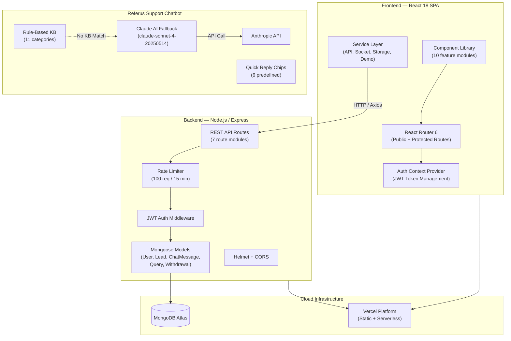
```mermaid
flowchart TB
    subgraph ClientLayer["Frontend — React 18 SPA"]
        UIComponents["Component Library<br/>(10 feature modules)"]
        ClientRouter["React Router 6<br/>(Public + Protected Routes)"]
        ServiceLayer["Service Layer<br/>(API, Socket, Storage, Demo)"]
        AuthContext["Auth Context Provider<br/>(JWT Token Management)"]
    end

    subgraph ServerLayer["Backend — Node.js / Express"]
        APIRoutes["REST API Routes<br/>(7 route modules)"]
        AuthMiddleware["JWT Auth Middleware"]
        DataModels["Mongoose Models<br/>(User, Lead, ChatMessage,<br/>Query, Withdrawal)"]
        RateLimiter["Rate Limiter<br/>(100 req / 15 min)"]
        SecurityLayer["Helmet + CORS"]
    end

    subgraph DataLayer["Cloud Infrastructure"]
        MongoDB[(MongoDB Atlas)]
        VercelDeploy["Vercel Platform<br/>(Static + Serverless)"]
    end

    subgraph ChatbotWidget["Referus Support Chatbot"]
        KBEngine["Rule-Based KB<br/>(11 categories)"]
        QuickReplies["Quick Reply Chips<br/>(6 predefined)"]
        AIFallback["Claude AI Fallback<br/>(claude-sonnet-4-20250514)"]
        AnthropicAPI["Anthropic API"]
    end

    UIComponents --> ClientRouter
    ClientRouter --> AuthContext
    ServiceLayer -->|"HTTP / Axios"| APIRoutes
    APIRoutes --> RateLimiter
    RateLimiter --> AuthMiddleware
    AuthMiddleware --> DataModels
    DataModels --> MongoDB
    ClientLayer --> VercelDeploy
    ServerLayer --> VercelDeploy
    KBEngine -.->|"No KB Match"| AIFallback
    AIFallback -->|"API Call"| AnthropicAPI
```

#### Core Technical Approach

The system follows a conventional **decoupled SPA + REST API** architecture:

| Layer | Technology | Key Details |
|---|---|---|
| **Frontend** | React 18.2 (CRA), Tailwind CSS 3.3, React Router 6.20 | Component-driven UI with context-based state management |
| **Backend** | Express 4.18, Mongoose 8.0, Socket.IO 4.8 | RESTful API with JWT auth, rate limiting, and security hardening |
| **Database** | MongoDB Atlas (Mongoose ODM) | Document-oriented storage with 5 core collections |
| **Deployment** | Vercel (serverless functions + static hosting) | Zero-config deployment with environment-based configuration |

The backend exposes seven primary route modules through a unified Express application bootstrapped in `referal/server/index.js`:

| Route Path | Module | Domain |
|---|---|---|
| `/api/auth` | `routes/auth.js` | Registration, login, session |
| `/api/leads` | `routes/leads.js` | Lead CRUD and lifecycle |
| `/api/wallet` | `routes/wallet.js` | Balances and withdrawals |
| `/api/chat` | `routes/chat.js` | Direct messaging (legacy) |
| `/api/users` | `routes/users.js` | Admin user management |
| `/api/admin` | `routes/admin.js` | Dashboard KPIs, queries |
| `/api/queries` | `routes/queries.js` | Public contact forms |

### 1.2.3 Success Criteria

The following measurable objectives and key performance indicators (KPIs) define success for the Referus.co platform, derived from the implemented dashboard metrics and system capabilities:

#### Measurable Objectives

| Objective | Measurement | Source |
|---|---|---|
| Lead pipeline visibility | Total leads tracked and categorized by status | Admin KPI: `totalLeads`, `pendingLeads` |
| User acquisition | Growth in registered platform users | Admin KPI: `totalUsers` |
| Revenue attribution | Commission values tracked per closed deal | Admin KPI: `commissions` |
| Support efficiency | Percentage of inquiries resolved by chatbot KB without AI fallback | Chatbot KB coverage (11 categories) |

#### Critical Success Factors

1. **Platform Reliability**: Consistent availability of core lead submission and wallet management workflows despite Vercel serverless constraints.
2. **Role-Based Workflow Integrity**: Correct enforcement of RBAC boundaries ensuring users, employees, and admins access only their authorized functionalities, as enforced by frontend route guards and backend auth middleware.
3. **Financial Accuracy**: Precise multi-currency wallet balance tracking and withdrawal processing with full audit trail (admin notes, processed-by references, timestamps on all `Withdrawal` records).
4. **Chatbot Effectiveness**: Successful replacement of the Socket.IO-based chat with the `ReferusChatbot.jsx` widget, providing instant responses for common inquiries while maintaining an intelligent AI fallback for edge cases.

#### Key Performance Indicators (KPIs)

| KPI | Target | Tracking Method |
|---|---|---|
| Lead-to-Close Conversion Rate | Measured via status transitions from `Pending` to `Deal Closed` | Lead status analytics in admin dashboard |
| Withdrawal Processing Time | Time from `pending` to `processed` status | Withdrawal timestamps in MongoDB |
| API Response Reliability | < 100 requests per 15-minute window per IP (rate limit threshold) | Express rate limiter (`express-rate-limit`) |
| Chatbot KB Hit Rate | Percentage of user queries matched by rule-based KB vs. Claude fallback | Chatbot interaction logs |

## 1.3 Scope

### 1.3.1 In-Scope Features and Capabilities

The following features and capabilities are implemented in the current Referus.co v1.0.0 codebase and constitute the documented scope of this technical specification:

#### Core Features and Functionalities

| Feature | Description | Key Evidence |
|---|---|---|
| **User Authentication** | JWT-based registration, login, and session management with role-based access control | `routes/auth.js`, `models/User.js`, `AuthContext` in `App.js` |
| **Lead Management** | Full CRUD for referral leads with 5-stage status workflow, category/company tracking, and commission assignment | `routes/leads.js`, `models/Lead.js`, `components/Leads/` |
| **Multi-Currency Wallet** | Per-user balances in USD, AED, EUR, SAR with withdrawal request and approval workflows | `routes/wallet.js`, `models/Withdrawal.js`, `components/Wallet/` |
| **Admin Dashboard** | KPI aggregation, user management, query handling, wallet oversight, and lead administration | `routes/admin.js`, `components/Admin/` |
| **Employee Workspace** | Dedicated interface for lead handling, messaging, and profile management | `components/Employee/` |
| **Contact/Query System** | Public contact forms with admin query lifecycle management (New → In Progress → Resolved → Closed) | `routes/queries.js`, `models/Query.js`, `components/Forms/` |
| **AI Support Chatbot** | Self-contained floating widget with rule-based KB (11 categories) + Claude AI fallback, replacing legacy Socket.IO chat | `ReferusChatbot.jsx` |
| **Demo Mode** | Client-side mock API with simulated latency and demo data for testing and demonstration | `services/demoApi.js` |
| **Public Marketing Pages** | Home, About, How It Works, and Contact pages with responsive layouts | `pages/` directory, `components/Layout/` |

#### Primary User Workflows

1. **Referral Submission Flow**: User registers → logs in → submits lead via `/add-lead` or `/leads` → lead enters `Pending` status → admin/employee processes through lifecycle stages.
2. **Commission & Withdrawal Flow**: Lead reaches `Deal Closed` → commission credited to user wallet → user submits withdrawal request with bank details → admin reviews and processes payout.
3. **Support Interaction Flow**: User clicks floating chat button → chatbot widget opens → user types query or selects quick reply → KB pattern matching returns instant response OR Claude AI generates contextual answer.
4. **Admin Operations Flow**: Admin logs in via `/admin/login` → views KPI dashboard → manages leads, users, queries, wallets, and withdrawals through dedicated admin panels.

#### Essential Integrations

| Integration | Type | Purpose |
|---|---|---|
| **MongoDB Atlas** | Database | Primary data persistence for all domain models |
| **Anthropic Claude API** | AI Service | Fallback response generation for chatbot queries outside KB coverage |
| **Formspree** | Form Service | Alternative contact form submission path (used in `FloatingChatButton` component) |
| **Vercel** | Platform | Hosting, serverless function execution, and static asset delivery |

#### Key Technical Requirements

- **Node.js** ≥ 18.0.0 (backend engine requirement per `referal/server/package.json`)
- **React** 18.2.0 with Create React App (`react-scripts` 5.0.1)
- **MongoDB** accessible via Mongoose 8.0.3 ODM
- **Environment Variables**: `MONGODB_URI`, `JWT_SECRET`, `CLIENT_URL`, `NODE_ENV`, `REACT_APP_API_URL` (per `referal/.env.vercel.example`)
- **Security**: Helmet headers, CORS whitelist (`referus.co`, `www.referus.co`, `localhost:3000`), rate limiting (100 req/15 min per IP), bcrypt password hashing

### 1.3.2 Implementation Boundaries

#### System Boundaries

The Referus.co platform operates as a self-contained web application with the following boundary definitions:

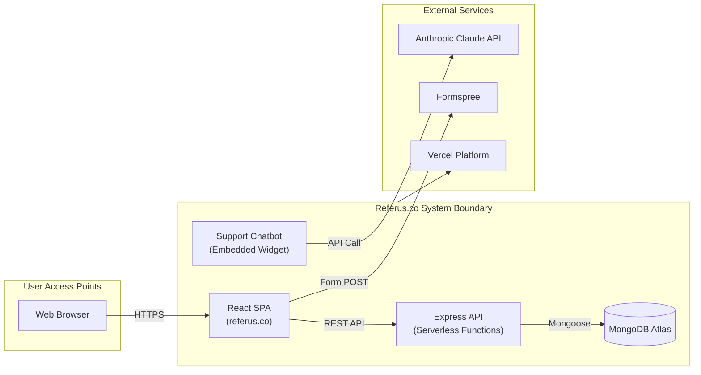
```mermaid
flowchart LR
    subgraph SystemBoundary["Referus.co System Boundary"]
        FE["React SPA<br/>(referus.co)"]
        BE["Express API<br/>(Serverless Functions)"]
        DB[(MongoDB Atlas)]
        CB["Support Chatbot<br/>(Embedded Widget)"]
    end

    subgraph ExternalBoundary["External Services"]
        Anthropic["Anthropic Claude API"]
        Formspree["Formspree"]
        Vercel["Vercel Platform"]
    end

    subgraph UserBoundary["User Access Points"]
        Browser["Web Browser"]
    end

    Browser -->|HTTPS| FE
    FE -->|REST API| BE
    BE -->|Mongoose| DB
    CB -->|API Call| Anthropic
    FE -->|Form POST| Formspree
    SystemBoundary --> Vercel
```

#### User Groups Covered

| User Group | Access Method | Authentication |
|---|---|---|
| Referrers (Users) | Web browser, all public and protected routes | JWT-based (registration + login) |
| Administrators | Web browser, `/admin` routes | JWT-based (admin role required) |
| Employees | Web browser, `/employee` routes | JWT-based (employee role required) |
| Public Visitors | Web browser, public routes only | None (unauthenticated) |

#### Geographic and Market Coverage

- **Currency Support**: USD, AED, EUR, SAR — indicating target markets in North America, United Arab Emirates, Europe, and Saudi Arabia
- **Internationalization**: Phone number input with country flag selection (`react-flags-select`, `libphonenumber-js`) supports international user registration
- **Language**: English-only interface (no i18n framework detected in the codebase)

#### Data Domains Included

The five Mongoose models in `referal/server/models/` define the complete data domain:

| Model | Collection | Key Attributes |
|---|---|---|
| `User` | Users | Profile, credentials, role, multi-currency wallet balances, activity status |
| `Lead` | Leads | Company details, contact info, value, status, currency, commission, notes, timestamps |
| `ChatMessage` | Chat Messages | Sender/receiver references, message content (max 1000 chars), read status |
| `Query` | Queries | Contact form submissions with subject, message, status workflow, handler assignment |
| `Withdrawal` | Withdrawals | Amount, currency, bank details (incl. IBAN/SWIFT), status, admin notes, processor reference |

### 1.3.3 Out-of-Scope Elements

The following features, capabilities, and integrations are **explicitly excluded** from the current v1.0.0 scope. Several of these are referenced in the `ReferusChatbot.jsx` knowledge base as platform capabilities but are not yet implemented in the codebase:

#### Excluded Features (Referenced in Chatbot KB Only)

| Feature | KB Category | Implementation Status |
|---|---|---|
| Campaign management system | `how_it_works`, `features` | Not implemented — no campaign model or routes exist |
| Unique tracking link generation | `what_is`, `features` | Not implemented — no link generation logic in codebase |
| Automated reward payouts | `what_is`, `how_it_works` | Not implemented — wallet management is manual (admin-driven) |
| Multi-tier referral chains | `features` | Not implemented — lead model supports single-level referrals only |
| White-label UI customization | `features` | Not implemented — no theming or branding configuration system |
| Fraud detection and abuse prevention | `features`, `security` | Not implemented — no fraud monitoring logic in codebase |
| SSO / SAML 2.0 / Google OAuth | `security` | Not implemented — authentication is email/password JWT only |
| SOC 2 Type II compliance | `security` | Not verified in codebase |

#### Excluded Third-Party Integrations

The chatbot knowledge base describes integrations with Stripe, PayPal, Wise, Mailchimp, SendGrid, HubSpot, Salesforce, Zapier, Slack, Discord, Shopify, and WooCommerce. **None of these integrations are implemented** in the current codebase. The only external service integrations are MongoDB Atlas (database), Anthropic Claude API (chatbot), and Formspree (contact forms).

#### Future Phase Considerations

- **Campaign Management Engine**: Structured campaign creation, configuration, and tracking to fulfill the chatbot KB's described workflow
- **Referral Attribution System**: Tracking link generation and conversion attribution (the RefRef reference architecture in `example-git-project-like-referus/refref/` demonstrates this capability via its `attribution-script` and `refer` packages)
- **Payment Gateway Integration**: Stripe/PayPal connectivity for automated commission disbursement
- **Real-Time Notifications**: Replacement strategy for Socket.IO-dependent features (typing indicators, presence, live lead/wallet updates) that are unreliable on Vercel serverless
- **Email Notification System**: Transactional emails for lead status changes, withdrawal processing, and referral activity (the RefRef reference includes `email-templates` package using React Email)
- **Advanced Analytics**: Conversion funnels, referrer leaderboards, geo-analytics, and CSV export as described in the chatbot KB's `analytics` category
- **Tiered Pricing Plans**: Starter/Growth/Business/Enterprise plans as described in the chatbot KB's `pricing` category

#### Reference Architecture (Not In Product Scope)

The `example-git-project-like-referus/refref/` directory contains an open-source referral management platform (RefRef) built with a modern TypeScript/Next.js/PostgreSQL stack using pnpm workspaces and Turborepo. This codebase is in alpha status and licensed under AGPLv3. It is included in the repository **solely as an architectural reference** and is explicitly excluded from the Referus.co product scope. Key architectural patterns demonstrated by RefRef (monorepo structure, embeddable widgets, attribution scripts, BullMQ job queues) may inform future Referus.co development phases.

## 1.4 References

#### Source Files

- `referal/README.md` — Project overview, tech stack listing, feature summary, and setup instructions
- `referal/ReferusChatbot.jsx` — AI-powered support chatbot component (replacement for current chat system); rule-based KB definitions, quick replies, Claude API integration, and full UI implementation
- `referal/client/package.json` — Frontend dependency manifest (React 18.2, Tailwind CSS 3.3, Socket.IO Client 4.7, React Router 6.20, Axios 1.6)
- `referal/server/package.json` — Backend dependency manifest (Express 4.18, Mongoose 8.0, jsonwebtoken 9.0, Helmet 7.1, express-rate-limit 7.1)
- `referal/server/index.js` — Server bootstrap configuration, middleware stack, route mounting, Socket.IO event handlers, CORS whitelist
- `referal/client/src/App.js` — Frontend route definitions, layout composition, auth provider wrapping, component imports
- `referal/.env.vercel.example` — Environment variable contract for Vercel deployment
- `referal/VERCEL_DEPLOYMENT.md` — Deployment guide, prerequisites, known limitations (Socket.IO on serverless)
- `example-git-project-like-referus/refref/README.md` — RefRef reference architecture overview, feature list, tech stack

#### Source Directories

- `referal/client/src/components/` — 10 feature-organized component modules (Admin, Auth, Chat, Common, Dashboard, Employee, Forms, Layout, Leads, Wallet)
- `referal/client/src/pages/` — 12 page-level route components
- `referal/client/src/services/` — 4 service modules (api.js, demoApi.js, socket.js, storage.js)
- `referal/server/models/` — 5 Mongoose data models (User, Lead, ChatMessage, Query, Withdrawal)
- `referal/server/routes/` — 7 Express route modules (auth, leads, wallet, chat, users, admin, queries)
- `example-git-project-like-referus/refref/apps/` — 7 RefRef deployable applications (reference only)
- `example-git-project-like-referus/refref/packages/` — 12 RefRef shared packages (reference only)

#### External References

- B2B referral market statistics sourced from CustomerGauge and PartnerStack industry research

# 2. Product Requirements

## 2.1 Feature Catalog

### 2.1.1 Feature Index and Priority Matrix

The Referus.co platform v1.0.0 comprises ten discrete features organized across five functional categories. Each feature has been identified through analysis of the implemented codebase within the `referal/` directory, including server-side models, API routes, client-side components, and the incoming `ReferusChatbot.jsx` widget provided as user context.

| Feature ID | Feature Name | Category | Priority |
|---|---|---|---|
| F-001 | User Authentication & Authorization | Security & Access | Critical |
| F-002 | Lead Lifecycle Management | Core Business | Critical |
| F-003 | Multi-Currency Wallet & Withdrawals | Financial Operations | Critical |
| F-004 | AI-Powered Support Chatbot | Customer Support | High |
| F-005 | Admin Dashboard & Operations | Administration | Critical |
| F-006 | Employee Workspace | Operations | Medium |
| F-007 | Contact/Query System | Customer Support | High |
| F-008 | Legacy Chat System | Communication (Deprecated) | Low |
| F-009 | Public Marketing Pages | Marketing & Acquisition | Medium |
| F-010 | Demo Mode | Development & Testing | Low |

| Feature ID | Status | Primary Evidence |
|---|---|---|
| F-001 | Completed | `routes/auth.js`, `models/User.js`, `middleware/auth.js` |
| F-002 | Completed | `routes/leads.js`, `models/Lead.js`, `components/Leads/` |
| F-003 | Completed | `routes/wallet.js`, `models/Withdrawal.js`, `components/Wallet/` |
| F-004 | In Development | `ReferusChatbot.jsx` (user-provided context) |
| F-005 | Completed | `routes/admin.js`, `routes/users.js`, `components/Admin/` |
| F-006 | In Development | `components/Employee/`, `pages/EmployeePage.js` |
| F-007 | Completed | `routes/queries.js`, `models/Query.js`, `components/Forms/` |
| F-008 | Completed (Deprecated) | `routes/chat.js`, `models/ChatMessage.js`, `services/socket.js` |
| F-009 | Completed | `pages/HomePage.js`, `pages/AboutPage.js`, `pages/ContactPage.js` |
| F-010 | Completed | `services/demoApi.js`, `context/AuthContext.js` |

### 2.1.2 Feature Category Distribution

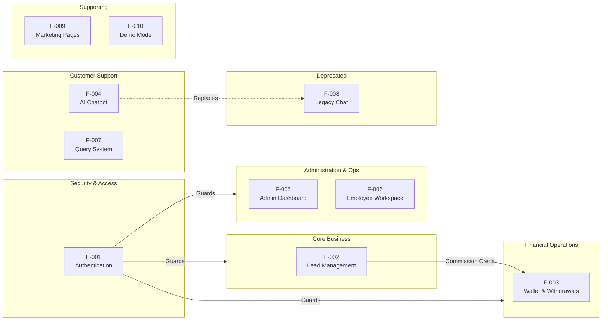
```mermaid
flowchart LR
    subgraph SecurityAccess["Security & Access"]
        F001["F-001<br/>Authentication"]
    end

    subgraph CoreBusiness["Core Business"]
        F002["F-002<br/>Lead Management"]
    end

    subgraph FinOps["Financial Operations"]
        F003["F-003<br/>Wallet & Withdrawals"]
    end

    subgraph CustSupport["Customer Support"]
        F004["F-004<br/>AI Chatbot"]
        F007["F-007<br/>Query System"]
    end

    subgraph Administration["Administration & Ops"]
        F005["F-005<br/>Admin Dashboard"]
        F006["F-006<br/>Employee Workspace"]
    end

    subgraph Deprecated["Deprecated"]
        F008["F-008<br/>Legacy Chat"]
    end

    subgraph Supporting["Supporting"]
        F009["F-009<br/>Marketing Pages"]
        F010["F-010<br/>Demo Mode"]
    end

    F001 -->|"Guards"| CoreBusiness
    F001 -->|"Guards"| FinOps
    F001 -->|"Guards"| Administration
    F002 -->|"Commission Credit"| F003
    F004 -.->|"Replaces"| F008
```

---

## 2.2 Feature Specifications

### 2.2.1 F-001: User Authentication & Authorization

#### Feature Metadata

| Attribute | Value |
|---|---|
| **Feature ID** | F-001 |
| **Feature Name** | User Authentication & Authorization |
| **Category** | Security & Access |
| **Priority Level** | Critical |
| **Status** | Completed |

#### Description

**Overview:** F-001 provides the complete authentication and authorization layer for the Referus.co platform. It implements JWT-based session management with bcrypt password hashing, supporting user registration, login, session persistence, and role-based access control (RBAC) across three user roles: `user`, `admin`, and `employee`. The feature spans both server-side enforcement (middleware in `referal/server/middleware/auth.js`) and client-side state management (context provider in `referal/client/src/context/AuthContext.js`).

**Business Value:** Authentication is the foundational gate for all monetized platform operations — lead submission, wallet management, and administrative oversight. Without robust auth, the platform cannot enforce data isolation between users, protect financial operations, or maintain operational integrity of admin functions.

**User Benefits:** Users gain secure, persistent sessions via localStorage-backed JWT tokens that survive browser refreshes. The auto-rehydration pattern (reading stored tokens and calling `GET /api/auth/me` on mount) eliminates repeated login prompts. Admins and employees receive dedicated route protection ensuring they access only their authorized interfaces.

**Technical Context:** The backend implements JWT token generation using `jsonwebtoken` ^9.0.2 signed with `process.env.JWT_SECRET` (with fallback `'fallback-secret'`), expiring per `JWT_EXPIRE` (default `'7d'`). Passwords are hashed with `bcryptjs` ^2.4.3 using 10 salt rounds. The frontend uses a `useReducer`-based `AuthContext` with six actions (`LOGIN_START`, `LOGIN_SUCCESS`, `LOGIN_FAILURE`, `LOGOUT`, `UPDATE_USER`, `CLEAR_ERROR`) and axios interceptors that auto-attach `Authorization: Bearer` headers and trigger logout on 401 responses.

#### Dependencies

| Dependency Type | Details |
|---|---|
| **Prerequisite Features** | None (foundational feature) |
| **System Dependencies** | MongoDB Atlas (User collection), Node.js ≥ 18.0.0 |
| **External Dependencies** | `jsonwebtoken` ^9.0.2, `bcryptjs` ^2.4.3 |
| **Integration Requirements** | Environment variables: `JWT_SECRET`, `JWT_EXPIRE`, `MONGODB_URI` |

---

### 2.2.2 F-002: Lead Lifecycle Management

#### Feature Metadata

| Attribute | Value |
|---|---|
| **Feature ID** | F-002 |
| **Feature Name** | Lead Lifecycle Management |
| **Category** | Core Business |
| **Priority Level** | Critical |
| **Status** | Completed |

#### Description

**Overview:** F-002 implements the core business workflow of the Referus.co platform — the complete lifecycle management of referral leads. Users submit leads via a structured form capturing company details, contact person, value, and currency denomination. Each lead progresses through a five-stage status workflow: `Pending` → `Contacted` → `Proposal Submitted` → `Deal Closed` / `Client Refused`. The feature is implemented via the Lead Mongoose model in `referal/server/models/Lead.js`, API routes in `referal/server/routes/leads.js`, and frontend components in `referal/client/src/components/Leads/`.

**Business Value:** Lead management is the primary revenue-driving mechanism. Every commission and wallet credit originates from a lead reaching `Deal Closed` status. The structured lifecycle enables pipeline visibility, conversion rate measurement, and revenue attribution — the core KPIs surfaced in the admin dashboard (`totalLeads`, `pendingLeads`, `commissions`).

**User Benefits:** Referrers can submit and track their leads with full visibility into status progression. The multi-currency value assignment (USD, AED, EUR, SAR) supports cross-border referral scenarios. The notes subdocument array enables auditable communication between admins and the lead record.

**Technical Context:** The Lead schema enforces data integrity through field-level validation: required fields with maximum character lengths, email pattern validation, enumerated status and currency values, and minimum value constraints. A pre-save hook automatically updates the `updatedAt` timestamp. Ownership enforcement ensures users can only view their own leads, while admin routes (`GET /api/leads/admin/all`, `PUT /api/leads/:id/status`) provide full management access.

#### Dependencies

| Dependency Type | Details |
|---|---|
| **Prerequisite Features** | F-001 (Authentication required for all operations) |
| **System Dependencies** | MongoDB Atlas (Lead collection), Express route middleware |
| **External Dependencies** | None |
| **Integration Requirements** | User ObjectId reference for lead ownership |

---

### 2.2.3 F-003: Multi-Currency Wallet & Withdrawal System

#### Feature Metadata

| Attribute | Value |
|---|---|
| **Feature ID** | F-003 |
| **Feature Name** | Multi-Currency Wallet & Withdrawal System |
| **Category** | Financial Operations |
| **Priority Level** | Critical |
| **Status** | Completed |

#### Description

**Overview:** F-003 provides the financial operations layer of the platform, managing per-user wallet balances across four currencies (USD, AED, EUR, SAR) and processing withdrawal requests with comprehensive bank details. Wallet balances are embedded directly in the User document (`wallet.usd`, `wallet.aed`, `wallet.euro`, `wallet.sar`), while withdrawal requests are stored as separate documents in `referal/server/models/Withdrawal.js`. The feature encompasses user-facing balance viewing and withdrawal submission, as well as admin-facing balance management and payout processing via `referal/server/routes/wallet.js`.

**Business Value:** The wallet system is the monetization engine that incentivizes referral submissions. Commission credits tied to `Deal Closed` leads are tracked in user wallets. The withdrawal workflow with admin approval provides financial control and audit trail capabilities. Multi-currency support enables the platform to operate across the target markets (North America, UAE, Europe, Saudi Arabia).

**User Benefits:** Referrers can view real-time balances per currency and submit withdrawal requests with their banking details. The four-stage withdrawal lifecycle (`pending` → `approved` / `rejected` → `processed`) provides transparency into payout status. Optional IBAN and SWIFT code fields support international transfers.

**Technical Context:** The Withdrawal schema captures banking information (accountHolderName, bankName, accountNumber, routingNumber as required fields; IBAN and SWIFT as optional), with admin processing tracked via `processedBy` (User ObjectId), `processedAt` (Date), and `adminNotes`. Admin wallet operations support three modes: add, subtract, and set balance. Withdrawal approval atomically deducts the balance from the user's wallet. A known internal field inconsistency between `sar` and `riyal` exists in `WalletPage.js`.

#### Dependencies

| Dependency Type | Details |
|---|---|
| **Prerequisite Features** | F-001 (Authentication), F-002 (Lead system for commission source) |
| **System Dependencies** | MongoDB Atlas (Withdrawal collection, User.wallet embedded) |
| **External Dependencies** | None (manual payouts; no payment gateway integration) |
| **Integration Requirements** | User ObjectId for wallet ownership and admin processing |

---

### 2.2.4 F-004: AI-Powered Support Chatbot

#### Feature Metadata

| Attribute | Value |
|---|---|
| **Feature ID** | F-004 |
| **Feature Name** | AI-Powered Support Chatbot |
| **Category** | Customer Support |
| **Priority Level** | High |
| **Status** | In Development |

#### Description

**Overview:** F-004 is the incoming replacement for the legacy Socket.IO-based chat system (F-008). It implements a self-contained floating chat widget (`ReferusChatbot.jsx`) using a hybrid approach: a rule-based knowledge base (`REFERUS_KB`) with 11 categories and 84 total match patterns provides instant responses, while an Anthropic Claude API fallback (`claude-sonnet-4-20250514`) handles unmatched queries. The component has zero dependencies on the Referus project internals, importing only `useState`, `useRef`, and `useEffect` from React.

**Business Value:** The chatbot directly addresses the platform's Socket.IO reliability issues on Vercel serverless deployment while reducing support costs. Rule-based responses are instant and free, handling the majority of anticipated queries. The AI fallback provides intelligent support for edge cases without requiring always-on human support agents. This architectural decision eliminates a critical deployment limitation while improving response time.

**User Benefits:** Users receive instant answers to common questions via six quick-reply chips ("What is Referus?", "How does it work?", "View pricing", "See integrations", "Reward types", "Book a demo"). The chat widget features a polished UI with the Referus green gradient branding, typing indicators with bouncing-dot animations, markdown-rendered responses (bold text and bullet points), and a persistent launcher button positioned at the bottom-right corner of the viewport.

**Technical Context:** The `matchKB()` function lowercases user input and iterates through all KB entries checking for pattern inclusion. For unmatched queries, `askClaude()` sends the conversation history to the Anthropic Messages API (`https://api.anthropic.com/v1/messages`) with a system prompt limiting responses to 150 words and constraining the AI to Referus-relevant topics. On API failure, a static fallback message directs users to `support@referus.co` and `docs.referus.co`. The widget renders at 370×560px with 16px border radius and includes CSS animations (`slideUp`, `bounce`, `pulse`) injected via an inline `<style>` element.

#### Dependencies

| Dependency Type | Details |
|---|---|
| **Prerequisite Features** | None (standalone component) |
| **System Dependencies** | React 18 runtime (`useState`, `useRef`, `useEffect`) |
| **External Dependencies** | Anthropic Claude API (`claude-sonnet-4-20250514`, max 1000 tokens) |
| **Integration Requirements** | Anthropic API key (client-side `fetch` call; no server proxy) |

---

### 2.2.5 F-005: Admin Dashboard & Operations

#### Feature Metadata

| Attribute | Value |
|---|---|
| **Feature ID** | F-005 |
| **Feature Name** | Admin Dashboard & Operations |
| **Category** | Administration |
| **Priority Level** | Critical |
| **Status** | Completed |

#### Description

**Overview:** F-005 provides the centralized administrative interface for managing all platform operations. The admin dashboard aggregates KPIs (`totalLeads`, `totalUsers`, `pendingLeads`, commission totals from closed deals), and provides management interfaces for leads, users, contact queries, wallet balances, and withdrawal processing. Server-side routes are defined across `referal/server/routes/admin.js` and `referal/server/routes/users.js`, with frontend components in `referal/client/src/components/Admin/` and the dashboard shell in `referal/client/src/pages/AdminPage.js`.

**Business Value:** The admin dashboard is the operational command center for the referral program, providing real-time business intelligence and complete control over the lead pipeline, user base, financial operations, and customer support queries. Without this feature, the platform cannot operate as a managed referral ecosystem.

**User Benefits:** Administrators gain a responsive sidebar/header shell with section switching between AdminSummary, leads, users, earnings, queries, and settings. Searchable/filterable management tables, detail modals, and status-update workflows enable efficient operations management.

**Technical Context:** The admin API endpoints implement the `adminOnly` middleware that checks `req.user.role === 'admin'`, returning HTTP 403 for non-admin access. The dashboard KPI endpoint aggregates data across the User, Lead, and Withdrawal collections. Query lifecycle management validates status transitions between `New`, `In Progress`, `Resolved`, and `Closed`, stamping `handledBy` and `handledAt` fields. User management supports toggling `isActive` status and role changes validated against `['user', 'admin']`.

#### Dependencies

| Dependency Type | Details |
|---|---|
| **Prerequisite Features** | F-001 (Admin-role authentication) |
| **System Dependencies** | MongoDB Atlas (User, Lead, Query, Withdrawal collections) |
| **External Dependencies** | None |
| **Integration Requirements** | Cross-model aggregation (User, Lead, Query, Withdrawal) |

---

### 2.2.6 F-006: Employee Workspace

#### Feature Metadata

| Attribute | Value |
|---|---|
| **Feature ID** | F-006 |
| **Feature Name** | Employee Workspace |
| **Category** | Operations |
| **Priority Level** | Medium |
| **Status** | In Development |

#### Description

**Overview:** F-006 provides a dedicated workspace interface for operational staff who handle day-to-day referral workflows. The workspace is implemented in `referal/client/src/components/Employee/` and `referal/client/src/pages/EmployeePage.js`, mirroring the admin dashboard's orchestration pattern but scoped to employee-relevant tasks: lead handling, message management, and profile/settings.

**Business Value:** The employee workspace enables delegation of operational tasks to non-admin staff, allowing administrators to focus on strategic oversight while employees manage routine lead processing and communication workflows.

**User Benefits:** Employees have a responsive navigation with quick stats and dedicated interfaces for their specific responsibilities, without exposure to sensitive administrative functions like wallet management or user role changes.

**Technical Context:** The employee workspace currently relies on mocked/locally seeded data with placeholders for future API and authentication integration. Frontend route protection is enforced via the `EmployeeProtectedRoute` component. The workspace mirrors the admin shell pattern with section-based navigation.

#### Dependencies

| Dependency Type | Details |
|---|---|
| **Prerequisite Features** | F-001 (Employee-role authentication) |
| **System Dependencies** | React Router 6 (protected routing) |
| **External Dependencies** | None |
| **Integration Requirements** | Future API integration for lead and message data |

---

### 2.2.7 F-007: Contact/Query System

#### Feature Metadata

| Attribute | Value |
|---|---|
| **Feature ID** | F-007 |
| **Feature Name** | Contact/Query System |
| **Category** | Customer Support |
| **Priority Level** | High |
| **Status** | Completed |

#### Description

**Overview:** F-007 implements a public-facing contact form system where unauthenticated visitors can submit inquiries that are tracked as Query documents with a four-stage lifecycle. The Query model is defined in `referal/server/models/Query.js`, the public submission endpoint in `referal/server/routes/queries.js`, and the admin management interface is part of F-005's query handling routes. An alternative Formspree integration provides a secondary submission path.

**Business Value:** The query system captures inbound interest from potential customers and partners, providing the admin team with a structured workflow for managing these interactions from receipt to resolution.

**User Benefits:** Public visitors can submit contact forms without requiring account registration. Each query receives lifecycle tracking (`New` → `In Progress` → `Resolved` → `Closed`), ensuring no inquiry falls through the cracks.

**Technical Context:** The Query schema enforces data integrity with required fields (name max 100 chars, validated email, subject max 150 chars, message max 2000 chars) and tracks admin handling via `handledBy` (User ObjectId) and `handledAt` (Date). The `POST /api/queries` endpoint is public and unauthenticated, while all management endpoints require admin authentication.

#### Dependencies

| Dependency Type | Details |
|---|---|
| **Prerequisite Features** | None for submission; F-001 + F-005 for management |
| **System Dependencies** | MongoDB Atlas (Query collection) |
| **External Dependencies** | Formspree (alternative submission path) |
| **Integration Requirements** | Admin route integration for query management |

---

### 2.2.8 F-008: Legacy Chat System

#### Feature Metadata

| Attribute | Value |
|---|---|
| **Feature ID** | F-008 |
| **Feature Name** | Legacy Chat System |
| **Category** | Communication (Deprecated) |
| **Priority Level** | Low |
| **Status** | Completed (Being Replaced by F-004) |

#### Description

**Overview:** F-008 is the existing Socket.IO-based real-time messaging system that is being replaced by the AI-powered chatbot (F-004). It enables direct messaging between users with conversation tracking, read receipts, and typing indicators. The implementation spans `referal/server/models/ChatMessage.js`, `referal/server/routes/chat.js`, `referal/client/src/components/Chat/`, and `referal/client/src/services/socket.js`.

**Business Value:** The legacy chat was intended to provide real-time communication between platform users and support staff. However, its reliability issues on Vercel serverless deployment have made it a primary driver for the chatbot replacement initiative documented in `referal/VERCEL_DEPLOYMENT.md`.

**User Benefits:** Users could send direct messages (max 1000 chars) to other users and admins, view conversation summaries, and see real-time typing indicators. Read status tracking marks messages as read when the conversation history is viewed.

**Technical Context:** Socket.IO events include `join`, `sendMessage`, `typing`, and `disconnect`, with server-managed room-based communication. The chat API uses a MongoDB aggregation pipeline for conversation summaries. The critical limitation is that Socket.IO does not function reliably on Vercel serverless functions, rendering this feature operationally unreliable in the production deployment environment.

#### Dependencies

| Dependency Type | Details |
|---|---|
| **Prerequisite Features** | F-001 (Authentication required) |
| **System Dependencies** | Socket.IO ^4.8.1 (server), socket.io-client ^4.7.4 (client) |
| **External Dependencies** | WebSocket-capable hosting (NOT reliably available on Vercel) |
| **Integration Requirements** | Persistent server process (incompatible with serverless) |

---

### 2.2.9 F-009: Public Marketing Pages

#### Feature Metadata

| Attribute | Value |
|---|---|
| **Feature ID** | F-009 |
| **Feature Name** | Public Marketing Pages |
| **Category** | Marketing & Acquisition |
| **Priority Level** | Medium |
| **Status** | Completed |

#### Description

**Overview:** F-009 comprises the public-facing static marketing pages that serve as the platform's acquisition funnel: Home (`/`), About (`/about`), How It Works (`/how-it-works`), and Contact (`/contact`). These pages are implemented as React components in the `referal/client/src/pages/` directory with shared layout components (Header, Footer) from `referal/client/src/components/Layout/`.

**Business Value:** Marketing pages serve as the primary entry point for potential customers, communicating the platform's value proposition, demonstrating the referral workflow, and providing contact mechanisms. The Home page includes hero section, features showcase, industry targeting, and call-to-action sections.

**User Benefits:** Visitors receive a clear understanding of the Referus platform through the four-step onboarding walkthrough on the How It Works page, brand story and milestones on the About page, and direct contact options with business hours on the Contact page. Authenticated users are automatically redirected from `/` to `/dashboard`.

**Technical Context:** Pages are built with React Router 6 for client-side navigation and Tailwind CSS 3.3 for responsive styling. The Home page redirects authenticated users to the dashboard. The Contact page integrates with the F-007 query submission endpoint.

#### Dependencies

| Dependency Type | Details |
|---|---|
| **Prerequisite Features** | None (public access) |
| **System Dependencies** | React Router 6, Tailwind CSS 3.3 |
| **External Dependencies** | None |
| **Integration Requirements** | F-007 (Contact page → Query submission) |

---

### 2.2.10 F-010: Demo Mode

#### Feature Metadata

| Attribute | Value |
|---|---|
| **Feature ID** | F-010 |
| **Feature Name** | Demo Mode |
| **Category** | Development & Testing |
| **Priority Level** | Low |
| **Status** | Completed |

#### Description

**Overview:** F-010 provides a client-side mock API layer that enables the entire application to operate without a backend connection. Implemented in `referal/client/src/services/demoApi.js` with integration into `referal/client/src/context/AuthContext.js`, it simulates authentication flows, lead data, messages, withdrawals, and dashboard summaries.

**Business Value:** Demo mode enables product demonstrations, frontend development without backend dependency, and testing scenarios without risking production data. It eliminates the need for a running server during client-side development or stakeholder demos.

**User Benefits:** Users in demo mode experience the full application workflow with realistic mock data and simulated API latency, providing a faithful representation of the platform's capabilities.

**Technical Context:** The `shouldUseDemoApi` feature flag controls activation. `setupDemoInterceptors` patches axios to intercept requests and return mock data. `demoLoginUser` in AuthContext simulates the authentication flow. No backend calls are made when demo mode is active.

#### Dependencies

| Dependency Type | Details |
|---|---|
| **Prerequisite Features** | None |
| **System Dependencies** | Axios interceptor mechanism |
| **External Dependencies** | None |
| **Integration Requirements** | AuthContext integration for demo login |

---

## 2.3 Functional Requirements

### 2.3.1 F-001: Authentication & Authorization Requirements

#### Requirement Details

| Requirement ID | Description | Priority | Complexity |
|---|---|---|---|
| F-001-RQ-001 | User registration with name, email, and password | Must-Have | Medium |
| F-001-RQ-002 | User login with email and password | Must-Have | Medium |
| F-001-RQ-003 | JWT-based session management with auto-renewal | Must-Have | High |
| F-001-RQ-004 | Role-based access control (user/admin/employee) | Must-Have | High |
| F-001-RQ-005 | Session persistence via localStorage token storage | Should-Have | Low |
| F-001-RQ-006 | Auto-logout on 401 unauthorized response | Should-Have | Low |
| F-001-RQ-007 | Account deactivation enforcement | Must-Have | Medium |

#### Acceptance Criteria

| Requirement ID | Acceptance Criteria |
|---|---|
| F-001-RQ-001 | Registration succeeds with valid name (≥2 chars), unique email, and password (≥6 chars); returns JWT token and user object |
| F-001-RQ-002 | Login succeeds with matching email/password via bcrypt comparison; returns JWT token and user object (password excluded) |
| F-001-RQ-003 | JWT signs with `JWT_SECRET`, expires per `JWT_EXPIRE` (default 7 days); `GET /api/auth/me` validates token and returns current user |
| F-001-RQ-004 | `protect` middleware validates JWT; `adminOnly` middleware returns 403 for non-admin; frontend route guards (`ProtectedRoute`, `AdminProtectedRoute`, `EmployeeProtectedRoute`) block unauthorized navigation |
| F-001-RQ-005 | Token stored in localStorage on login; axios interceptor attaches `Authorization: Bearer` header to all requests |
| F-001-RQ-006 | Axios response interceptor detects 401, clears stored token, and redirects to login page |
| F-001-RQ-007 | `protect` middleware checks `isActive` field; inactive accounts receive authentication failure |

#### Validation Rules

| Requirement ID | Data Validation | Security Requirement |
|---|---|---|
| F-001-RQ-001 | Name: min 2, max 50 chars; Email: valid format, unique, lowercase; Password: min 6 chars | Bcrypt 10 salt rounds; no plaintext password storage |
| F-001-RQ-002 | Email: normalized lowercase; Password: bcrypt comparison | Rate limiting: 100 req/15 min per IP |
| F-001-RQ-003 | Token: valid JWT structure and signature | `JWT_SECRET` must not be fallback value in production |
| F-001-RQ-004 | Role: enum `['user', 'admin', 'employee']` | Helmet security headers; CORS whitelist enforcement |

---

### 2.3.2 F-002: Lead Management Requirements

#### Requirement Details

| Requirement ID | Description | Priority | Complexity |
|---|---|---|---|
| F-002-RQ-001 | Lead creation with company details and contact info | Must-Have | Medium |
| F-002-RQ-002 | User-scoped lead listing with search and filters | Must-Have | Medium |
| F-002-RQ-003 | Five-stage lead status lifecycle management | Must-Have | High |
| F-002-RQ-004 | Multi-currency value and commission tracking | Must-Have | Medium |
| F-002-RQ-005 | Admin lead listing across all users | Must-Have | Low |
| F-002-RQ-006 | Lead notes subdocument management | Should-Have | Low |
| F-002-RQ-007 | Ownership-based lead access control | Must-Have | Medium |

#### Acceptance Criteria

| Requirement ID | Acceptance Criteria |
|---|---|
| F-002-RQ-001 | `POST /api/leads` creates lead with validated category, companyName, contactPerson, email, phone, description, value, and currency; auto-assigns creating user's ObjectId |
| F-002-RQ-002 | `GET /api/leads` returns only leads belonging to the authenticated user; frontend supports text search and status/category filtering |
| F-002-RQ-003 | Status transitions follow: `Pending` → `Contacted` → `Proposal Submitted` → `Deal Closed` / `Client Refused`; admin-only status updates via `PUT /api/leads/:id/status` |
| F-002-RQ-004 | Value field accepts numeric values ≥ 0 with currency enum (USD/AED/EUR/SAR); commission field tracks earned amount per lead |
| F-002-RQ-005 | `GET /api/leads/admin/all` returns all leads regardless of user; requires admin authentication |
| F-002-RQ-006 | Notes array stores subdocuments with note text, addedBy (User ObjectId), and addedAt timestamp |
| F-002-RQ-007 | `GET /api/leads/:id` enforces ownership check — returns lead only if user is owner or admin |

#### Technical Specifications

| Requirement ID | Input Parameters | Output/Response |
|---|---|---|
| F-002-RQ-001 | category, companyName, contactPerson, email, phone, description, value, currency, hasReference, referencePerson | Created lead document with auto-generated `_id`, `createdAt`, `updatedAt` |
| F-002-RQ-002 | Authentication token; optional search query, status filter, category filter | Array of Lead documents filtered by user ownership |
| F-002-RQ-003 | Lead ID, new status value | Updated lead document with new status and refreshed `updatedAt` |

#### Validation Rules

| Rule Type | Requirement | Constraint |
|---|---|---|
| Data Validation | category | Required, max 100 chars |
| Data Validation | companyName | Required, max 100 chars |
| Data Validation | contactPerson | Required, max 50 chars |
| Data Validation | email | Required, valid email pattern, lowercase |
| Data Validation | phone | Required, trimmed |
| Data Validation | description | Required, max 500 chars |
| Data Validation | value | Required, min 0 (numeric) |
| Business Rule | status | Must be one of: Pending, Contacted, Deal Closed, Proposal Submitted, Client Refused |
| Business Rule | currency | Must be one of: USD, AED, EUR, SAR |

---

### 2.3.3 F-003: Wallet & Withdrawal Requirements

#### Requirement Details

| Requirement ID | Description | Priority | Complexity |
|---|---|---|---|
| F-003-RQ-001 | Per-user multi-currency wallet balance retrieval | Must-Have | Low |
| F-003-RQ-002 | Withdrawal request submission with bank details | Must-Have | High |
| F-003-RQ-003 | User withdrawal history listing | Must-Have | Low |
| F-003-RQ-004 | Admin withdrawal review and processing | Must-Have | High |
| F-003-RQ-005 | Admin wallet balance management (add/subtract/set) | Must-Have | Medium |
| F-003-RQ-006 | Atomic balance deduction on withdrawal approval | Must-Have | High |

#### Acceptance Criteria

| Requirement ID | Acceptance Criteria |
|---|---|
| F-003-RQ-001 | `GET /api/wallet` returns wallet object with `usd`, `aed`, `euro`, `sar` balances for authenticated user |
| F-003-RQ-002 | `POST /api/wallet/withdraw` creates withdrawal with amount (≥1), currency, and bank details (accountHolderName, bankName, accountNumber, routingNumber required); status defaults to `pending` |
| F-003-RQ-003 | `GET /api/wallet/withdrawals` returns all withdrawal records for the authenticated user, ordered by creation date |
| F-003-RQ-004 | `PUT /api/wallet/admin/withdrawals/:id` allows admin to approve or reject withdrawals with admin notes; records `processedBy` and `processedAt` |
| F-003-RQ-005 | `PUT /api/wallet/admin/balance` accepts userId, currency, amount, and operation (add/subtract/set); updates the corresponding wallet field |
| F-003-RQ-006 | Approval of a withdrawal atomically deducts the requested amount from the user's wallet balance in the matching currency |

#### Validation Rules

| Rule Type | Requirement | Constraint |
|---|---|---|
| Data Validation | amount | Required, min 1 (numeric) |
| Data Validation | currency | Required, enum: USD/AED/EUR/SAR |
| Data Validation | accountHolderName | Required, trimmed string |
| Data Validation | bankName | Required, trimmed string |
| Data Validation | accountNumber | Required, trimmed string |
| Data Validation | routingNumber | Required, trimmed string |
| Data Validation | iban | Optional, trimmed string |
| Data Validation | swiftCode | Optional, trimmed string |
| Business Rule | Withdrawal status | Enum: pending, approved, rejected, processed |
| Security Rule | Balance deduction | Must be atomic — balance checked and deducted in single operation |

---

### 2.3.4 F-004: AI-Powered Chatbot Requirements

#### Requirement Details

| Requirement ID | Description | Priority | Complexity |
|---|---|---|---|
| F-004-RQ-001 | Rule-based KB matching across 11 categories | Must-Have | Medium |
| F-004-RQ-002 | Quick-reply chip interaction for 6 common queries | Must-Have | Low |
| F-004-RQ-003 | Claude AI fallback for unmatched queries | Should-Have | High |
| F-004-RQ-004 | Graceful error fallback on API failure | Must-Have | Low |
| F-004-RQ-005 | Markdown-lite rendering (bold, bullet points) | Should-Have | Low |
| F-004-RQ-006 | Floating launcher with open/close toggle | Must-Have | Low |
| F-004-RQ-007 | Typing indicator animation during response generation | Should-Have | Low |

#### Acceptance Criteria

| Requirement ID | Acceptance Criteria |
|---|---|
| F-004-RQ-001 | `matchKB()` lowercases input, iterates all 11 KB categories (84 total patterns), returns response for first matching pattern; returns `null` if no match |
| F-004-RQ-002 | Clicking a quick-reply chip inserts the label as a user message and immediately displays the associated KB response without API calls |
| F-004-RQ-003 | `askClaude()` sends conversation history to `https://api.anthropic.com/v1/messages` with model `claude-sonnet-4-20250514`, max 1000 tokens, and a system prompt constraining responses to 150 words and Referus-relevant topics |
| F-004-RQ-004 | On API failure, displays static fallback: directs users to `support@referus.co` and `docs.referus.co` |
| F-004-RQ-005 | `renderMarkdown()` converts `**text**` to `<strong>`, converts `• ` and `- ` prefixed lines to styled bullet points |
| F-004-RQ-006 | Launcher button renders at 60×60px with green gradient (#16a34a → #15803d) at fixed bottom-right (24px offset); clicking opens 370×560px chat window with slideUp animation |
| F-004-RQ-007 | Three bouncing dots (7×7px, green, staggered 0.2s delay) display while waiting for KB or AI response |

#### Technical Specifications

| Requirement ID | Input Parameters | Output/Response |
|---|---|---|
| F-004-RQ-001 | User text input (string) | KB response string or `null` |
| F-004-RQ-003 | Conversation history (array of {role, content}) | AI-generated response (≤150 words) or `null` |
| F-004-RQ-004 | API error/timeout | Static fallback message with support contacts |

#### KB Category Coverage

| Category | Pattern Count | Example Patterns |
|---|---|---|
| greetings | 7 | hi, hello, hey, howdy |
| what_is | 6 | what is referus, about referus |
| how_it_works | 8 | how does it work, getting started |
| features | 5 | features, capabilities |
| pricing | 8 | pricing, cost, plans, free |
| integrations | 11 | api, webhook, zapier, stripe |
| analytics | 8 | dashboard, reports, metrics |
| rewards | 8 | reward, commission, payout |
| security | 9 | security, fraud, gdpr |
| support | 7 | help, contact, human agent |
| demo | 7 | demo, trial, try, test |

---

### 2.3.5 F-005: Admin Dashboard Requirements

#### Requirement Details

| Requirement ID | Description | Priority | Complexity |
|---|---|---|---|
| F-005-RQ-001 | KPI dashboard with aggregated metrics | Must-Have | High |
| F-005-RQ-002 | User management (listing, status toggle, role change) | Must-Have | Medium |
| F-005-RQ-003 | Query lifecycle management with handler assignment | Must-Have | Medium |
| F-005-RQ-004 | Cross-model data aggregation | Must-Have | High |
| F-005-RQ-005 | Responsive admin shell with section navigation | Should-Have | Medium |

#### Acceptance Criteria

| Requirement ID | Acceptance Criteria |
|---|---|
| F-005-RQ-001 | `GET /api/admin/dashboard` returns `totalLeads`, `totalUsers`, `pendingLeads`, recently active users, and commission totals from closed deals |
| F-005-RQ-002 | `GET /api/users` lists all users (passwords excluded); `PUT /api/users/:id/status` toggles `isActive`; `PUT /api/users/:id/role` changes role within `['user', 'admin']` |
| F-005-RQ-003 | `PUT /api/admin/queries/:id` updates query status with validated transitions (`New` → `In Progress` → `Resolved` → `Closed`); stamps `handledBy` and `handledAt` |
| F-005-RQ-004 | Dashboard endpoint aggregates data across User, Lead, Query, and Withdrawal collections in a single response |
| F-005-RQ-005 | Admin shell provides sidebar/header navigation between AdminSummary, leads, users, earnings, queries, and settings sections |

---

### 2.3.6 F-006: Employee Workspace Requirements

#### Requirement Details

| Requirement ID | Description | Priority | Complexity |
|---|---|---|---|
| F-006-RQ-001 | Dedicated employee interface for lead handling | Should-Have | Medium |
| F-006-RQ-002 | Employee message management interface | Should-Have | Medium |
| F-006-RQ-003 | Employee profile and settings management | Could-Have | Low |

#### Acceptance Criteria

| Requirement ID | Acceptance Criteria |
|---|---|
| F-006-RQ-001 | Employee can view and process assigned leads through a dedicated interface; access restricted to `employee` role |
| F-006-RQ-002 | Employee can manage communications related to their assigned leads |
| F-006-RQ-003 | Employee can update personal profile information and preferences |

> **Note:** F-006 currently operates with mocked/locally seeded data. Full API integration is pending as documented in the component placeholders.

---

### 2.3.7 F-007: Contact/Query System Requirements

#### Requirement Details

| Requirement ID | Description | Priority | Complexity |
|---|---|---|---|
| F-007-RQ-001 | Public contact form submission (unauthenticated) | Must-Have | Low |
| F-007-RQ-002 | Query lifecycle tracking | Must-Have | Medium |
| F-007-RQ-003 | Alternative Formspree submission path | Could-Have | Low |

#### Acceptance Criteria

| Requirement ID | Acceptance Criteria |
|---|---|
| F-007-RQ-001 | `POST /api/queries` creates query with validated name (max 100), email, subject (max 150), and message (max 2000); requires no authentication; status defaults to `New` |
| F-007-RQ-002 | Query status transitions: `New` → `In Progress` → `Resolved` → `Closed`; managed via admin routes (F-005-RQ-003) |
| F-007-RQ-003 | Formspree form POST available as fallback submission method in `FloatingChatButton` component |

---

### 2.3.8 F-008: Legacy Chat Requirements

#### Requirement Details

| Requirement ID | Description | Priority | Complexity |
|---|---|---|---|
| F-008-RQ-001 | Direct message sending between users | Must-Have | Medium |
| F-008-RQ-002 | Conversation listing with aggregation | Must-Have | High |
| F-008-RQ-003 | Real-time message delivery via Socket.IO | Should-Have | High |
| F-008-RQ-004 | Read status tracking | Should-Have | Low |

#### Acceptance Criteria

| Requirement ID | Acceptance Criteria |
|---|---|
| F-008-RQ-001 | `POST /api/chat/send` creates ChatMessage with sender, receiver, and message (max 1000 chars) |
| F-008-RQ-002 | `GET /api/chat/conversations` returns aggregated conversation summaries via MongoDB aggregation pipeline |
| F-008-RQ-003 | Socket.IO events (`join`, `sendMessage`, `typing`, `disconnect`) deliver messages in real-time via room-based communication |
| F-008-RQ-004 | `GET /api/chat/messages/:userId` retrieves message history and marks retrieved messages as read |

> **Deprecation Notice:** F-008 is being replaced by F-004 due to Socket.IO's inability to function reliably on Vercel serverless deployment. All F-008 requirements will be superseded upon F-004 completion.

---

### 2.3.9 F-009: Marketing Pages Requirements

#### Requirement Details

| Requirement ID | Description | Priority | Complexity |
|---|---|---|---|
| F-009-RQ-001 | Landing page with hero, features, and CTA | Should-Have | Low |
| F-009-RQ-002 | About page with brand narrative and milestones | Could-Have | Low |
| F-009-RQ-003 | How It Works onboarding walkthrough | Should-Have | Low |
| F-009-RQ-004 | Authenticated user redirect to dashboard | Must-Have | Low |

#### Acceptance Criteria

| Requirement ID | Acceptance Criteria |
|---|---|
| F-009-RQ-001 | Home page (`/`) renders hero section, features showcase, industry targeting, and call-to-action sections |
| F-009-RQ-002 | About page (`/about`) presents brand story, platform statistics, and development milestones |
| F-009-RQ-003 | How It Works page (`/how-it-works`) displays 4-step onboarding walkthrough and FAQ section |
| F-009-RQ-004 | Authenticated users accessing `/` are automatically redirected to `/dashboard` |

---

### 2.3.10 F-010: Demo Mode Requirements

#### Requirement Details

| Requirement ID | Description | Priority | Complexity |
|---|---|---|---|
| F-010-RQ-001 | Client-side mock API layer with simulated latency | Should-Have | Medium |
| F-010-RQ-002 | Demo login without backend calls | Should-Have | Low |
| F-010-RQ-003 | Feature flag activation control | Must-Have | Low |

#### Acceptance Criteria

| Requirement ID | Acceptance Criteria |
|---|---|
| F-010-RQ-001 | `setupDemoInterceptors` patches axios to return mock data for leads, messages, withdrawals, and dashboard summaries with realistic delays |
| F-010-RQ-002 | `demoLoginUser` in AuthContext simulates authentication flow, setting user state and token without hitting backend endpoints |
| F-010-RQ-003 | `shouldUseDemoApi` flag enables/disables demo mode; when active, no backend calls are made |

---

## 2.4 Feature Relationships

### 2.4.1 Feature Dependency Map

The following diagram illustrates the dependency relationships between all platform features, based on the implemented code references:

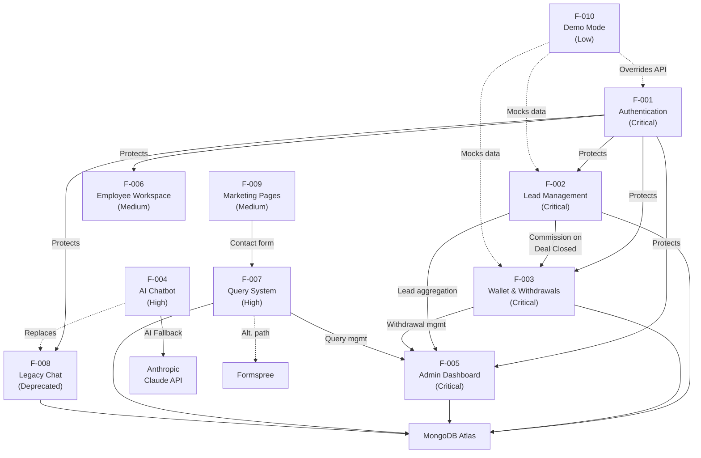
```mermaid
flowchart TD
    F001["F-001<br/>Authentication<br/>(Critical)"]

    F002["F-002<br/>Lead Management<br/>(Critical)"]
    F003["F-003<br/>Wallet & Withdrawals<br/>(Critical)"]
    F004["F-004<br/>AI Chatbot<br/>(High)"]
    F005["F-005<br/>Admin Dashboard<br/>(Critical)"]
    F006["F-006<br/>Employee Workspace<br/>(Medium)"]
    F007["F-007<br/>Query System<br/>(High)"]
    F008["F-008<br/>Legacy Chat<br/>(Deprecated)"]
    F009["F-009<br/>Marketing Pages<br/>(Medium)"]
    F010["F-010<br/>Demo Mode<br/>(Low)"]

    AnthropicAPI["Anthropic<br/>Claude API"]
    FormspreeAPI["Formspree"]
    MongoDB["MongoDB Atlas"]

    F001 -->|"Protects"| F002
    F001 -->|"Protects"| F003
    F001 -->|"Protects"| F005
    F001 -->|"Protects"| F006
    F001 -->|"Protects"| F008

    F002 -->|"Commission on<br/>Deal Closed"| F003
    F002 -->|"Lead aggregation"| F005
    F003 -->|"Withdrawal mgmt"| F005
    F007 -->|"Query mgmt"| F005
    F009 -->|"Contact form"| F007

    F004 -.->|"Replaces"| F008
    F004 -->|"AI Fallback"| AnthropicAPI
    F007 -.->|"Alt. path"| FormspreeAPI

    F002 --> MongoDB
    F003 --> MongoDB
    F005 --> MongoDB
    F007 --> MongoDB
    F008 --> MongoDB

    F010 -.->|"Overrides API"| F001
    F010 -.->|"Mocks data"| F002
    F010 -.->|"Mocks data"| F003
```

### 2.4.2 Integration Points

The following integration points have been identified from the codebase:

| Integration Point | Source Feature | Target Feature | Mechanism |
|---|---|---|---|
| Auth → Lead Ownership | F-001 | F-002 | `user` ObjectId reference in Lead model |
| Auth → Wallet Ownership | F-001 | F-003 | `wallet` embedded in User model |
| Lead → Commission Credit | F-002 | F-003 | Lead `Deal Closed` status triggers wallet credit |
| Query → Admin Management | F-007 | F-005 | Admin routes manage Query documents |
| Contact Page → Query API | F-009 | F-007 | Contact form submits to `POST /api/queries` |
| Chatbot → Anthropic API | F-004 | External | `fetch` to `api.anthropic.com/v1/messages` |
| Contact → Formspree | F-007 | External | Form POST to Formspree service |
| Demo → API Interceptors | F-010 | F-001, F-002, F-003 | Axios interceptors override real API calls |

### 2.4.3 Shared Components and Services

| Component/Service | Used By | Location |
|---|---|---|
| JWT Auth Middleware (`protect`) | F-002, F-003, F-005, F-006, F-008 | `referal/server/middleware/auth.js` |
| Admin Middleware (`adminOnly`) | F-005, Admin routes in F-002/F-003 | `referal/server/middleware/auth.js` |
| AuthContext Provider | F-001, F-002, F-003, F-005, F-006, F-010 | `referal/client/src/context/AuthContext.js` |
| Axios API Service | F-001, F-002, F-003, F-005, F-007 | `referal/client/src/services/api.js` |
| Protected Route Guards | F-002, F-003, F-005, F-006 | `referal/client/src/components/Layout/` |
| User Model (shared reference) | F-001, F-002, F-003, F-005, F-008 | `referal/server/models/User.js` |
| Layout Components (Header, Footer) | F-009, F-002, F-003, F-005 | `referal/client/src/components/Layout/` |

---

## 2.5 Implementation Considerations

### 2.5.1 Technical Constraints

| Constraint | Affected Features | Impact |
|---|---|---|
| Vercel serverless deployment | F-008 (critical), all server-side features | Socket.IO unreliable; cold-start latency on API routes |
| JSON body parsing limit (10 MB) | F-002, F-003, F-007 | Maximum request payload size for all API endpoints |
| Single-language interface (English) | All features | No internationalization framework; limits non-English market adoption |
| Node.js ≥ 18.0.0 requirement | All server-side features | Runtime engine constraint for backend deployment |
| Client-side Anthropic API call | F-004 | API key exposed in browser; no server proxy in current architecture |

### 2.5.2 Performance Requirements

| Requirement | Feature | Specification |
|---|---|---|
| Rate Limiting | All API endpoints | 100 requests per 15-minute window per IP via `express-rate-limit` |
| KB Response Time | F-004 | Rule-based match: 400ms simulated delay; AI fallback: dependent on Anthropic API latency |
| AI Token Cap | F-004 | Max 1000 tokens per Claude API call; system prompt limits responses to 150 words |
| JWT Expiration | F-001 | Default 7 days (`JWT_EXPIRE` env var); configurable per deployment |
| Session Rehydration | F-001 | On-mount token validation via `GET /api/auth/me`; subject to cold-start latency |

### 2.5.3 Scalability Considerations

| Consideration | Details | Affected Features |
|---|---|---|
| Serverless auto-scaling | Vercel functions scale automatically per request; no manual infrastructure management | All server-side features |
| Database connection pooling | Mongoose ODM manages MongoDB Atlas connections; serverless may exhaust connection limits under high load | F-002, F-003, F-005, F-007, F-008 |
| Stateless architecture | JWT-based auth eliminates server-side session state; enables horizontal scaling | F-001 |
| Chatbot self-containment | F-004 has zero project dependencies; can be embedded in any React application | F-004 |
| Wallet embedded design | Wallet balances embedded in User document avoids collection joins but limits independent wallet scaling | F-003 |

### 2.5.4 Security Implications

| Security Measure | Implementation | Affected Features |
|---|---|---|
| Password hashing | Bcrypt with 10 salt rounds; `select('-password')` on queries | F-001 |
| Helmet security headers | `helmet` middleware applied to all Express routes | All API features |
| CORS whitelist | `referus.co`, `www.referus.co`, `localhost:3000` | All API features |
| Rate limiting | 100 req/15 min per IP via `express-rate-limit` | All API features |
| Ownership enforcement | Lead and wallet operations validate `req.user._id` matches resource owner | F-002, F-003 |
| Admin-only gating | `adminOnly` middleware returns 403 for non-admin users | F-005, admin routes in F-002/F-003/F-007 |
| Fallback JWT secret | `process.env.JWT_SECRET` falls back to `'fallback-secret'`; production must override | F-001 |
| Client-side API key exposure | F-004 calls Anthropic API directly from browser without server proxy | F-004 |

### 2.5.5 Maintenance Requirements

| Requirement | Details | Affected Features |
|---|---|---|
| KB content updates | Chatbot knowledge base responses must be updated to reflect actual implemented features vs. aspirational descriptions | F-004 |
| Legacy chat removal | Socket.IO dependencies and routes should be removed after F-004 is fully integrated | F-008 |
| Field inconsistency fix | `sar`/`riyal` naming inconsistency in `WalletPage.js` requires normalization | F-003 |
| Employee API integration | Replace mocked data with actual API endpoints and authentication hooks | F-006 |
| Environment variable audit | Ensure `JWT_SECRET` fallback is not used in production; verify all required env vars are set | F-001, all server features |
| Dependency updates | Monitor and update npm dependencies, particularly security-sensitive packages (`jsonwebtoken`, `bcryptjs`, `helmet`) | All features |

---

## 2.6 Traceability Matrix

### 2.6.1 Feature-to-Requirements Traceability

| Feature ID | Requirement IDs | Total Requirements |
|---|---|---|
| F-001 | F-001-RQ-001 through F-001-RQ-007 | 7 |
| F-002 | F-002-RQ-001 through F-002-RQ-007 | 7 |
| F-003 | F-003-RQ-001 through F-003-RQ-006 | 6 |
| F-004 | F-004-RQ-001 through F-004-RQ-007 | 7 |
| F-005 | F-005-RQ-001 through F-005-RQ-005 | 5 |
| F-006 | F-006-RQ-001 through F-006-RQ-003 | 3 |
| F-007 | F-007-RQ-001 through F-007-RQ-003 | 3 |
| F-008 | F-008-RQ-001 through F-008-RQ-004 | 4 |
| F-009 | F-009-RQ-001 through F-009-RQ-004 | 4 |
| F-010 | F-010-RQ-001 through F-010-RQ-003 | 3 |
| **Total** | | **49** |

### 2.6.2 Feature-to-Source Traceability

| Feature ID | Server Models | Server Routes | Client Components |
|---|---|---|---|
| F-001 | `User.js` | `auth.js` | `Auth/`, `Layout/`, `AuthContext.js` |
| F-002 | `Lead.js` | `leads.js`, `admin.js` | `Leads/`, `LeadsPage.js`, `AddLeadPage.js` |
| F-003 | `Withdrawal.js`, `User.js` (wallet) | `wallet.js` | `Wallet/`, `WalletPage.js` |
| F-004 | — | — | `ReferusChatbot.jsx` |
| F-005 | User, Lead, Query, Withdrawal | `admin.js`, `users.js` | `Admin/`, `AdminPage.js` |
| F-006 | — (mocked data) | — (pending) | `Employee/`, `EmployeePage.js` |
| F-007 | `Query.js` | `queries.js`, `admin.js` | `Forms/`, `ContactPage.js` |
| F-008 | `ChatMessage.js` | `chat.js` | `Chat/`, `ChatPage.js`, `socket.js` |
| F-009 | — | — | `HomePage.js`, `AboutPage.js`, `HowItWorksPage.js` |
| F-010 | — | — | `demoApi.js`, `AuthContext.js` |

### 2.6.3 Priority Distribution

| Priority | Count | Features |
|---|---|---|
| Must-Have | 34 | F-001 (7), F-002 (7), F-003 (6), F-004 (3), F-005 (5), F-007 (2), F-008 (2), F-009 (1), F-010 (1) |
| Should-Have | 11 | F-001 (2), F-004 (3), F-006 (2), F-009 (2), F-010 (2) |
| Could-Have | 4 | F-004 (1), F-006 (1), F-007 (1), F-009 (1) |

---

## 2.7 Assumptions and Constraints

### 2.7.1 Documented Assumptions

| ID | Assumption | Impact |
|---|---|---|
| A-001 | MongoDB Atlas is the sole persistence layer; no caching layer (Redis, etc.) is deployed | All data reads hit the database directly |
| A-002 | The chatbot KB describes aspirational features not yet implemented (campaign management, tracking links, automated payouts, third-party integrations) | KB responses may set user expectations beyond current capabilities |
| A-003 | Employee workspace will receive full API integration in a future release | F-006 operates with mocked data in current version |
| A-004 | JWT fallback secret (`'fallback-secret'`) is overridden in production via environment variables | If not overridden, production auth tokens would be predictable |
| A-005 | The Anthropic API key is managed client-side in F-004 | No server-side proxy exists for AI fallback calls |

### 2.7.2 Known Constraints

| ID | Constraint | Mitigation |
|---|---|---|
| C-001 | Socket.IO does not function reliably on Vercel serverless | F-004 chatbot replaces F-008 legacy chat |
| C-002 | Serverless cold-start latency affects initial API response times | Stateless JWT auth reduces per-request overhead |
| C-003 | Rate limiting at 100 req/15 min per IP may be restrictive for high-traffic admin operations | Rate limit is configurable via `express-rate-limit` options |
| C-004 | English-only interface with no i18n framework | Multi-currency support partially addresses international markets |
| C-005 | Wallet `sar`/`riyal` field naming inconsistency in `WalletPage.js` | Requires normalization in maintenance cycle |

---

## 2.8 References

#### Source Files

- `referal/server/models/User.js` — User schema with roles, wallet, password hashing (F-001, F-003, F-005)
- `referal/server/models/Lead.js` — Lead schema with 5-stage status workflow (F-002)
- `referal/server/models/Withdrawal.js` — Withdrawal schema with bank details (F-003)
- `referal/server/models/Query.js` — Query schema with status lifecycle (F-007)
- `referal/server/models/ChatMessage.js` — Chat message schema (F-008)
- `referal/server/routes/auth.js` — Registration, login, session endpoints (F-001)
- `referal/server/routes/leads.js` — Lead CRUD and status management (F-002)
- `referal/server/routes/wallet.js` — Wallet and withdrawal endpoints (F-003)
- `referal/server/routes/admin.js` — Admin dashboard, lead, and query management (F-005)
- `referal/server/routes/users.js` — Admin user management (F-005)
- `referal/server/routes/queries.js` — Public query submission (F-007)
- `referal/server/routes/chat.js` — Legacy chat endpoints (F-008)
- `referal/server/middleware/auth.js` — JWT `protect` and `adminOnly` middleware (F-001)
- `referal/ReferusChatbot.jsx` — AI-powered support chatbot widget (F-004, user-provided context)
- `referal/server/package.json` — Backend dependency manifest (all server features)
- `referal/client/package.json` — Frontend dependency manifest (all client features)
- `referal/client/src/context/AuthContext.js` — Auth state management (F-001, F-010)
- `referal/client/src/services/demoApi.js` — Mock API layer (F-010)
- `referal/client/src/services/socket.js` — Socket.IO client service (F-008)

#### Source Directories

- `referal/client/src/components/Auth/` — Login and registration forms (F-001)
- `referal/client/src/components/Layout/` — Route guards, Header, Footer (F-001, F-009)
- `referal/client/src/components/Leads/` — Lead cards, filters, forms (F-002)
- `referal/client/src/components/Wallet/` — Withdrawal display and requests (F-003)
- `referal/client/src/components/Admin/` — Admin UI components (F-005)
- `referal/client/src/components/Employee/` — Employee workspace components (F-006)
- `referal/client/src/components/Forms/` — Contact forms (F-007)
- `referal/client/src/components/Chat/` — Chat UI components (F-008)
- `referal/client/src/pages/` — 12 page-level route components (F-002, F-003, F-005–F-010)
- `referal/client/src/services/` — API, demo, socket, storage services (F-001, F-008, F-010)
- `referal/server/models/` — 5 Mongoose data models (F-001–F-003, F-007, F-008)
- `referal/server/routes/` — 7 Express route modules (F-001–F-003, F-005, F-007, F-008)

#### Technical Specification Cross-References

- Section 1.1 — Executive Summary: Project overview, business problem, stakeholder definitions
- Section 1.2 — System Overview: Architecture, success criteria, KPIs
- Section 1.3 — Scope: In-scope features, implementation boundaries, out-of-scope elements
- Section 1.4 — References: Complete source file and directory listing

#### External References

- B2B referral market context and industry benchmarks sourced from CustomerGauge and PartnerStack research

# 3. Technology Stack

This section provides a comprehensive inventory of all technologies, frameworks, libraries, and services that comprise the Referus.co platform. Each choice is documented with its declared version, role within the system, and justification based on architectural requirements established in prior sections. The Referus.co v1.0.0 platform follows a MERN-variant architecture (MongoDB, Express, React, Node.js) deployed on Vercel's serverless infrastructure.

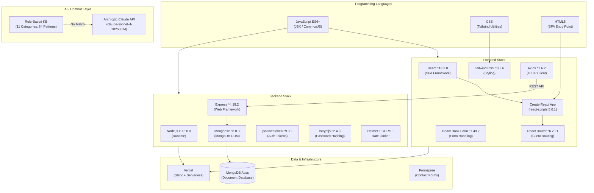
```mermaid
flowchart TB
    subgraph ProgrammingLanguages["Programming Languages"]
        JS["JavaScript ES6+<br/>(JSX / CommonJS)"]
        CSS["CSS<br/>(Tailwind Utilities)"]
        HTML["HTML5<br/>(SPA Entry Point)"]
    end

    subgraph FrontendStack["Frontend Stack"]
        React18["React ^18.2.0<br/>(SPA Framework)"]
        CRA["Create React App<br/>(react-scripts 5.0.1)"]
        RRouter["React Router ^6.20.1<br/>(Client Routing)"]
        TW["Tailwind CSS ^3.3.6<br/>(Styling)"]
        Axios["Axios ^1.6.2<br/>(HTTP Client)"]
        RHF["React Hook Form ^7.48.2<br/>(Form Handling)"]
    end

    subgraph BackendStack["Backend Stack"]
        NodeJS["Node.js ≥ 18.0.0<br/>(Runtime)"]
        Express["Express ^4.18.2<br/>(Web Framework)"]
        Mongoose["Mongoose ^8.0.3<br/>(MongoDB ODM)"]
        JWT["jsonwebtoken ^9.0.2<br/>(Auth Tokens)"]
        Bcrypt["bcryptjs ^2.4.3<br/>(Password Hashing)"]
        SecurityMW["Helmet + CORS +<br/>Rate Limiter"]
    end

    subgraph AILayer["AI / Chatbot Layer"]
        KBRB["Rule-Based KB<br/>(11 Categories, 84 Patterns)"]
        ClaudeAPI["Anthropic Claude API<br/>(claude-sonnet-4-20250514)"]
    end

    subgraph DataInfra["Data & Infrastructure"]
        MongoAtlas[("MongoDB Atlas<br/>(Document Database)")]
        VercelPlatform["Vercel<br/>(Static + Serverless)"]
        FormspreeExt["Formspree<br/>(Contact Forms)"]
    end

    JS --> FrontendStack
    JS --> BackendStack
    CSS --> TW
    HTML --> CRA

    React18 --> CRA
    CRA --> RRouter
    Axios -->|"REST API"| Express
    Express --> Mongoose
    Mongoose --> MongoAtlas
    KBRB -.->|"No Match"| ClaudeAPI
    FrontendStack --> VercelPlatform
    BackendStack --> VercelPlatform
```

## 3.1 Programming Languages

### 3.1.1 JavaScript (ES6+ / JSX)

JavaScript serves as the **sole programming language** for the entire Referus.co codebase — spanning both the frontend Single Page Application and the backend REST API. No TypeScript source files exist in the production codebase.

| Aspect | Detail | Evidence |
|---|---|---|
| **Frontend Dialect** | ES6+ with JSX syntax | All files in `referal/client/src/` use `.js`/`.jsx` extensions |
| **Backend Dialect** | CommonJS (Node.js) | All files in `referal/server/` use `require()`/`module.exports` patterns |
| **Runtime Requirement** | Node.js ≥ 18.0.0 | Declared in `referal/server/package.json` via `"engines": { "node": ">=18.0.0" }` |
| **Module System** | ES Modules (frontend via CRA/Webpack), CommonJS (backend) | Frontend uses `import`/`export`; backend uses `require()`/`module.exports` |

#### Selection Justification

- **Unified Language Stack**: JavaScript across all layers eliminates context-switching overhead, enabling full-stack developer mobility between client and server codebases.
- **Ecosystem Alignment**: The MERN stack (MongoDB, Express, React, Node.js) is one of the most widely adopted full-stack JavaScript architectures, providing extensive community support, documentation, and third-party library availability.
- **Node.js 18+ Requirement**: Mandating Node.js 18 or higher ensures access to the latest LTS security patches and modern JavaScript engine features. This aligns with Express 4.x compatibility requirements and Vercel's serverless runtime capabilities.

#### TypeScript Consideration

While `@types/react` ^18.2.42 and `@types/react-dom` ^18.2.17 appear as `devDependencies` in `referal/client/package.json`, these serve exclusively for IDE autocompletion and type hinting. The Tailwind configuration in `referal/client/tailwind.config.js` scans `*.{js,jsx,ts,tsx}` file patterns, but no `.ts` or `.tsx` source files exist in the codebase. The project is pure JavaScript.

### 3.1.2 CSS

Styling is implemented through a layered approach combining utility-first CSS with targeted custom styles:

| Layer | Technology | Purpose |
|---|---|---|
| **Utility Framework** | Tailwind CSS ^3.3.6 | Responsive, utility-first class-based styling across all React components |
| **Post-Processing** | PostCSS ^8.4.32 + Autoprefixer ^10.4.16 | CSS transformation pipeline and vendor prefix automation |
| **Custom Styles** | Global stylesheet (`index.css`) with `@apply` directives | Custom Tailwind-based component styles |
| **Inline Styles** | CSS-in-JS via `style` props | Chatbot widget (`ReferusChatbot.jsx`) uses inline styles and `<style>` elements for animations (`slideUp`, `bounce`, `pulse`) |

### 3.1.3 HTML

A single `index.html` entry point is managed by Create React App. All markup is generated through JSX-templated React components rendered into the DOM via React 18's `createRoot` API.

---

## 3.2 Frameworks & Libraries

### 3.2.1 Frontend Core Framework

The frontend is built as a React 18 Single Page Application using Create React App as the build toolchain. This provides a zero-configuration development experience with production-optimized bundling.

| Library | Version (Declared) | Role | Justification |
|---|---|---|---|
| **react** | ^18.2.0 | Core UI framework | Component-driven architecture with hooks API (`useState`, `useReducer`, `useEffect`, `useContext`, `useRef`). Enables declarative UI composition across 10 feature modules. |
| **react-dom** | ^18.2.0 | DOM rendering layer | React 18's `createRoot` API for concurrent rendering capabilities. Provides the browser-specific rendering pipeline. |
| **react-scripts** | 5.0.1 | Build toolchain (CRA) | Bundles Webpack, Babel, Jest, ESLint, and Workbox into a zero-configuration development and production build pipeline. Manages transpilation, bundling, and development server. |
| **react-router-dom** | ^6.20.1 | Client-side routing | Declarative routing with nested layouts, protected route guards (`ProtectedRoute`, `AdminProtectedRoute`, `EmployeeProtectedRoute`), and SPA navigation. |

#### React 18 Feature Utilization

The platform leverages several React 18-specific capabilities:

- **Hooks-Based State Management**: `AuthContext` uses `useReducer` with six actions (`LOGIN_START`, `LOGIN_SUCCESS`, `LOGIN_FAILURE`, `LOGOUT`, `UPDATE_USER`, `CLEAR_ERROR`) for centralized auth state management, as implemented in `referal/client/src/context/AuthContext.js`.
- **Concurrent Rendering**: React 18's `createRoot` API enables automatic batching and concurrent rendering features across all SPA routes.
- **Component Composition**: The 10 feature-organized component modules in `referal/client/src/components/` leverage React's compositional model for modular UI architecture.

#### Version Context

The project declares React ^18.2.0 as its dependency. React 19 is now available (latest 19.2.4 as of early 2026), but the ^18.2.0 semver range constrains resolution to the 18.x line. The React team recommends upgrading to 18.3.1 first to identify deprecation warnings before migrating to React 19.

### 3.2.2 Frontend Supporting Libraries

| Library | Version | Category | Purpose & Justification |
|---|---|---|---|
| **tailwindcss** | ^3.3.6 | Styling | Utility-first CSS framework enabling rapid responsive design. Custom theme configured in `referal/client/tailwind.config.js` with branded color scales (`primary`, `secondary`) and `Inter` font family. |
| **postcss** | ^8.4.32 | CSS Processing | Required Tailwind CSS host; manages the CSS transformation pipeline defined in `referal/client/postcss.config.js`. |
| **autoprefixer** | ^10.4.16 | CSS Processing | Automatic vendor prefix injection for cross-browser CSS compatibility, aligned with the browserslist targeting `>0.2%` market share in production. |
| **axios** | ^1.6.2 | HTTP Client | Promise-based HTTP client for REST API communication. Leverages interceptor mechanism for JWT token injection (`Authorization: Bearer` headers) and auto-logout on 401 responses. Also used by Demo Mode (F-010) for request interception. |
| **socket.io-client** | ^4.7.4 | WebSocket (Legacy) | Client-side WebSocket library for the legacy chat system (F-008). **Being replaced** by the AI chatbot (F-004) due to Vercel serverless incompatibility. |
| **react-hook-form** | ^7.48.2 | Form Handling | Declarative form state management with built-in validation for lead submission (F-002), contact forms (F-007), and authentication (F-001). |
| **react-hot-toast** | ^2.4.1 | Notifications | Lightweight toast notification system for user feedback on API operations (success, error, loading states). |
| **lucide-react** | ^0.294.0 | Icons | Tree-shakeable SVG icon component library providing consistent iconography across the UI. |
| **react-flags-select** | ^2.5.0 | Internationalization | Country flag picker component supporting international phone number input for multi-market user registration. |
| **libphonenumber-js** | ^1.12.24 | Phone Validation | Google's phone number parsing and validation library. Enables multi-country phone number formatting for the platform's cross-border markets (USD, AED, EUR, SAR territories). |

### 3.2.3 Frontend Testing Framework

| Library | Version | Role |
|---|---|---|
| **@testing-library/jest-dom** | ^5.17.0 | Custom DOM assertion matchers extending Jest's `expect` API |
| **@testing-library/react** | ^13.4.0 | React component rendering utilities for behavioral testing |
| **@testing-library/user-event** | ^14.5.1 | Simulated user interaction events (click, type, tab) for integration tests |

The testing stack is bundled through `react-scripts` 5.0.1, which includes Jest as the test runner. ESLint configuration extends `react-app` and `react-app/jest` presets as declared in `referal/client/package.json`.

### 3.2.4 Frontend Configuration

#### Tailwind CSS Configuration (`referal/client/tailwind.config.js`)

| Setting | Value | Purpose |
|---|---|---|
| Content scan | `./src/**/*.{js,jsx,ts,tsx}` | Purges unused CSS classes from production builds |
| Color theme — primary | Blue scale | Primary brand color for UI elements |
| Color theme — secondary | Slate scale | Secondary/neutral color palette |
| Font family | `Inter`, `system-ui`, `sans-serif` | Branded typography with system font fallbacks |
| Plugins | None | Minimal Tailwind configuration |

#### PostCSS Configuration (`referal/client/postcss.config.js`)

Plugins: `tailwindcss`, `autoprefixer` — a standard two-plugin pipeline that processes Tailwind utilities and auto-prefixes CSS output.

#### Browserslist (`referal/client/package.json`)

| Environment | Targets |
|---|---|
| Production | `>0.2%`, `not dead`, `not op_mini all` |
| Development | `last 1 chrome version`, `last 1 firefox version`, `last 1 safari version` |

### 3.2.5 Backend Core Framework

The backend is built on Express.js, the de facto standard server framework for Node.js, using Mongoose as the MongoDB Object Document Mapper.

| Library | Version (Declared) | Role | Justification |
|---|---|---|---|
| **express** | ^4.18.2 | Web framework | REST API routing, middleware-based request pipeline. Provides the routing, middleware composition, and HTTP abstraction layer for 7 route modules. |
| **mongoose** | ^8.0.3 | MongoDB ODM | Schema validation, model compilation, query building, and lifecycle hooks. Manages the 5 core data models (User, Lead, ChatMessage, Query, Withdrawal). |
| **jsonwebtoken** | ^9.0.2 | JWT Authentication | Token generation and verification for stateless session management. Signs tokens with `JWT_SECRET` (configurable, 7-day default expiry). |
| **bcryptjs** | ^2.4.3 | Password Security | Pure JavaScript bcrypt implementation. 10 salt rounds for password hashing via pre-save hook in the User model. |
| **dotenv** | ^16.3.1 | Configuration | Loads `.env` file key-value pairs into `process.env` for environment-based configuration management. |

#### Express Version Context

The project uses Express ^4.18.2. Express 5 has been officially released (latest 5.2.1), which includes native promise rejection handling in middleware, path-to-regexp security improvements, and Node.js 18 minimum requirement. The current 4.x line remains under maintenance support, but the team should plan a migration path to Express 5 for long-term security and performance benefits.

#### Mongoose Version Context

Mongoose ^8.0.3 is declared in `referal/server/package.json`. Mongoose 8 was released on October 31, 2023, built on the MongoDB Node.js driver 6.0. While Mongoose 9.x has since been released, Mongoose 8.x continues to receive bug fixes and features. The ^8.0.3 semver range allows resolution up to (but not including) 9.0.0.

### 3.2.6 Backend Security & Middleware Libraries

| Library | Version | Role | Configuration |
|---|---|---|---|
| **helmet** | ^7.1.0 | HTTP security headers | Applied as first middleware in `referal/server/index.js`; sets Content-Security-Policy, X-Frame-Options, and other hardening headers. |
| **cors** | ^2.8.5 | Cross-Origin Resource Sharing | Whitelist-based origin filtering. Allowed origins: `referus.co`, `www.referus.co`, `localhost:3000`. Credentials enabled. Configured in `referal/server/index.js` lines 51–64. |
| **express-rate-limit** | ^7.1.5 | Rate limiting | 100 requests per 15-minute window per IP. Protects all API endpoints against abuse and brute-force attacks. Configured in `referal/server/index.js` lines 34–38. |
| **express-validator** | ^7.0.1 | Input validation | Request body, query, and parameter validation across all API routes. Enforces data integrity constraints defined in Mongoose schemas. |
| **multer** | ^1.4.5-lts.1 | File upload handling | Multipart form data middleware for file attachment processing. |

### 3.2.7 Backend Middleware Pipeline

The Express middleware stack is ordered deliberately in `referal/server/index.js` to ensure security layers process before business logic:

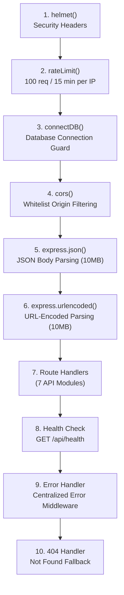
```mermaid
flowchart TD
    A["1. helmet()<br/>Security Headers"] --> B["2. rateLimit()<br/>100 req / 15 min per IP"]
    B --> C["3. connectDB()<br/>Database Connection Guard"]
    C --> D["4. cors()<br/>Whitelist Origin Filtering"]
    D --> E["5. express.json()<br/>JSON Body Parsing (10MB)"]
    E --> F["6. express.urlencoded()<br/>URL-Encoded Parsing (10MB)"]
    F --> G["7. Route Handlers<br/>(7 API Modules)"]
    G --> H["8. Health Check<br/>GET /api/health"]
    H --> I["9. Error Handler<br/>Centralized Error Middleware"]
    I --> J["10. 404 Handler<br/>Not Found Fallback"]
```

### 3.2.8 AI Chatbot Widget Technology

The `ReferusChatbot.jsx` widget is a **zero-dependency standalone component** that imports exclusively from React and uses the browser's native `fetch` API. This architectural decision ensures the chatbot can be embedded in any React application without introducing project-specific coupling.

| Technology | Version/Model | Role |
|---|---|---|
| React hooks (`useState`, `useRef`, `useEffect`) | Part of React ^18.2.0 | Component state management, DOM references, side-effect lifecycle |
| Browser `fetch` API | Native (no library) | Direct HTTP calls to Anthropic API — bypasses Axios dependency |
| Anthropic Claude API | Model: `claude-sonnet-4-20250514` | AI fallback for queries not matched by the rule-based knowledge base |
| Inline CSS-in-JS | N/A | Component styling via React `style` props for portability |
| Inline `<style>` element | N/A | CSS `@keyframes` animations: `slideUp`, `bounce`, `pulse` |

---

## 3.3 Open Source Dependencies

### 3.3.1 Frontend Package Manifest

**Package**: `referus-co-client` v1.0.0 (private: true)
**Registry**: npm (npmjs.com)
**Lockfile**: `referal/client/package-lock.json` (lockfile version 3)

#### Production Dependencies (16 packages)

| Package | Version | License Implication |
|---|---|---|
| `react` | ^18.2.0 | MIT |
| `react-dom` | ^18.2.0 | MIT |
| `react-router-dom` | ^6.20.1 | MIT |
| `react-scripts` | 5.0.1 | MIT |
| `tailwindcss` | ^3.3.6 | MIT |
| `postcss` | ^8.4.32 | MIT |
| `autoprefixer` | ^10.4.16 | MIT |
| `axios` | ^1.6.2 | MIT |
| `socket.io-client` | ^4.7.4 | MIT |
| `react-hook-form` | ^7.48.2 | MIT |
| `react-hot-toast` | ^2.4.1 | MIT |
| `lucide-react` | ^0.294.0 | ISC |
| `react-flags-select` | ^2.5.0 | MIT |
| `libphonenumber-js` | ^1.12.24 | MIT |
| `@testing-library/jest-dom` | ^5.17.0 | MIT |
| `@testing-library/react` | ^13.4.0 | MIT |
| `@testing-library/user-event` | ^14.5.1 | MIT |

#### Development Dependencies (2 packages)

| Package | Version | Purpose |
|---|---|---|
| `@types/react` | ^18.2.42 | TypeScript type definitions for IDE support |
| `@types/react-dom` | ^18.2.17 | TypeScript type definitions for IDE support |

### 3.3.2 Backend Package Manifest

**Package**: `referus-co-server` v1.0.0
**Registry**: npm (npmjs.com)
**Lockfile**: `referal/server/package-lock.json`

#### Production Dependencies (11 packages)

| Package | Version | License Implication |
|---|---|---|
| `express` | ^4.18.2 | MIT |
| `mongoose` | ^8.0.3 | MIT |
| `jsonwebtoken` | ^9.0.2 | MIT |
| `bcryptjs` | ^2.4.3 | MIT |
| `cors` | ^2.8.5 | MIT |
| `helmet` | ^7.1.0 | MIT |
| `express-rate-limit` | ^7.1.5 | MIT |
| `express-validator` | ^7.0.1 | MIT |
| `dotenv` | ^16.3.1 | BSD-2-Clause |
| `multer` | ^1.4.5-lts.1 | MIT |
| `socket.io` | ^4.8.1 | MIT |

#### Development Dependencies (1 package)

| Package | Version | Purpose |
|---|---|---|
| `nodemon` | ^3.0.2 | Auto-restart development server on file changes |

### 3.3.3 Transitive Dependency Surface

The Create React App toolchain (`react-scripts` 5.0.1) introduces a substantial transitive dependency tree that provides the full frontend build infrastructure:

| Transitive Layer | Role |
|---|---|
| **Babel** | JavaScript transpilation (ES6+ / JSX → browser-compatible JS) |
| **Webpack + webpack-dev-server** | Module bundling, code splitting, hot module replacement, and development server |
| **Jest** | Test runner with coverage reporting |
| **ESLint** | Code quality linting (extends `react-app` and `react-app/jest` presets) |
| **Workbox** | Service worker generation for PWA capabilities |
| **PostCSS Internals** | CSS processing pipeline for Tailwind compilation |

### 3.3.4 Dependency Management Strategy

- **Semver Ranges**: All dependencies use caret (`^`) ranges, allowing minor and patch updates while preventing major version breaks. The exception is `react-scripts` at exactly `5.0.1` (pinned version).
- **Lockfile Consistency**: Both `package-lock.json` files ensure deterministic installations across development, staging, and production environments.
- **Security Monitoring**: Security-sensitive packages (`jsonwebtoken`, `bcryptjs`, `helmet`, `express-rate-limit`) should be monitored for vulnerability disclosures and updated promptly. This is documented as a maintenance requirement in Section 2.5.5.

---

## 3.4 Third-Party Services

### 3.4.1 Service Integration Overview

The Referus.co platform integrates with four external services in its current v1.0.0 implementation. All other integrations described in the chatbot knowledge base (Stripe, PayPal, HubSpot, Salesforce, Zapier, Slack, etc.) are aspirational and not yet implemented, as documented in Section 1.3.3.

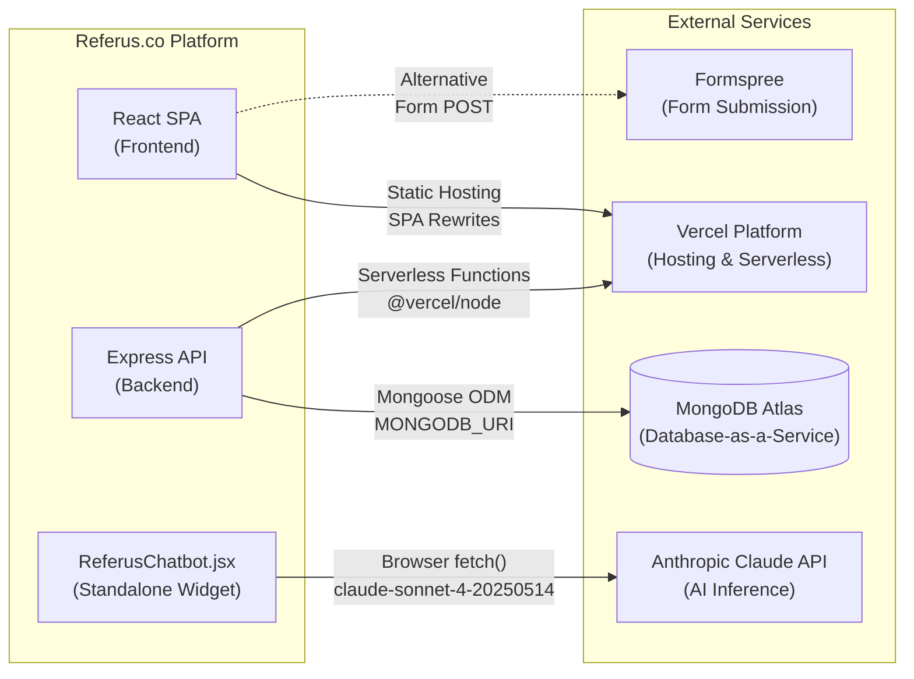
```mermaid
flowchart LR
    subgraph ReferusPlatform["Referus.co Platform"]
        FEClient["React SPA<br/>(Frontend)"]
        BEServer["Express API<br/>(Backend)"]
        ChatbotWidget["ReferusChatbot.jsx<br/>(Standalone Widget)"]
    end

    subgraph ExternalServices["External Services"]
        MongoDBAtlas[("MongoDB Atlas<br/>(Database-as-a-Service)")]
        AnthropicService["Anthropic Claude API<br/>(AI Inference)"]
        VercelService["Vercel Platform<br/>(Hosting & Serverless)"]
        FormspreeService["Formspree<br/>(Form Submission)"]
    end

    BEServer -->|"Mongoose ODM<br/>MONGODB_URI"| MongoDBAtlas
    ChatbotWidget -->|"Browser fetch()<br/>claude-sonnet-4-20250514"| AnthropicService
    FEClient -->|"Static Hosting<br/>SPA Rewrites"| VercelService
    BEServer -->|"Serverless Functions<br/>@vercel/node"| VercelService
    FEClient -.->|"Alternative<br/>Form POST"| FormspreeService
```

### 3.4.2 MongoDB Atlas (Database-as-a-Service)

| Attribute | Detail |
|---|---|
| **Service Type** | Managed cloud database |
| **Integration Point** | `referal/server/config/database.js` |
| **Connection Protocol** | MongoDB wire protocol via `mongoose.connect()` |
| **Configuration** | `MONGODB_URI` environment variable (with hardcoded Atlas fallback) |
| **Connection Options** | `bufferCommands: false` to prevent silent buffering before connection establishment |

#### Serverless Connection Optimization

The database module in `referal/server/config/database.js` implements a serverless-optimized connection caching pattern. A cached Mongoose connection promise is stored on `global.mongoose` to prevent duplicate connections across Vercel serverless warm invocations. This addresses the known constraint (C-002) that serverless cold starts affect initial API response times and that connection pooling may exhaust limits under high load.

### 3.4.3 Anthropic Claude API (AI Service)

| Attribute | Detail |
|---|---|
| **Service Type** | Large Language Model inference |
| **Integration Point** | `referal/ReferusChatbot.jsx` — `askClaude()` function |
| **API Endpoint** | `https://api.anthropic.com/v1/messages` |
| **Model** | `claude-sonnet-4-20250514` |
| **Token Limit** | `max_tokens: 1000` per request |
| **System Prompt** | Constrains responses to ≤150 words and Referus-relevant topics only |
| **Invocation** | Client-side browser `fetch()` — no server proxy |

#### Security Consideration (Constraint C-005)

The Anthropic API is called directly from the client-side browser without a server-side proxy. This means the API key must be accessible in the browser context, creating an exposure risk documented as Assumption A-005 and Constraint C-005 in Section 2.7. A future mitigation would involve routing Claude API calls through a server-side endpoint to protect the API key.

#### Failure Handling

On API failure or timeout, the chatbot falls back to a static message directing users to `support@referus.co` and `docs.referus.co`, ensuring the user experience degrades gracefully without system errors.

### 3.4.4 Vercel (Hosting Platform)

| Attribute | Detail |
|---|---|
| **Service Type** | Platform-as-a-Service (static hosting + serverless functions) |
| **Frontend Deployment** | Static hosting with SPA rewrites (`referal/client/vercel.json`) |
| **Backend Deployment** | Serverless functions via `@vercel/node` builder (`referal/server/vercel.json`) |
| **API Proxy** | Client `vercel.json` rewrites `/api/:path*` to the backend deployment URL |

#### Deployment Configuration

| Component | Build Command | Output | Builder |
|---|---|---|---|
| Frontend (Client) | `npm run build` | `build/` directory | Native static hosting |
| Backend (Server) | N/A (interpreted at runtime) | `api/index.js` | `@vercel/node` |

#### Known Platform Constraints

- **WebSocket Degradation**: Socket.IO does not function reliably on Vercel serverless functions, which is the primary driver for replacing the legacy chat (F-008) with the AI chatbot (F-004).
- **Cold-Start Latency**: Serverless functions experience cold-start delays on initial invocations, affecting API response times.
- **Conditional Server Listening**: The Express server conditionally invokes `server.listen()` only in non-production environments; in production, it exports `module.exports = server` for Vercel's serverless adapter.

### 3.4.5 Formspree (Form Service)

| Attribute | Detail |
|---|---|
| **Service Type** | Form-as-a-Service |
| **Integration Point** | `FloatingChatButton` component |
| **Purpose** | Alternative contact form submission path alongside the primary `POST /api/queries` endpoint |
| **Authentication** | None (public form submission) |

### 3.4.6 Explicitly Not Integrated

The chatbot knowledge base in `ReferusChatbot.jsx` references numerous third-party integrations that are **aspirational only** and not implemented in the v1.0.0 codebase:

| Category | Referenced Services | Implementation Status |
|---|---|---|
| Payment Gateways | Stripe, PayPal, Wise | Not implemented |
| Email Services | Mailchimp, SendGrid, Postmark | Not implemented |
| CRM Systems | HubSpot, Salesforce, Pipedrive | Not implemented |
| Automation | Zapier, Make (Integromat), n8n | Not implemented |
| Messaging | Slack, Discord | Not implemented |
| E-commerce | Shopify, WooCommerce | Not implemented |
| SSO Providers | Google OAuth, SAML 2.0 | Not implemented |

---

## 3.5 Databases & Storage

### 3.5.1 Primary Database: MongoDB Atlas

MongoDB Atlas serves as the **sole persistence layer** for the Referus.co platform. This is documented as Assumption A-001: "MongoDB Atlas is the sole persistence layer; no caching layer (Redis, etc.) is deployed."

| Attribute | Detail |
|---|---|
| **Database Type** | Document-oriented NoSQL (MongoDB) |
| **Hosting** | MongoDB Atlas (cloud-managed) |
| **ODM** | Mongoose ^8.0.3 |
| **Connection String** | Configured via `MONGODB_URI` environment variable |
| **Connection Module** | `referal/server/config/database.js` |
| **Buffer Commands** | Disabled (`bufferCommands: false`) to prevent silent command buffering |

#### Selection Justification

- **Document Model**: MongoDB's flexible document schema aligns with the platform's varied data structures — from embedded wallet balances in User documents to subdocument arrays (lead notes) and ObjectId references (withdrawal-to-user relationships).
- **Atlas Managed Service**: Cloud-managed database eliminates infrastructure management overhead, aligning with the serverless deployment philosophy on Vercel.
- **Mongoose ODM**: Provides schema enforcement at the application layer, ensuring data validation, type casting, and business logic hooks (e.g., bcrypt pre-save password hashing) that MongoDB's flexible schema model does not natively enforce.

### 3.5.2 Data Collections

The platform operates on five Mongoose-defined collections:

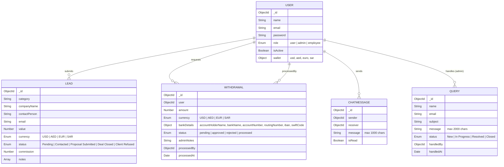
```mermaid
erDiagram
    USER {
        ObjectId _id
        String name
        String email
        String password
        Enum role "user | admin | employee"
        Boolean isActive
        Object wallet "usd, aed, euro, sar"
    }

    LEAD {
        ObjectId _id
        String category
        String companyName
        String contactPerson
        String email
        Number value
        Enum currency "USD | AED | EUR | SAR"
        Enum status "Pending | Contacted | Proposal Submitted | Deal Closed | Client Refused"
        Number commission
        Array notes
    }

    CHATMESSAGE {
        ObjectId _id
        ObjectId sender
        ObjectId receiver
        String message "max 1000 chars"
        Boolean isRead
    }

    QUERY {
        ObjectId _id
        String name
        String email
        String subject
        String message "max 2000 chars"
        Enum status "New | In Progress | Resolved | Closed"
        ObjectId handledBy
        Date handledAt
    }

    WITHDRAWAL {
        ObjectId _id
        ObjectId user
        Number amount
        Enum currency "USD | AED | EUR | SAR"
        Object bankDetails "accountHolderName, bankName, accountNumber, routingNumber, iban, swiftCode"
        Enum status "pending | approved | rejected | processed"
        String adminNotes
        ObjectId processedBy
        Date processedAt
    }

    USER ||--o{ LEAD : "submits"
    USER ||--o{ WITHDRAWAL : "requests"
    USER ||--o{ CHATMESSAGE : "sends"
    USER ||--o{ QUERY : "handles (admin)"
    WITHDRAWAL }o--|| USER : "processedBy"
```

| Model | Collection | Schema Location | Key Relationships |
|---|---|---|---|
| **User** | Users | `referal/server/models/User.js` | Root entity; wallet balances embedded as subdocument |
| **Lead** | Leads | `referal/server/models/Lead.js` | `user` → User (ownership reference) |
| **ChatMessage** | ChatMessages | `referal/server/models/ChatMessage.js` | `sender` / `receiver` → User |
| **Query** | Queries | `referal/server/models/Query.js` | `handledBy` → User (admin assignment) |
| **Withdrawal** | Withdrawals | `referal/server/models/Withdrawal.js` | `user` → User (requester), `processedBy` → User (admin processor) |

### 3.5.3 Client-Side Storage

The frontend utilizes browser-native storage mechanisms managed through a centralized storage service at `referal/client/src/services/storage.js`:

| Storage Mechanism | Persistence | Purpose |
|---|---|---|
| **localStorage** | Persistent (across sessions) | JWT token persistence, user data, settings, theme preferences, language selection, cached data, form drafts, search history, favorites |
| **sessionStorage** | Session-scoped (per tab) | Temporary session data, ephemeral state |

### 3.5.4 Caching Strategy

**No dedicated caching layer is deployed.** There is no Redis, Memcached, or other caching service. All data reads directly query MongoDB Atlas. The only caching mechanism is the Mongoose connection state cached in `global.mongoose` for serverless warm-invocation reuse. This architectural simplicity aligns with the v1.0.0 scope but may require re-evaluation as traffic scales.

---

## 3.6 Development & Deployment

### 3.6.1 Development Tools

| Tool | Version / Config | Purpose |
|---|---|---|
| **Node.js** | ≥ 18.0.0 | JavaScript runtime for backend execution and frontend build tooling |
| **npm** | System default (bundled with Node.js) | Package manager; both client and server use npm lockfiles |
| **nodemon** | ^3.0.2 (dev dependency) | Backend auto-restart on file changes during development (`npm run dev`) |
| **react-scripts** | 5.0.1 | Frontend development server, build pipeline, test runner, and linting |
| **ESLint** | Bundled with react-scripts | Code quality linting; extends `react-app` and `react-app/jest` presets |
| **Jest** | Bundled with react-scripts | Test runner with React Testing Library integration |

### 3.6.2 Build System

#### Frontend Build Pipeline

| Script | Command | Description |
|---|---|---|
| `start` | `react-scripts start` | Development server with hot module replacement (proxied to `http://localhost:5000`) |
| `build` | `react-scripts build` | Production build — outputs optimized static assets to `build/` directory |
| `test` | `react-scripts test` | Runs Jest test suite with React Testing Library |
| `vercel-build` | `react-scripts build` | Vercel-specific build hook (identical to `build`) |

- **Development Proxy**: Configured as `"proxy": "http://localhost:5000"` in `referal/client/package.json`, forwarding API requests to the local Express server during development.
- **Asset Paths**: `"homepage": "."` enables relative asset paths for deployment flexibility.

#### Backend Build Pipeline

The backend requires **no build step** — it runs raw CommonJS JavaScript directly on Node.js.

| Script | Command | Description |
|---|---|---|
| `start` | `node index.js` | Production server start |
| `dev` | `nodemon index.js` | Development server with auto-restart on file changes |

- **Entry Points**: `index.js` (traditional server start) or `api/index.js` (Vercel serverless adapter)
- **Conditional Listening**: The server only calls `server.listen()` in non-production environments; exports `module.exports = server` for Vercel's serverless runtime.

### 3.6.3 Deployment Architecture

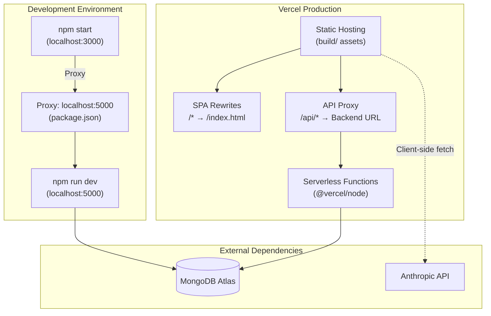
```mermaid
flowchart TB
    subgraph DevEnvironment["Development Environment"]
        DevClient["npm start<br/>(localhost:3000)"]
        DevServer["npm run dev<br/>(localhost:5000)"]
        DevProxy["Proxy: localhost:5000<br/>(package.json)"]
    end

    subgraph VercelProd["Vercel Production"]
        VercelStatic["Static Hosting<br/>(build/ assets)"]
        VercelServerless["Serverless Functions<br/>(@vercel/node)"]
        SPARewrite["SPA Rewrites<br/>/* → /index.html"]
        APIRewrite["API Proxy<br/>/api/* → Backend URL"]
    end

    subgraph ExternalDeps["External Dependencies"]
        AtlasDB[("MongoDB Atlas")]
        AnthropicExt["Anthropic API"]
    end

    DevClient -->|"Proxy"| DevProxy
    DevProxy --> DevServer
    DevServer --> AtlasDB

    VercelStatic --> SPARewrite
    VercelStatic --> APIRewrite
    APIRewrite --> VercelServerless
    VercelServerless --> AtlasDB
    VercelStatic -.->|"Client-side fetch"| AnthropicExt
```

#### Vercel Configuration Details

**Client Deployment** (`referal/client/vercel.json`):
- Version: 2
- Build: `npm run build` → `build/` output
- Rewrites: `/api/:path*` → backend Vercel deployment URL, `/static/*` passthrough, `/*` → `/index.html` (SPA fallback)

**Server Deployment** (`referal/server/vercel.json`):
- Version: 2
- Builder: `@vercel/node` targeting `api/index.js`
- Routes: All incoming requests mapped to `/api/index.js` handler

### 3.6.4 Environment Configuration

#### Server Environment Variables

| Variable | Required | Default Value | Purpose |
|---|---|---|---|
| `MONGODB_URI` | Yes | Hardcoded Atlas URI fallback | MongoDB Atlas connection string |
| `JWT_SECRET` | Yes | `'fallback-secret'` ⚠️ | JWT token signing key — **must be overridden in production** |
| `CLIENT_URL` | Yes | `http://localhost:3000` | CORS whitelist origin for frontend |
| `NODE_ENV` | No | `development` | Environment mode toggle (production/development) |
| `PORT` | No (dev only) | `5000` | Local development server port |
| `JWT_EXPIRE` | No | `'7d'` | JWT token expiration duration |

#### Client Environment Variables

| Variable | Required | Purpose |
|---|---|---|
| `REACT_APP_API_URL` | Yes | Backend API base URL; set as `axios.defaults.baseURL` in `referal/client/src/index.js` |

### 3.6.5 Containerization

**No containerization is implemented** in the Referus.co codebase. No `Dockerfile`, `docker-compose.yml`, or container-related configuration files exist within the `referal/` directory. The platform relies entirely on Vercel's managed build and runtime infrastructure.

> **Note**: The out-of-scope reference architecture (`example-git-project-like-referus/refref/`) includes Docker support, but this is explicitly excluded from the Referus.co product.

### 3.6.6 CI/CD Pipeline

**No CI/CD pipeline configuration is detected** in the `referal/` codebase. There are no GitHub Actions workflows, CircleCI configurations, or other pipeline definition files. Deployment is managed through Vercel's platform-native Git integration, which provides automatic builds and deployments on Git push events as documented in `referal/VERCEL_DEPLOYMENT.md`.

| Capability | Status | Mechanism |
|---|---|---|
| Automated builds | ✅ Via Vercel | Git-triggered on push to connected repository |
| Automated testing | ❌ Not configured | No pre-deployment test gates |
| Staging environments | ✅ Via Vercel | Preview deployments on pull requests |
| Production deployment | ✅ Via Vercel | Main branch deploys to production |

---

## 3.7 Security Stack

### 3.7.1 Defense-in-Depth Architecture

The platform implements multiple security layers in a defense-in-depth pattern, each addressing specific threat vectors:

| Security Layer | Technology | Version | Configuration | Threat Addressed |
|---|---|---|---|---|
| **HTTP Security Headers** | `helmet` | ^7.1.0 | Applied as first middleware in `referal/server/index.js` | XSS, clickjacking, MIME-sniffing, CSP violations |
| **CORS Protection** | `cors` | ^2.8.5 | Whitelist: `referus.co`, `www.referus.co`, `localhost:3000`; credentials enabled | Cross-origin request forgery |
| **Rate Limiting** | `express-rate-limit` | ^7.1.5 | 100 requests per 15-minute window per IP | Brute-force attacks, API abuse, DDoS mitigation |
| **Password Hashing** | `bcryptjs` | ^2.4.3 | 10 salt rounds; pre-save hook in User model; `select('-password')` on queries | Password compromise, rainbow table attacks |
| **JWT Authentication** | `jsonwebtoken` | ^9.0.2 | Signed with `JWT_SECRET`; 7-day default expiry; Bearer token scheme | Unauthorized access, session hijacking |
| **Input Validation** | `express-validator` | ^7.0.1 | Field-level validation on all API routes | Injection attacks, malformed data |
| **Body Parsing Limits** | Express built-in | N/A | JSON and URL-encoded limited to 10MB | Request payload abuse |
| **Ownership Enforcement** | Custom middleware | N/A | `req.user._id` validation on lead/wallet operations | Horizontal privilege escalation |
| **Role-Based Access Control** | Custom middleware | N/A | `protect` (auth check) + `adminOnly` (role check) in `referal/server/middleware/auth.js` | Vertical privilege escalation |

### 3.7.2 Known Security Concerns

| Concern | Severity | Detail | Mitigation Path |
|---|---|---|---|
| **Client-side API key exposure** | High | Chatbot calls Anthropic API directly from browser via `fetch()` without server proxy (Constraint C-005, Assumption A-005) | Route API calls through server-side proxy endpoint |
| **JWT fallback secret** | Critical (if unmitigated) | `JWT_SECRET` defaults to `'fallback-secret'` if environment variable is not set (Assumption A-004) | Mandatory environment variable enforcement in production deployment checklist |
| **No automated security scanning** | Medium | No CI/CD pipeline means no automated dependency vulnerability scanning | Implement `npm audit` in a CI/CD pipeline |

---

## 3.8 Technology Stack Summary

### 3.8.1 Complete Stack Visualization

| Layer | Technology | Version | Status |
|---|---|---|---|
| **Language** | JavaScript (ES6+ / JSX / CommonJS) | ES2020+ features | Active |
| **Frontend Framework** | React | ^18.2.0 | Active |
| **Build Toolchain** | Create React App (react-scripts) | 5.0.1 | Active |
| **CSS Framework** | Tailwind CSS | ^3.3.6 | Active |
| **Client Routing** | React Router | ^6.20.1 | Active |
| **HTTP Client** | Axios | ^1.6.2 | Active |
| **Backend Runtime** | Node.js | ≥ 18.0.0 | Active |
| **Backend Framework** | Express | ^4.18.2 | Active |
| **Database ODM** | Mongoose | ^8.0.3 | Active |
| **Database** | MongoDB Atlas | Cloud-managed | Active |
| **Authentication** | jsonwebtoken + bcryptjs | ^9.0.2 / ^2.4.3 | Active |
| **AI Service** | Anthropic Claude API | claude-sonnet-4-20250514 | Active (F-004) |
| **WebSocket** | Socket.IO | ^4.8.1 (server) / ^4.7.4 (client) | **Deprecated** (F-008) |
| **Deployment** | Vercel | Platform-managed | Active |
| **Form Service** | Formspree | External service | Active |

### 3.8.2 Upgrade Considerations

| Component | Current Version | Latest Available | Upgrade Priority | Notes |
|---|---|---|---|---|
| React | ^18.2.0 | 19.2.4 | Medium | React 19 introduces Server Components and Actions; significant migration effort. Consider 18.3.1 as intermediate step. |
| Express | ^4.18.2 | 5.2.1 | Medium | Express 5 adds native async error handling and ReDoS-safe routing. Requires Node.js 18+ (already satisfied). |
| Mongoose | ^8.0.3 | 9.2.4 | Low | Mongoose 8.x still receives bug fixes. Evaluate 9.x for MongoDB driver improvements. |
| Socket.IO | ^4.8.1 / ^4.7.4 | N/A | **Remove** | Scheduled for removal upon F-004 chatbot completion (replaces F-008 legacy chat). |

---

#### References

#### Source Files

- `referal/client/package.json` — Frontend dependency manifest, scripts, ESLint config, browserslist, proxy configuration
- `referal/server/package.json` — Backend dependency manifest, scripts, Node.js engine requirement
- `referal/client/tailwind.config.js` — Tailwind content scan, custom theme (colors, fonts), plugin configuration
- `referal/client/postcss.config.js` — PostCSS plugin pipeline (tailwindcss + autoprefixer)
- `referal/client/vercel.json` — Frontend Vercel deployment configuration (build command, SPA rewrites, API proxy)
- `referal/server/vercel.json` — Backend Vercel deployment configuration (@vercel/node builder, route mapping)
- `referal/.env.vercel.example` — Environment variable template with deployment checklist
- `referal/server/index.js` — Express + Socket.IO bootstrap, complete middleware stack, route mounting, error handling
- `referal/server/config/database.js` — MongoDB connection module with serverless caching and promise-based reuse
- `referal/client/env.example` — Client environment template (REACT_APP_API_URL)
- `referal/ReferusChatbot.jsx` — Standalone AI chatbot widget with KB definitions, Claude API integration, and inline styles

#### Source Directories

- `referal/client/src/` — Full frontend source tree: components, context, hooks, pages, services, styles, utils
- `referal/server/` — Backend workspace: api/, config/, middleware/, models/, routes/, scripts/
- `referal/server/models/` — 5 Mongoose data models (User, Lead, ChatMessage, Query, Withdrawal)
- `referal/server/routes/` — 7 Express route modules (auth, leads, wallet, chat, users, admin, queries)
- `referal/server/middleware/` — Auth middleware (protect + adminOnly)
- `referal/client/src/services/` — Service modules (api.js, socket.js, storage.js, demoApi.js)

#### Technical Specification Cross-References

- Section 1.1 — Executive Summary: Project overview, version info, deployment platform
- Section 1.2 — System Overview: Architecture diagram, technical approach, core capabilities
- Section 1.3 — Scope: In-scope features, implementation boundaries, excluded features/integrations
- Section 2.2 — Feature Specifications: Feature metadata, dependencies, and technical context for all 10 features
- Section 2.4 — Feature Relationships: Integration points and shared components
- Section 2.5 — Implementation Considerations: Technical constraints, performance requirements, security implications
- Section 2.7 — Assumptions and Constraints: Documented assumptions (A-001 through A-005) and constraints (C-001 through C-005)

#### External References

- [React Versions — react.dev](https://react.dev/versions) — React release history and version documentation
- [Express.js — npm](https://www.npmjs.com/package/express) — Express version registry and release notes
- [Mongoose ODM — mongoosejs.com](https://mongoosejs.com/) — Mongoose version documentation and support policy
- [Express.js Releases — GitHub](https://github.com/expressjs/express/releases) — Express 5 release and changelog

# 4. Process Flowchart

This section documents the end-to-end process flows, state transitions, decision points, error handling paths, and integration workflows of the Referus.co B2B referral management platform. All diagrams are grounded in the implemented codebase as documented in the server routes (`referal/server/routes/`), middleware (`referal/server/middleware/auth.js`), client context (`referal/client/src/context/AuthContext.js`), application entry points (`referal/server/index.js`, `referal/client/src/App.js`), and the incoming chatbot widget (`ReferusChatbot.jsx`).

---

## 4.1 HIGH-LEVEL SYSTEM WORKFLOW

### 4.1.1 Server Request Processing Pipeline

Every HTTP request to the Referus.co Express backend traverses a deterministic middleware chain before reaching any route handler. The server, bootstrapped in `referal/server/index.js`, enforces security, rate limiting, database readiness, CORS, and body parsing as sequential processing stages. Requests that fail at any middleware stage are short-circuited with an appropriate error response.

The pipeline processes requests through seven distinct layers: Helmet security headers are applied first, followed by IP-based rate limiting (100 requests per 15-minute window via `express-rate-limit`), a database readiness check (invoking `connectDB()` asynchronously per request), CORS origin validation against an explicit allowlist (`referus.co`, `www.referus.co`, `localhost:3000`, and `process.env.CLIENT_URL`), JSON and URL-encoded body parsing (capped at 10 MB via `express.json({ limit: '10mb' })`), route matching across seven mounted route modules, and finally a two-tier error handling layer consisting of a global error handler middleware and a catch-all 404 handler.

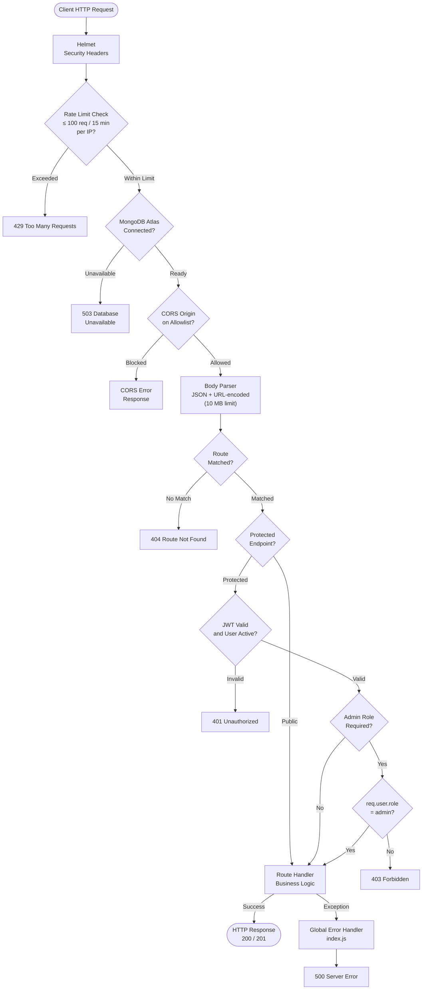
```mermaid
flowchart TD
    REQ(["Client HTTP Request"]) --> HLM["Helmet<br/>Security Headers"]
    HLM --> RLM{"Rate Limit Check<br/>≤ 100 req / 15 min<br/>per IP?"}
    RLM -->|"Exceeded"| RL429["429 Too Many Requests"]
    RLM -->|"Within Limit"| DBC{"MongoDB Atlas<br/>Connected?"}
    DBC -->|"Unavailable"| DB503["503 Database<br/>Unavailable"]
    DBC -->|"Ready"| CORS{"CORS Origin<br/>on Allowlist?"}
    CORS -->|"Blocked"| CORSBLK["CORS Error<br/>Response"]
    CORS -->|"Allowed"| BP["Body Parser<br/>JSON + URL-encoded<br/>(10 MB limit)"]
    BP --> RM{"Route<br/>Matched?"}
    RM -->|"No Match"| R404["404 Route Not Found"]
    RM -->|"Matched"| PR{"Protected<br/>Endpoint?"}
    PR -->|"Public"| RH["Route Handler<br/>Business Logic"]
    PR -->|"Protected"| AUTH{"JWT Valid<br/>and User Active?"}
    AUTH -->|"Invalid"| R401["401 Unauthorized"]
    AUTH -->|"Valid"| ADM{"Admin Role<br/>Required?"}
    ADM -->|"No"| RH
    ADM -->|"Yes"| ROLE{"req.user.role<br/>= admin?"}
    ROLE -->|"No"| R403["403 Forbidden"]
    ROLE -->|"Yes"| RH
    RH -->|"Success"| RES(["HTTP Response<br/>200 / 201"])
    RH -->|"Exception"| GEH["Global Error Handler<br/>index.js"]
    GEH --> R500["500 Server Error"]
```

The seven route modules are mounted at the following paths, each targeting a specific functional domain:

| Mount Path | Module | Domain | Auth Required |
|---|---|---|---|
| `/api/auth` | `routes/auth.js` | Registration, login, session | Partial (login/register are public) |
| `/api/leads` | `routes/leads.js` | Lead CRUD and lifecycle | Yes (`protect`) |
| `/api/wallet` | `routes/wallet.js` | Balances and withdrawals | Yes (`protect` + `adminOnly` for admin ops) |
| `/api/chat` | `routes/chat.js` | Legacy direct messaging | Yes (`protect`) |
| `/api/users` | `routes/users.js` | Admin user management | Yes (`protect` + `adminOnly`) |
| `/api/admin` | `routes/admin.js` | Dashboard KPIs, query management | Yes (`protect` + `adminOnly`) |
| `/api/queries` | `routes/queries.js` | Public contact form submissions | No (public endpoint) |

A health check endpoint at `/api/health` returns `{ status: 'OK', timestamp }` and is exempt from authentication, providing infrastructure monitoring capability.

### 4.1.2 Client-Side Application Routing

The React SPA, defined in `referal/client/src/App.js`, implements a layered routing architecture with three tiers of access control. The `AuthProvider` context wraps the entire application and manages authentication state through a `useReducer`-based state machine. On mount, the provider checks localStorage for a stored JWT token: if found, it verifies the session via `GET /api/auth/me`; if the application is in demo mode (`shouldUseDemoApi` flag), it loads mock user data without backend contact.

Route guards — `ProtectedRoute`, `AdminProtectedRoute`, and `EmployeeProtectedRoute` components — enforce access control at the navigation layer, preventing unauthorized users from reaching protected pages. Authenticated users accessing the root path (`/`) are automatically redirected to `/dashboard`.

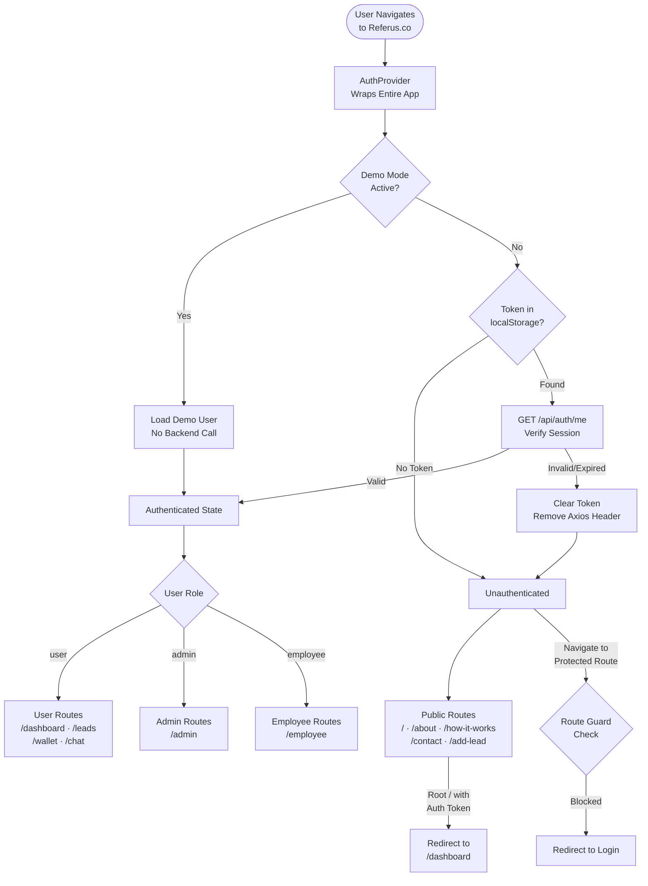
```mermaid
flowchart TD
    VISIT(["User Navigates<br/>to Referus.co"]) --> AUTHPROV["AuthProvider<br/>Wraps Entire App"]
    AUTHPROV --> DEMOCHECK{"Demo Mode<br/>Active?"}
    DEMOCHECK -->|"Yes"| LOADEMO["Load Demo User<br/>No Backend Call"]
    LOADEMO --> AUTHSTATE["Authenticated State"]
    DEMOCHECK -->|"No"| TOKCHECK{"Token in<br/>localStorage?"}
    TOKCHECK -->|"No Token"| UNAUTH["Unauthenticated"]
    TOKCHECK -->|"Found"| SESSVER["GET /api/auth/me<br/>Verify Session"]
    SESSVER -->|"Valid"| AUTHSTATE
    SESSVER -->|"Invalid/Expired"| CLRTOK["Clear Token<br/>Remove Axios Header"]
    CLRTOK --> UNAUTH

    UNAUTH --> PUBROUTES["Public Routes<br/>/ · /about · /how-it-works<br/>/contact · /add-lead"]
    UNAUTH -->|"Navigate to<br/>Protected Route"| GUARD{"Route Guard<br/>Check"}
    GUARD -->|"Blocked"| LOGINREDIR["Redirect to Login"]

    AUTHSTATE --> ROLECHECK{"User Role"}
    ROLECHECK -->|"user"| USERRTS["User Routes<br/>/dashboard · /leads<br/>/wallet · /chat"]
    ROLECHECK -->|"admin"| ADMINRTS["Admin Routes<br/>/admin"]
    ROLECHECK -->|"employee"| EMPRTS["Employee Routes<br/>/employee"]

    PUBROUTES -->|"Root / with<br/>Auth Token"| DASHREDIR["Redirect to<br/>/dashboard"]
```

### 4.1.3 End-to-End Platform Integration Sequence

The following sequence diagram illustrates the primary cross-feature interactions that constitute the core business workflow: a user registers, submits a referral lead, the admin processes the lead to closure, commissions are credited, and the user requests a withdrawal. Additionally, the chatbot interaction path demonstrates the hybrid KB/AI resolution pattern defined in `ReferusChatbot.jsx`.

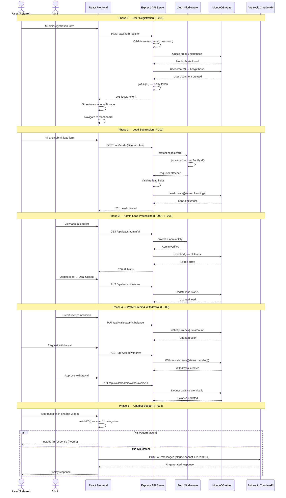
```mermaid
sequenceDiagram
    actor U as User (Referrer)
    actor A as Admin
    participant FE as React Frontend
    participant API as Express API Server
    participant MW as Auth Middleware
    participant DB as MongoDB Atlas
    participant AI as Anthropic Claude API

    Note over U,AI: Phase 1 — User Registration (F-001)
    U->>FE: Submit registration form
    FE->>API: POST /api/auth/register
    API->>API: Validate (name, email, password)
    API->>DB: Check email uniqueness
    DB-->>API: No duplicate found
    API->>DB: User.create() — bcrypt hash
    DB-->>API: User document created
    API->>API: jwt.sign() — 7-day token
    API-->>FE: 201 {user, token}
    FE->>FE: Store token in localStorage
    FE->>FE: Navigate to /dashboard

    Note over U,AI: Phase 2 — Lead Submission (F-002)
    U->>FE: Fill and submit lead form
    FE->>API: POST /api/leads (Bearer token)
    API->>MW: protect middleware
    MW->>MW: jwt.verify() + User.findById()
    MW-->>API: req.user attached
    API->>API: Validate lead fields
    API->>DB: Lead.create({status: Pending})
    DB-->>API: Lead document
    API-->>FE: 201 Lead created

    Note over U,AI: Phase 3 — Admin Lead Processing (F-002 + F-005)
    A->>FE: View admin lead list
    FE->>API: GET /api/leads/admin/all
    API->>MW: protect + adminOnly
    MW-->>API: Admin verified
    API->>DB: Lead.find() — all leads
    DB-->>API: Leads array
    API-->>FE: 200 All leads
    A->>FE: Update lead → Deal Closed
    FE->>API: PUT /api/leads/:id/status
    API->>DB: Update lead status
    DB-->>API: Updated lead

    Note over U,AI: Phase 4 — Wallet Credit & Withdrawal (F-003)
    A->>FE: Credit user commission
    FE->>API: PUT /api/wallet/admin/balance
    API->>DB: wallet[currency] += amount
    DB-->>API: Updated user
    U->>FE: Request withdrawal
    FE->>API: POST /api/wallet/withdraw
    API->>DB: Withdrawal.create({status: pending})
    DB-->>API: Withdrawal created
    A->>FE: Approve withdrawal
    FE->>API: PUT /api/wallet/admin/withdrawals/:id
    API->>DB: Deduct balance atomically
    DB-->>API: Balance updated

    Note over U,AI: Phase 5 — Chatbot Support (F-004)
    U->>FE: Type question in chatbot widget
    FE->>FE: matchKB() — scan 11 categories
    alt KB Pattern Match
        FE-->>U: Instant KB response (400ms)
    else No KB Match
        FE->>AI: POST /v1/messages (claude-sonnet-4-20250514)
        AI-->>FE: AI-generated response
        FE-->>U: Display response
    end
```

---

## 4.2 CORE BUSINESS PROCESS FLOWS

### 4.2.1 Authentication & Authorization Flows

The authentication system spans both the Express backend (`referal/server/routes/auth.js`, `referal/server/middleware/auth.js`) and the React frontend (`referal/client/src/context/AuthContext.js`). It implements three distinct workflows: user registration, login, and session verification. All three converge on JWT token generation signed with `process.env.JWT_SECRET` (with a fallback to `'fallback-secret'` that must be overridden in production) and an expiry controlled by `JWT_EXPIRE` (defaulting to 7 days).

#### User Registration Process

Registration creates a new user account with bcrypt-hashed password (10 salt rounds), validates input against strict criteria using `express-validator`, enforces email uniqueness at the database level, and returns a JWT token for immediate session establishment.

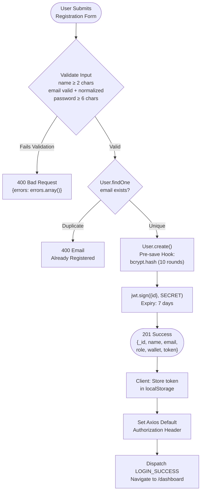
```mermaid
flowchart TD
    R1(["User Submits<br/>Registration Form"]) --> R2{"Validate Input<br/>name ≥ 2 chars<br/>email valid + normalized<br/>password ≥ 6 chars"}
    R2 -->|"Fails Validation"| R3["400 Bad Request<br/>{errors: errors.array()}"]
    R2 -->|"Valid"| R4{"User.findOne<br/>email exists?"}
    R4 -->|"Duplicate"| R5["400 Email<br/>Already Registered"]
    R4 -->|"Unique"| R6["User.create()<br/>Pre-save Hook:<br/>bcrypt.hash (10 rounds)"]
    R6 --> R7["jwt.sign({id}, SECRET)<br/>Expiry: 7 days"]
    R7 --> R8(["201 Success<br/>{_id, name, email,<br/>role, wallet, token}"])
    R8 --> R9["Client: Store token<br/>in localStorage"]
    R9 --> R10["Set Axios Default<br/>Authorization Header"]
    R10 --> R11["Dispatch LOGIN_SUCCESS<br/>Navigate to /dashboard"]
```

#### User Login Process

Login authenticates an existing user by comparing the provided password against the stored bcrypt hash using `user.matchPassword()`. On success, a new JWT is issued and the client-side auth state transitions through `LOGIN_START` → `LOGIN_SUCCESS`.

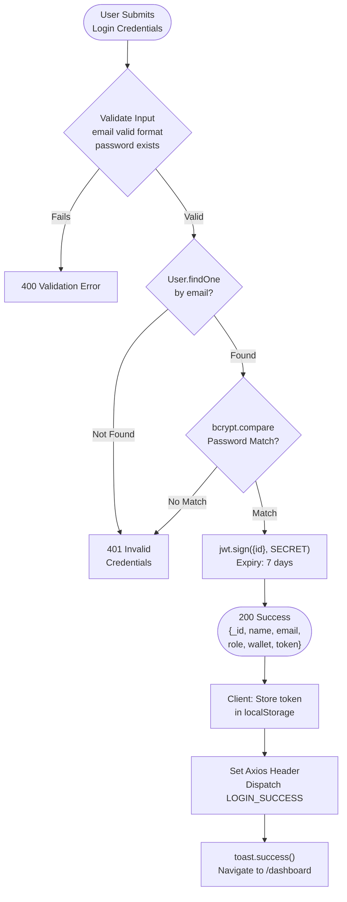
```mermaid
flowchart TD
    L1(["User Submits<br/>Login Credentials"]) --> L2{"Validate Input<br/>email valid format<br/>password exists"}
    L2 -->|"Fails"| L3["400 Validation Error"]
    L2 -->|"Valid"| L4{"User.findOne<br/>by email?"}
    L4 -->|"Not Found"| L5["401 Invalid<br/>Credentials"]
    L4 -->|"Found"| L6{"bcrypt.compare<br/>Password Match?"}
    L6 -->|"No Match"| L5
    L6 -->|"Match"| L7["jwt.sign({id}, SECRET)<br/>Expiry: 7 days"]
    L7 --> L8(["200 Success<br/>{_id, name, email,<br/>role, wallet, token}"])
    L8 --> L9["Client: Store token<br/>in localStorage"]
    L9 --> L10["Set Axios Header<br/>Dispatch LOGIN_SUCCESS"]
    L10 --> L11["toast.success()<br/>Navigate to /dashboard"]
```

#### Session Verification & Token Lifecycle

The `protect` middleware in `referal/server/middleware/auth.js` intercepts every protected route to validate the JWT token, retrieve the associated user, and verify the account is active. The frontend triggers this check on application mount via `GET /api/auth/me` and handles the six distinct failure modes documented below.

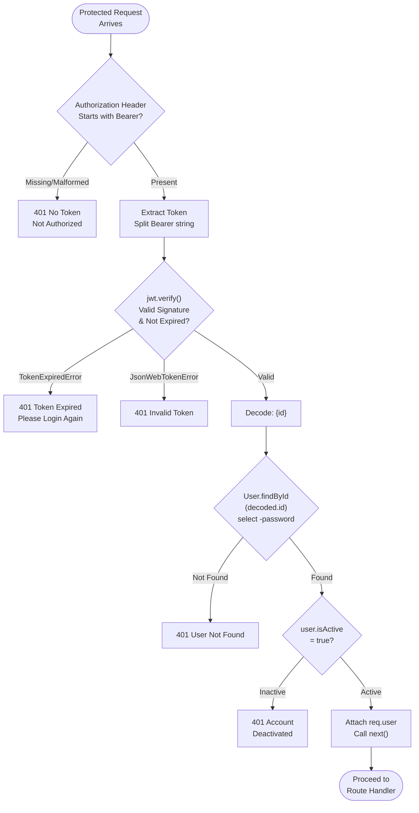
```mermaid
flowchart TD
    S1(["Protected Request<br/>Arrives"]) --> S2{"Authorization Header<br/>Starts with Bearer?"}
    S2 -->|"Missing/Malformed"| S3["401 No Token<br/>Not Authorized"]
    S2 -->|"Present"| S4["Extract Token<br/>Split Bearer string"]
    S4 --> S5{"jwt.verify()<br/>Valid Signature<br/>& Not Expired?"}
    S5 -->|"TokenExpiredError"| S6["401 Token Expired<br/>Please Login Again"]
    S5 -->|"JsonWebTokenError"| S7["401 Invalid Token"]
    S5 -->|"Valid"| S8["Decode: {id}"]
    S8 --> S9{"User.findById<br/>(decoded.id)<br/>select -password"}
    S9 -->|"Not Found"| S10["401 User Not Found"]
    S9 -->|"Found"| S11{"user.isActive<br/>= true?"}
    S11 -->|"Inactive"| S12["401 Account<br/>Deactivated"]
    S11 -->|"Active"| S13["Attach req.user<br/>Call next()"]
    S13 --> S14(["Proceed to<br/>Route Handler"])
```

#### Admin Authorization Gate

For admin-only endpoints, the `adminOnly` middleware executes after `protect`, checking `req.user.role === 'admin'`. This two-layer authorization model is applied to lead status management, withdrawal processing, wallet balance management, user management, query management, and dashboard KPI endpoints.

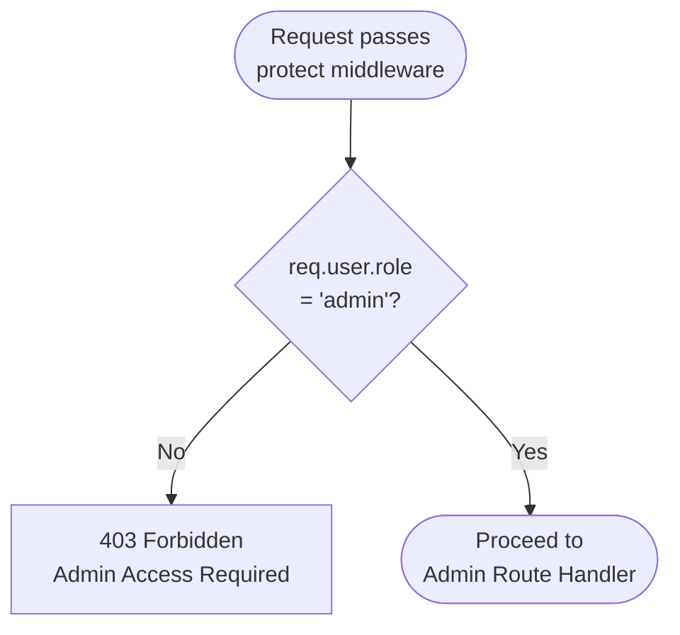
```mermaid
flowchart TD
    A1(["Request passes<br/>protect middleware"]) --> A2{"req.user.role<br/>= 'admin'?"}
    A2 -->|"No"| A3["403 Forbidden<br/>Admin Access Required"]
    A2 -->|"Yes"| A4(["Proceed to<br/>Admin Route Handler"])
```

### 4.2.2 Lead Lifecycle Management

Lead management, implemented in `referal/server/routes/leads.js` and the admin routes in `referal/server/routes/admin.js`, constitutes the primary revenue-driving workflow. Users submit referral leads that progress through a five-stage status lifecycle managed exclusively by administrators. Upon reaching `Deal Closed` status, the lead triggers commission attribution, linking to the wallet system (F-003). The Lead model in `referal/server/models/Lead.js` enforces field-level validation, ownership via `user` ObjectId reference, and timestamps via a pre-save hook.

#### Lead Creation Process

Authenticated users submit leads through a structured form capturing company details, contact information, value, and multi-currency denomination (USD, AED, EUR, SAR). The creating user's ObjectId is automatically assigned as the lead owner, enforcing data isolation at the creation point.

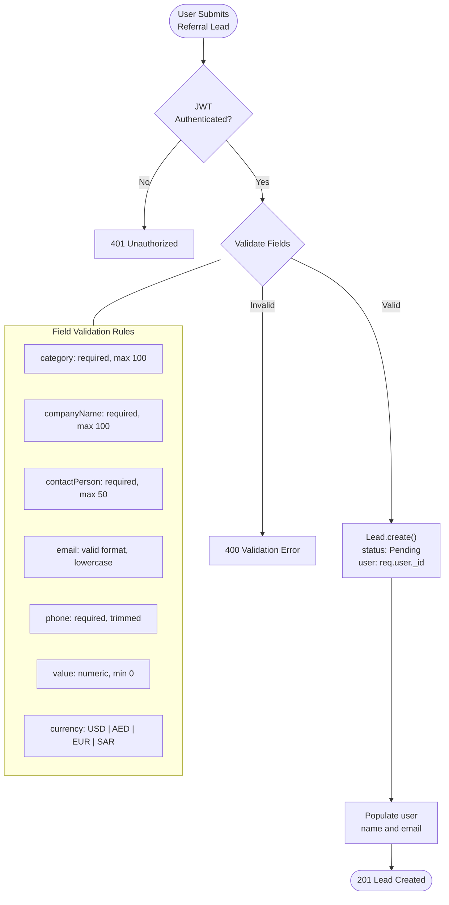
```mermaid
flowchart TD
    LC1(["User Submits<br/>Referral Lead"]) --> LC2{"JWT<br/>Authenticated?"}
    LC2 -->|"No"| LC3["401 Unauthorized"]
    LC2 -->|"Yes"| LC4{"Validate Fields"}
    LC4 -->|"Invalid"| LC5["400 Validation Error"]
    LC4 -->|"Valid"| LC6["Lead.create()<br/>status: Pending<br/>user: req.user._id"]
    LC6 --> LC7["Populate user<br/>name and email"]
    LC7 --> LC8(["201 Lead Created"])

    subgraph ValidationRules["Field Validation Rules"]
        VR1["category: required, max 100"]
        VR2["companyName: required, max 100"]
        VR3["contactPerson: required, max 50"]
        VR4["email: valid format, lowercase"]
        VR5["phone: required, trimmed"]
        VR6["value: numeric, min 0"]
        VR7["currency: USD | AED | EUR | SAR"]
    end
    LC4 --- ValidationRules
```

#### Lead Retrieval with Ownership Enforcement

The lead retrieval endpoints implement ownership-scoped data access. The `GET /api/leads` endpoint filters results by `user: req.user._id`, ensuring referrers see only their own submissions. The single-lead endpoint `GET /api/leads/:id` performs an explicit ownership check, permitting access only if the requester is the lead owner or holds the admin role. The admin listing endpoint `GET /api/leads/admin/all` bypasses ownership filtering entirely, returning all leads with populated user and notes references.

#### Admin Lead Status Management

Administrators update lead status through `PUT /api/leads/:id/status`, which validates the new status against the five permitted values and optionally appends a note to the lead's `notes[]` subdocument array. Importantly, the current implementation does not enforce sequential status transitions — an admin can set any valid status from any current state, providing operational flexibility.

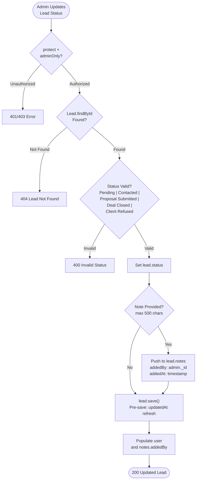
```mermaid
flowchart TD
    LS1(["Admin Updates<br/>Lead Status"]) --> LS2{"protect +<br/>adminOnly?"}
    LS2 -->|"Unauthorized"| LS3["401/403 Error"]
    LS2 -->|"Authorized"| LS4{"Lead.findById<br/>Found?"}
    LS4 -->|"Not Found"| LS5["404 Lead Not Found"]
    LS4 -->|"Found"| LS6{"Status Valid?<br/>Pending | Contacted |<br/>Proposal Submitted |<br/>Deal Closed |<br/>Client Refused"}
    LS6 -->|"Invalid"| LS7["400 Invalid Status"]
    LS6 -->|"Valid"| LS8["Set lead.status"]
    LS8 --> LS9{"Note Provided?<br/>max 500 chars"}
    LS9 -->|"Yes"| LS10["Push to lead.notes<br/>addedBy: admin._id<br/>addedAt: timestamp"]
    LS9 -->|"No"| LS11["lead.save()<br/>Pre-save: updatedAt refresh"]
    LS10 --> LS11
    LS11 --> LS12["Populate user<br/>and notes.addedBy"]
    LS12 --> LS13(["200 Updated Lead"])
```

### 4.2.3 Multi-Currency Wallet & Withdrawal Processing

The financial operations layer, implemented in `referal/server/routes/wallet.js`, manages per-user wallet balances embedded directly in the User document (`wallet.usd`, `wallet.aed`, `wallet.euro`, `wallet.sar`) and withdrawal requests stored as separate documents in the Withdrawal collection. The withdrawal workflow follows a `pending` → `approved`/`rejected` → `processed` lifecycle with atomic balance deduction on approval, ensuring financial integrity.

#### Withdrawal Request Submission

Users initiate withdrawals by specifying an amount (minimum 1 unit), target currency, and comprehensive bank details (account holder name, bank name, account number, and routing number as required fields; IBAN and SWIFT code as optional). The system validates sufficient balance at request time but does **not** deduct the balance — deduction occurs only upon admin approval, preventing premature fund reservation.

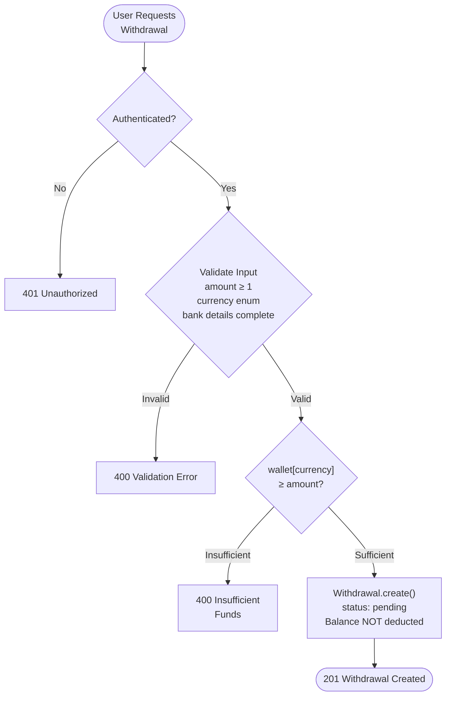
```mermaid
flowchart TD
    W1(["User Requests<br/>Withdrawal"]) --> W2{"Authenticated?"}
    W2 -->|"No"| W3["401 Unauthorized"]
    W2 -->|"Yes"| W4{"Validate Input<br/>amount ≥ 1<br/>currency enum<br/>bank details complete"}
    W4 -->|"Invalid"| W5["400 Validation Error"]
    W4 -->|"Valid"| W6{"wallet[currency]<br/>≥ amount?"}
    W6 -->|"Insufficient"| W7["400 Insufficient<br/>Funds"]
    W6 -->|"Sufficient"| W8["Withdrawal.create()<br/>status: pending<br/>Balance NOT deducted"]
    W8 --> W9(["201 Withdrawal Created"])
```

#### Admin Withdrawal Processing

The admin processing endpoint (`PUT /api/wallet/admin/withdrawals/:id`) is the critical financial control point. When an admin approves a withdrawal, the system performs an atomic balance verification and deduction: it re-checks the user's current balance (which may have changed since the original request), deducts the amount from the corresponding currency wallet field, and saves both the withdrawal record and user document. Rejection and processing operations update metadata without affecting the wallet balance.

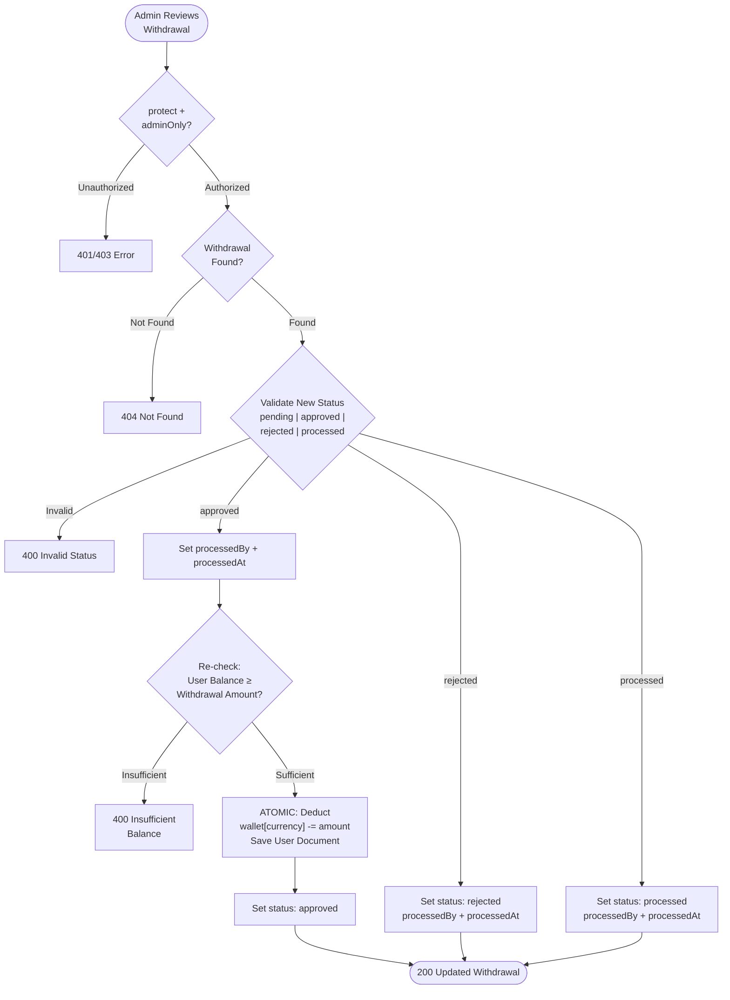
```mermaid
flowchart TD
    AP1(["Admin Reviews<br/>Withdrawal"]) --> AP2{"protect +<br/>adminOnly?"}
    AP2 -->|"Unauthorized"| AP3["401/403 Error"]
    AP2 -->|"Authorized"| AP4{"Withdrawal<br/>Found?"}
    AP4 -->|"Not Found"| AP5["404 Not Found"]
    AP4 -->|"Found"| AP6{"Validate New Status<br/>pending | approved |<br/>rejected | processed"}
    AP6 -->|"Invalid"| AP6E["400 Invalid Status"]
    AP6 -->|"approved"| AP7["Set processedBy + processedAt"]
    AP7 --> AP8{"Re-check:<br/>User Balance ≥<br/>Withdrawal Amount?"}
    AP8 -->|"Insufficient"| AP9["400 Insufficient<br/>Balance"]
    AP8 -->|"Sufficient"| AP10["ATOMIC: Deduct<br/>wallet[currency] -= amount<br/>Save User Document"]
    AP10 --> AP11["Set status: approved"]
    AP6 -->|"rejected"| AP12["Set status: rejected<br/>processedBy + processedAt"]
    AP6 -->|"processed"| AP13["Set status: processed<br/>processedBy + processedAt"]
    AP11 --> AP14(["200 Updated Withdrawal"])
    AP12 --> AP14
    AP13 --> AP14
```

#### Admin Direct Balance Management

Administrators can directly modify any user's wallet balance via `PUT /api/wallet/admin/balance`, supporting three operations: `add` (increment balance), `subtract` (decrement with floor check), and `set` (assign absolute value). This mechanism is used to credit commissions from closed deals and to make manual adjustments as needed.

```mermaid
flowchart TD
    BM1(["Admin Manages<br/>User Balance"]) --> BM2{"Admin Authenticated?"}
    BM2 -->|"No"| BM3["401/403 Error"]
    BM2 -->|"Yes"| BM4{"Validate:<br/>userId (MongoId)<br/>currency (enum)<br/>amount (numeric)<br/>operation (add|subtract|set)"}
    BM4 -->|"Invalid"| BM5["400 Validation Error"]
    BM4 -->|"Valid"| BM6{"User Found?"}
    BM6 -->|"No"| BM7["404 User Not Found"]
    BM6 -->|"Yes"| BM8{"Operation<br/>Type?"}
    BM8 -->|"add"| BM9["wallet[currency]<br/>+= amount"]
    BM8 -->|"subtract"| BM10{"Current Balance<br/>≥ amount?"}
    BM10 -->|"No"| BM11["400 Insufficient"]
    BM10 -->|"Yes"| BM12["wallet[currency]<br/>-= amount"]
    BM8 -->|"set"| BM13["wallet[currency]<br/>= amount"]
    BM9 --> BM14["Save User"]
    BM12 --> BM14
    BM13 --> BM14
    BM14 --> BM15(["200 Updated Wallet"])
```

### 4.2.4 AI-Powered Support Chatbot

The AI-powered chatbot (F-004), implemented in `ReferusChatbot.jsx`, is the incoming replacement for the legacy Socket.IO chat system (F-008). It operates as a self-contained React component with zero dependencies on Referus project internals, importing only `useState`, `useRef`, and `useEffect` from React. The chatbot implements a hybrid resolution strategy: a rule-based knowledge base (`REFERUS_KB`) with 11 categories and 84 total match patterns handles the majority of anticipated queries instantly and at zero cost, while the Anthropic Claude API (`claude-sonnet-4-20250514`) serves as an intelligent fallback for unmatched queries.

#### Message Processing Pipeline

The chatbot's `sendMessage()` function orchestrates the complete message lifecycle: input validation, UI state updates, rule-based KB matching via `matchKB()`, and conditional AI fallback via `askClaude()`. The KB matcher lowercases the user input and iterates through all pattern entries using `String.includes()` for broad matching. If no pattern matches, the full conversation history is sent to the Anthropic Messages API with a system prompt constraining responses to 150 words and Referus-relevant topics.

```mermaid
flowchart TD
    CB1(["User Types Message<br/>or Clicks Send"]) --> CB2{"Input Empty<br/>or Loading?"}
    CB2 -->|"Yes"| CB3(["Ignored"])
    CB2 -->|"No"| CB4["Add User Message<br/>to Messages Array"]
    CB4 --> CB5["Clear Input Field<br/>Set loading = true<br/>Hide Quick Replies"]
    CB5 --> CB6{"matchKB(input)<br/>Lowercase + scan<br/>84 patterns in<br/>11 categories"}
    CB6 -->|"Pattern<br/>Match Found"| CB7["Simulate 400ms<br/>Processing Delay"]
    CB7 --> CB8["Return KB Response"]
    CB6 -->|"No Match"| CB9["askClaude(messages)<br/>POST api.anthropic.com<br/>Model: claude-sonnet-4-20250514<br/>Max Tokens: 1000"]
    CB9 --> CB10{"API Response<br/>Contains Text?"}
    CB10 -->|"Yes"| CB11["Return AI Response"]
    CB10 -->|"Failure / Null"| CB12["Static Fallback:<br/>Contact support@referus.co<br/>or docs.referus.co"]
    CB8 --> CB13["Add Assistant Message<br/>Set loading = false"]
    CB11 --> CB13
    CB12 --> CB13
    CB13 --> CB14["Auto-scroll<br/>to Bottom"]
    CB14 --> CB15(["Response Displayed<br/>to User"])
```

#### Quick Reply Chip Interaction

Six predefined quick-reply chips provide one-click access to the most common queries. Unlike the text input path, quick replies bypass the `matchKB()` function entirely — clicking a chip directly retrieves the associated KB entry by key and inserts both the user label and the KB response into the message history simultaneously, with zero latency and no API calls.

```mermaid
flowchart TD
    QR1(["User Clicks<br/>Quick Reply Chip"]) --> QR2["Identify Chip Key<br/>what_is | how_it_works |<br/>pricing | integrations |<br/>rewards | demo"]
    QR2 --> QR3["Lookup REFERUS_KB<br/>by Key"]
    QR3 --> QR4["Insert Chip Label<br/>as User Message"]
    QR4 --> QR5["Insert KB Response<br/>as Assistant Message"]
    QR5 --> QR6["Hide Quick<br/>Reply Chips"]
    QR6 --> QR7(["Both Messages<br/>Displayed Instantly"])
```

#### Chatbot Knowledge Base Coverage

The 11 KB categories and their pattern counts provide the following coverage map, with each category representing a distinct support topic:

| Category | Patterns | Example Triggers | Response Focus |
|---|---|---|---|
| `greetings` | 7 | hi, hello, hey, howdy | Welcome message, platform introduction |
| `what_is` | 6 | what is referus, about referus | Platform overview, capabilities list |
| `how_it_works` | 8 | how does it work, getting started | 4-step onboarding walkthrough |
| `features` | 5 | features, capabilities | Core feature list with descriptions |
| `pricing` | 8 | pricing, cost, free, plans | Tier breakdown (Starter → Enterprise) |
| `integrations` | 11 | api, webhook, zapier, stripe | Integration catalog by category |
| `analytics` | 8 | dashboard, reports, metrics | Analytics dashboard capabilities |
| `rewards` | 8 | reward, commission, payout | Reward types and trigger conditions |
| `security` | 9 | security, fraud, gdpr | Security measures, compliance |
| `support` | 7 | help, contact, human | Support channels and options |
| `demo` | 7 | demo, trial, try, test | Free trial instructions, demo booking |

### 4.2.5 Contact/Query System

The contact/query system (F-007), implemented across `referal/server/routes/queries.js` and admin routes in `referal/server/routes/admin.js`, provides a public-facing contact mechanism for unauthenticated visitors. Queries follow a four-stage lifecycle (`New` → `In Progress` → `Resolved` → `Closed`) managed by administrators. The Contact page additionally integrates with Formspree as an alternative submission path.

```mermaid
flowchart TD
    subgraph PublicSubmission["Public Query Submission (POST /api/queries)"]
        QS1(["Visitor Submits<br/>Contact Form"]) --> QS2{"Validate:<br/>name required<br/>email valid<br/>subject required<br/>message required"}
        QS2 -->|"Invalid"| QS3["400 Validation Error"]
        QS2 -->|"Valid"| QS4["Query.create()<br/>status: New<br/>No auth required"]
        QS4 --> QS5(["201 Query Created"])
    end

    subgraph AdminManagement["Admin Query Lifecycle Management"]
        QM1(["Admin Views Queries<br/>GET /api/admin/queries"]) --> QM2["Retrieve All Queries<br/>Sorted by createdAt desc"]
        QM2 --> QM3["Admin Selects Query"]
        QM3 --> QM4{"Update Status<br/>New | In Progress |<br/>Resolved | Closed"}
        QM4 -->|"Invalid"| QM5["400 Invalid Status"]
        QM4 -->|"Valid"| QM6["Set handledBy:<br/>admin._id"]
        QM6 --> QM7{"Status = Resolved<br/>or Closed?"}
        QM7 -->|"Yes"| QM8["Set handledAt:<br/>new Date()"]
        QM7 -->|"No"| QM9["Set handledAt:<br/>null"]
        QM8 --> QM10(["200 Query Updated"])
        QM9 --> QM10
    end
```

### 4.2.6 Legacy Chat System (F-008 — Being Replaced)

The legacy chat system, implemented in `referal/server/routes/chat.js` with Socket.IO events defined in `referal/server/index.js`, provides direct messaging between users via both REST API endpoints and real-time WebSocket events. This system is being replaced by the AI chatbot (F-004) due to Socket.IO's inability to function reliably on Vercel serverless deployment.

```mermaid
flowchart TD
    subgraph RESTPath["REST API Flow"]
        CH1(["User Sends Message"]) --> CH2["POST /api/chat/send<br/>Validate receiverId + message"]
        CH2 --> CH3["ChatMessage.create()<br/>sender: req.user._id"]
        CH3 --> CH4["Populate sender/receiver"]
        CH4 --> CH5(["Return Message"])
    end

    subgraph SocketPath["Socket.IO Real-Time Flow"]
        SO1(["Client Connects"]) --> SO2["socket.join<br/>user_{userId} room"]
        SO2 --> SO3{"Event Type?"}
        SO3 -->|"sendMessage"| SO4["Emit newMessage<br/>to receiver room"]
        SO4 --> SO5["Emit messageSent<br/>confirmation to sender"]
        SO3 -->|"typing"| SO6["Emit userTyping<br/>to receiver room"]
        SO3 -->|"disconnect"| SO7["Log Disconnection"]
    end

    subgraph ReadTracking["Message Read Tracking"]
        RT1(["GET /api/chat/messages/:userId"]) --> RT2["Fetch Two-party<br/>Message History"]
        RT2 --> RT3["updateMany:<br/>Mark Inbound Messages<br/>as isRead: true"]
        RT3 --> RT4(["Return Messages<br/>Sorted by createdAt asc"])
    end
```

> **Deprecation Notice:** F-008 is operationally unreliable in the current Vercel serverless deployment and is being superseded by F-004. Socket.IO events (`join`, `sendMessage`, `typing`, `disconnect`) require persistent server connections incompatible with serverless function lifecycles.

### 4.2.7 Demo Mode Activation

Demo mode (F-010), controlled by the `shouldUseDemoApi` feature flag in `referal/client/src/services/demoApi.js`, enables the entire application to operate without backend connectivity. When active, `setupDemoInterceptors` patches Axios to intercept all API calls and return mock data with simulated latency. The `demoLoginUser()` function in `AuthContext.js` simulates the authentication flow, generating mock tokens and user data that mirror the production data shape.

```mermaid
flowchart TD
    DM1(["Application Mount"]) --> DM2{"shouldUseDemoApi<br/>Flag Active?"}
    DM2 -->|"No"| DM3["Normal API Mode<br/>All requests hit<br/>Express backend"]
    DM2 -->|"Yes"| DM4["setupDemoInterceptors<br/>Patch Axios globally"]
    DM4 --> DM5{"User Action?"}
    DM5 -->|"Demo Login"| DM6["demoLoginUser(userType)<br/>Generate Mock Token<br/>+ User Data"]
    DM6 --> DM7["Store in localStorage<br/>Set Axios Auth Header"]
    DM7 --> DM8["Dispatch LOGIN_SUCCESS<br/>Navigate to /dashboard"]
    DM5 -->|"Auth Check<br/>on Mount"| DM9{"isDemoMode()?"}
    DM9 -->|"Yes"| DM10["Load Demo User<br/>from demoUsers[type]<br/>No Backend Call"]
    DM10 --> DM11["Dispatch LOGIN_SUCCESS"]
    DM9 -->|"No"| DM12["GET /api/auth/me<br/>Normal Session Verify"]
    DM5 -->|"API Request"| DM13["Axios Interceptor<br/>Returns Mock Data<br/>with Simulated Latency"]
```

---

## 4.3 STATE TRANSITION DIAGRAMS

### 4.3.1 Lead Status State Machine

The lead status lifecycle defines five states with a directed-graph transition model. While the logical progression follows `Pending` → `Contacted` → `Proposal Submitted` → `Deal Closed` / `Client Refused`, the current implementation in `referal/server/routes/leads.js` does **not** enforce sequential transitions — an admin can set any valid status from any current state. `Deal Closed` and `Client Refused` serve as terminal states, with `Deal Closed` triggering commission attribution to the referrer's wallet.

```mermaid
stateDiagram-v2
    [*] --> Pending : Lead Created (auto)
    Pending --> Contacted : Admin Update
    Pending --> ProposalSubmitted : Admin Update
    Pending --> DealClosed : Admin Update
    Pending --> ClientRefused : Admin Update
    Contacted --> ProposalSubmitted : Admin Update
    Contacted --> DealClosed : Admin Update
    Contacted --> ClientRefused : Admin Update
    ProposalSubmitted --> DealClosed : Admin Update
    ProposalSubmitted --> ClientRefused : Admin Update
    DealClosed --> [*]
    ClientRefused --> [*]

    state "Proposal Submitted" as ProposalSubmitted
    state "Deal Closed ✦ Commission Trigger" as DealClosed
    state "Client Refused ✦ Terminal" as ClientRefused
```

### 4.3.2 Withdrawal Status State Machine

The withdrawal lifecycle manages the flow of financial payout requests. The critical transition is from `pending` to `approved`, which triggers atomic balance deduction from the user's wallet. The `rejected` state is terminal with no balance impact. The `processed` state represents completion of actual fund disbursement. As with leads, the current implementation does not strictly enforce sequential transitions — any valid status can be set from `pending`.

```mermaid
stateDiagram-v2
    [*] --> pending : Withdrawal.create()
    pending --> approved : Admin Approves
    pending --> rejected : Admin Rejects
    pending --> processed : Admin Processes
    approved --> processed : Admin Processes
    rejected --> [*]
    processed --> [*]

    state "pending" as pending
    state "approved ✦ Balance Deducted" as approved
    state "rejected ✦ No Balance Impact" as rejected
    state "processed ✦ Funds Disbursed" as processed
```

### 4.3.3 Query Status State Machine

The query lifecycle tracks contact form submissions from initial receipt through resolution. The `handledBy` field (admin User ObjectId) is set on any status update, while `handledAt` (Date) is set **only** when transitioning to `Resolved` or `Closed` — it is explicitly set to `null` for `New` and `In Progress` statuses. `Closed` is the terminal state.

```mermaid
stateDiagram-v2
    [*] --> New : Public Form Submission
    New --> InProgress : Admin Update (handledBy set)
    New --> Resolved : Admin Update (handledAt set)
    New --> Closed : Admin Update (handledAt set)
    InProgress --> Resolved : Admin Update (handledAt set)
    InProgress --> Closed : Admin Update (handledAt set)
    Resolved --> Closed : Admin Update
    Closed --> [*]

    state "New" as New
    state "In Progress" as InProgress
    state "Resolved ✦ handledAt timestamped" as Resolved
    state "Closed ✦ Terminal" as Closed
```

### 4.3.4 Client Authentication State Machine

The frontend authentication state is managed by a `useReducer` pattern in `AuthContext.js` with six action types: `LOGIN_START`, `LOGIN_SUCCESS`, `LOGIN_FAILURE`, `LOGOUT`, `UPDATE_USER`, and `CLEAR_ERROR`. The state shape includes `{ user, isAuthenticated, loading, error }`. On application mount, the state begins in `Loading`, transitioning to either `Authenticated` (valid token or demo mode) or `Unauthenticated` (no token, invalid token, or explicit logout).

```mermaid
stateDiagram-v2
    [*] --> Loading : App Mount / Token Check
    Loading --> Authenticated : LOGIN_SUCCESS
    Loading --> Unauthenticated : No Token / Invalid Token
    Loading --> LoginFailed : LOGIN_FAILURE
    Unauthenticated --> Loading : LOGIN_START (login attempt)
    LoginFailed --> Loading : Retry LOGIN_START
    LoginFailed --> Unauthenticated : CLEAR_ERROR
    Authenticated --> Unauthenticated : LOGOUT
    Authenticated --> Authenticated : UPDATE_USER

    state "Loading (loading: true)" as Loading
    state "Authenticated (isAuthenticated: true)" as Authenticated
    state "Unauthenticated (isAuthenticated: false)" as Unauthenticated
    state "Login Failed (error set)" as LoginFailed
```

---

## 4.4 ERROR HANDLING FLOWS

### 4.4.1 Server-Side Error Processing Pipeline

All Express route handlers follow an `async/try/catch` pattern, with errors categorized by type and mapped to appropriate HTTP status codes. Validation errors from `express-validator` return structured error arrays at 400. Authentication and authorization failures return 401 or 403 respectively. Resource not-found conditions return 404. Unhandled exceptions propagate to the global error handler middleware defined in `referal/server/index.js`, which conditionally includes error details in development mode. All error paths invoke `console.error()` for server-side logging.

```mermaid
flowchart TD
    ERR(["Error Occurs in<br/>Route Handler"]) --> ETYPE{"Error<br/>Classification"}
    ETYPE -->|"express-validator<br/>Validation Failure"| V400["400 Bad Request<br/>{errors: errors.array()}"]
    ETYPE -->|"Resource<br/>Not Found"| NF404["404 Not Found<br/>{message: '...not found'}"]
    ETYPE -->|"TokenExpiredError"| TE401["401 Token Has Expired<br/>Please Login Again"]
    ETYPE -->|"JsonWebTokenError"| IT401["401 Invalid Token"]
    ETYPE -->|"Missing Token<br/>or User"| NT401["401 Not Authorized<br/>No Token Provided"]
    ETYPE -->|"Non-Admin<br/>Role"| NA403["403 Access Denied<br/>Admin Only"]
    ETYPE -->|"Business Rule<br/>Violation"| BL400["400 Bad Request<br/>(e.g., Insufficient Funds)"]
    ETYPE -->|"Unhandled<br/>Exception"| GEH["Global Error Handler<br/>(referal/server/index.js)"]
    GEH --> DEVCHK{"NODE_ENV =<br/>development?"}
    DEVCHK -->|"Yes"| DEV500["500 + error.message<br/>+ Additional Details"]
    DEVCHK -->|"No"| PRD500["500 Server Error<br/>(Generic Message)"]
```

### 4.4.2 Authentication Error Handling Matrix

The authentication middleware in `referal/server/middleware/auth.js` produces six distinct error responses, each targeting a specific failure mode. The frontend `AuthContext` handles these by clearing the stored token and dispatching `LOGOUT` on any 401 response, redirecting the user to the login interface.

| Failure Mode | HTTP Status | Error Message | Trigger Condition |
|---|---|---|---|
| No Authorization header | 401 | Not authorized, no token | `req.headers.authorization` undefined or does not start with `Bearer` |
| Token expired | 401 | Token has expired, please login again | `jwt.verify()` throws `TokenExpiredError` |
| Token invalid/tampered | 401 | Not authorized, token failed | `jwt.verify()` throws `JsonWebTokenError` |
| User deleted after token issued | 401 | User not found | `User.findById(decoded.id)` returns null |
| Account deactivated | 401 | Account is deactivated | `user.isActive === false` |
| Non-admin accessing admin route | 403 | Access denied. Admin only. | `req.user.role !== 'admin'` |

### 4.4.3 Chatbot Error Recovery Flow

The chatbot implements a three-tier response strategy with graceful degradation. The rule-based KB provides the primary response path (instant, free, no external dependency). The Claude AI API serves as the secondary path (variable latency, API cost, external dependency). The static fallback message serves as the tertiary path, ensuring the user always receives a response even when all external systems are unavailable.

```mermaid
flowchart TD
    USERINPUT(["User Query"]) --> TIER1{"Tier 1: KB Match<br/>matchKB() — 84 patterns<br/>11 categories"}
    TIER1 -->|"Match Found"| KB_RESP(["KB Response<br/>Latency: 400ms<br/>Cost: Free"])
    TIER1 -->|"No Match"| TIER2["Tier 2: Claude AI<br/>POST api.anthropic.com"]
    TIER2 --> APIRESULT{"API Call<br/>Result?"}
    APIRESULT -->|"200 + Valid<br/>content[0].text"| AI_RESP(["AI Response<br/>Latency: Variable<br/>Cost: Per-token"])
    APIRESULT -->|"HTTP Error"| TIER3["Tier 3: Static Fallback"]
    APIRESULT -->|"Null/Empty<br/>Response Body"| TIER3
    APIRESULT -->|"Network<br/>Failure"| TIER3
    TIER3 --> FALLBACK_RESP(["Fallback Message<br/>support@referus.co<br/>docs.referus.co"])
```

The `askClaude()` function wraps the entire API call in a `try/catch` block, returning `null` on any failure. The calling `sendMessage()` function then substitutes the static fallback message when a `null` response is received, ensuring the chatbot never presents an error state to the user.

### 4.4.4 Client-Side Error Handling Patterns

The React frontend implements error handling at multiple levels:

| Layer | Mechanism | Behavior |
|---|---|---|
| **Auth Context** | `LOGIN_FAILURE` dispatch | Sets `error` state, triggers `toast.error()` notification |
| **Axios Interceptor** | Response interceptor on 401 | Clears localStorage token, deletes Axios auth header, dispatches `LOGOUT` |
| **Route Guards** | `ProtectedRoute`, `AdminProtectedRoute` | Redirects unauthorized navigation to login page |
| **Toast Notifications** | `react-hot-toast` (`Toaster` component) | Displays success/error messages on auth operations |
| **Form Validation** | `express-validator` error arrays | Displayed to user as field-level validation feedback |

---

## 4.5 VALIDATION AND BUSINESS RULES

### 4.5.1 Input Validation Checkpoints

Every API endpoint that accepts user input enforces field-level validation through `express-validator` middleware before the route handler executes. Failed validation returns a 400 response with the full error array, enabling the frontend to display specific field-level error messages.

| Endpoint | Required Fields | Validation Constraints |
|---|---|---|
| `POST /api/auth/register` | name, email, password | name ≥ 2 chars; email valid format, unique, normalized; password ≥ 6 chars |
| `POST /api/auth/login` | email, password | email valid format; password exists |
| `POST /api/leads` | category, companyName, contactPerson, email, phone, value, currency | category max 100; companyName max 100; contactPerson max 50; email valid; value numeric ≥ 0; currency enum |
| `PUT /api/leads/:id/status` | status | Enum: Pending, Contacted, Proposal Submitted, Deal Closed, Client Refused; optional note max 500 |
| `POST /api/wallet/withdraw` | amount, currency, bankDetails | amount numeric ≥ 1; currency enum; accountHolderName, bankName, accountNumber, routingNumber required |
| `PUT /api/wallet/admin/balance` | userId, currency, amount, operation | userId valid MongoId; currency enum; amount numeric; operation: add/subtract/set |
| `PUT /api/wallet/admin/withdrawals/:id` | status | Enum: pending, approved, rejected, processed; optional adminNotes max 500 |
| `POST /api/queries` | name, email, subject, message | name max 100; email valid; subject max 150; message max 2000 |
| `POST /api/chat/send` | receiverId, message | receiverId valid MongoId; message 1–1000 chars |

### 4.5.2 Authorization Checkpoints

The platform enforces authorization at three levels: endpoint-level middleware, resource-level ownership verification, and role-level access control.

```mermaid
flowchart LR
    REQ(["API Request"]) --> L1{"Level 1:<br/>Authentication<br/>protect middleware"}
    L1 -->|"No Token"| DENY1["401"]
    L1 -->|"Valid Token"| L2{"Level 2:<br/>Role Check<br/>adminOnly middleware"}
    L2 -->|"Non-Admin<br/>(if required)"| DENY2["403"]
    L2 -->|"Authorized Role"| L3{"Level 3:<br/>Ownership Check<br/>Resource-level"}
    L3 -->|"Not Owner<br/>(if applicable)"| DENY3["403"]
    L3 -->|"Owner or Admin"| ALLOW(["Access Granted"])
```

| Authorization Level | Enforcement Point | Affected Endpoints | Error Code |
|---|---|---|---|
| **Authentication** | `protect` middleware | All `/api/leads`, `/api/wallet`, `/api/chat`, `/api/users`, `/api/admin` | 401 |
| **Admin Role** | `adminOnly` middleware | Lead status updates, withdrawal processing, balance management, user management, query management, dashboard KPIs | 403 |
| **Resource Ownership** | Route handler logic | `GET /api/leads/:id` (owner or admin), `GET /api/wallet` (own wallet only), `GET /api/wallet/withdrawals` (own records only) | 403 |
| **Active Account** | `protect` middleware | All protected endpoints | 401 |

### 4.5.3 Business Rule Enforcement Points

The following business rules are enforced at the server level as part of the route handler logic, preventing invalid business operations regardless of client behavior:

| Business Rule | Enforcement Point | Behavior on Violation |
|---|---|---|
| Withdrawal amount ≥ wallet balance | `POST /api/wallet/withdraw` | 400 — Insufficient funds |
| Atomic balance deduction on approval | `PUT /api/wallet/admin/withdrawals/:id` | Re-verifies balance before deduction; 400 if insufficient |
| Subtract operation floor check | `PUT /api/wallet/admin/balance` | 400 — Cannot subtract below zero |
| Lead ownership isolation | `GET /api/leads/:id` | 403 if requester is not owner and not admin |
| Email uniqueness constraint | `POST /api/auth/register` | 400 — User already exists |
| Active account enforcement | `protect` middleware | 401 — Account is deactivated |
| Query handledAt conditional | `PUT /api/admin/queries/:id/status` | `handledAt` set only for Resolved/Closed; null for other statuses |
| Password exclusion from responses | All user-returning endpoints | `select('-password')` on User queries |

---

## 4.6 TIMING AND PERFORMANCE CONSTRAINTS

### 4.6.1 SLA and Latency Considerations

The following timing constraints and performance boundaries are enforced across the platform, derived from configuration in `referal/server/index.js`, the authentication middleware, and the chatbot widget:

| Constraint | Value | Source | Impact |
|---|---|---|---|
| **Rate Limit Window** | 100 requests / 15 minutes per IP | `express-rate-limit` in `index.js` | Exceeding limit returns 429; may restrict high-traffic admin operations |
| **JWT Token Lifetime** | 7 days (default) | `JWT_EXPIRE` env var; `jwt.sign()` | Users must re-authenticate after expiry |
| **KB Response Latency** | 400ms (simulated delay) | `setTimeout` in `sendMessage()` | Provides natural typing feel for instant KB matches |
| **Claude API Max Tokens** | 1,000 tokens per request | `askClaude()` function | Constrains AI response length |
| **AI Response Word Cap** | 150 words | System prompt in `askClaude()` | Keeps AI responses concise and focused |
| **Request Body Limit** | 10 MB | `express.json({ limit: '10mb' })` | Maximum payload size for all API endpoints |
| **Password Hash Rounds** | 10 bcrypt salt rounds | User model pre-save hook | Adds ~100ms to registration/login |
| **Serverless Cold Start** | Variable (Vercel) | Deployment constraint (C-002) | Affects first API call latency after idle period |
| **DB Connection Caching** | Global Mongoose promise | `referal/server/config/database.js` | Prevents duplicate connections across warm invocations |

### 4.6.2 Rate Limiting Behavior

The rate limiter, configured as the second middleware in the processing pipeline, tracks request counts per IP address within a 15-minute sliding window. When a client exceeds the threshold, subsequent requests receive a 429 status until the window resets.

```mermaid
flowchart LR
    RREQ(["Incoming Request"]) --> IPTRACK{"Request Count<br/>for IP in<br/>15-min Window?"}
    IPTRACK -->|"< 100"| INCREMENT["Increment Counter<br/>Allow Request"]
    IPTRACK -->|"≥ 100"| BLOCK["429 Too Many<br/>Requests"]
    INCREMENT --> NEXT(["Continue to<br/>Next Middleware"])
    BLOCK --> RESET["Wait for Window<br/>Reset (15 min)"]
```

---

## 4.7 INTEGRATION WORKFLOW SUMMARY

### 4.7.1 Feature Dependency and Data Flow Map

The following diagram consolidates the cross-feature data flows documented in Section 2.4, showing how authentication gates all protected features, how leads drive commission credits, and how the admin dashboard aggregates data from multiple collections.

```mermaid
flowchart TD
    subgraph AuthGate["F-001: Authentication Layer"]
        PROTECT["protect middleware<br/>JWT Validation"]
        ADMINONLY["adminOnly middleware<br/>Role: admin"]
    end

    subgraph CoreBusiness["Core Business Features"]
        LEADS["F-002: Lead Management<br/>Lead CRUD + Status Lifecycle"]
        WALLET["F-003: Wallet & Withdrawals<br/>Multi-currency Balances"]
    end

    subgraph AdminOps["Administrative Operations"]
        DASHBOARD["F-005: Admin Dashboard<br/>KPI Aggregation"]
        USERMGMT["User Management<br/>Status + Role Control"]
        QUERYMGMT["Query Management<br/>Lifecycle Tracking"]
    end

    subgraph Support["Support & Engagement"]
        CHATBOT["F-004: AI Chatbot<br/>KB + Claude Fallback"]
        QUERIES["F-007: Query System<br/>Public Contact Forms"]
        LEGACY["F-008: Legacy Chat<br/>(Deprecated)"]
    end

    subgraph External["External Services"]
        MONGODB[("MongoDB Atlas")]
        ANTHROPIC["Anthropic Claude API"]
        FORMSPREE["Formspree"]
    end

    subgraph DevTools["Development"]
        DEMO["F-010: Demo Mode<br/>Mock API Layer"]
    end

    PROTECT -->|"Guards"| LEADS
    PROTECT -->|"Guards"| WALLET
    PROTECT -->|"Guards"| DASHBOARD
    PROTECT -->|"Guards"| LEGACY

    LEADS -->|"Deal Closed<br/>→ Commission"| WALLET
    LEADS -->|"Lead Aggregation"| DASHBOARD
    WALLET -->|"Withdrawal Mgmt"| DASHBOARD
    QUERIES -->|"Query Mgmt"| DASHBOARD

    CHATBOT -->|"AI Fallback"| ANTHROPIC
    QUERIES -.->|"Alt Path"| FORMSPREE

    LEADS --> MONGODB
    WALLET --> MONGODB
    QUERIES --> MONGODB
    DASHBOARD --> MONGODB

    DEMO -.->|"Overrides"| PROTECT
    DEMO -.->|"Mocks"| LEADS
    DEMO -.->|"Mocks"| WALLET
```

### 4.7.2 Admin Dashboard KPI Aggregation Flow

The admin dashboard endpoint (`GET /api/admin/stats`) performs cross-collection aggregation to compute the platform's key performance indicators. This endpoint queries the User, Lead, and Withdrawal collections in a single request cycle, with no caching layer — all reads hit MongoDB Atlas directly as documented in Assumption A-001.

```mermaid
flowchart TD
    KPI1(["GET /api/admin/stats"]) --> KPI2["protect + adminOnly"]
    KPI2 --> KPI3["Lead.countDocuments()"]
    KPI3 --> KPI4["User.countDocuments()"]
    KPI4 --> KPI5["Lead.countDocuments<br/>status: Pending"]
    KPI5 --> KPI6["User.countDocuments<br/>lastLogin ≥ 30 days ago"]
    KPI6 --> KPI7["Find all Deal Closed leads<br/>Sum commission fields"]
    KPI7 --> KPI8(["200 Response<br/>{totalLeads, totalUsers,<br/>pendingLeads, activeUsers,<br/>totalIncentives}"])
```

---

## 4.8 REFERENCES

#### Referenced Source Files

- `referal/server/index.js` — Server bootstrap, middleware chain, Socket.IO event handlers, global error handler, 404 catch-all
- `referal/server/routes/auth.js` — Registration, login, and session verification endpoints with `express-validator` rules
- `referal/server/routes/leads.js` — Lead CRUD operations, status updates, admin listing endpoint
- `referal/server/routes/wallet.js` — Wallet balance retrieval, withdrawal requests, admin processing, balance management
- `referal/server/routes/admin.js` — Dashboard KPI aggregation, query lifecycle management
- `referal/server/routes/queries.js` — Public contact form submission endpoint
- `referal/server/routes/chat.js` — Legacy direct messaging, conversation aggregation, message history with read tracking
- `referal/server/routes/users.js` — Admin user management (listing, status toggle, role change)
- `referal/server/middleware/auth.js` — `protect` (JWT verification, active account check) and `adminOnly` (role enforcement) middleware
- `referal/server/config/database.js` — Serverless-optimized MongoDB connection caching
- `referal/server/models/Lead.js` — Lead schema with status enum, currency enum, notes subdocument, pre-save hook
- `referal/server/models/User.js` — User schema with embedded wallet, role enum, bcrypt password hashing
- `referal/server/models/Withdrawal.js` — Withdrawal schema with bank details, processing metadata
- `referal/server/models/Query.js` — Query schema with lifecycle status tracking
- `referal/server/models/ChatMessage.js` — Chat message schema with read tracking
- `referal/client/src/App.js` — Client-side routing with public, protected, admin, and employee route layers
- `referal/client/src/context/AuthContext.js` — `useReducer`-based auth state machine with 6 actions, demo mode integration
- `referal/client/src/services/demoApi.js` — Demo mode feature flag, Axios interceptor setup, mock data
- `ReferusChatbot.jsx` — Self-contained AI chatbot widget with KB engine, Claude API fallback, quick replies

#### Referenced Technical Specification Sections

- Section 1.1 — Executive Summary: Business context, stakeholder roles
- Section 1.2 — System Overview: Architecture diagram, route modules, deployment constraints
- Section 2.2 — Feature Specifications: F-001 through F-010 detailed specifications
- Section 2.3 — Functional Requirements: Validation rules, acceptance criteria, technical specifications
- Section 2.4 — Feature Relationships: Dependency map, integration points, shared components
- Section 2.5 — Implementation Considerations: Technical constraints, performance requirements, security implications
- Section 2.6 — Traceability Matrix: Feature-to-source traceability
- Section 2.7 — Assumptions and Constraints: Documented assumptions (A-001 through A-005), known constraints (C-001 through C-005)
- Section 3.4 — Third-Party Services: MongoDB Atlas, Anthropic Claude API, Vercel, Formspree integration details
- Section 3.7 — Security Stack: Defense-in-depth architecture, known security concerns

# 5. System Architecture

This section provides the definitive architectural reference for the Referus.co B2B referral management platform (v1.0.0). All architectural descriptions are grounded in observed codebase artifacts within the `referal/` directory and corroborated against prior sections of this Technical Specification. The `example-git-project-like-referus/refref/` reference architecture is explicitly excluded from this platform's scope.

---

## 5.1 HIGH-LEVEL ARCHITECTURE

### 5.1.1 System Overview

#### Architecture Style and Rationale

The Referus.co platform implements a **decoupled Single Page Application (SPA) + REST API** architecture following the MERN stack pattern — MongoDB, Express, React, and Node.js. This architecture style was chosen to provide a unified JavaScript development experience across the full stack while maintaining a clean separation between the presentation tier and the service tier.

The architecture adheres to the following core principles, each observable in the codebase:

- **Separation of Concerns**: The client (`referal/client/`) and server (`referal/server/`) are independently deployable packages, each with their own `package.json`, build pipelines, and Vercel deployment configurations. This separation enables independent scaling and deployment of presentation and business logic tiers.

- **Defense-in-Depth Security**: The server middleware pipeline in `referal/server/index.js` chains nine distinct security layers — from HTTP header hardening through Helmet, to IP-based rate limiting, CORS enforcement, JWT authentication, RBAC authorization, input validation, and ownership enforcement — creating overlapping protection zones where no single layer's failure compromises the system.

- **Stateless Authentication**: JWT-based sessions eliminate server-side session storage, enabling horizontal scaling across Vercel's serverless function instances without shared state coordination. Tokens carry the user's identity claims and are verified independently on each request.

- **Serverless-First Deployment**: The Express server conditionally invokes `server.listen()` only in non-production environments and exports `module.exports = server` for Vercel's serverless adapter (`@vercel/node`), enabling the same codebase to run in both local development and serverless production modes.

- **Role-Based Access Control (RBAC)**: Three user roles (`user`, `admin`, `employee`) are enforced at both the frontend route guard layer (`ProtectedRoute`, `AdminProtectedRoute`, `EmployeeProtectedRoute` components in `referal/client/src/components/Layout/`) and the backend middleware layer (`protect` and `adminOnly` in `referal/server/middleware/auth.js`), providing defense-in-depth against unauthorized access.

#### System Boundaries

The platform defines four distinct system boundaries:

1. **React SPA Boundary** — Static assets served via Vercel, executing entirely in the user's browser
2. **Express API Boundary** — Serverless functions processing authenticated REST requests
3. **MongoDB Atlas Boundary** — Cloud-managed document database accessible only from the server tier
4. **Chatbot Widget Boundary** — Self-contained React component with its own KB engine and direct Anthropic API access from the browser

```mermaid
flowchart TB
    subgraph BrowserBoundary["Browser Boundary"]
        SPA["React 18 SPA<br/>(Axios HTTP Client)"]
        Chatbot["ReferusChatbot.jsx<br/>(Standalone Widget)"]
    end

    subgraph VercelEdge["Vercel Platform"]
        StaticHost["Static Hosting<br/>(build/ assets)"]
        SPARewrite["SPA Rewrites<br/>/* → /index.html"]
        APIProxy["API Proxy<br/>/api/* → Backend"]
        ServerlessFn["Serverless Functions<br/>(@vercel/node)"]
    end

    subgraph ExpressBoundary["Express API Boundary"]
        MW["Middleware Pipeline<br/>(Helmet → Rate Limit → CORS<br/>→ Auth → Validation)"]
        Routes["7 Route Modules<br/>(auth, leads, wallet, chat,<br/>users, admin, queries)"]
        Models["Mongoose ODM<br/>(5 Data Models)"]
    end

    subgraph DataBoundary["Data Boundary"]
        MongoDB[("MongoDB Atlas<br/>(Sole Persistence)")]
    end

    subgraph ExternalAPIs["External APIs"]
        Anthropic["Anthropic Claude API<br/>(claude-sonnet-4-20250514)"]
        Formspree["Formspree<br/>(Form-as-a-Service)"]
    end

    SPA -->|"HTTP/HTTPS"| StaticHost
    StaticHost --> SPARewrite
    StaticHost --> APIProxy
    APIProxy --> ServerlessFn
    ServerlessFn --> MW
    MW --> Routes
    Routes --> Models
    Models -->|"Mongoose ODM"| MongoDB
    Chatbot -->|"Browser fetch()"| Anthropic
    SPA -.->|"Alternative Form POST"| Formspree
```

### 5.1.2 Core Components

The following table enumerates the platform's major components, their responsibilities, dependencies, integration points, and critical architectural considerations:

| Component Name | Primary Responsibility |
|---|---|
| **React 18 SPA** | User interface rendering, client-side routing, auth state management, and API communication |
| **Express REST API** | Business logic processing, request validation, authentication/authorization enforcement, and data persistence coordination |
| **MongoDB Atlas** | Sole persistence layer for all five data collections with document-oriented storage |
| **AI Chatbot Widget** | Customer support via rule-based KB matching with Claude AI fallback for unmatched queries |

| Component Name | Key Dependencies | Integration Points |
|---|---|---|
| **React 18 SPA** | React 18.2, React Router 6.20, Axios 1.6, Tailwind CSS 3.3 | Express API via HTTP/Axios, Formspree via HTTP POST |
| **Express REST API** | Express 4.18, Mongoose 8.0, jsonwebtoken 9.0, bcryptjs 2.4 | MongoDB Atlas via Mongoose ODM, React SPA via REST endpoints |
| **MongoDB Atlas** | Mongoose 8.0 (application ODM) | Express API via `MONGODB_URI` connection string |
| **AI Chatbot Widget** | React 18.2 (only import), browser native `fetch` | Anthropic API via client-side REST call |

| Component Name | Critical Considerations |
|---|---|
| **React 18 SPA** | CRA build toolchain limits customization; demo mode interceptor can override API calls |
| **Express REST API** | Serverless cold-start latency (C-002); rate limit of 100 req/15 min may constrain admin operations (C-003) |
| **MongoDB Atlas** | No caching layer (A-001); all reads hit DB directly; serverless connection pooling may exhaust limits under high load |
| **AI Chatbot Widget** | Client-side API key exposure (C-005/A-005, High severity); zero project-internal dependencies for portability |

### 5.1.3 Data Flow Architecture

#### Primary Request Flow

All user-initiated data operations follow a deterministic path through the system layers. The request originates in the browser, traverses Vercel's edge network, and enters the Express middleware pipeline before reaching a route handler that interacts with MongoDB Atlas through the Mongoose ODM.

The primary request lifecycle proceeds as follows:

1. **Browser Origin** — The React SPA constructs an HTTP request using the Axios client, which automatically injects the JWT `Authorization: Bearer <token>` header via its request interceptor (configured in `referal/client/src/services/api.js`).

2. **Vercel Edge** — The request hits Vercel's static hosting, which applies SPA rewrites for client-side routes (`/*` → `/index.html`) and API proxy rewrites (`/api/:path*` → backend deployment URL) as configured in `referal/client/vercel.json`.

3. **Express Middleware Pipeline** — The serverless function at `referal/server/api/index.js` initializes the Express application, processing the request through seven sequential middleware layers: Helmet security headers, IP-based rate limiting (100 req/15 min), MongoDB connection readiness check, CORS origin validation, JSON/URL-encoded body parsing (10 MB limit), route matching, and finally error handling.

4. **Authentication Gate** — For protected endpoints, the `protect` middleware in `referal/server/middleware/auth.js` extracts the Bearer token, verifies it with `jwt.verify()`, loads the user via `User.findById()`, checks `isActive` status, and attaches a sanitized `req.user` object. Admin routes further require `adminOnly` middleware validation that `req.user.role === 'admin'`.

5. **Business Logic** — The matched route handler performs input validation via `express-validator`, executes business operations, and interacts with MongoDB through Mongoose model methods.

6. **Response Path** — Success responses return JSON data (200/201). Errors propagate to the global error handler, which conditionally exposes error details based on `NODE_ENV`.

#### Chatbot Data Flow

The chatbot widget in `ReferusChatbot.jsx` implements an independent data flow that bypasses the Express API entirely:

1. **Rule-Based KB Matching** — User input is processed by `matchKB()`, which scans 84 patterns across 11 knowledge base categories. Matches return an instant response with a 400ms simulated delay for natural interaction feel.

2. **Claude AI Fallback** — If no KB pattern matches, `askClaude()` sends the conversation history directly to `https://api.anthropic.com/v1/messages` via the browser's native `fetch` API, using the `claude-sonnet-4-20250514` model with a 1,000 max token limit and a system prompt constraining responses to ≤150 words.

3. **Static Fallback** — If the Claude API call fails (network error, invalid response, timeout), a static fallback message directing users to `support@referus.co` and `docs.referus.co` is displayed, ensuring graceful degradation.

#### Client-Side State Flow

The `AuthProvider` context in `referal/client/src/context/AuthContext.js` manages application-wide authentication state through a `useReducer`-based state machine with six actions: `LOGIN_START`, `LOGIN_SUCCESS`, `LOGIN_FAILURE`, `LOGOUT`, `UPDATE_USER`, and `CLEAR_ERROR`. On application mount, the provider checks localStorage for a stored JWT token, verifying it against `GET /api/auth/me` — or loading mock user data if the demo mode flag (`shouldUseDemoApi`) is active.

### 5.1.4 External Integration Points

The platform integrates with four external services in its v1.0.0 implementation. All other integrations referenced in the chatbot knowledge base (Stripe, PayPal, HubSpot, Salesforce, Zapier, Slack, etc.) are aspirational and not yet implemented, as documented in Assumption A-002.

| System Name | Integration Type |
|---|---|
| **MongoDB Atlas** | Database-as-a-Service (primary persistence) |
| **Anthropic Claude API** | AI Large Language Model inference service |
| **Vercel** | Platform-as-a-Service (static hosting + serverless functions) |
| **Formspree** | Form-as-a-Service (alternative contact form) |

| System Name | Data Exchange Pattern | Protocol/Format |
|---|---|---|
| **MongoDB Atlas** | Mongoose ODM queries via `mongoose.connect()` | MongoDB wire protocol, `MONGODB_URI` env var |
| **Anthropic Claude API** | Client-side browser `fetch()` from `ReferusChatbot.jsx` | REST/JSON — `POST /v1/messages` |
| **Vercel** | Static asset serving + serverless function invocation | HTTPS, `@vercel/node` builder |
| **Formspree** | HTTP form POST from `FloatingChatButton` component | HTTP POST (public, unauthenticated) |

---

## 5.2 COMPONENT DETAILS

### 5.2.1 Frontend — React 18 SPA

#### Purpose and Responsibilities

The React SPA, located at `referal/client/`, serves as the platform's presentation tier, responsible for rendering the user interface, managing client-side routing and navigation guards, maintaining authentication state, and orchestrating all HTTP communication with the Express backend.

#### Technologies and Frameworks

| Technology | Version | Role |
|---|---|---|
| React | ^18.2.0 | Core UI framework with hooks-based state management |
| React Router | ^6.20.1 | Declarative client-side routing with three-tier access control |
| Axios | ^1.6.2 | HTTP client with JWT interceptors and demo-mode interception |
| Tailwind CSS | ^3.3.6 | Utility-first styling with custom `Inter` font and branded color scales |
| react-hook-form | ^7.48.2 | Declarative form state management with validation |
| react-hot-toast | ^2.4.1 | Toast notification system for user feedback |
| lucide-react | ^0.294.0 | Tree-shakeable SVG icon library |
| socket.io-client | ^4.7.4 | WebSocket client (deprecated, being replaced by chatbot) |

#### Key Interfaces and APIs

The frontend services layer in `referal/client/src/services/` provides four specialized modules:

- **`api.js`** — Centralized Axios instance with JWT injection via request interceptor, automatic logout on 401 responses via response interceptor, and domain-grouped API wrappers: `authAPI`, `leadsAPI`, `walletAPI`, `chatAPI`, `usersAPI`, `queriesAPI`, `uploadAPI`, and `healthAPI`.
- **`demoApi.js`** — Mock service layer activated by the `shouldUseDemoApi`/`isDemoMode` flags, simulating backend behavior with mock data and artificial latency for demo presentations without backend connectivity.
- **`socket.js`** — Singleton `SocketService` class managing Socket.IO connection lifecycle (deprecated; being replaced by the chatbot widget per Constraint C-001).
- **`storage.js`** — Browser storage abstraction with domain-specific helpers for token management, user data, settings, theme preferences, language selection, TTL-based cache entries, form drafts, search history, and favorites.

#### Component Architecture

The frontend component tree in `referal/client/src/components/` is organized into 10 feature-aligned modules: `Admin/`, `Auth/`, `Chat/`, `Common/` (design system), `Dashboard/`, `Employee/`, `Forms/`, `Layout/`, `Leads/`, and `Wallet/`. The `Layout/` module houses the three route guard components that enforce access control at the navigation layer.

#### Scaling Considerations

The SPA is deployed as static assets on Vercel, benefiting from CDN-based distribution with no server-side rendering overhead. The CRA build toolchain (react-scripts 5.0.1) produces optimized bundles with code splitting, but limits customization compared to alternatives like Vite or Next.js. The stateless design (all state in browser memory or localStorage) means horizontal scaling is inherently supported through Vercel's edge network.

### 5.2.2 Backend — Express REST API

#### Purpose and Responsibilities

The Express backend, located at `referal/server/`, processes all business logic, validates and sanitizes input, enforces authentication and authorization, manages data persistence through the Mongoose ODM, and exposes seven RESTful route modules to the frontend.

#### Technologies and Frameworks

| Technology | Version | Role |
|---|---|---|
| Express | ^4.18.2 | REST API framework with middleware pipeline |
| Mongoose | ^8.0.3 | MongoDB ODM with schema validation and lifecycle hooks |
| jsonwebtoken | ^9.0.2 | JWT generation and verification for stateless auth |
| bcryptjs | ^2.4.3 | Password hashing with 10 salt rounds |
| helmet | ^7.1.0 | HTTP security header hardening |
| cors | ^2.8.5 | Cross-origin request sharing with whitelist enforcement |
| express-rate-limit | ^7.1.5 | IP-based rate limiting (100 req / 15 min) |
| express-validator | ^7.0.1 | Request body/param validation |
| multer | ^1.4.5-lts.1 | Multipart form data and file upload handling |

#### Key Interfaces and APIs

The backend exposes seven route modules mounted at predictable REST paths:

| Route Path | Auth Level | Domain |
|---|---|---|
| `POST/GET /api/auth` | Partial (login/register public) | Registration, login, session verification |
| `GET/POST/PUT /api/leads` | `protect` (all); `adminOnly` (admin list) | Lead CRUD, status lifecycle management |
| `GET/POST/PUT /api/wallet` | `protect`; `adminOnly` (admin balance/withdrawal ops) | Balance queries, withdrawal requests/processing |
| `GET/POST /api/chat` | `protect` | Legacy direct messaging (deprecated) |
| `GET/PUT /api/users` | `protect` + `adminOnly` | User listing, status/role management |
| `GET/PUT /api/admin` | `protect` + `adminOnly` | KPI dashboard, query lifecycle management |
| `POST /api/queries` | None (public) | Contact form submissions |

A health check endpoint at `GET /api/health` returns `{ status: 'OK', timestamp }`, exempt from authentication, and provides infrastructure monitoring capability.

#### Serverless API Surface

The `referal/server/api/` directory contains the Vercel-specific serverless entry points:

- **`index.js`** — Full Express application composition for Vercel serverless, duplicating the middleware stack from the server root `index.js` to ensure consistent behavior in both deployment modes.
- **`_utils.js`** — Shared CORS headers, JWT generation utilities, and Bearer token protection for file-based serverless handlers.
- **`health.js`** — Standalone health check handler that logs structured request metadata for observability.
- **Feature folders** (`auth/`, `chat/`, `leads/`, `wallet/`) — File-based Vercel handlers for individual API operations.

#### Scaling Considerations

Vercel serverless functions scale automatically per request with no manual infrastructure management. However, the serverless model introduces cold-start latency (Constraint C-002) and precludes persistent WebSocket connections (Constraint C-001). The stateless JWT architecture ensures no server-side session coordination is required across function instances. Database connection pooling is optimized through the `global.mongoose` caching pattern in `referal/server/config/database.js`, but may exhaust MongoDB Atlas connection limits under high concurrent load.

### 5.2.3 Database — MongoDB Atlas

#### Purpose and Responsibilities

MongoDB Atlas serves as the sole persistence layer (Assumption A-001) for all platform data. No caching layer (Redis, Memcached, etc.) is deployed. All data reads query MongoDB Atlas directly. The document-oriented storage model aligns with the platform's varied data structures, from embedded wallet balances in User documents to subdocument arrays (lead notes) and ObjectId references.

#### Connection Architecture

The database connection module at `referal/server/config/database.js` implements a serverless-optimized connection caching pattern. A cached Mongoose connection promise is stored on `global.mongoose` to prevent duplicate connections across Vercel serverless warm invocations. Configuration is driven by the `MONGODB_URI` environment variable, with a hardcoded Atlas URI fallback. The `bufferCommands: false` option prevents Mongoose from silently buffering commands before connection establishment, ensuring explicit failure on connection issues.

#### Data Collections

Five Mongoose-defined collections form the platform's data model:

| Model | Collection | Schema Location |
|---|---|---|
| **User** | Users | `referal/server/models/User.js` |
| **Lead** | Leads | `referal/server/models/Lead.js` |
| **ChatMessage** | ChatMessages | `referal/server/models/ChatMessage.js` |
| **Query** | Queries | `referal/server/models/Query.js` |
| **Withdrawal** | Withdrawals | `referal/server/models/Withdrawal.js` |

Key data model characteristics:

- **User** — Root entity with `name`, `email`, `password` (bcrypt 10-round hash via pre-save hook), `role` enum (`user`/`admin`/`employee`), `isActive` flag, and an embedded `wallet` subdocument containing multi-currency balances (`usd`, `aed`, `euro`, `sar`).
- **Lead** — References `User` via `user` field (ownership). Tracks `category`, `companyName`, five-stage `status` enum (`Pending` → `Contacted` → `Proposal Submitted` → `Deal Closed` / `Client Refused`), four-currency `commission`, and an embedded `notes` array.
- **ChatMessage** — References `User` via `sender` and `receiver` fields. Constrains `message` to 1,000 characters with an `isRead` boolean.
- **Query** — Public contact form entity with `name`, `email`, `subject`, `message` (max 2,000 chars), four-stage `status` enum (`New` → `In Progress` → `Resolved` → `Closed`), and `handledBy` reference to admin User. Uses defensive model compilation to prevent recompilation errors.
- **Withdrawal** — References `User` for both the requester (`user`) and processor (`processedBy`). Contains `amount`, `currency`, embedded `bankDetails` (accountHolderName, bankName, accountNumber, routingNumber, optional IBAN/SWIFT), and four-stage `status` enum (`pending` → `approved` / `rejected` → `processed`).

```mermaid
erDiagram
    USER {
        ObjectId _id
        String name
        String email
        String password
        Enum role "user | admin | employee"
        Boolean isActive
        Object wallet "usd aed euro sar"
    }

    LEAD {
        ObjectId _id
        ObjectId user "FK to USER"
        String category
        String companyName
        Enum status "5 states"
        Number commission
        Array notes "embedded"
    }

    CHATMESSAGE {
        ObjectId _id
        ObjectId sender "FK to USER"
        ObjectId receiver "FK to USER"
        String message "max 1000 chars"
        Boolean isRead
    }

    QUERY {
        ObjectId _id
        String name
        String email
        String subject
        String message "max 2000 chars"
        Enum status "4 states"
        ObjectId handledBy "FK to USER"
    }

    WITHDRAWAL {
        ObjectId _id
        ObjectId user "FK to USER"
        Number amount
        Enum currency "4 currencies"
        Object bankDetails "embedded"
        Enum status "4 states"
        ObjectId processedBy "FK to USER"
    }

    USER ||--o{ LEAD : "submits"
    USER ||--o{ WITHDRAWAL : "requests"
    USER ||--o{ CHATMESSAGE : "sends"
    USER ||--o{ QUERY : "handles as admin"
    WITHDRAWAL }o--|| USER : "processedBy"
```

### 5.2.4 AI Chatbot Widget

#### Purpose and Responsibilities

The `ReferusChatbot.jsx` widget, provided as the incoming replacement for the deprecated Socket.IO-based chat (Feature F-008 → Feature F-004), serves as the platform's primary customer support interface. It provides instant, rule-based responses for common inquiries while maintaining an intelligent AI fallback for edge cases.

#### Architecture and Design

The chatbot is a **zero-dependency standalone component** that imports exclusively from React (`useState`, `useRef`, `useEffect`) and uses the browser's native `fetch` API. This architectural isolation ensures the widget can be embedded in any React application without introducing project-specific coupling. All styling is implemented via inline CSS-in-JS with a `<style>` element for `@keyframes` animations (`slideUp`, `bounce`, `pulse`).

#### Knowledge Base Engine

The rule-based KB (`REFERUS_KB` constant) contains 11 thematic categories with a total of 84 matching patterns:

| Category | Pattern Count | Example Triggers |
|---|---|---|
| `greetings` | 7 | "hi", "hello", "hey" |
| `what_is` | 6 | "what is referus", "about referus" |
| `how_it_works` | 8 | "how does it work", "getting started" |
| `features` | 5 | "features", "capabilities" |
| `pricing` | 8 | "pricing", "cost", "plans" |
| `integrations` | 10 | "api", "webhook", "zapier", "hubspot" |
| `analytics` | 8 | "analytics", "dashboard", "reports" |
| `rewards` | 8 | "reward", "payout", "commission" |
| `security` | 9 | "security", "fraud", "gdpr" |
| `support` | 7 | "support", "help", "contact" |
| `demo` | 8 | "demo", "trial", "try" |

Six predefined quick-reply chips (`QUICK_REPLIES`) provide guided conversation entry points: "What is Referus?", "How does it work?", "View pricing", "See integrations", "Reward types", and "Book a demo".

> **Note (Assumption A-002):** Several KB responses describe aspirational features (campaign management, tracking links, automated payouts, third-party integrations) that are not yet implemented in the v1.0.0 codebase.

#### Three-Tier Response Strategy

The chatbot implements graceful degradation through a prioritized response chain:

1. **Tier 1 — KB Match (instant, free):** `matchKB()` scans all 11 categories via string inclusion. Matches return the corresponding response with a 400ms simulated delay for natural interaction feel.
2. **Tier 2 — Claude AI (variable latency, per-token cost):** `askClaude()` sends the full conversation history to `https://api.anthropic.com/v1/messages` using `claude-sonnet-4-20250514`, constrained to 1,000 max tokens and 150-word responses by the system prompt.
3. **Tier 3 — Static Fallback (guaranteed):** On any API failure, a static message directing users to `support@referus.co` and `docs.referus.co` ensures the user always receives a response.

#### Security Concern (C-005, A-005)

The Anthropic API is called directly from the client-side browser without a server-side proxy, meaning the API key must be accessible in the browser context. This creates a **High severity** exposure risk. A future mitigation involves routing Claude API calls through a server-side endpoint to protect the API key.

### 5.2.5 Component Interaction Diagrams

#### Authentication and Request Processing Sequence

The following sequence diagram illustrates the core authentication flow, from user login through token-authenticated API access, demonstrating how the frontend, backend middleware, and database interact:

```mermaid
sequenceDiagram
    actor User
    participant SPA as React SPA
    participant Axios as Axios Client
    participant API as Express API
    participant Auth as Auth Middleware
    participant DB as MongoDB Atlas

    Note over User,DB: Login Flow
    User->>SPA: Submit credentials
    SPA->>Axios: POST /api/auth/login
    Axios->>API: HTTP POST (no auth header)
    API->>API: express-validator check
    API->>DB: User.findOne({email}).select(+password)
    DB-->>API: User document
    API->>API: bcrypt.compare(password, hash)
    API->>API: jwt.sign({id}, JWT_SECRET, 7d)
    API-->>Axios: 200 {user, token}
    Axios-->>SPA: Store token in localStorage
    SPA->>SPA: AuthContext dispatch LOGIN_SUCCESS

    Note over User,DB: Authenticated Request Flow
    User->>SPA: Navigate to protected page
    SPA->>Axios: GET /api/leads
    Axios->>Axios: Interceptor injects Bearer token
    Axios->>API: HTTP GET + Authorization header
    API->>Auth: protect middleware
    Auth->>Auth: jwt.verify(token, JWT_SECRET)
    Auth->>DB: User.findById(decoded.id)
    DB-->>Auth: User document
    Auth->>Auth: Check isActive === true
    Auth-->>API: req.user attached
    API->>DB: Lead.find({user: req.user._id})
    DB-->>API: Leads array
    API-->>SPA: 200 Leads data

    Note over User,DB: Token Expiry / Logout
    User->>SPA: Make API call
    SPA->>Axios: Any API request
    Axios->>API: Bearer token (expired)
    API->>Auth: jwt.verify throws TokenExpiredError
    Auth-->>Axios: 401 Token has expired
    Axios->>Axios: Response interceptor catches 401
    Axios->>SPA: Clear token + delete auth header
    SPA->>SPA: AuthContext dispatch LOGOUT
    SPA->>User: Redirect to login
```

#### Chatbot Interaction State Diagram

```mermaid
stateDiagram-v2
    [*] --> Closed: Initial State

    Closed --> Open: User clicks launcher button

    Open --> WaitingInput: Display welcome message + quick replies

    WaitingInput --> Processing: User types message or clicks quick reply
    WaitingInput --> Closed: User clicks close button

    Processing --> KBMatch: matchKB() finds pattern
    Processing --> AIQuery: No KB match found

    KBMatch --> DisplayResponse: Return KB response (400ms delay)

    AIQuery --> AISuccess: Claude API returns valid response
    AIQuery --> AIFailure: API error or null response

    AISuccess --> DisplayResponse: Show AI response
    AIFailure --> DisplayResponse: Show static fallback message

    DisplayResponse --> WaitingInput: Ready for next input

    Open --> Closed: User clicks close
```

---

## 5.3 TECHNICAL DECISIONS

### 5.3.1 Architecture Style Decisions and Tradeoffs

The following Architecture Decision Records (ADRs) document the key architectural choices made for the Referus.co platform, their rationale, and the tradeoffs they introduce:

| Decision | Choice Made | Rationale |
|---|---|---|
| **ADR-001: Stack Selection** | MERN (MongoDB, Express, React, Node.js) — all JavaScript | Unified language across full stack enables developer mobility and reduces context switching |
| **ADR-002: Deployment Model** | Vercel serverless + static hosting | Zero-configuration deployment, automatic scaling, preview deployments on PRs, managed infrastructure |
| **ADR-003: Authentication Strategy** | Stateless JWT with 7-day expiry | No server-side session storage required; compatible with serverless horizontal scaling |
| **ADR-004: Database Selection** | MongoDB Atlas (document store, no caching) | Flexible document schema fits varied data structures; managed service eliminates infrastructure overhead |
| **ADR-005: Chatbot Architecture** | Standalone widget with client-side AI calls | Zero project dependencies enables portability; bypasses server for simplified implementation |
| **ADR-006: Build Toolchain** | Create React App (react-scripts 5.0.1) | Zero-configuration bundling with Webpack, Babel, Jest; fastest path to production for v1.0.0 |
| **ADR-007: Real-Time Strategy** | Socket.IO → AI Chatbot replacement | Vercel serverless does not support persistent WebSockets reliably (C-001) |

| Decision | Tradeoff Accepted |
|---|---|
| **ADR-001** | No TypeScript type safety across either frontend or backend |
| **ADR-002** | WebSocket limitations (Socket.IO broken); cold-start latency on first requests |
| **ADR-003** | Tokens cannot be revoked before expiry; 7-day window is a compromise between UX and security |
| **ADR-004** | All reads hit DB directly with no caching; performance limitation at scale |
| **ADR-005** | API key exposure in browser (High severity); no server-side proxy for AI calls |
| **ADR-006** | Limited customization compared to Vite or Next.js; no SSR support |
| **ADR-007** | Loses true real-time bidirectional communication for users; chatbot is request-response only |

### 5.3.2 Communication Pattern Choices

| Pattern | Implementation | Justification |
|---|---|---|
| **Client → Server** | RESTful HTTP via Axios | Standard request-response pattern aligned with serverless deployment; Axios interceptors provide centralized auth header injection and error handling |
| **Server → Database** | Mongoose ODM queries | Schema validation at the application layer compensates for MongoDB's flexible schema; lifecycle hooks (e.g., bcrypt pre-save) embed business logic |
| **Client → Anthropic** | Browser-native `fetch` | Avoids Axios dependency in the chatbot, maintaining zero-dependency isolation for widget portability |
| **Client → Formspree** | Direct HTTP POST | Alternative contact form path that operates independently of the Express backend |

### 5.3.3 Data Storage Solution Rationale

MongoDB Atlas was selected as the sole persistence layer based on the following factors:

- **Document Model Alignment**: The platform's data structures range from embedded subdocuments (User wallet balances, Lead notes) to ObjectId references (Withdrawal → User), which map naturally to MongoDB's document model without requiring relational joins.
- **Managed Service Simplicity**: Atlas eliminates database infrastructure management, consistent with the serverless deployment philosophy on Vercel. No DBA overhead is required for backup, replication, or scaling operations.
- **Mongoose ODM Layer**: Provides application-level schema enforcement, type casting, business logic hooks (bcrypt pre-save), and query building that compensates for MongoDB's schema-flexibility.
- **No Caching Layer (A-001)**: The v1.0.0 architecture deliberately omits Redis or Memcached to reduce operational complexity. This is an explicit tradeoff accepting direct-to-database reads on every request.

### 5.3.4 Security Mechanism Selection

```mermaid
flowchart TD
    REQ(["Incoming HTTP Request"]) --> L1["Layer 1: Helmet<br/>HTTP Security Headers<br/>(CSP, X-Frame-Options)"]
    L1 --> L2{"Layer 2: Rate Limit<br/>≤ 100 req / 15 min?"}
    L2 -->|"Exceeded"| BLOCK429["429 Too Many Requests"]
    L2 -->|"Within Limit"| L3{"Layer 3: CORS<br/>Origin Allowed?"}
    L3 -->|"Blocked"| CORSBLOCK["CORS Error Response"]
    L3 -->|"Allowed"| L4["Layer 4: Body Parsing<br/>JSON + URL-encoded<br/>(10 MB limit)"]
    L4 --> L5["Layer 5: Input Validation<br/>express-validator<br/>Field-level checks"]
    L5 --> L6{"Layer 6: JWT Auth<br/>Token Valid?<br/>User Active?"}
    L6 -->|"Invalid/Expired"| AUTH401["401 Unauthorized"]
    L6 -->|"Valid"| L7{"Layer 7: RBAC<br/>Role Sufficient?"}
    L7 -->|"Insufficient"| ROLE403["403 Forbidden"]
    L7 -->|"Authorized"| L8["Layer 8: Ownership<br/>req.user._id matches<br/>resource owner"]
    L8 --> L9["Layer 9: Business Logic<br/>Route Handler Execution"]
    L9 --> RESP(["Success Response"])
```

The nine-layer security architecture was designed around the defense-in-depth principle, where each layer addresses a distinct threat vector and no single layer's failure compromises the entire system. The selection rationale for each mechanism is documented in the table below:

| Security Mechanism | Threat Addressed | Selection Rationale |
|---|---|---|
| Helmet (HTTP headers) | XSS, clickjacking, MIME-sniffing | Industry-standard Express middleware; zero-configuration protection |
| express-rate-limit | Brute-force, DDoS, API abuse | Lightweight per-IP limiting without external dependencies |
| CORS whitelist | Cross-origin attacks | Explicit origin allowlist prevents unauthorized domain access |
| bcryptjs (10 rounds) | Password compromise | Pure JS implementation; 10 rounds adds ~100ms per hash |
| JWT (jsonwebtoken) | Unauthorized access | Stateless sessions compatible with serverless scaling |
| express-validator | Injection attacks | Declarative validation chain integrated with Express pipeline |
| Ownership enforcement | Horizontal privilege escalation | Custom middleware validates resource ownership via `req.user._id` |
| RBAC (`adminOnly`) | Vertical privilege escalation | Role-based gating separates user, employee, and admin capabilities |

---

## 5.4 CROSS-CUTTING CONCERNS

### 5.4.1 Monitoring and Observability

#### Current Monitoring Capabilities

The platform's monitoring capabilities are minimal in v1.0.0, relying primarily on Vercel's built-in platform metrics and a custom health check endpoint:

- **Health Check Endpoint**: `GET /api/health` returns `{ status: 'OK', timestamp }` and is exempt from authentication. The standalone handler in `referal/server/api/health.js` logs structured request metadata (method, URL, headers) for basic observability.
- **Vercel Platform Monitoring**: Vercel provides deployment status tracking, function invocation logs, and basic error reporting as part of its managed infrastructure.
- **No Dedicated APM**: No Application Performance Monitoring service (Datadog, New Relic, etc.) is deployed. No distributed tracing infrastructure exists.

### 5.4.2 Logging Strategy

| Layer | Mechanism | Scope |
|---|---|---|
| **Server-Side Errors** | `console.error()` | All caught exceptions in route handlers and middleware |
| **Server-Side Events** | `console.log()` | Database connection status, Socket.IO events, server startup |
| **Serverless Health** | Structured logging in `api/health.js` | Request metadata (method, URL, headers) for diagnostic purposes |
| **Client-Side** | Browser console | Development debugging; no production logging pipeline |

No centralized logging aggregation service (ELK Stack, Datadog Logs, CloudWatch, etc.) is deployed. Server-side logs are captured by Vercel's function log streams, which have limited retention and searchability compared to dedicated logging infrastructure.

### 5.4.3 Error Handling Patterns

The platform implements error handling at four distinct layers, each with escalation paths ensuring no error goes unhandled:

#### Server-Side Error Handling

All Express route handlers follow the `async/try/catch` pattern. Errors are classified and mapped to appropriate HTTP status codes:

| Error Type | HTTP Status | Response Pattern |
|---|---|---|
| Validation failure (`express-validator`) | 400 | `{ errors: errors.array() }` |
| Business rule violation (e.g., insufficient funds) | 400 | `{ message: 'descriptive error' }` |
| Missing/expired/invalid JWT token | 401 | `{ message: 'specific auth error' }` |
| User deleted or deactivated post-token | 401 | `{ message: 'User not found' }` or `{ message: 'Account is deactivated' }` |
| Non-admin accessing admin route | 403 | `{ message: 'Access denied. Admin only.' }` |
| Resource not found | 404 | `{ message: '...not found' }` |
| Unhandled exception | 500 | Conditional detail exposure by `NODE_ENV` |

The global error handler in `referal/server/index.js` differentiates between development and production environments: in development, full `error.message` details are included; in production, only a generic "Server Error" message is returned to avoid information leakage.

#### Client-Side Error Handling

| Layer | Mechanism | Behavior |
|---|---|---|
| **Axios Interceptor** | Response interceptor on 401 | Clears localStorage token, deletes Axios auth header, dispatches `LOGOUT`, redirects to login |
| **Auth Context** | `LOGIN_FAILURE` dispatch | Sets error state, triggers `toast.error()` notification |
| **Route Guards** | `ProtectedRoute`, `AdminProtectedRoute`, `EmployeeProtectedRoute` | Redirects unauthorized navigation to login page |
| **Toast Notifications** | `react-hot-toast` | User-visible success/error feedback |
| **Form Validation** | `express-validator` error arrays | Displayed as field-level validation feedback |

#### Chatbot Error Recovery

```mermaid
flowchart TD
    INPUT(["User Submits Query"]) --> KB{"Tier 1: KB Match<br/>matchKB() scans<br/>84 patterns"}
    KB -->|"Match Found"| KBRESP(["KB Response<br/>400ms delay<br/>Cost: Free"])
    KB -->|"No Match"| CLAUDE["Tier 2: Claude AI<br/>fetch() to api.anthropic.com"]
    CLAUDE --> RESULT{"API Call<br/>Result?"}
    RESULT -->|"200 + Valid Response"| AIRESP(["AI Response<br/>Variable Latency<br/>Cost: Per-token"])
    RESULT -->|"HTTP Error"| FALLBACK["Tier 3: Static Fallback"]
    RESULT -->|"Network Failure"| FALLBACK
    RESULT -->|"Null/Empty Body"| FALLBACK
    FALLBACK --> STATIC(["Fallback Message<br/>support@referus.co<br/>docs.referus.co"])
```

The `askClaude()` function wraps the entire API call in a `try/catch` block, returning `null` on any failure. The calling `sendMessage()` function substitutes the static fallback message when a `null` response is received, ensuring the chatbot never presents an error state or unhandled exception to the user.

### 5.4.4 Authentication and Authorization Framework

The authentication and authorization framework implements a dual-layer enforcement model across the frontend and backend:

**Backend Enforcement** (`referal/server/middleware/auth.js`):

- **`protect` middleware**: Extracts the Bearer token from `req.headers.authorization`, verifies it via `jwt.verify()` against `JWT_SECRET`, loads the corresponding user from MongoDB via `User.findById(decoded.id)`, verifies the user's `isActive` status, and attaches a sanitized `req.user` object (excluding the password field). Six distinct failure modes produce specific 401/403 responses.

- **`adminOnly` middleware**: Checks `req.user.role === 'admin'` and returns `403 Access denied. Admin only.` for non-admin users.

**Frontend Enforcement** (`referal/client/src/components/Layout/`):

- **`ProtectedRoute`**: Requires any authenticated session
- **`AdminProtectedRoute`**: Requires `role === 'admin'`
- **`EmployeeProtectedRoute`**: Requires `role === 'employee'`

All route guards redirect unauthorized users to the login page, and the Axios response interceptor automatically clears authentication state on any 401 response, providing seamless session recovery.

**Known Security Concerns:**

| Concern ID | Severity | Description | Mitigation Path |
|---|---|---|---|
| C-005 / A-005 | High | Chatbot calls Anthropic API directly from browser; API key exposed in client | Route AI calls through server-side proxy endpoint |
| A-004 | Critical (if unmitigated) | `JWT_SECRET` defaults to `'fallback-secret'` if env var not set | Mandatory env var enforcement in production deployment checklist |
| — | Medium | No CI/CD pipeline for automated `npm audit` security scanning | Implement automated dependency scanning in CI/CD |

### 5.4.5 Performance Requirements and SLAs

| Constraint | Value | Impact |
|---|---|---|
| **Rate Limit** | 100 requests / 15 min per IP | Exceeding limit returns 429; configurable via `express-rate-limit` options |
| **JWT Token Lifetime** | 7 days (default, configurable via `JWT_EXPIRE`) | Users re-authenticate after expiry |
| **KB Response Latency** | 400ms (simulated delay) | Provides natural typing feel for instant KB matches |
| **Claude API Max Tokens** | 1,000 tokens per request | Constrains AI response length |
| **AI Word Cap** | 150 words | System prompt enforcement for concise responses |
| **Request Body Limit** | 10 MB (JSON + URL-encoded) | Maximum payload for all API endpoints |
| **Password Hash Cost** | 10 bcrypt salt rounds (~100ms) | Per-registration/login latency |
| **Serverless Cold Start** | Variable (Vercel-managed) | Affects first API call after idle period |
| **DB Connection Caching** | `global.mongoose` promise reuse | Prevents duplicate connections across warm invocations |

### 5.4.6 Deployment Architecture

#### Production Environment (Vercel)

The production deployment leverages Vercel's managed infrastructure with two distinct deployment targets:

- **Frontend**: Static hosting from the `build/` directory produced by `npm run build`, with SPA rewrites (`/*` → `/index.html`) and API proxy rewrites (`/api/:path*` → backend deployment URL) configured in `referal/client/vercel.json`.
- **Backend**: Serverless functions via the `@vercel/node` builder targeting `api/index.js` as configured in `referal/server/vercel.json`. All incoming requests are routed to the Express application exported by `module.exports = server`.

#### Development Environment

- **Frontend**: `react-scripts start` on `localhost:3000` with a proxy to `localhost:5000` configured in `referal/client/package.json`.
- **Backend**: `nodemon index.js` on `localhost:5000` with automatic restart on file changes.
- **Database**: Same MongoDB Atlas instance (no separate development database configuration detected).

#### Environment Configuration

| Variable | Environment | Required | Default / Fallback |
|---|---|---|---|
| `MONGODB_URI` | Server | Yes | Hardcoded Atlas URI fallback |
| `JWT_SECRET` | Server | Yes | `'fallback-secret'` ⚠️ |
| `CLIENT_URL` | Server | Yes | `http://localhost:3000` |
| `NODE_ENV` | Server | No | `development` |
| `PORT` | Server (dev only) | No | `5000` |
| `JWT_EXPIRE` | Server | No | `'7d'` |
| `REACT_APP_API_URL` | Client | Yes | N/A (sets `axios.defaults.baseURL`) |

#### Infrastructure Constraints

- **No Containerization**: No `Dockerfile` or `docker-compose.yml` exists in `referal/`. The platform relies entirely on Vercel's managed infrastructure.
- **No CI/CD Pipeline**: No GitHub Actions, CircleCI, or other pipeline configurations exist. Deployment is managed through Vercel's Git integration — automatic builds on push to the connected repository and preview deployments on pull requests.

| CI/CD Capability | Status | Mechanism |
|---|---|---|
| Automated builds | ✅ Active | Vercel Git-triggered builds |
| Automated testing | ❌ Not configured | No pre-deployment test gates |
| Staging environments | ✅ Active | Vercel preview deployments on PRs |
| Production deployment | ✅ Active | Main branch auto-deploys to production |

---

## 5.5 ARCHITECTURAL ASSUMPTIONS AND CONSTRAINTS

### 5.5.1 Documented Assumptions

| ID | Assumption | Architectural Impact |
|---|---|---|
| A-001 | MongoDB Atlas is the sole persistence layer; no caching layer deployed | All data reads hit the database directly; performance may degrade at scale |
| A-002 | Chatbot KB describes aspirational features not yet implemented | KB responses may set user expectations beyond current platform capabilities |
| A-003 | Employee workspace will receive full API integration in a future release | F-006 operates with mocked data in current version |
| A-004 | JWT fallback secret (`'fallback-secret'`) is overridden in production via environment variables | If not overridden, production auth tokens would be predictable (Critical severity) |
| A-005 | Anthropic API key is managed client-side in the chatbot widget | No server-side proxy exists; API key exposed in browser context (High severity) |

### 5.5.2 Known Constraints

| ID | Constraint | Architectural Mitigation |
|---|---|---|
| C-001 | Socket.IO does not function reliably on Vercel serverless | F-004 AI Chatbot replaces F-008 legacy chat system |
| C-002 | Serverless cold-start latency affects initial API response times | Stateless JWT auth reduces per-request overhead; `global.mongoose` caching prevents redundant DB connections |
| C-003 | Rate limiting at 100 req/15 min per IP may restrict high-traffic admin operations | Rate limit is configurable via `express-rate-limit` options |
| C-004 | English-only interface with no i18n framework | Multi-currency support partially addresses international markets |
| C-005 | Wallet `sar`/`riyal` field naming inconsistency in `WalletPage.js` | Requires normalization in maintenance cycle |

---

#### References

#### Source Files

- `referal/server/index.js` — Express server composition root: middleware pipeline, route mounting, Socket.IO setup, conditional server listening, error handlers, Vercel serverless export
- `referal/ReferusChatbot.jsx` — Standalone AI chatbot widget: rule-based KB (11 categories, 84 patterns), Claude API integration (`askClaude()`), three-tier response strategy, inline CSS-in-JS styling
- `referal/server/config/database.js` — MongoDB Atlas connection module with serverless `global.mongoose` caching pattern
- `referal/server/middleware/auth.js` — JWT authentication (`protect`) and RBAC (`adminOnly`) middleware
- `referal/server/api/index.js` — Vercel serverless Express application entry point
- `referal/server/api/_utils.js` — Shared CORS headers, JWT generation, Bearer token protection for file-based handlers
- `referal/server/api/health.js` — Standalone health check handler with structured request metadata logging
- `referal/client/vercel.json` — Frontend Vercel deployment configuration (SPA rewrites, API proxy)
- `referal/server/vercel.json` — Backend Vercel deployment configuration (`@vercel/node` builder)
- `referal/client/package.json` — Frontend dependency manifest, dev proxy, browserslist, build scripts
- `referal/server/package.json` — Backend dependency manifest, Node.js ≥18.0.0 engine requirement
- `referal/client/src/services/api.js` — Centralized Axios instance with JWT injection and auto-logout interceptors
- `referal/client/src/services/demoApi.js` — Mock service layer for demo mode
- `referal/client/src/services/socket.js` — Singleton SocketService class (deprecated)
- `referal/client/src/services/storage.js` — Browser localStorage/sessionStorage abstraction with TTL caching

#### Source Directories

- `referal/server/models/` — 5 Mongoose data models (User, Lead, ChatMessage, Query, Withdrawal)
- `referal/server/routes/` — 7 Express route modules (auth, leads, wallet, chat, users, admin, queries)
- `referal/server/api/` — Vercel serverless API surface (auth/, chat/, leads/, wallet/)
- `referal/client/src/components/` — 10 feature-organized UI modules (Admin, Auth, Chat, Common, Dashboard, Employee, Forms, Layout, Leads, Wallet)
- `referal/client/src/context/` — AuthContext provider with useReducer state machine

#### Technical Specification Cross-References

- Section 1.2 — System Overview: Architecture pattern, major components, core technical approach
- Section 2.1 — Feature Catalog: Feature index (F-001 through F-010) and priority matrix
- Section 2.5 — Implementation Considerations: Technical constraints, performance requirements, scalability, security implications
- Section 2.7 — Assumptions and Constraints: Documented assumptions (A-001 through A-005) and constraints (C-001 through C-005)
- Section 3.2 — Frameworks & Libraries: Complete frontend/backend dependency inventory with versions
- Section 3.4 — Third-Party Services: MongoDB Atlas, Anthropic, Vercel, Formspree integration details
- Section 3.5 — Databases & Storage: Data collections, ER diagram, client-side storage, caching strategy
- Section 3.6 — Development & Deployment: Build system, Vercel configuration, environment variables, CI/CD status
- Section 3.7 — Security Stack: Defense-in-depth architecture, known security concerns
- Section 3.8 — Technology Stack Summary: Complete stack table with upgrade considerations
- Section 4.1 — High-Level System Workflow: Server pipeline, client routing, end-to-end integration sequence
- Section 4.4 — Error Handling Flows: Server-side error classification, auth error matrix, chatbot recovery, client patterns
- Section 4.6 — Timing and Performance Constraints: SLA values, rate limiting behavior
- Section 4.7 — Integration Workflow Summary: Feature dependency map, admin KPI aggregation flow

# 6. SYSTEM COMPONENTS DESIGN

## 6.1 Core Services Architecture

### 6.1.1 Applicability Assessment

**Core Services Architecture, in the conventional microservices and distributed systems sense, is not applicable to the Referus.co platform.** The system implements a monolithic MERN stack (MongoDB, Express, React, Node.js) architecture deployed as a decoupled Single Page Application (SPA) plus REST API on Vercel's serverless platform. No independent service deployments, inter-service communication buses, service discovery mechanisms, container orchestration layers, or message queues exist within the codebase.

This section documents the platform's actual architectural topology — its logical service boundaries, intra-application communication patterns, platform-managed scalability characteristics, and implemented resilience mechanisms — as the functional equivalent of a core services design within the context of this monolithic system.

#### Architecture Classification

The Referus.co platform is classified as a **decoupled SPA + REST API monolith** deployed on a serverless Platform-as-a-Service (PaaS). The architecture decision was recorded in ADR-001 (Section 5.3.1), which selected the MERN stack for its unified JavaScript development experience across the full stack. All business domains — authentication, lead management, wallet operations, chat, user administration, admin analytics, and public queries — are served by a single Express application instance defined in `referal/server/index.js`.

Evidence of the monolithic nature is unambiguous:

- A **single Express application** (`const app = express()`) in `referal/server/index.js` mounts all seven route modules (`/api/auth`, `/api/leads`, `/api/wallet`, `/api/chat`, `/api/users`, `/api/admin`, `/api/queries`) within the same process.
- A **single shared middleware pipeline** (Helmet → Rate Limit → DB Ready Check → CORS → Body Parsing) processes every incoming request regardless of business domain.
- The **backend Vercel deployment** configuration in `referal/server/vercel.json` routes all incoming requests to a single handler: `"dest": "/api/index.js"`, built by a single `@vercel/node` builder.
- The server is exported as `module.exports = server` for Vercel's serverless adapter, with conditional `server.listen()` for local development only.

#### Rationale for Monolithic Design

The monolithic architecture was a deliberate decision documented through seven Architecture Decision Records (ADRs) in Section 5.3.1. The following table summarizes the key decisions and their accepted tradeoffs that preclude a distributed services architecture:

| ADR | Decision | Tradeoff Accepted |
|---|---|---|
| ADR-001 | MERN stack — all JavaScript | No TypeScript; single-language monolith |
| ADR-002 | Vercel serverless deployment | No persistent WebSockets; cold-start latency |
| ADR-003 | Stateless JWT (7-day expiry) | Tokens irrevocable before expiry |
| ADR-004 | MongoDB Atlas, no caching | All reads hit DB directly |

The v1.0.0 system prioritizes rapid delivery, unified developer experience, and zero-infrastructure management over the operational complexity that microservices would introduce. The Vercel serverless deployment model provides sufficient scaling characteristics for the platform's current user base without requiring service decomposition.

---

### 6.1.2 Logical Service Boundaries

While the Referus.co platform does not decompose into independent services, it defines four distinct **system boundaries** that function as logical tiers. These boundaries establish clear separation of concerns, independent deployment surfaces, and distinct security perimeters.

#### System Boundary Definitions

The following diagram illustrates the four system boundaries and their interactions:

```mermaid
flowchart TB
    subgraph BrowserTier["Boundary 1: Browser Tier"]
        ReactSPA["React 18 SPA<br/>(Axios HTTP Client)<br/>referal/client/"]
        ChatbotWidget["ReferusChatbot.jsx<br/>(Standalone Widget)<br/>11 KB Categories, 84 Patterns"]
    end

    subgraph VercelTier["Boundary 2: Vercel Platform Tier"]
        CDNHost["Vercel CDN<br/>(Static Asset Distribution)"]
        SPARewrite["SPA Rewrites<br/>/* → /index.html"]
        APIProxy["API Proxy Rewrite<br/>/api/* → Backend URL"]
        ServerlessFn["Serverless Function<br/>(@vercel/node → api/index.js)"]
    end

    subgraph ExpressTier["Boundary 3: Express API Tier"]
        MWPipeline["9-Layer Middleware Pipeline<br/>(Helmet → Rate Limit → CORS<br/>→ Auth → Validation)"]
        RouteLayer["7 Route Modules<br/>(auth, leads, wallet, chat,<br/>users, admin, queries)"]
        ODMLayer["Mongoose ODM<br/>(5 Data Models)"]
    end

    subgraph DataTier["Boundary 4: Data Tier"]
        AtlasDB[("MongoDB Atlas<br/>(Sole Persistence)")]
    end

    subgraph ExtAPIs["External APIs"]
        AnthropicSvc["Anthropic Claude API<br/>(claude-sonnet-4-20250514)"]
        FormspreeSvc["Formspree<br/>(Form-as-a-Service)"]
    end

    ReactSPA -->|"HTTPS"| CDNHost
    CDNHost --> SPARewrite
    CDNHost --> APIProxy
    APIProxy --> ServerlessFn
    ServerlessFn --> MWPipeline
    MWPipeline --> RouteLayer
    RouteLayer --> ODMLayer
    ODMLayer -->|"MongoDB Wire Protocol"| AtlasDB
    ChatbotWidget -->|"Browser fetch()"| AnthropicSvc
    ReactSPA -.->|"HTTP POST"| FormspreeSvc
```

Each boundary serves a distinct architectural purpose:

| Boundary | Location | Responsibility |
|---|---|---|
| **Browser Tier** | User's browser | UI rendering, client routing, auth state, chatbot widget |
| **Vercel Platform** | Vercel edge network | CDN hosting, SPA rewrites, API proxying, serverless function execution |
| **Express API** | Vercel serverless function | Business logic, validation, auth/authz, data persistence coordination |
| **Data Tier** | MongoDB Atlas (cloud) | Sole persistence for all five data collections |

#### Component-to-Boundary Mapping

Within these boundaries, the platform's functional components are distributed as follows:

**Browser Tier Components** (`referal/client/`):

| Component | Technology | Key Function |
|---|---|---|
| React SPA | React 18.2, React Router 6.20, Tailwind 3.3 | 10 feature-aligned UI modules with 3 route guard types |
| Service Layer | `referal/client/src/services/api.js` | Centralized Axios with JWT interceptors, 8 domain API wrappers |
| Demo Service | `referal/client/src/services/demoApi.js` | Mock backend for offline demo presentations |
| Auth Context | `referal/client/src/context/AuthContext.js` | `useReducer`-based state machine with 6 dispatch actions |
| Chatbot Widget | `ReferusChatbot.jsx` | Zero-dependency standalone component with KB engine + Claude AI fallback |

**Express API Tier Components** (`referal/server/`):

| Component | Location | Key Function |
|---|---|---|
| Server Composition Root | `referal/server/index.js` | Single Express app with all route mounts and middleware |
| Auth Middleware | `referal/server/middleware/auth.js` | `protect` (JWT) and `adminOnly` (RBAC) enforcement |
| Data Models (5) | `referal/server/models/` | User, Lead, ChatMessage, Query, Withdrawal schemas |
| Route Modules (7) | `referal/server/routes/` | auth, leads, wallet, chat, users, admin, queries |
| DB Configuration | `referal/server/config/database.js` | `global.mongoose` connection caching for serverless |

**Data Tier Collections** (MongoDB Atlas):

| Collection | Model File | Key Relationships |
|---|---|---|
| Users | `referal/server/models/User.js` | Root entity; embedded wallet subdocument |
| Leads | `referal/server/models/Lead.js` | References User (ownership); embedded notes array |
| Withdrawals | `referal/server/models/Withdrawal.js` | References User (requester) + User (processor) |
| Queries | `referal/server/models/Query.js` | References User (`handledBy` admin) |
| ChatMessages | `referal/server/models/ChatMessage.js` | References User (sender + receiver) |

---

### 6.1.3 Intra-Application Communication Patterns

All communication in the Referus.co platform occurs between application tiers rather than between independent services. Four distinct communication patterns are employed, each selected for specific architectural reasons documented in Section 5.3.2.

#### Client-to-Server Communication

The primary communication path between the React SPA and the Express API follows the **RESTful HTTP request-response** pattern via the Axios HTTP client library (v1.6.2).

The Axios instance configured in `referal/client/src/services/api.js` provides two critical interceptors:

- **Request Interceptor**: Automatically injects the `Authorization: Bearer <token>` header from localStorage into every outgoing request, ensuring stateless JWT authentication without manual header management across the 8 domain API wrapper functions (`authAPI`, `leadsAPI`, `walletAPI`, `chatAPI`, `usersAPI`, `queriesAPI`, `uploadAPI`, `healthAPI`).
- **Response Interceptor**: Intercepts any 401 response, clears the stored token from localStorage, deletes the Axios default authorization header, and dispatches a `LOGOUT` action to the `AuthContext`, triggering an automatic redirect to the login page.

The request path traverses the Vercel platform layer: the client-side `vercel.json` configuration rewrites `/api/:path*` requests to the backend Vercel deployment URL, which routes all traffic to the single `api/index.js` serverless function handler.

#### Server-to-Database Communication

All database interactions use the **Mongoose ODM** (v8.0.3) over the MongoDB wire protocol. The connection is established through `referal/server/config/database.js`, which implements a serverless-optimized caching pattern by storing the connection promise on `global.mongoose` to prevent duplicate connections across warm Vercel function invocations.

Key configuration choices:
- `bufferCommands: false` — Prevents Mongoose from silently queuing operations before connection establishment, ensuring explicit failure visibility.
- `MONGODB_URI` environment variable — Drives connection string configuration, with a hardcoded Atlas URI fallback (noted as a security concern).
- No connection pooling library — The platform relies on Mongoose's default connection handling plus the `global.mongoose` warm invocation cache.

#### Client-to-External API Communication

Two communication paths bypass the Express API tier entirely, operating directly from the browser:

**Chatbot → Anthropic Claude API**: The `ReferusChatbot.jsx` widget (provided as the incoming replacement for the deprecated Socket.IO chat per Constraint C-001) uses the browser's native `fetch()` API to call `https://api.anthropic.com/v1/messages`. This call sends conversation history to the `claude-sonnet-4-20250514` model with a system prompt constraining responses to 150 words and a 1,000-token maximum. The `askClaude()` function wraps the call in `try/catch`, returning `null` on any failure. This design was selected per ADR-005 to maintain the widget's zero-dependency portability, though it creates a High severity API key exposure risk (C-005/A-005).

**SPA → Formspree**: An alternative contact form path sends HTTP POST requests directly to Formspree's service, operating independently of the Express backend as a public, unauthenticated submission channel.

The following table summarizes all communication patterns:

| Pattern | Protocol | Auth Mechanism |
|---|---|---|
| Client → Server (REST) | HTTPS via Axios | JWT Bearer token (auto-injected) |
| Server → Database | MongoDB wire protocol via Mongoose | `MONGODB_URI` connection string |
| Chatbot → Anthropic | HTTPS via browser `fetch()` | Client-side API key (⚠️ exposed) |
| Client → Formspree | HTTP POST | None (public endpoint) |

---

### 6.1.4 Platform-Managed Scalability

The Referus.co platform delegates all infrastructure scaling to Vercel's managed serverless platform rather than implementing custom scaling logic. This approach aligns with ADR-002's rationale of zero-configuration deployment and managed infrastructure.

#### Horizontal Scaling via Vercel Serverless

The following diagram illustrates how the platform scales horizontally through Vercel's automatic function provisioning:

```mermaid
flowchart LR
    subgraph UserPool["Concurrent Users"]
        UA["User A"]
        UB["User B"]
        UN["User N..."]
    end

    subgraph VercelEdge["Vercel Edge Network"]
        GlobalCDN["Global CDN<br/>(Static Assets)"]
        FnDispatcher["Function Dispatcher<br/>(Auto-Scale)"]
    end

    subgraph FnPool["Serverless Function Pool"]
        FI1["Instance 1<br/>(Express App)"]
        FI2["Instance 2<br/>(Express App)"]
        FIN["Instance N<br/>(Auto-Provisioned)"]
    end

    subgraph DBPool["Database"]
        Atlas[("MongoDB Atlas<br/>(Managed Cluster)")]
    end

    UA --> GlobalCDN
    UB --> GlobalCDN
    UN --> GlobalCDN
    GlobalCDN --> FnDispatcher
    FnDispatcher --> FI1
    FnDispatcher --> FI2
    FnDispatcher --> FIN
    FI1 -->|"global.mongoose<br/>cache"| Atlas
    FI2 -->|"global.mongoose<br/>cache"| Atlas
    FIN -->|"global.mongoose<br/>cache"| Atlas
```

The platform's scaling characteristics operate across four dimensions:

| Scaling Dimension | Mechanism | Details |
|---|---|---|
| **Frontend CDN** | Vercel global CDN | Static assets distributed globally; no SSR overhead; inherent horizontal scaling |
| **API Auto-Scaling** | Vercel serverless functions | Functions scale automatically per concurrent request; no manual infrastructure management |
| **Stateless Auth** | JWT-based sessions | No server-side session storage; each function invocation verifies tokens independently |
| **DB Connection Reuse** | `global.mongoose` caching | Warm invocations reuse cached Mongoose connection promises to minimize connection overhead |

The stateless JWT architecture (ADR-003) is the critical enabler for serverless horizontal scaling. Since each request carries its own authentication claims in the `Authorization: Bearer <token>` header, no shared session state coordination is required across Vercel function instances. The `protect` middleware in `referal/server/middleware/auth.js` independently verifies each token via `jwt.verify()` and loads the user from MongoDB, making every function invocation fully self-contained.

#### Performance Constraints

The following performance boundaries are enforced across the platform, derived from configuration in `referal/server/index.js`, the authentication middleware, and the chatbot widget:

| Constraint | Value | Source |
|---|---|---|
| Rate Limit | 100 requests / 15 min per IP | `express-rate-limit` in `referal/server/index.js` |
| JWT Token Lifetime | 7 days (configurable via `JWT_EXPIRE`) | `jwt.sign()` in auth routes |
| Request Body Limit | 10 MB | `express.json({ limit: '10mb' })` |
| Password Hash Cost | 10 bcrypt rounds (~100ms) | User model pre-save hook |
| KB Response Latency | 400ms (simulated) | `setTimeout` in chatbot `sendMessage()` |
| Claude Max Tokens | 1,000 per request | `askClaude()` in `ReferusChatbot.jsx` |
| AI Word Cap | 150 words | System prompt constraint |
| Cold Start Latency | Variable (Vercel-managed) | Constraint C-002 |

The rate limiter operates as the second middleware layer in the processing pipeline, tracking request counts per IP address within a 15-minute sliding window. When a client exceeds 100 requests, subsequent requests receive a `429 Too Many Requests` response until the window resets. This rate limit is configurable but is not auto-scaling aware — it applies uniformly regardless of traffic volume.

#### Capacity Planning Considerations

Several capacity constraints have been identified that may impact the platform under increased load:

| Concern | Risk Level | Description |
|---|---|---|
| **No Caching Layer** | High | Assumption A-001 confirms no Redis/Memcached is deployed; all data reads query MongoDB Atlas directly, creating a linear relationship between request volume and database load |
| **Connection Exhaustion** | Medium | Serverless function cold starts create new MongoDB connections; the `global.mongoose` caching pattern mitigates this for warm invocations, but high concurrent cold starts may exhaust Atlas connection pool limits |
| **Rate Limit Granularity** | Low | The IP-based rate limit (100 req/15 min) may restrict high-traffic admin operations (Constraint C-003) where a single administrator performs bulk actions |
| **Wallet Embedded Design** | Low | Wallet balances embedded in User documents avoid collection joins but limit independent wallet scaling under high-frequency financial operations |

The absence of a caching layer (Assumption A-001) represents the most significant capacity planning concern. Every API request that reads data — including repeated queries for the same lead, user profile, or wallet balance — results in a direct MongoDB Atlas query. At scale, this creates a database-centric bottleneck that Redis or Memcached would ordinarily mitigate through read-through caching.

---

### 6.1.5 Resilience and Fault Tolerance

The platform implements resilience patterns at four distinct layers: the server-side middleware pipeline, the chatbot's degradation strategy, the database connection layer, and the deployment infrastructure. These patterns provide defense-in-depth fault tolerance within the monolithic architecture, although no formal circuit breakers, service meshes, or distributed tracing systems are deployed.

#### Server-Side Multi-Layer Error Handling

All Express route handlers in the seven route modules follow the `async/try/catch` pattern, with errors classified by type and mapped to appropriate HTTP status codes. The global error handler in `referal/server/index.js` serves as the final catch-all, differentiating between development and production environments:

- **Development mode** (`NODE_ENV=development`): Returns `500` with the full `error.message` and additional diagnostic details.
- **Production mode**: Returns a generic `500 Server Error` message to prevent information leakage.

The nine-layer security middleware pipeline in `referal/server/index.js` provides progressive fault isolation, where each layer addresses a distinct threat vector:

| Layer | Middleware | Failure Response |
|---|---|---|
| 1. Security Headers | Helmet | N/A (always applied) |
| 2. Rate Limiting | `express-rate-limit` | `429 Too Many Requests` |
| 3. DB Readiness | Custom middleware | `503 Service Unavailable` |
| 4. CORS Validation | `cors` with whitelist | CORS error (browser-enforced) |
| 5. Body Parsing | `express.json` (10 MB) | `413 Payload Too Large` |
| 6. Input Validation | `express-validator` | `400 { errors: [...] }` |
| 7. JWT Authentication | `protect` middleware | `401 Unauthorized` (6 failure modes) |
| 8. RBAC Authorization | `adminOnly` middleware | `403 Access Denied` |
| 9. Ownership Enforcement | Route-level checks | `403 / 404` |

The authentication middleware in `referal/server/middleware/auth.js` produces six distinct error responses, ensuring precise failure identification: missing token, expired token, tampered token, deleted user, deactivated account, and insufficient role. The frontend Axios response interceptor catches all `401` responses and automatically clears authentication state, dispatching `LOGOUT` to the `AuthContext` for seamless session recovery.

#### Chatbot Three-Tier Degradation Strategy

The `ReferusChatbot.jsx` widget — provided as the incoming replacement for the legacy Socket.IO-based chat (Feature F-008 → Feature F-004) — implements a prioritized three-tier response strategy that ensures the user always receives a response regardless of external system availability:

```mermaid
flowchart TD
    UserQuery(["User Submits Query"])
    UserQuery --> KBCheck{"Tier 1: KB Match<br/>matchKB() scans<br/>11 categories, 84 patterns"}
    KBCheck -->|"Pattern Match Found"| KBResponse(["KB Response<br/>Latency: 400ms simulated<br/>Cost: Free"])
    KBCheck -->|"No Match"| ClaudeCall["Tier 2: Claude AI<br/>fetch() → api.anthropic.com<br/>claude-sonnet-4-20250514"]
    ClaudeCall --> APIResult{"API Call<br/>Result?"}
    APIResult -->|"200 + Valid Text"| AIResponse(["AI Response<br/>Latency: Variable<br/>Cost: Per-token"])
    APIResult -->|"HTTP Error"| StaticFallback["Tier 3: Static Fallback"]
    APIResult -->|"Network Failure"| StaticFallback
    APIResult -->|"Null/Empty Body"| StaticFallback
    StaticFallback --> FallbackMsg(["Fallback Message<br/>support@referus.co<br/>docs.referus.co"])
```

The three tiers operate with the following guarantees:

| Tier | Mechanism | Latency | Cost | Dependency |
|---|---|---|---|---|
| **1. KB Match** | `matchKB()` string inclusion scan | 400ms (simulated) | Free | None (local) |
| **2. Claude AI** | `askClaude()` via browser `fetch()` | Variable | Per-token | Anthropic API |
| **3. Static Fallback** | Hardcoded redirect message | Instant | Free | None (local) |

The `askClaude()` function wraps the entire Anthropic API call in a `try/catch` block, returning `null` on any failure. The `sendMessage()` function substitutes the static fallback message when `null` is received, ensuring the chatbot never presents an unhandled error state to the user. The KB engine contains 11 thematic categories — greetings, what\_is, how\_it\_works, features, pricing, integrations, analytics, rewards, security, support, and demo — with 6 predefined quick-reply chips providing guided conversation entry points.

#### Database Connection Resilience

The database connection module at `referal/server/config/database.js` implements three resilience mechanisms:

1. **Connection Caching**: The `global.mongoose` pattern stores the Mongoose connection promise globally, preventing duplicate connection attempts across warm Vercel serverless invocations. On cold starts, a new connection is established and cached for subsequent requests within the same function lifecycle.

2. **Explicit Failure Mode**: The `bufferCommands: false` configuration option prevents Mongoose from silently queuing database operations when the connection is not yet established. This ensures that connection failures propagate immediately as errors rather than causing indefinite request hangs.

3. **DB-Readiness Middleware**: A custom middleware in the Express pipeline checks the MongoDB connection state before processing each request. If the database is unreachable, the request is rejected with a `503 Service Unavailable` response rather than allowing it to proceed and fail at the route handler level.

#### Deployment Continuity

The Vercel platform provides deployment-level resilience through its managed infrastructure:

| Capability | Mechanism | Status |
|---|---|---|
| Auto-deploy on push | Vercel Git integration | ✅ Active (main branch) |
| Preview environments | Vercel PR deployments | ✅ Active (pull requests) |
| Rollback capability | Vercel deployment history | ✅ Available via platform |
| Health monitoring | `GET /api/health` endpoint | ✅ Returns `{ status: 'OK', timestamp }` |
| Automated testing | Pre-deployment test gates | ❌ Not configured |
| Centralized logging | ELK/CloudWatch/Datadog | ❌ Not deployed |

The health check endpoint at `GET /api/health` is exempt from authentication and provides basic liveness verification. The standalone handler in `referal/server/api/health.js` logs structured request metadata (method, URL, headers) for diagnostic purposes. However, no dedicated APM service (Datadog, New Relic, etc.) or distributed tracing infrastructure is deployed (Section 5.4.1), limiting production observability to Vercel's built-in function logs and deployment metrics.

---

### 6.1.6 Absent Distributed Architecture Patterns

The following distributed systems patterns are confirmed absent from the Referus.co v1.0.0 codebase. This section serves as a definitive reference for architectural patterns that would need to be introduced if the system evolves toward a microservices or distributed architecture in the future.

| Pattern | Status | Evidence |
|---|---|---|
| Service Discovery | Not present | Single Express app; no Consul, Eureka, or DNS-based discovery |
| Circuit Breakers | Not implemented | No Hystrix, resilience4j, or equivalent fault-isolation libraries |
| Message Queues / Event Bus | Not present | No RabbitMQ, Kafka, Redis Pub/Sub, or event-driven patterns |
| Service Mesh | Not present | No Istio, Linkerd, or Envoy sidecar configurations |
| Containerization | Not present | No `Dockerfile` or `docker-compose.yml` in `referal/` (Section 3.6.5) |
| Container Orchestration | Not present | No Kubernetes manifests, Helm charts, or orchestration tooling |
| Centralized Logging | Not present | No ELK Stack, CloudWatch, or log aggregation (Section 5.4.2) |
| Distributed Tracing | Not present | No OpenTelemetry, Jaeger, or Zipkin instrumentation (Section 5.4.1) |
| APM Monitoring | Not present | No Datadog, New Relic, or Prometheus/Grafana stack |
| CI/CD Pipeline | Not present | No GitHub Actions, CircleCI, or pipeline configs (Section 3.6.6) |
| Caching Layer | Not present | No Redis, Memcached; confirmed by Assumption A-001 |
| Load Balancer | Platform-managed only | Vercel handles function distribution; no custom LB configuration |

The absence of these patterns is consistent with the monolithic architecture decision (ADR-001, ADR-002) and the v1.0.0 scope. The platform compensates through Vercel's managed infrastructure (auto-scaling, CDN distribution, preview deployments), stateless JWT authentication (eliminating shared state requirements), and the chatbot's three-tier degradation strategy (ensuring availability without circuit breakers).

> **Note:** The `example-git-project-like-referus/refref/` codebase in the repository demonstrates a more sophisticated architecture with pnpm workspaces, Turborepo, Next.js, Fastify, Drizzle ORM, PostgreSQL, Redis, and BullMQ. Per Section 1.2.1, this is **not** part of the Referus.co product and serves solely as an architectural reference point for potential future evolution.

---

### 6.1.7 References

#### Source Files

- `referal/server/index.js` — Express server composition root: single application with all 7 route mounts, 9-layer middleware pipeline, Socket.IO setup, conditional server listening, global error handler, and Vercel serverless export
- `referal/server/vercel.json` — Backend Vercel deployment configuration: single `@vercel/node` builder routing all requests to `api/index.js`
- `referal/client/vercel.json` — Frontend Vercel deployment configuration: SPA rewrites, API proxy to backend URL
- `referal/server/config/database.js` — MongoDB Atlas connection module with `global.mongoose` caching pattern and `bufferCommands: false`
- `referal/server/middleware/auth.js` — JWT authentication (`protect`) and RBAC (`adminOnly`) middleware with 6 failure modes
- `referal/server/api/index.js` — Vercel serverless Express application entry point
- `referal/server/api/health.js` — Standalone health check handler with structured request metadata logging
- `referal/server/package.json` — Backend dependency manifest confirming Express 4.18, Mongoose 8.0, Node.js ≥18.0.0
- `referal/client/src/services/api.js` — Centralized Axios instance with JWT request interceptor and 401 response interceptor
- `referal/client/src/services/demoApi.js` — Mock service layer for demo mode presentations
- `referal/client/src/services/socket.js` — Singleton SocketService class (deprecated, being replaced by chatbot)
- `referal/client/src/services/storage.js` — Browser storage abstraction with TTL-based caching
- `referal/client/src/context/AuthContext.js` — `useReducer`-based authentication state machine with 6 dispatch actions
- `ReferusChatbot.jsx` — Standalone AI chatbot widget: 11 KB categories, 84 patterns, 6 quick-reply chips, Claude API integration, three-tier response fallback

#### Source Directories

- `referal/server/models/` — 5 Mongoose data models (User, Lead, ChatMessage, Query, Withdrawal)
- `referal/server/routes/` — 7 Express route modules (auth, leads, wallet, chat, users, admin, queries)
- `referal/server/api/` — Vercel serverless API surface (auth/, chat/, leads/, wallet/ + shared utilities)
- `referal/client/src/components/` — 10 feature-organized UI modules (Admin, Auth, Chat, Common, Dashboard, Employee, Forms, Layout, Leads, Wallet)
- `referal/client/src/services/` — 4 client service modules (api, demoApi, socket, storage)

#### Technical Specification Cross-References

- Section 1.2 — System Overview: Architecture classification, system boundaries, core technical approach
- Section 2.5 — Implementation Considerations: Technical constraints, scalability considerations, security implications
- Section 3.6 — Development & Deployment: Build systems, Vercel configuration, environment variables, containerization status, CI/CD status
- Section 4.4 — Error Handling Flows: Server-side error classification, auth error matrix, chatbot recovery, client-side patterns
- Section 4.6 — Timing and Performance Constraints: Rate limiting behavior, SLA values, latency boundaries
- Section 5.1 — High-Level Architecture: Architecture style, system boundaries, data flow, external integrations
- Section 5.2 — Component Details: Frontend, backend, database, and chatbot component specifications
- Section 5.3 — Technical Decisions: ADR-001 through ADR-007, communication patterns, security mechanism selection
- Section 5.4 — Cross-Cutting Concerns: Monitoring, logging, error handling, authentication framework, deployment architecture
- Section 5.5 — Architectural Assumptions and Constraints: Assumptions A-001 through A-005, Constraints C-001 through C-005

## 6.2 Database Design

### 6.2.1 Schema Design

#### 6.2.1.1 Entity-Relationship Model

The Referus.co platform persists all application state in **MongoDB Atlas**, a cloud-managed document-oriented NoSQL database, operating as the sole persistence layer (Assumption A-001). The Object-Document Mapper (ODM) is Mongoose ^8.0.3, which enforces application-level schema validation, type casting, and lifecycle hooks atop MongoDB's inherently flexible document model. Five Mongoose-defined collections constitute the complete data tier, with the **User** collection serving as the root entity referenced by all others.

The following entity-relationship diagram illustrates the complete data model, including all collections, primary fields, embedded subdocuments, and reference relationships:

```mermaid
erDiagram
    USER {
        ObjectId _id PK
        String name "required, trim, max 50"
        String email UK "required, unique, lowercase"
        String password "required, min 6, bcrypt hashed"
        String role "enum: user | admin | employee"
        Boolean isActive "default: true"
        Number wallet_usd "default: 0"
        Number wallet_aed "default: 0"
        Number wallet_euro "default: 0"
        Number wallet_sar "default: 0"
        Date createdAt "default: Date.now"
    }

    LEAD {
        ObjectId _id PK
        ObjectId user FK "required, ref: User"
        String category "required, trim, max 100"
        String companyName "required, trim, max 100"
        String contactPerson "required, trim, max 50"
        String email "required, lowercase, regex"
        String phone "required, trim"
        String description "required, trim, max 500"
        Boolean hasReference "default: false"
        String referencePerson "trim, max 100"
        String status "enum: 5 states, default Pending"
        Number value "required, min 0"
        String currency "enum: 4 currencies, default USD"
        Number commission "default: 0"
        Array notes "embedded subdocuments"
        Date createdAt "default: Date.now"
        Date updatedAt "default: Date.now"
    }

    CHATMESSAGE {
        ObjectId _id PK
        ObjectId sender FK "required, ref: User"
        ObjectId receiver FK "required, ref: User"
        String message "required, trim, max 1000"
        Boolean isRead "default: false"
        Date createdAt "default: Date.now"
    }

    QUERY {
        ObjectId _id PK
        String name "required, trim, max 100"
        String email "required, lowercase, regex"
        String subject "required, trim, max 150"
        String message "required, trim, max 2000"
        String status "enum: 4 states, default New"
        ObjectId handledBy FK "ref: User, default null"
        Date handledAt "default: null"
        Date createdAt "default: Date.now"
    }

    WITHDRAWAL {
        ObjectId _id PK
        ObjectId user FK "required, ref: User"
        Number amount "required, min 1"
        String currency "required, enum: 4 currencies"
        String bankDetails_accountHolderName "required"
        String bankDetails_bankName "required"
        String bankDetails_accountNumber "required"
        String bankDetails_routingNumber "required"
        String bankDetails_iban "optional"
        String bankDetails_swiftCode "optional"
        String status "enum: 4 states, default pending"
        String adminNotes "trim, optional"
        ObjectId processedBy FK "ref: User"
        Date processedAt "optional"
        Date createdAt "default: Date.now"
    }

    USER ||--o{ LEAD : "submits"
    USER ||--o{ WITHDRAWAL : "requests"
    USER ||--o{ CHATMESSAGE : "sends"
    USER ||--o{ CHATMESSAGE : "receives"
    USER ||--o{ QUERY : "handles as admin"
    WITHDRAWAL }o--|| USER : "processedBy"
    LEAD }o--|| USER : "notes.addedBy"
```

All inter-collection relationships are implemented as MongoDB ObjectId references resolved at query time via Mongoose's `.populate()` mechanism. The platform does not use MongoDB's `$graphLookup` or manual reference embedding for foreign documents — all joins are performed through explicit `populate()` calls or aggregation `$lookup` stages.

The following table summarizes the six distinct reference relationships across the five collections:

| Source Collection | Reference Field | Target Collection | Cardinality |
|---|---|---|---|
| Lead | `user` | User | Many-to-One |
| Lead | `notes[].addedBy` | User | Many-to-One |
| ChatMessage | `sender` | User | Many-to-One |
| ChatMessage | `receiver` | User | Many-to-One |
| Withdrawal | `user` | User | Many-to-One |
| Withdrawal | `processedBy` | User | Many-to-One |

> **Note regarding the ReferusChatbot widget:** The incoming `ReferusChatbot.jsx` component (replacing the legacy Socket.IO chat per Constraint C-001) operates entirely in the browser tier. Its knowledge base (`REFERUS_KB`) is a JavaScript constant with 11 categories and 84 patterns, and conversation history is maintained in React component state via `useState`. The Claude AI fallback calls the Anthropic API directly from the browser via `fetch()`. No chatbot interaction data is persisted to MongoDB or any database — this is a fully client-side, stateless interaction model. The existing **ChatMessage** collection in MongoDB corresponds to the legacy direct messaging system, not the chatbot widget.

#### 6.2.1.2 Data Models and Structures

Each of the five Mongoose schemas defines field-level constraints, default values, embedded subdocuments, and behavioral lifecycle hooks. The following subsections document every collection in detail.

#### User Model

**Schema Location:** `referal/server/models/User.js`
**Collection Name:** Users
**Role:** Root entity — all other collections reference User

| Field | Type | Constraints | Default |
|---|---|---|---|
| `_id` | ObjectId | Auto-generated | — |
| `name` | String | required, trim, maxlength: 50 | — |
| `email` | String | required, unique, lowercase, regex | — |
| `password` | String | required, minlength: 6 | — |

| Field | Type | Constraints | Default |
|---|---|---|---|
| `role` | String | enum: user, admin, employee | `'user'` |
| `isActive` | Boolean | — | `true` |
| `wallet.usd` | Number | — | `0` |
| `wallet.aed` | Number | — | `0` |

| Field | Type | Constraints | Default |
|---|---|---|---|
| `wallet.euro` | Number | — | `0` |
| `wallet.sar` | Number | — | `0` |
| `createdAt` | Date | — | `Date.now` |

**Embedded Subdocument — Wallet:** The multi-currency wallet is embedded directly within the User document as a nested object containing four currency balances (`usd`, `aed`, `euro`, `sar`), all defaulting to zero. This embedded design avoids cross-collection joins for balance lookups but limits independent wallet scaling and prevents atomic multi-document transactions for concurrent financial operations.

**Behavioral Hooks:**
- **`pre('save')` hook**: Intercepts document saves and hashes the `password` field using bcrypt with 10 salt rounds, executing only when the `password` field has been modified. This ensures passwords are hashed on registration and password changes but not on unrelated profile updates.
- **Instance method `matchPassword()`**: Performs secure password comparison using `bcrypt.compare()` against the stored hash, used during login authentication flows.

#### Lead Model

**Schema Location:** `referal/server/models/Lead.js`
**Collection Name:** Leads
**Role:** Core business entity tracking referral opportunities through a five-stage lifecycle

| Field | Type | Constraints | Default |
|---|---|---|---|
| `_id` | ObjectId | Auto-generated | — |
| `user` | ObjectId (ref: User) | required | — |
| `category` | String | required, trim, max: 100 | — |
| `companyName` | String | required, trim, max: 100 | — |

| Field | Type | Constraints | Default |
|---|---|---|---|
| `contactPerson` | String | required, trim, max: 50 | — |
| `email` | String | required, lowercase, regex | — |
| `phone` | String | required, trim | — |
| `description` | String | required, trim, max: 500 | — |

| Field | Type | Constraints | Default |
|---|---|---|---|
| `hasReference` | Boolean | — | `false` |
| `referencePerson` | String | trim, max: 100 | — |
| `status` | String | 5-value enum | `'Pending'` |
| `value` | Number | required, min: 0 | — |

| Field | Type | Constraints | Default |
|---|---|---|---|
| `currency` | String | 4-value enum | `'USD'` |
| `commission` | Number | — | `0` |
| `notes` | Array of subdocuments | — | `[]` |
| `createdAt` / `updatedAt` | Date | — | `Date.now` |

**Status Enum Values:** `Pending`, `Contacted`, `Proposal Submitted`, `Deal Closed`, `Client Refused`

**Currency Enum Values:** `USD`, `AED`, `EUR`, `SAR`

**Embedded Subdocument — Notes Array:** Each lead contains an embedded array of note subdocuments with the structure `{ note: String, addedBy: ObjectId (ref: User), addedAt: Date }`. This pattern provides fast read access to the lead's annotation history without requiring a separate collection join.

**Behavioral Hook:**
- **`pre('save')` hook**: Automatically updates the `updatedAt` field to `Date.now()` on every save operation, providing implicit modification tracking.

#### ChatMessage Model

**Schema Location:** `referal/server/models/ChatMessage.js`
**Collection Name:** ChatMessages
**Role:** Stores direct messages between users (legacy system; the incoming `ReferusChatbot.jsx` widget operates in-memory without database persistence)

| Field | Type | Constraints | Default |
|---|---|---|---|
| `_id` | ObjectId | Auto-generated | — |
| `sender` | ObjectId (ref: User) | required | — |
| `receiver` | ObjectId (ref: User) | required | — |
| `message` | String | required, trim, max: 1000 | — |
| `isRead` | Boolean | — | `false` |
| `createdAt` | Date | — | `Date.now` |

This collection supports the legacy Socket.IO-based direct messaging system. The incoming `ReferusChatbot.jsx` replacement — a standalone React component implementing a three-tier response strategy (KB match → Claude AI → static fallback) — is entirely client-side and does not write to this collection. Chatbot conversations exist only in browser component state and are lost on page reload.

#### Query Model

**Schema Location:** `referal/server/models/Query.js`
**Collection Name:** Queries
**Role:** Captures public contact form submissions and tracks admin resolution lifecycle

| Field | Type | Constraints | Default |
|---|---|---|---|
| `_id` | ObjectId | Auto-generated | — |
| `name` | String | required, trim, max: 100 | — |
| `email` | String | required, lowercase, regex | — |
| `subject` | String | required, trim, max: 150 | — |
| `message` | String | required, trim, max: 2000 | — |

| Field | Type | Constraints | Default |
|---|---|---|---|
| `status` | String | 4-value enum | `'New'` |
| `handledBy` | ObjectId (ref: User) | — | `null` |
| `handledAt` | Date | — | `null` |
| `createdAt` | Date | — | `Date.now` |

**Status Enum Values:** `New`, `In Progress`, `Resolved`, `Closed`

**Special Compilation Pattern:** This model uses defensive model compilation — `mongoose.models.Query || mongoose.model('Query', querySchema)` — to prevent Mongoose `OverwriteModelError` in serverless and hot-reload environments where the model file may be executed multiple times within the same process.

#### Withdrawal Model

**Schema Location:** `referal/server/models/Withdrawal.js`
**Collection Name:** Withdrawals
**Role:** Manages financial payout requests with full admin audit trail

| Field | Type | Constraints | Default |
|---|---|---|---|
| `_id` | ObjectId | Auto-generated | — |
| `user` | ObjectId (ref: User) | required | — |
| `amount` | Number | required, min: 1 | — |
| `currency` | String | required, 4-value enum | — |

| Field | Type | Constraints | Default |
|---|---|---|---|
| `bankDetails.accountHolderName` | String | required, trim | — |
| `bankDetails.bankName` | String | required, trim | — |
| `bankDetails.accountNumber` | String | required, trim | — |
| `bankDetails.routingNumber` | String | required, trim | — |

| Field | Type | Constraints | Default |
|---|---|---|---|
| `bankDetails.iban` | String | trim (optional) | — |
| `bankDetails.swiftCode` | String | trim (optional) | — |
| `status` | String | 4-value enum | `'pending'` |
| `adminNotes` | String | trim | — |

| Field | Type | Constraints | Default |
|---|---|---|---|
| `processedBy` | ObjectId (ref: User) | — | — |
| `processedAt` | Date | — | — |
| `createdAt` | Date | — | `Date.now` |

**Status Enum Values:** `pending`, `approved`, `rejected`, `processed`

**Embedded Subdocument — Bank Details:** Financial disbursement information is embedded directly in the withdrawal document, capturing account holder name, bank name, account number, routing number, and optional IBAN/SWIFT code. This avoids a separate bank account collection while ensuring all payout information is co-located with the withdrawal request.

#### 6.2.1.3 Indexing Strategy

The current v1.0.0 implementation defines minimal explicit indexes, relying primarily on MongoDB's default `_id` index and a single unique constraint on the User email field.

#### Explicitly Defined Indexes

| Collection | Field(s) | Index Type | Source |
|---|---|---|---|
| Users | `_id` | Default ObjectId | MongoDB auto-generated |
| Users | `email` | Unique | `unique: true` in schema |
| All Collections | `_id` | Default ObjectId | MongoDB auto-generated |

#### Recommended Indexes (Not Yet Implemented)

Analysis of the route handler query patterns in `referal/server/routes/` reveals multiple frequently executed queries that perform collection scans due to the absence of supporting indexes. The following table documents these gaps:

| Collection | Recommended Index | Query Pattern | Source Route |
|---|---|---|---|
| Leads | `{ user: 1 }` | `Lead.find({ user: req.user._id })` | `routes/leads.js` |
| Leads | `{ status: 1 }` | `Lead.find({ status: 'Pending' })` | `routes/admin.js` |
| Withdrawals | `{ user: 1 }` | `Withdrawal.find({ user: req.user._id })` | `routes/wallet.js` |
| ChatMessages | `{ sender: 1, receiver: 1 }` | Aggregation `$match` on sender/receiver | `routes/chat.js` |

| Collection | Recommended Index | Query Pattern | Source Route |
|---|---|---|---|
| ChatMessages | `{ sender: 1, receiver: 1, isRead: 1 }` | `updateMany` mark-as-read | `routes/chat.js` |
| Users | `{ role: 1 }` | `User.find({ role: 'user' })` | `routes/users.js` |

> **Integrity Note:** The admin dashboard route at `referal/server/routes/admin.js` (lines 58–60) executes `User.countDocuments({ lastLogin: { $gte: ... } })`, referencing a `lastLogin` field that does not exist in the User schema. This query always returns zero, representing a schema-query mismatch.

#### 6.2.1.4 Partitioning and Replication Architecture

The Referus.co platform delegates all partitioning, sharding, and replication management to the **MongoDB Atlas managed service**. No application-level partitioning logic, sharding key configuration, or replica set directives exist in the codebase.

```mermaid
flowchart TB
    subgraph AppTier["Application Tier (Vercel Serverless)"]
        FN1["Function Instance 1<br/>Mongoose ODM"]
        FN2["Function Instance 2<br/>Mongoose ODM"]
        FNN["Function Instance N<br/>Mongoose ODM"]
    end

    subgraph ConnCache["Connection Management"]
        GlobalCache["global.mongoose<br/>(Connection Promise Cache)<br/>Warm Invocation Reuse"]
    end

    subgraph AtlasCluster["MongoDB Atlas Managed Cluster"]
        Primary[("Primary Node<br/>(Reads + Writes)")]
        Secondary1[("Secondary Node<br/>(Replica)")]
        Secondary2[("Secondary Node<br/>(Replica)")]
    end

    subgraph AtlasServices["Atlas Platform Services"]
        AutoBackup["Automated Backups<br/>(Atlas Managed)"]
        Monitoring["Atlas Monitoring<br/>(Performance Advisor)"]
        Encryption["Encryption at Rest<br/>(Atlas Default)"]
    end

    FN1 --> GlobalCache
    FN2 --> GlobalCache
    FNN --> GlobalCache
    GlobalCache -->|"MongoDB Wire Protocol<br/>MONGODB_URI"| Primary
    Primary --> Secondary1
    Primary --> Secondary2
    Primary --> AutoBackup
    AtlasCluster --> AtlasServices
```

| Aspect | Implementation | Details |
|---|---|---|
| **Partitioning** | Not configured | No sharding keys or collection-level partitioning |
| **Replication** | Atlas-managed | Standard Atlas replica set (typically 3-node) |
| **Read Preference** | Default (Primary) | All reads and writes target the primary node |

#### 6.2.1.5 Backup Architecture

Backup operations are entirely delegated to MongoDB Atlas with no application-level backup code, `mongodump` scripts, or scheduled export jobs present in the codebase.

| Backup Aspect | Status | Details |
|---|---|---|
| Automated Backups | Atlas-managed | Continuous backups per Atlas tier configuration |
| Point-in-Time Recovery | Atlas-managed | Available per Atlas cluster tier |
| Application-Level Backup | Not implemented | No backup scripts in `referal/server/scripts/` |
| Export Mechanisms | Not implemented | No data export endpoints or batch jobs |

---

### 6.2.2 Data Management

#### 6.2.2.1 Migration Procedures

**No formal database migration framework is deployed.** The codebase does not include tools such as `migrate-mongo`, `mongodb-migrations`, or equivalent schema migration libraries. Schema evolution relies entirely on MongoDB's schema-less document model — new fields are added by updating Mongoose schema definitions, and existing documents without the new fields continue to function due to MongoDB's inherent flexibility.

The `referal/server/scripts/` directory contains 10 operational scripts that serve as ad-hoc data management tools rather than formal migrations:

| Script | Purpose | Pattern |
|---|---|---|
| `createAdmin.js` | Creates or promotes admin account | Upsert via `findOne` + `save` |
| `createEmployee.js` | Creates or promotes employee account | Upsert via `findOne` + `save` |
| `checkAndResetAdmin.js` | Finds/creates admin, force-resets password | Direct field mutation + `save` |

| Script | Purpose | Pattern |
|---|---|---|
| `fixAdminPassword.js` | Repairs admin password hash | Hash + `save` with hook |
| `fixEmployeePassword.js` | Fixes employee password | `User.collection.updateOne` (bypasses hooks) |
| `createSimpleAdmin.js` | Deletes and recreates admin | `deleteOne` + `create` (stores unhashed password) |

| Script | Purpose | Pattern |
|---|---|---|
| `createWorkingAdmin.js` | Recreates admin bypassing hooks | `deleteOne` + manual hash + `create` |
| `testPasswordOnly.js` | Tests password against stored hash | `bcrypt.compare` diagnostic |
| `testAPILogin.js` | Smoke tests login via HTTP | `fetch` to `/api/auth/login` |
| `testLogin.js` | Combined DB inspection + API validation | `findOne` + `fetch` |

These scripts connect directly to MongoDB Atlas using the same `MONGODB_URI` configuration and are executed manually via `node scripts/<scriptName>.js`. They represent an operational maintenance pattern rather than a repeatable migration strategy.

#### 6.2.2.2 Versioning Strategy

| Versioning Aspect | Status | Details |
|---|---|---|
| Application Version | `1.0.0` | Defined in `referal/server/package.json` |
| Schema Versioning | Mongoose default `__v` | Automatic `__v` versionKey per document |
| Document Versioning | Not implemented | No revision history or changelog per document |
| Migration Versioning | Not implemented | No numbered migration files or version tracking |

Mongoose automatically appends a `__v` (version key) field to every document, which is incremented on array operations via `save()`. However, no application logic reads or enforces the `__v` field, and no optimistic concurrency control is implemented using this version key.

#### 6.2.2.3 Archival Policies

**No archival policies are implemented in the v1.0.0 codebase.** The following capabilities are confirmed absent:

- No TTL (Time-To-Live) indexes on any collection
- No automated document lifecycle management or aging policies
- No cold-storage migration for historical data
- No document soft-delete mechanism (records persist indefinitely once created)
- Chat messages, query records, withdrawal histories, and closed leads accumulate without purging

#### 6.2.2.4 Data Storage and Retrieval Mechanisms

The platform implements a tiered data storage architecture spanning the server and client tiers, with distinct storage mechanisms at each layer.

#### Server-Side: MongoDB Atlas

All persistent application data flows through the Mongoose ODM to MongoDB Atlas. The connection module at `referal/server/config/database.js` implements a serverless-optimized caching pattern:

1. On first invocation, the module creates a Mongoose connection promise and stores it on `global.mongoose`
2. Subsequent warm invocations reuse the cached connection, avoiding redundant connection establishment
3. The `bufferCommands: false` option ensures that failed connections propagate immediately rather than silently buffering queries
4. On connection failure, the cached promise is reset to `null` and the error is re-thrown, enabling retry on the next invocation

The following data flow diagram illustrates the complete path from API request to database persistence and back:

```mermaid
flowchart LR
    subgraph ClientTier["Client Tier"]
        SPA["React SPA"]
        LocalStore["localStorage<br/>(JWT, User Data,<br/>Cache, Drafts)"]
        SessionStore["sessionStorage<br/>(Temporary State)"]
    end

    subgraph ServerlessTier["Serverless Tier"]
        AxiosClient["Axios HTTP Client<br/>(JWT Auto-Injection)"]
        ExpressAPI["Express API<br/>(7 Route Modules)"]
        MongooseODM["Mongoose ODM<br/>(5 Schema Models)"]
    end

    subgraph DataTier["Data Tier"]
        AtlasDB[("MongoDB Atlas<br/>(5 Collections)")]
    end

    SPA --> LocalStore
    SPA --> SessionStore
    SPA --> AxiosClient
    AxiosClient -->|"HTTPS REST"| ExpressAPI
    ExpressAPI --> MongooseODM
    MongooseODM -->|"Wire Protocol"| AtlasDB
    AtlasDB -->|"Query Results"| MongooseODM
    MongooseODM -->|"JSON Response"| ExpressAPI
    ExpressAPI -->|"HTTPS Response"| AxiosClient
    AxiosClient --> SPA
```

#### Client-Side: Browser Storage

The centralized storage service at `referal/client/src/services/storage.js` manages all client-side persistence through domain-specific abstractions:

| Storage Module | Mechanism | Data Managed |
|---|---|---|
| `tokenStorage` | `localStorage` | JWT token get/set/remove |
| `userStorage` | `localStorage` | User profile data |
| `cacheStorage` | `localStorage` | TTL-based cache entries (1-hour default) |
| `formStorage` | `localStorage` | Form draft persistence |

| Storage Module | Mechanism | Data Managed |
|---|---|---|
| `searchStorage` | `localStorage` | Last 10 recent searches |
| `favoritesStorage` | `localStorage` | Favorite items list |
| `settingsStorage` | `localStorage` | Theme, language preferences |
| Session data | `sessionStorage` | Ephemeral per-tab state |

The `cacheStorage` module implements a TTL-based cache pattern: entries are stored with a timestamp and configurable TTL (default: 1 hour). On retrieval, the module checks expiration and automatically removes stale entries, providing client-side read caching without server-side infrastructure.

#### 6.2.2.5 Caching Policies

**No dedicated server-side caching layer is deployed** (Assumption A-001). The caching architecture operates exclusively at the connection and client tiers:

| Caching Layer | Mechanism | Scope |
|---|---|---|
| **Connection Cache** | `global.mongoose` | Reuses Mongoose connection across warm serverless invocations |
| **Client TTL Cache** | `cacheStorage` in `storage.js` | 1-hour TTL for cached API responses in `localStorage` |
| **No Server Cache** | — | No Redis, Memcached, or in-memory cache |

Every API data request results in a direct MongoDB Atlas query. Repeated requests for the same resource (e.g., a user's lead list, wallet balance, or conversation history) are not cached server-side. This creates a linear relationship between request volume and database load, identified as a High-risk capacity concern in Section 6.1.4.

---

### 6.2.3 Compliance Considerations

#### 6.2.3.1 Data Retention Rules

**No explicit data retention rules are enforced in the v1.0.0 codebase.** All documents persist indefinitely once created.

| Data Category | Retention Policy | TTL Index |
|---|---|---|
| User accounts | Indefinite | None |
| Lead records | Indefinite | None |
| Chat messages | Indefinite | None |
| Query submissions | Indefinite | None |
| Withdrawal records | Indefinite | None |

No automated purging, aging, or archival mechanisms exist. Financial records (withdrawals), communication records (chat messages), and contact form submissions accumulate without bounds, subject only to MongoDB Atlas storage tier limits.

#### 6.2.3.2 Backup and Fault Tolerance

The platform's backup and fault tolerance strategy is entirely dependent on MongoDB Atlas platform services and the Vercel deployment infrastructure:

| Capability | Provider | Status |
|---|---|---|
| Automated database backups | MongoDB Atlas | Platform-managed |
| Point-in-time recovery | MongoDB Atlas | Per tier configuration |
| Replica set failover | MongoDB Atlas | Automatic (3-node replica) |
| Application-level backups | — | Not implemented |

**Database Connection Fault Tolerance** is implemented at the application layer through three mechanisms in `referal/server/config/database.js`:

1. **Connection caching** via `global.mongoose` prevents duplicate connections and enables warm invocation reuse
2. **Explicit failure mode** via `bufferCommands: false` ensures immediate error propagation on connection failures
3. **DB-readiness middleware** in the Express pipeline returns `503 Service Unavailable` if MongoDB is unreachable, preventing requests from cascading into route handler failures

#### 6.2.3.3 Privacy Controls

| Privacy Control | Implementation | Location |
|---|---|---|
| Password exclusion | `.select('-password')` on User queries | `referal/server/middleware/auth.js` |
| Email normalization | `lowercase: true` on all email fields | All schema definitions |
| Password hashing | bcrypt with 10 salt rounds | User model `pre('save')` hook |
| PII encryption at rest | MongoDB Atlas default encryption | Atlas platform service |

**Notable Gaps:**
- No GDPR-specific data deletion endpoints (right to erasure) are implemented
- No data export endpoints for user data portability
- No PII field-level encryption beyond MongoDB Atlas default disk encryption
- No data anonymization or pseudonymization capabilities
- Sensitive bank details (account numbers, routing numbers) in Withdrawal documents are stored as plaintext strings without field-level encryption

#### 6.2.3.4 Audit Mechanisms

The platform implements lightweight audit tracking through timestamp fields and admin reference fields rather than a dedicated audit logging collection:

| Audit Mechanism | Collection | Fields |
|---|---|---|
| Creation tracking | All 5 collections | `createdAt` (auto-set to `Date.now`) |
| Modification tracking | Lead | `updatedAt` (auto-set via pre-save hook) |
| Admin action tracking | Withdrawal | `processedBy` (ObjectId), `processedAt` (Date) |
| Admin assignment tracking | Query | `handledBy` (ObjectId), `handledAt` (Date) |

**Audit Gaps:**
- No dedicated audit log collection for change history
- No tracking of field-level changes (only timestamps, not what changed)
- No user activity logging beyond server-side `console.error()` for exceptions
- No record of who changed lead statuses or when wallet balances were modified (beyond the Withdrawal model's `processedBy`)
- Server logging relies on `console.log()` and `console.error()` captured by Vercel's function log streams with limited retention

#### 6.2.3.5 Access Controls

Access to database-persisted resources is enforced through a three-tier authorization model implemented in `referal/server/middleware/auth.js` and at the route handler level:

```mermaid
flowchart TD
    Request(["API Request"])
    Request --> AuthCheck{"Layer 1: Authentication<br/>protect middleware<br/>JWT Verification"}
    AuthCheck -->|"No Token / Invalid / Expired"| Deny401["401 Unauthorized"]
    AuthCheck -->|"Valid Token + Active User"| RoleCheck{"Layer 2: Role-Based Access<br/>adminOnly middleware<br/>req.user.role check"}
    RoleCheck -->|"Non-Admin on Admin Route"| Deny403A["403 Access Denied"]
    RoleCheck -->|"Role Authorized"| OwnerCheck{"Layer 3: Ownership<br/>Route-Level Check<br/>req.user._id match"}
    OwnerCheck -->|"Not Owner + Not Admin"| Deny403B["403 Forbidden"]
    OwnerCheck -->|"Owner or Admin"| Granted(["Access Granted<br/>Route Handler Executes"])
```

| Access Level | Enforcement | Mechanism |
|---|---|---|
| **Authentication** | `protect` middleware | JWT verification + `isActive` check |
| **Role Authorization** | `adminOnly` middleware | `req.user.role === 'admin'` |
| **Resource Ownership** | Route handler logic | `resource.user === req.user._id` |

The three RBAC roles — `user`, `admin`, and `employee` — define the following data access boundaries:

| Role | Lead Access | Wallet Access | User Mgmt |
|---|---|---|---|
| `user` | Own leads only | Own wallet + withdrawals | None |
| `employee` | Own leads only | Own wallet + withdrawals | None |
| `admin` | All leads | All wallets + all withdrawals | Full CRUD |

---

### 6.2.4 Performance Optimization

#### 6.2.4.1 Query Optimization Patterns

The backend route handlers employ several query optimization techniques, though significant optimization opportunities remain:

**Field Selection (Projection):**
Route handlers limit returned fields to reduce document transfer size. For example, `User.findById(id).select('-password')` excludes the password hash from all user-returning queries, while `User.findById(id).select('wallet')` retrieves only the wallet subdocument for balance operations.

**Population with Field Limits:**
Cross-collection reference resolution via `.populate()` specifies only required fields, reducing the joined document payload. Examples include `.populate('user', 'name email')` and `.populate('notes.addedBy', 'name')` in lead queries, and `.populate('processedBy', 'name')` in withdrawal queries.

**Sort-Constrained List Queries:**
Most collection listing endpoints apply `.sort({ createdAt: -1 })` to return newest-first ordering. However, no explicit indexes support these sort operations, meaning MongoDB must perform in-memory sorts for each query.

**Aggregation Pipeline (Chat Conversations):**
The most complex query in the system is the chat conversation aggregation in `referal/server/routes/chat.js` (lines 53–117), which employs a seven-stage pipeline:

| Stage | Operation | Purpose |
|---|---|---|
| 1. `$match` | Filter by sender/receiver | Scope to current user |
| 2. `$sort` | `createdAt: -1` | Latest messages first |
| 3. `$group` | Group by conversation partner | Extract last message + unread count |
| 4. `$lookup` | Join with Users collection | Resolve partner profile |
| 5. `$unwind` | Flatten user array | Normalize lookup result |
| 6. `$project` | Shape output fields | Return only needed fields |
| 7. `$sort` | By last message date | Order conversations |

**In-Memory Computation Anti-Pattern:**
Commission total calculation in `referal/server/routes/admin.js` fetches all documents matching `Lead.find({ status: 'Deal Closed' })` and then computes the sum via JavaScript `reduce()` in application memory. This pattern transfers all closed-deal documents over the wire instead of using a MongoDB `$group`/`$sum` aggregation, representing a significant optimization opportunity as the lead volume grows.

#### 6.2.4.2 Caching Strategy

The platform operates without a server-side caching layer per ADR-004, resulting in every API read request executing a fresh MongoDB query:

| Request Type | Caching | Impact |
|---|---|---|
| Server → MongoDB | No caching | Linear DB load scaling |
| Client → localStorage | TTL-based (1 hour) | Reduces repeated API calls |
| DB Connection | `global.mongoose` cache | Avoids redundant connections |

The client-side TTL cache in `referal/client/src/services/storage.js` (lines 152–184) provides the only read-caching mechanism. Cache entries are stored as JSON objects with `{ data, timestamp, ttl }` under `localStorage` keys prefixed with `cache_`. On retrieval, the module compares `Date.now()` against `timestamp + ttl` and evicts expired entries automatically.

#### 6.2.4.3 Connection Pooling

Connection management is handled through the `global.mongoose` caching pattern in `referal/server/config/database.js` rather than explicit connection pool configuration:

| Configuration | Value | Source |
|---|---|---|
| Pool Size | Mongoose/Driver default | No explicit `poolSize` option set |
| Connection Caching | `global.mongoose` | Warm invocation reuse |
| Buffer Commands | `false` | Immediate failure on no connection |
| Max Idle Time | Driver default | No explicit `maxIdleTimeMS` |

The `global.mongoose` object stores two properties: `conn` (the resolved connection) and `promise` (the in-flight connection promise). Multiple simultaneous requests within the same serverless function instance await the same promise, preventing duplicate connections. However, concurrent cold starts across separate Vercel function instances each establish independent connections to MongoDB Atlas, which may exhaust Atlas connection pool limits under high concurrent load.

#### 6.2.4.4 Read/Write Splitting

**Read/write splitting is not implemented.** All database operations — reads and writes — target the same MongoDB Atlas connection using the default read preference (`primary`). No read replica routing, secondary read preference, or connection-level read/write separation is configured in the application code. MongoDB Atlas manages replica set failover transparently, but the application does not leverage secondaries for read scaling.

#### 6.2.4.5 Batch Processing Approach

The platform implements minimal batch processing, with most operations executing as individual document queries:

| Batch Pattern | Location | Operation |
|---|---|---|
| Bulk message read marking | `routes/chat.js` (line 151) | `ChatMessage.updateMany({ sender, receiver, isRead: false }, { isRead: true })` |
| Multi-count dashboard | `routes/admin.js` (lines 55–60) | Multiple sequential `countDocuments()` calls |
| In-memory aggregation | `routes/admin.js` | `Lead.find()` + JavaScript `reduce()` for commission totals |

The admin dashboard KPI endpoint issues four separate `countDocuments()` calls (`totalLeads`, `totalUsers`, `pendingLeads`, and commission calculation) rather than consolidating them into a single MongoDB aggregation pipeline with `$facet`. This results in four round-trips to MongoDB Atlas per dashboard load.

---

### 6.2.5 Data Integrity Concerns

The following data integrity concerns have been identified through analysis of the schema definitions, route handlers, and query patterns. These represent areas where the current implementation may produce inconsistent data under specific conditions.

| Concern | Severity | Description |
|---|---|---|
| Non-atomic wallet operations | High | Withdrawal approval in `routes/wallet.js` uses a read-modify-write pattern without MongoDB transactions |
| Hardcoded Atlas URI fallback | High | `config/database.js` contains a hardcoded MongoDB Atlas connection string with credentials |
| Missing indexes | Medium | Frequently queried fields (`lead.user`, `lead.status`, `withdrawal.user`, `chatMessage.sender/receiver`) lack indexes |

| Concern | Severity | Description |
|---|---|---|
| No migration framework | Medium | Schema changes rely on MongoDB flexibility, risking silent inconsistency for existing documents |
| Schema-query mismatch | Low | `admin.js` queries `User.lastLogin` field that does not exist in the User schema |
| Embedded wallet design | Low | Wallet balances embedded in User documents prevent independent scaling |

**Non-Atomic Wallet Operations (Critical Detail):** When an admin approves a withdrawal at `PUT /api/wallet/admin/withdrawals/:id`, the route handler reads the user's wallet balance, verifies sufficiency, deducts the amount, and saves the user document — all as separate operations without a MongoDB transaction. If two concurrent withdrawal approvals target the same user, a race condition could result in the wallet balance going negative, as both requests may read the same balance before either write completes.

**Schema-Level Validation Summary:** Mongoose enforces field-level validation including required fields, string max lengths, enum constraints, numeric minimums, email regex patterns, and the unique constraint on `User.email`. These validations execute on every `save()` and `create()` operation, providing the primary data integrity enforcement layer. Business rules such as withdrawal balance sufficiency and lead ownership isolation are enforced at the route handler level, not at the database constraint level.

---

### 6.2.6 References

#### Source Files

- `referal/server/config/database.js` — MongoDB Atlas connection module with `global.mongoose` caching pattern, `bufferCommands: false` configuration, and `MONGODB_URI` environment variable handling
- `referal/server/models/User.js` — User schema definition with embedded wallet subdocument, bcrypt pre-save hook, `matchPassword()` instance method, and `email` unique index
- `referal/server/models/Lead.js` — Lead schema with five-stage status enum, embedded notes subdocument array, `updatedAt` pre-save hook, and User reference
- `referal/server/models/ChatMessage.js` — ChatMessage schema with sender/receiver User references and `isRead` flag
- `referal/server/models/Query.js` — Query schema with defensive model compilation pattern, four-stage status enum, and admin `handledBy` reference
- `referal/server/models/Withdrawal.js` — Withdrawal schema with embedded bank details subdocument, four-stage status enum, and dual User references (requester + processor)
- `referal/server/routes/wallet.js` — Wallet CRUD operations, withdrawal lifecycle management, and non-atomic balance deduction pattern
- `referal/server/routes/chat.js` — Seven-stage aggregation pipeline for conversations, bulk `updateMany` for read receipts
- `referal/server/routes/admin.js` — Admin KPI queries with multiple `countDocuments()` calls, in-memory commission aggregation, and `lastLogin` schema-query mismatch
- `referal/server/routes/leads.js` — Lead CRUD operations, ownership enforcement, note management, and status updates
- `referal/server/routes/auth.js` — Registration with email uniqueness check, login with `matchPassword()`, JWT generation
- `referal/server/middleware/auth.js` — JWT verification, `isActive` enforcement, `adminOnly` role check, and password field exclusion
- `referal/client/src/services/storage.js` — Client-side storage abstraction with TTL-based cache, token management, form drafts, and search history
- `referal/server/package.json` — Dependency manifest confirming Mongoose ^8.0.3, Express ^4.18.2, Node.js ≥18.0.0
- `ReferusChatbot.jsx` — Standalone chatbot widget with in-memory conversation state, client-side KB engine, and Anthropic Claude AI fallback (no database interaction)

#### Source Directories

- `referal/server/models/` — All 5 Mongoose model definitions (User, Lead, ChatMessage, Query, Withdrawal)
- `referal/server/config/` — Database connection module
- `referal/server/routes/` — All 7 Express route modules with database query patterns
- `referal/server/scripts/` — 10 operational scripts for seeding, maintenance, and diagnostics
- `referal/client/src/services/` — Client-side service modules including storage abstraction

#### Technical Specification Cross-References

- Section 1.2 — System Overview: Architecture classification, core technical approach, current system limitations
- Section 2.7 — Assumptions and Constraints: A-001 (no caching layer), A-004 (JWT fallback secret), C-001 (Socket.IO replacement)
- Section 3.5 — Databases & Storage: MongoDB Atlas configuration, data collections, client-side storage, caching strategy
- Section 3.7 — Security Stack: Defense-in-depth layers, known security concerns, RBAC enforcement
- Section 4.3 — State Transition Diagrams: Lead, Withdrawal, and Query status state machines
- Section 4.5 — Validation and Business Rules: Input validation checkpoints, authorization levels, business rule enforcement
- Section 5.2 — Component Details: Backend and database component specifications, interaction diagrams
- Section 5.3 — Technical Decisions: ADR-001 (MERN stack), ADR-004 (MongoDB Atlas, no caching), data storage rationale
- Section 5.4 — Cross-Cutting Concerns: Logging strategy, error handling, authentication framework, deployment architecture
- Section 6.1 — Core Services Architecture: Monolithic classification, communication patterns, connection resilience, capacity planning

## 6.3 Integration Architecture

The Referus.co platform (v1.0.0) implements a **monolithic MERN stack** architecture with a clearly defined set of integration points. The system integrates with exactly four external services in production: **MongoDB Atlas**, **Anthropic Claude API**, **Vercel Platform**, and **Formspree**. All inter-system communication follows synchronous **request-response patterns** over REST/HTTPS. The platform does not implement message queues, event buses, circuit breakers, service meshes, or distributed tracing — consistent with the architectural decisions documented in ADR-001 through ADR-007 (Section 5.3.1) and the monolithic classification established in Section 6.1.1.

This section serves as the definitive technical reference for how the Referus.co platform interfaces with external systems, processes API requests, and coordinates data exchange across its four system boundaries: Browser Tier, Vercel Platform Tier, Express API Tier, and Data Tier.

---

### 6.3.1 API Design

The Express REST API, rooted in `referal/server/index.js`, exposes a comprehensive surface of seven route modules mounted under the `/api/` base path. All endpoints adhere to RESTful conventions with JSON as the sole data exchange format, stateless JWT authentication, and a defense-in-depth security pipeline.

#### 6.3.1.1 Protocol Specifications

All client-to-server communication is conducted over HTTPS in production and HTTP in development, using the RESTful HTTP request-response pattern. The Express application is composed in `referal/server/index.js` and duplicated in `referal/server/api/index.js` for the Vercel serverless entry point, ensuring consistent behavior across deployment modes.

| Specification | Value | Evidence |
|---|---|---|
| **Transport Protocol** | HTTPS (production) | `referal/client/vercel.json` rewrites to `https://` backend URL |
| **API Style** | RESTful HTTP | 7 route modules in `referal/server/routes/` |
| **Data Format** | JSON (`application/json`) | `referal/client/src/services/api.js` line 13 |
| **Base Path** | `/api/*` | All routes mounted in `referal/server/index.js` lines 71–77 |

| Specification | Value | Evidence |
|---|---|---|
| **Request Body Limit** | 10 MB (JSON + URL-encoded) | `express.json({ limit: '10mb' })` in `referal/server/index.js` line 67 |
| **Client Timeout** | 10,000 ms | `referal/client/src/services/api.js` line 11 |
| **File Upload** | Multipart/form-data via multer | `multer: ^1.4.5-lts.1` in `referal/server/package.json` |
| **HTTP Client** | Axios ^1.6.2 | `referal/client/src/services/api.js` |

The Axios HTTP client configured in `referal/client/src/services/api.js` provides the centralized communication layer between the React SPA and the Express backend. It exposes eight domain-grouped API wrapper objects — `authAPI`, `leadsAPI`, `walletAPI`, `chatAPI`, `usersAPI`, `queriesAPI`, `uploadAPI`, and `healthAPI` — all sharing a single Axios instance with unified timeout, base URL (`process.env.REACT_APP_API_URL || '/api'`), and header configuration.

#### Complete API Endpoint Catalog

The Express backend exposes 24 REST endpoints across seven route modules. The following tables document every endpoint, organized by domain.

**Authentication Endpoints** (`/api/auth` — `referal/server/routes/auth.js`):

| Method | Path | Auth Level |
|---|---|---|
| POST | `/api/auth/register` | Public |
| POST | `/api/auth/login` | Public |
| GET | `/api/auth/me` | `protect` |

**Lead Management Endpoints** (`/api/leads` — `referal/server/routes/leads.js`):

| Method | Path | Auth Level |
|---|---|---|
| POST | `/api/leads` | `protect` |
| GET | `/api/leads` | `protect` |
| GET | `/api/leads/:id` | `protect` + ownership |
| PUT | `/api/leads/:id/status` | `protect` + `adminOnly` |
| GET | `/api/leads/admin/all` | `protect` + `adminOnly` |

**Wallet and Withdrawal Endpoints** (`/api/wallet` — `referal/server/routes/wallet.js`):

| Method | Path | Auth Level |
|---|---|---|
| GET | `/api/wallet` | `protect` |
| POST | `/api/wallet/withdraw` | `protect` |
| GET | `/api/wallet/withdrawals` | `protect` |
| GET | `/api/wallet/admin/withdrawals` | `protect` + `adminOnly` |
| PUT | `/api/wallet/admin/withdrawals/:id` | `protect` + `adminOnly` |
| PUT | `/api/wallet/admin/balance` | `protect` + `adminOnly` |

**Chat Endpoints** (`/api/chat` — `referal/server/routes/chat.js`):

| Method | Path | Auth Level |
|---|---|---|
| POST | `/api/chat/send` | `protect` |
| GET | `/api/chat/conversations` | `protect` |
| GET | `/api/chat/messages/:userId` | `protect` |
| GET | `/api/chat/admin/users` | `protect` + `adminOnly` |

**Admin and User Management Endpoints**:

| Method | Path | Auth Level |
|---|---|---|
| GET | `/api/admin/stats` | `protect` + `adminOnly` |
| GET | `/api/admin/queries` | `protect` + `adminOnly` |
| PUT | `/api/admin/queries/:id/status` | `protect` + `adminOnly` |
| GET/PUT | `/api/users` (various) | `protect` + `adminOnly` |
| POST | `/api/queries` | Public |
| GET | `/api/health` | None (exempt) |

#### 6.3.1.2 Authentication Methods

The platform implements **stateless JWT-based authentication** as its sole authentication mechanism, selected per ADR-003 (Section 5.3.1) for compatibility with Vercel's serverless horizontal scaling model. The authentication subsystem is implemented across `referal/server/middleware/auth.js` (verification), `referal/server/routes/auth.js` (token issuance), and `referal/client/src/services/api.js` (token management).

#### Token Lifecycle

| Phase | Implementation | Location |
|---|---|---|
| **Generation** | `jwt.sign({ id }, JWT_SECRET, { expiresIn: JWT_EXPIRE \|\| '7d' })` | `referal/server/routes/auth.js` lines 10–13 |
| **Delivery** | Returned in login/register JSON response body | `referal/server/routes/auth.js` |
| **Storage** | `localStorage.setItem()` via `tokenStorage` | `referal/client/src/services/api.js` line 23 |
| **Injection** | Axios request interceptor attaches `Authorization: Bearer <token>` | `referal/client/src/services/api.js` lines 21–32 |

| Phase | Implementation | Location |
|---|---|---|
| **Verification** | `jwt.verify(token, process.env.JWT_SECRET \|\| 'fallback-secret')` | `referal/server/middleware/auth.js` line 13 |
| **Expiry** | Default 7 days, configurable via `JWT_EXPIRE` env var | `referal/server/routes/auth.js` |
| **Revocation** | Client-side `LOGOUT` dispatched on 401 response | `referal/client/src/services/api.js` lines 35–46 |

The following sequence diagram illustrates the complete authentication lifecycle from login through token-authenticated requests to automatic session recovery on expiry:

```mermaid
sequenceDiagram
    actor User
    participant SPA as React SPA
    participant Axios as Axios Client<br/>(api.js)
    participant Vercel as Vercel Proxy<br/>(vercel.json)
    participant API as Express API<br/>(index.js)
    participant Auth as protect Middleware<br/>(auth.js)
    participant DB as MongoDB Atlas

    Note over User,DB: Phase 1 — Login & Token Issuance
    User->>SPA: Submit email + password
    SPA->>Axios: authAPI.login(credentials)
    Axios->>Vercel: POST /api/auth/login
    Vercel->>API: Rewrite to backend URL
    API->>API: express-validator validates input
    API->>DB: User.findOne({ email }).select('+password')
    DB-->>API: User document with hash
    API->>API: bcrypt.compare(password, hash)
    API->>API: jwt.sign({ id }, JWT_SECRET, 7d)
    API-->>Axios: 200 { user, token }
    Axios->>Axios: Store token in localStorage
    Axios-->>SPA: AuthContext LOGIN_SUCCESS

    Note over User,DB: Phase 2 — Authenticated API Request
    User->>SPA: Navigate to /dashboard
    SPA->>Axios: leadsAPI.getMyLeads()
    Axios->>Axios: Request interceptor injects Bearer token
    Axios->>Vercel: GET /api/leads + Authorization header
    Vercel->>API: Rewrite to backend
    API->>Auth: protect middleware invoked
    Auth->>Auth: Extract Bearer token from header
    Auth->>Auth: jwt.verify(token, JWT_SECRET)
    Auth->>DB: User.findById(decoded.id).select('-password')
    DB-->>Auth: User document
    Auth->>Auth: Verify isActive === true
    Auth-->>API: req.user attached
    API->>DB: Lead.find({ user: req.user._id })
    DB-->>API: Leads array
    API-->>SPA: 200 JSON response

    Note over User,DB: Phase 3 — Token Expiry & Auto-Logout
    User->>SPA: Perform action after token expires
    SPA->>Axios: Any API request
    Axios->>API: Expired Bearer token
    API->>Auth: jwt.verify throws TokenExpiredError
    Auth-->>Axios: 401 Token has expired
    Axios->>Axios: Response interceptor catches 401
    Axios->>Axios: Clear localStorage + delete auth header
    Axios-->>SPA: AuthContext dispatch LOGOUT
    SPA->>User: Redirect to login page
```

#### Authentication Failure Matrix

The `protect` middleware in `referal/server/middleware/auth.js` produces six distinct error responses, each targeting a specific failure mode. The frontend Axios response interceptor catches all 401 responses, triggering automatic logout and session recovery.

| Failure Mode | Status | Error Message |
|---|---|---|
| No Authorization header | 401 | `Not authorized, no token` |
| Token expired | 401 | `Token has expired, please login again` |
| Token invalid/tampered | 401 | `Not authorized, token failed` |

| Failure Mode | Status | Error Message |
|---|---|---|
| User deleted post-issuance | 401 | `User not found` |
| Account deactivated | 401 | `Account is deactivated` |
| Non-admin on admin route | 403 | `Access denied. Admin only.` |

#### Security Concerns in Authentication

| Concern ID | Severity | Description |
|---|---|---|
| A-004 | **Critical** | `JWT_SECRET` falls back to `'fallback-secret'` if env var is not set |
| C-005 | **High** | Anthropic API key exposed in browser context |
| — | **High** | Hardcoded MongoDB Atlas URI in `config/database.js` |

#### 6.3.1.3 Authorization Framework

The platform implements a **three-tier Role-Based Access Control (RBAC)** model enforced at both the backend middleware layer and the frontend route guard layer. Three user roles — `user`, `admin`, and `employee` — define the access boundaries for all protected resources.

```mermaid
flowchart TD
    REQ([Incoming API Request])
    REQ --> L1{Layer 1: Authentication<br/>protect middleware<br/>JWT + isActive check}
    L1 -->|No Token / Invalid / Expired| DENY401([401 Unauthorized])
    L1 -->|Valid Token + Active User| L2{Layer 2: Role Authorization<br/>adminOnly middleware<br/>req.user.role check}
    L2 -->|Non-Admin on Admin Route| DENY403A([403 Access Denied])
    L2 -->|Role Sufficient| L3{Layer 3: Ownership<br/>Route-Level Check<br/>resource.user === req.user._id}
    L3 -->|Not Owner and Not Admin| DENY403B([403 / 404])
    L3 -->|Owner or Admin| GRANTED([Access Granted<br/>Route Handler Executes])
```

#### Role-Permission Matrix

| Role | Lead Access | Wallet Access | User Management |
|---|---|---|---|
| `user` | Own leads only | Own wallet + withdrawals | None |
| `employee` | Own leads only | Own wallet + withdrawals | None |
| `admin` | All leads (full CRUD) | All wallets + withdrawals | Full CRUD |

#### Enforcement Layers

Authorization is enforced redundantly at both the backend and frontend:

| Layer | Component | Mechanism |
|---|---|---|
| **Backend Auth** | `protect` in `auth.js` | JWT verification + `isActive` status check |
| **Backend RBAC** | `adminOnly` in `auth.js` | `req.user.role === 'admin'` gate |
| **Backend Ownership** | Route handler logic | `resource.user === req.user._id` comparison |
| **Frontend Guards** | `ProtectedRoute`, `AdminProtectedRoute`, `EmployeeProtectedRoute` | Client-side navigation gating in `referal/client/src/components/Layout/` |

#### 6.3.1.4 Rate Limiting Strategy

A global IP-based rate limiter is applied as the second middleware in the Express processing pipeline, configured in `referal/server/index.js` lines 34–38 using the `express-rate-limit` library (^7.1.5).

| Parameter | Value | Notes |
|---|---|---|
| **Window Duration** | 15 minutes (sliding) | `windowMs: 15 * 60 * 1000` |
| **Max Requests** | 100 per IP per window | `max: 100` |
| **Failure Response** | `429 Too Many Requests` | Standard HTTP rate limit response |
| **Scope** | All routes (global) | Applied before CORS and body parsing |

The rate limiter is **not auto-scaling aware** — it applies uniformly regardless of traffic volume or user role. This uniform policy may constrain administrative operations (Constraint C-003), where a single administrator performing bulk actions could exceed the 100-request threshold within the 15-minute window.

#### 6.3.1.5 Versioning Approach

**No explicit API versioning is implemented in the v1.0.0 codebase.** All endpoints are mounted directly at `/api/*` without version prefixes such as `/api/v1/` or `/api/v2/`. No API version headers (`Accept-Version`, `X-API-Version`) are employed. The application version `1.0.0` is defined in `referal/server/package.json`, but this is not exposed as an API versioning mechanism.

| Versioning Aspect | Status |
|---|---|
| URL-based versioning (`/api/v1/`) | Not implemented |
| Header-based versioning | Not implemented |
| Query parameter versioning | Not implemented |
| Content negotiation versioning | Not implemented |

This absence of API versioning means that any breaking API changes in future releases would require coordinated client-server deployments rather than supporting parallel API versions.

#### 6.3.1.6 Documentation Standards

API documentation follows an informal **JSDoc-like inline commenting style** within each route file. Each route handler is prefixed with structured comments indicating the HTTP method, path, description, and access level.

| Standard | Status | Evidence |
|---|---|---|
| Inline route annotations | Implemented | `@route`, `@desc`, `@access` comments in all route files |
| OpenAPI / Swagger spec | Not implemented | No `swagger.json` or OpenAPI definition file |
| Swagger UI / Redoc | Not implemented | No auto-generated interactive documentation |
| API changelog | Not implemented | No versioned change log |

The inline annotation pattern observed in `referal/server/routes/auth.js` follows this format:
- `@route` — HTTP method and path (e.g., `POST /api/auth/register`)
- `@desc` — Human-readable description of the endpoint's purpose
- `@access` — Access level designation (`Public` or `Private`)

#### Input Validation Standards

All API endpoints employ declarative validation through `express-validator` (^7.0.1), configured as middleware arrays in each route definition. Validation chains include `.trim()`, `.isLength()`, `.isEmail()`, `.normalizeEmail()`, `.isNumeric()`, `.isIn()`, and `.isFloat()` operations. Failed validations return `400 { errors: errors.array() }` with structured field-level error details.

---

### 6.3.2 Message Processing

The Referus.co platform operates exclusively on **synchronous request-response patterns**. No formal message queuing, event-driven processing, or stream processing systems are deployed in v1.0.0. This section documents the actual processing patterns in use and explicitly identifies the absence of conventional message processing infrastructure.

#### 6.3.2.1 Event Processing Patterns

The platform does not implement formal event-driven architecture patterns such as publish-subscribe, event sourcing, or CQRS. All data mutations flow through synchronous REST API calls that execute within a single Express request lifecycle.

The closest analog to event processing exists in two areas:

**Client-Side Interceptor Events**: The Axios response interceptor in `referal/client/src/services/api.js` functions as a reactive event handler — it intercepts all `401` HTTP responses globally and triggers a coordinated logout sequence: clearing the localStorage token, removing the Axios default authorization header, and dispatching the `LOGOUT` action to the `AuthContext` state machine. This pattern operates as a client-side event listener for authentication failure events across all API interactions.

**Socket.IO Event System (Deprecated)**: The legacy Socket.IO integration in `referal/server/index.js` lines 84–129 implements a WebSocket-based event system with four event types — `join`, `sendMessage`, `typing`, and `disconnect`. However, this system is being replaced by the AI chatbot per ADR-007 (Section 5.3.1) due to Vercel serverless platform limitations with persistent WebSocket connections (Constraint C-001). The Socket.IO libraries remain installed (`socket.io ^4.8.1` server-side, `socket.io-client ^4.7.4` client-side) but are functionally deprecated.

#### 6.3.2.2 Message Queue Architecture

**Message queue architecture is not applicable to this system.** No message broker technologies — RabbitMQ, Apache Kafka, Redis Pub/Sub, Amazon SQS, or BullMQ — are deployed or referenced in the codebase. All operations execute synchronously within the Express request-response cycle. This is a deliberate architectural choice aligned with the monolithic design philosophy (ADR-001, ADR-002) and the serverless deployment model on Vercel, which does not support long-running background processes.

| Pattern | Status | Rationale |
|---|---|---|
| Message Queue | Not present | Monolithic architecture; no async processing needs |
| Event Bus | Not present | Single Express process handles all domains |
| Pub/Sub | Not present | No inter-service communication required |
| Dead Letter Queue | Not present | No message queue infrastructure exists |

#### 6.3.2.3 Stream and Batch Processing

**Stream processing is not implemented.** No real-time data streaming, Change Data Capture (CDC), or event stream processing exists in the codebase.

**Batch processing exists in minimal form** within two specific operational contexts, documented in Section 6.2.4.5:

| Batch Operation | Location | Pattern |
|---|---|---|
| Bulk message read marking | `referal/server/routes/chat.js` | `ChatMessage.updateMany()` marks all messages from a sender as read |
| Admin KPI aggregation | `referal/server/routes/admin.js` | Four sequential `countDocuments()` calls per dashboard load |
| Commission calculation | `referal/server/routes/admin.js` | `Lead.find({ status: 'Deal Closed' })` with JavaScript `reduce()` |

The admin dashboard KPI endpoint (`GET /api/admin/stats`) issues four separate MongoDB queries rather than consolidating them into a single `$facet` aggregation pipeline. The commission total calculation fetches all closed-deal lead documents into application memory and computes the sum via JavaScript `reduce()`, representing an in-memory computation anti-pattern that will degrade under high lead volume.

#### 6.3.2.4 Error Handling Strategy

Despite the absence of formal message processing infrastructure, the platform implements a comprehensive multi-layer error handling strategy that ensures predictable failure behavior across all integration points.

#### Server-Side Error Classification

All Express route handlers follow the `async/try/catch` pattern with errors classified by type and mapped to specific HTTP status codes. The global error handler in `referal/server/index.js` lines 131–143 serves as the final catch-all:

| Error Category | Status | Response Pattern |
|---|---|---|
| Validation failure | 400 | `{ errors: errors.array() }` |
| Business rule violation | 400 | `{ message: 'descriptive error' }` |
| Authentication failure (6 modes) | 401 | `{ message: 'specific auth error' }` |

| Error Category | Status | Response Pattern |
|---|---|---|
| Role authorization failure | 403 | `{ message: 'Access denied. Admin only.' }` |
| Resource not found | 404 | `{ message: '...not found' }` |
| Unhandled exception | 500 | Conditional detail by `NODE_ENV` |

In **development mode** (`NODE_ENV=development`), the global error handler returns the full `error.message` with diagnostic details. In **production mode**, it returns a generic `'Something went wrong!'` message to prevent information leakage. A wildcard `*` route at `referal/server/index.js` lines 141–143 catches unmatched paths and returns `{ message: 'Route not found' }`.

#### Chatbot Three-Tier Degradation

The `ReferusChatbot.jsx` widget implements a prioritized response chain that guarantees the user always receives a response, even when external systems fail. This represents the platform's most sophisticated error recovery strategy:

```mermaid
flowchart TD
    UserQuery([User Submits Query])
    UserQuery --> KBCheck{Tier 1: KB Match<br/>matchKB scans<br/>11 categories / 84 patterns}
    KBCheck -->|Pattern Match Found| KBResponse([KB Response<br/>Latency: 400ms simulated<br/>Cost: Free])
    KBCheck -->|No Match| ClaudeCall[Tier 2: Claude AI<br/>fetch to api.anthropic.com<br/>claude-sonnet-4-20250514]
    ClaudeCall --> APIResult{API Call Result}
    APIResult -->|200 + Valid Text| AIResponse([AI Response<br/>Latency: Variable<br/>Cost: Per-token])
    APIResult -->|HTTP Error| StaticFallback[Tier 3: Static Fallback]
    APIResult -->|Network Failure| StaticFallback
    APIResult -->|Null or Empty Body| StaticFallback
    StaticFallback --> FallbackMsg([Fallback Message<br/>support@referus.co<br/>docs.referus.co])
```

| Tier | Mechanism | Latency | Cost |
|---|---|---|---|
| **1. KB Match** | `matchKB()` string inclusion scan across `REFERUS_KB` | 400ms (simulated) | Free |
| **2. Claude AI** | `askClaude()` via browser `fetch()` to Anthropic API | Variable (network-dependent) | Per-token |
| **3. Static Fallback** | Hardcoded redirect message | Instant | Free |

The `askClaude()` function wraps the entire Anthropic API call in a `try/catch` block, returning `null` on any failure. The `sendMessage()` function substitutes the static fallback message when `null` is received, ensuring the chatbot never presents an unhandled error state to the user.

---

### 6.3.3 External Systems

The Referus.co platform integrates with exactly four external services in its v1.0.0 implementation. All other integrations referenced in the chatbot knowledge base (`REFERUS_KB` in `ReferusChatbot.jsx`) — including Stripe, PayPal, HubSpot, Salesforce, Zapier, Slack, Shopify, and others — are aspirational and not yet implemented, as documented in Assumption A-002 and Section 3.4.6.

#### 6.3.3.1 Third-Party Integration Patterns

The following diagram illustrates all active integration points, their communication protocols, and the system boundary each integration crosses:

```mermaid
flowchart TB
    subgraph BrowserTier[Browser Tier]
        ReactSPA[React 18 SPA<br/>Axios HTTP Client<br/>referal/client/]
        ChatbotWidget[ReferusChatbot.jsx<br/>Standalone Widget<br/>11 KB Categories]
    end

    subgraph VercelTier[Vercel Platform Tier]
        CDN[Vercel CDN<br/>Static Assets]
        SPARewrite[SPA Rewrites<br/>/* to /index.html]
        APIRewrite[API Proxy Rewrite<br/>/api/* to Backend URL]
        ServerlessFn[Serverless Function<br/>@vercel/node<br/>api/index.js]
    end

    subgraph ExpressTier[Express API Tier]
        MWPipeline[9-Layer Middleware Pipeline<br/>Helmet - Rate Limit - CORS<br/>Auth - Validation]
        RouteModules[7 Route Modules<br/>auth / leads / wallet / chat<br/>users / admin / queries]
        MongooseODM[Mongoose ODM<br/>5 Data Models]
    end

    subgraph ExternalSystems[External Services]
        MongoAtlas[(MongoDB Atlas<br/>Database-as-a-Service)]
        AnthropicAPI[Anthropic Claude API<br/>claude-sonnet-4-20250514]
        FormspreeAPI[Formspree<br/>Form-as-a-Service]
    end

    ReactSPA -->|HTTPS| CDN
    CDN --> SPARewrite
    CDN --> APIRewrite
    APIRewrite -->|Rewrite to backend deployment| ServerlessFn
    ServerlessFn --> MWPipeline
    MWPipeline --> RouteModules
    RouteModules --> MongooseODM
    MongooseODM -->|MongoDB Wire Protocol<br/>MONGODB_URI| MongoAtlas
    ChatbotWidget -->|Browser fetch - HTTPS<br/>POST /v1/messages| AnthropicAPI
    ReactSPA -.->|HTTP POST<br/>Public endpoint| FormspreeAPI
```

#### Integration Summary

| External System | Integration Type | Protocol | Auth Mechanism |
|---|---|---|---|
| MongoDB Atlas | Database-as-a-Service | MongoDB wire protocol | `MONGODB_URI` connection string |
| Anthropic Claude API | AI LLM Inference | REST/HTTPS | Client-side API key ⚠️ |
| Vercel Platform | PaaS (hosting + serverless) | HTTPS, `@vercel/node` | Git integration |
| Formspree | Form-as-a-Service | HTTP POST | None (public endpoint) |

#### Integration 1: MongoDB Atlas

MongoDB Atlas serves as the sole persistence layer (Assumption A-001), storing all five data collections (Users, Leads, ChatMessages, Queries, Withdrawals) as documented in Section 6.2.1. The integration is mediated by the Mongoose ODM (^8.0.3) through the connection module at `referal/server/config/database.js`.

| Attribute | Detail |
|---|---|
| **Connection Protocol** | MongoDB wire protocol via `mongoose.connect()` |
| **Configuration** | `MONGODB_URI` environment variable with hardcoded Atlas fallback |
| **Connection Options** | `bufferCommands: false` — immediate failure on no connection |
| **DNS Resolution** | IPv4-first via `dns.setDefaultResultOrder('ipv4first')` |

**Serverless Connection Caching**: The connection module implements a serverless-optimized caching pattern where a cached Mongoose connection promise is stored on `global.mongoose = { conn, promise }`. Warm Vercel function invocations reuse the cached connection, preventing duplicate connections. Cold starts establish new connections and cache them for subsequent requests within the same function lifecycle.

#### Integration 2: Anthropic Claude API

The AI chatbot widget (`ReferusChatbot.jsx`) integrates directly with Anthropic's Claude API from the browser tier, bypassing the Express backend entirely. This architectural decision (ADR-005) was made to maintain the widget's zero-dependency portability but introduces a High severity API key exposure risk (C-005).

| Attribute | Detail |
|---|---|
| **Transport** | Browser-native `fetch()` API |
| **Endpoint** | `https://api.anthropic.com/v1/messages` |
| **HTTP Method** | POST |
| **Model** | `claude-sonnet-4-20250514` |
| **Max Tokens** | 1,000 per request |

| Attribute | Detail |
|---|---|
| **System Prompt** | Constrains responses to ≤150 words, Referus-focused topics only |
| **Error Handling** | `try/catch` in `askClaude()` returning `null` on any failure |
| **Invocation Trigger** | Only when local KB (`matchKB()`) fails to match across 84 patterns |
| **Security Risk** | API key must be accessible in browser context (C-005/A-005) |

#### Integration 3: Vercel Platform

Vercel provides the deployment infrastructure for both the frontend static assets and the backend serverless functions. The platform serves as the de facto API gateway through URL rewrite rules, CDN distribution, and serverless function orchestration. Detailed gateway configuration is documented in Section 6.3.3.3.

| Attribute | Detail |
|---|---|
| **Frontend Deployment** | Static hosting with SPA rewrites from `referal/client/vercel.json` |
| **Backend Deployment** | Serverless functions via `@vercel/node` builder from `referal/server/vercel.json` |
| **API Proxying** | Client `vercel.json` rewrites `/api/:path*` to backend deployment URL |
| **Build Trigger** | Automatic on push to connected Git repository (main branch) |

**Known Platform Constraints** (from Section 3.4.4):
- **C-001**: Socket.IO does not function reliably on Vercel serverless, driving the migration to the AI chatbot
- **C-002**: Serverless cold-start latency affects initial API response times
- The Express server conditionally invokes `server.listen()` only in non-production environments, exporting `module.exports = server` for Vercel's serverless adapter in production

#### Integration 4: Formspree

Formspree provides an alternative contact form submission path, operating independently of the Express backend as a public, unauthenticated channel.

| Attribute | Detail |
|---|---|
| **Service Type** | Form-as-a-Service |
| **Integration Point** | `FloatingChatButton` component |
| **Transport** | HTTP POST (public endpoint) |
| **Authentication** | None required |
| **Purpose** | Alternative to `POST /api/queries` backend endpoint |

#### Aspirational Integrations (Not Implemented)

The chatbot knowledge base (`REFERUS_KB`) in `ReferusChatbot.jsx` references numerous integrations that are **aspirational only** and have no code implementation in v1.0.0:

| Category | Referenced Services |
|---|---|
| Payment Gateways | Stripe, PayPal, Wise |
| Email Services | Mailchimp, SendGrid, Postmark |
| CRM Systems | HubSpot, Salesforce, Pipedrive |

| Category | Referenced Services |
|---|---|
| Automation Platforms | Zapier, Make (Integromat), n8n |
| Messaging | Slack, Discord webhooks |
| E-commerce | Shopify, WooCommerce |
| SSO Providers | Google OAuth, SAML 2.0 |

#### 6.3.3.2 Legacy System Interfaces

The platform maintains one legacy system interface: the **Socket.IO-based direct messaging system**.

| Attribute | Detail |
|---|---|
| **Server Library** | `socket.io ^4.8.1` in `referal/server/package.json` |
| **Client Library** | `socket.io-client ^4.7.4` in `referal/client/package.json` |
| **Status** | Deprecated — being replaced by AI chatbot (ADR-007) |
| **Deprecation Reason** | Vercel serverless does not support persistent WebSocket connections (C-001) |

The Socket.IO server is initialized in `referal/server/index.js` lines 84–129 with CORS configured for `CLIENT_URL || 'http://localhost:3000'` and methods restricted to `GET` and `POST`. Four socket event handlers are registered: `join` (user identification), `sendMessage` (message relay), `typing` (typing indicator broadcast), and `disconnect` (cleanup).

The client-side `SocketService` class in `referal/client/src/services/socket.js` implements a singleton pattern managing the Socket.IO connection lifecycle. The corresponding `ChatMessage` model in `referal/server/models/ChatMessage.js` persists messages to MongoDB, unlike the incoming `ReferusChatbot.jsx` replacement which maintains conversation state exclusively in browser memory.

#### 6.3.3.3 API Gateway Configuration

The Vercel platform serves as the de facto API gateway for the Referus.co platform through URL rewrite rules defined in two `vercel.json` configuration files. No dedicated API gateway service (Kong, AWS API Gateway, Nginx) is deployed.

```mermaid
flowchart LR
    subgraph ClientBrowser[Client Browser]
        SPA[React SPA<br/>Axios baseURL: /api]
    end

    subgraph VercelFrontend[Vercel Frontend Deployment]
        FERewrite1[SPA Rewrite<br/>/* to /index.html]
        FERewrite2[Static Asset Rewrite<br/>/static/* to /static/*]
        FERewrite3[API Proxy Rewrite<br/>/api/:path* to<br/>backend deployment URL]
    end

    subgraph VercelBackend[Vercel Backend Deployment]
        BERoute[Catch-All Route<br/>/* to /api/index.js]
        BEBuilder[@vercel/node Builder<br/>api/index.js entry]
        ExpressApp[Express Application<br/>Full Middleware Pipeline]
    end

    SPA -->|/api/* requests| FERewrite3
    SPA -->|/* page routes| FERewrite1
    SPA -->|/static/* assets| FERewrite2
    FERewrite3 -->|HTTPS rewrite| BERoute
    BERoute --> BEBuilder
    BEBuilder --> ExpressApp
```

#### Frontend Gateway Rules (`referal/client/vercel.json`)

The client-side deployment configuration defines three rewrite rules that govern all incoming traffic:

| Priority | Source Pattern | Destination | Purpose |
|---|---|---|---|
| 1 | `/api/:path*` | Backend deployment HTTPS URL | Proxy all API calls to backend |
| 2 | `/static/(.*)` | `/static/$1` | Serve static assets directly |
| 3 | `/(.*)` | `/index.html` | SPA client-side routing fallback |

#### Backend Gateway Rules (`referal/server/vercel.json`)

The server-side deployment configuration routes all incoming traffic to the Express application:

| Builds | Routes |
|---|---|
| `src: "api/index.js"`, `use: "@vercel/node"` | `src: "/(.*)"` → `dest: "/api/index.js"` |

#### Development Proxy

In development mode, the React SPA uses Create React App's built-in proxy mechanism:

| Configuration | Value | Source |
|---|---|---|
| Proxy target | `http://localhost:5000` | `referal/client/package.json` |
| Backend port | `PORT=5000` (default) | `referal/server/env-example.txt` |
| API base URL override | `REACT_APP_API_URL` | `referal/client/env.example` |

#### Nine-Layer Security Middleware Pipeline

All requests entering the Express API pass through a nine-layer security middleware pipeline defined in `referal/server/index.js`. This pipeline constitutes the platform's primary integration security boundary:

```mermaid
flowchart TD
    REQ([Incoming HTTP Request])
    REQ --> MW1[Layer 1: Helmet<br/>HTTP Security Headers<br/>CSP / X-Frame-Options]
    MW1 --> MW2{Layer 2: Rate Limit<br/>100 req / 15 min per IP}
    MW2 -->|Exceeded| BLOCK429([429 Too Many Requests])
    MW2 -->|Within Limit| MW3{Layer 3: DB Readiness<br/>MongoDB Connected?}
    MW3 -->|Unreachable| BLOCK503([503 Service Unavailable])
    MW3 -->|Connected| MW4{Layer 4: CORS<br/>Origin Whitelisted?}
    MW4 -->|Blocked Origin| CORSBLOCK([CORS Error])
    MW4 -->|Allowed Origin| MW5[Layer 5: Body Parsing<br/>JSON + URL-encoded<br/>10 MB limit]
    MW5 --> MW6[Layer 6: Input Validation<br/>express-validator<br/>Per-Route Checks]
    MW6 --> MW7{Layer 7: JWT Auth<br/>protect middleware<br/>6 Failure Modes}
    MW7 -->|Auth Failure| AUTH401([401 Unauthorized])
    MW7 -->|Authenticated| MW8{Layer 8: RBAC<br/>adminOnly middleware<br/>Role Check}
    MW8 -->|Insufficient Role| ROLE403([403 Forbidden])
    MW8 -->|Authorized| MW9[Layer 9: Ownership<br/>Route-Level Check<br/>Resource Owner Match]
    MW9 --> HANDLER([Route Handler Execution])
```

#### CORS Whitelist

The CORS middleware in `referal/server/index.js` lines 51–64 permits requests from a defined set of origins with credentials enabled:

| Allowed Origin | Environment |
|---|---|
| `https://www.referus.co` | Production |
| `https://referus.co` | Production |
| `process.env.CLIENT_URL` or `http://localhost:3000` | Development/Configurable |

Non-browser requests (where `origin` is `undefined`) are permitted through the CORS policy, allowing server-to-server communication and health check monitoring tools.

#### 6.3.3.4 External Service Contracts

Each external service integration operates under specific contract parameters that define the boundaries of the interaction.

#### MongoDB Atlas Service Contract

| Contract Parameter | Value |
|---|---|
| **Connection String** | `MONGODB_URI` environment variable (required) |
| **ODM Version** | Mongoose ^8.0.3 |
| **Schema Enforcement** | Application-level via Mongoose (not database-level) |
| **Transaction Support** | Not utilized (non-atomic wallet operations identified) |
| **Backup Strategy** | Entirely Atlas-managed; no application-level backups |

#### Anthropic Claude API Service Contract

| Contract Parameter | Value |
|---|---|
| **API Endpoint** | `https://api.anthropic.com/v1/messages` |
| **Model Identifier** | `claude-sonnet-4-20250514` |
| **Max Tokens** | 1,000 per request |
| **System Prompt Constraint** | ≤150 words, Referus-focused topics only |
| **Failure Behavior** | `try/catch` → `null` → static fallback message |
| **SLA Dependency** | None — chatbot functions without AI via KB + static fallback |

#### Vercel Platform Service Contract

| Contract Parameter | Value |
|---|---|
| **Frontend Builder** | Native static hosting (build/ directory) |
| **Backend Builder** | `@vercel/node` targeting `api/index.js` |
| **Deployment Trigger** | Git push to connected repository |
| **Preview Deployments** | Automatic on pull requests |
| **Function Timeout** | Vercel-managed (default serverless limits) |

#### Formspree Service Contract

| Contract Parameter | Value |
|---|---|
| **Authentication** | None (public form endpoint) |
| **Integration Point** | `FloatingChatButton` component |
| **Failure Impact** | Minimal — alternative to `POST /api/queries` |
| **Data Transmitted** | Contact form fields only |

---

### 6.3.4 Absent Integration Patterns

The following integration patterns are confirmed absent from the Referus.co v1.0.0 codebase, as established in Section 6.1.6. These patterns would need to be introduced if the system evolves toward a distributed or microservices architecture.

| Pattern | Status | Impact |
|---|---|---|
| Message Queues / Event Bus | Not present | All operations synchronous within Express lifecycle |
| Circuit Breakers | Not implemented | No Hystrix or resilience4j equivalent |
| Service Discovery | Not present | Single Express app; no discovery registry |

| Pattern | Status | Impact |
|---|---|---|
| Service Mesh | Not present | No Istio, Linkerd, or sidecar proxies |
| API Versioning | Not implemented | Breaking changes require coordinated deploys |
| Centralized Logging | Not present | Relies on Vercel function log streams |

| Pattern | Status | Impact |
|---|---|---|
| Distributed Tracing | Not present | No OpenTelemetry or Jaeger instrumentation |
| APM Monitoring | Not present | No Datadog, New Relic, or Prometheus |
| Caching Layer | Not present | All reads hit MongoDB directly (A-001) |
| CI/CD Pipeline | Not present | No GitHub Actions or automated test gates |

---

### 6.3.5 Environment Configuration

The integration architecture is driven by environment variables that configure connection strings, secrets, and deployment targets across both the server and client tiers.

#### 6.3.5.1 Server Environment Variables

| Variable | Required | Default / Fallback | Integration Purpose |
|---|---|---|---|
| `MONGODB_URI` | Yes | Hardcoded Atlas URI ⚠️ | MongoDB Atlas connection string |
| `JWT_SECRET` | Yes | `'fallback-secret'` ⚠️ | JWT signing key for auth tokens |
| `CLIENT_URL` | Yes | `http://localhost:3000` | CORS origin + Socket.IO config |
| `NODE_ENV` | No | `development` | Error detail exposure toggle |
| `PORT` | No | `5000` | Development server listen port |
| `JWT_EXPIRE` | No | `'7d'` | Token expiration duration |

#### 6.3.5.2 Client Environment Variables

| Variable | Required | Default | Integration Purpose |
|---|---|---|---|
| `REACT_APP_API_URL` | Yes | N/A | Backend API base URL for Axios |

#### 6.3.5.3 Integration Technology Stack

The following table documents the exact dependency versions that implement the integration architecture, sourced from `referal/server/package.json` and `referal/client/package.json`:

**Backend Integration Dependencies**:

| Package | Version | Integration Role |
|---|---|---|
| `express` | ^4.18.2 | REST API framework |
| `mongoose` | ^8.0.3 | MongoDB Atlas ODM |
| `jsonwebtoken` | ^9.0.2 | JWT authentication |
| `bcryptjs` | ^2.4.3 | Password hashing |

| Package | Version | Integration Role |
|---|---|---|
| `helmet` | ^7.1.0 | HTTP security headers |
| `cors` | ^2.8.5 | Cross-origin enforcement |
| `express-rate-limit` | ^7.1.5 | IP-based rate limiting |
| `express-validator` | ^7.0.1 | Request validation |

**Frontend Integration Dependencies**:

| Package | Version | Integration Role |
|---|---|---|
| `axios` | ^1.6.2 | HTTP client with interceptors |
| `react-router-dom` | ^6.20.1 | Client-side routing + guards |
| `socket.io-client` | ^4.7.4 | Legacy WebSocket client (deprecated) |

---

### 6.3.6 Integration Architecture Summary

The following diagram provides a consolidated view of the complete integration architecture, capturing all four external system integrations, the nine-layer security pipeline, the chatbot's three-tier degradation strategy, and the Vercel API gateway proxy pattern:

```mermaid
flowchart TB
    subgraph Clients[Client Tier - Browser]
        UserSPA[React 18 SPA<br/>8 API Wrapper Objects<br/>Axios with JWT Interceptors]
        Chatbot[ReferusChatbot.jsx<br/>KB Engine: 11 Categories<br/>84 Patterns / 6 Quick Replies]
    end

    subgraph Gateway[Vercel Platform - API Gateway]
        CDNFE[CDN: Static Assets]
        ProxyRule[API Proxy: /api/* Rewrite<br/>to Backend Deployment URL]
        ServerlessFN[Serverless Function<br/>@vercel/node]
    end

    subgraph SecurityPipeline[Express 9-Layer Security Pipeline]
        L1_Helmet[L1: Helmet Headers]
        L2_RateLimit[L2: Rate Limit 100/15min]
        L3_DBReady[L3: DB Readiness Check]
        L4_CORS[L4: CORS Whitelist]
        L5_BodyParse[L5: Body Parse 10MB]
        L6_Validate[L6: Input Validation]
        L7_JWT[L7: JWT Auth - 6 modes]
        L8_RBAC[L8: RBAC - adminOnly]
        L9_Owner[L9: Ownership Check]
    end

    subgraph BusinessLogic[Route Handlers]
        Routes[7 Route Modules<br/>24 REST Endpoints<br/>5 Mongoose Models]
    end

    subgraph ExternalDeps[External Services]
        MongoDB[(MongoDB Atlas<br/>5 Collections<br/>Sole Persistence)]
        Anthropic[Anthropic Claude API<br/>claude-sonnet-4-20250514<br/>1000 max tokens]
        Formspree[Formspree<br/>Public Form Submission]
    end

    UserSPA -->|HTTPS| CDNFE
    CDNFE --> ProxyRule
    ProxyRule --> ServerlessFN
    ServerlessFN --> L1_Helmet
    L1_Helmet --> L2_RateLimit
    L2_RateLimit --> L3_DBReady
    L3_DBReady --> L4_CORS
    L4_CORS --> L5_BodyParse
    L5_BodyParse --> L6_Validate
    L6_Validate --> L7_JWT
    L7_JWT --> L8_RBAC
    L8_RBAC --> L9_Owner
    L9_Owner --> Routes
    Routes -->|Mongoose ODM| MongoDB

    Chatbot -->|Browser fetch - HTTPS| Anthropic
    UserSPA -.->|HTTP POST| Formspree
```

---

### 6.3.7 References

#### Source Files

- `referal/server/index.js` — Express server composition root: single application with all 7 route mounts, 9-layer middleware pipeline, Socket.IO setup, conditional server listening, global error handler, rate limiter configuration, and CORS whitelist
- `referal/server/middleware/auth.js` — JWT authentication (`protect`) and RBAC authorization (`adminOnly`) middleware with 6 distinct failure modes
- `referal/server/routes/auth.js` — Registration, login, JWT generation with `jwt.sign()`, session verification via `GET /api/auth/me`
- `referal/server/routes/leads.js` — Lead CRUD with express-validator validation chains, ownership enforcement, and admin status update
- `referal/server/routes/wallet.js` — Wallet balance queries, withdrawal request/approval lifecycle, and admin balance modification
- `referal/server/routes/chat.js` — Seven-stage aggregation pipeline for conversations, bulk `updateMany` for read receipts
- `referal/server/routes/admin.js` — Admin KPI dashboard with four sequential `countDocuments()` calls and in-memory commission aggregation
- `referal/server/config/database.js` — MongoDB Atlas connection module with `global.mongoose` caching pattern, `bufferCommands: false`, and IPv4-first DNS
- `referal/server/vercel.json` — Backend Vercel deployment configuration: `@vercel/node` builder routing all requests to `api/index.js`
- `referal/server/api/index.js` — Vercel serverless Express application entry point mirroring main `index.js` middleware stack
- `referal/server/api/_utils.js` — Shared CORS headers, JWT generation, and Bearer token protection for file-based serverless handlers
- `referal/server/api/health.js` — Standalone health check handler with structured request metadata logging
- `referal/server/package.json` — Backend dependency manifest confirming Express ^4.18.2, Mongoose ^8.0.3, Node.js ≥18.0.0
- `referal/server/env-example.txt` — Backend environment variable template
- `referal/client/vercel.json` — Frontend Vercel deployment with API proxy rewrites to backend URL
- `referal/client/src/services/api.js` — Centralized Axios instance with JWT request interceptor, 401 response interceptor, 10s timeout, and 8 domain API wrappers
- `referal/client/package.json` — Frontend dependency manifest with Axios ^1.6.2, React ^18.2.0, socket.io-client ^4.7.4
- `referal/client/env.example` — Frontend environment template (`REACT_APP_API_URL`)
- `ReferusChatbot.jsx` — Standalone AI chatbot widget: 11 KB categories, 84 patterns, 6 quick-reply chips, Claude API integration via browser `fetch()`, three-tier response fallback

#### Source Directories

- `referal/server/routes/` — 7 Express route modules (auth, leads, wallet, chat, users, admin, queries)
- `referal/server/api/` — Vercel serverless API surface (auth/, chat/, leads/, wallet/ + shared utilities)
- `referal/server/models/` — 5 Mongoose data models (User, Lead, ChatMessage, Query, Withdrawal)
- `referal/server/middleware/` — Authentication and authorization middleware
- `referal/client/src/services/` — 4 client service modules (api, demoApi, socket, storage)
- `referal/client/src/components/Layout/` — Route guard components (ProtectedRoute, AdminProtectedRoute, EmployeeProtectedRoute)

#### Technical Specification Cross-References

- Section 3.4 — Third-Party Services: All four external service integrations detailed
- Section 3.7 — Security Stack: Nine-layer defense-in-depth, known security concerns
- Section 4.4 — Error Handling Flows: Server-side error pipeline, auth error matrix, chatbot recovery
- Section 4.7 — Integration Workflow Summary: Feature dependency map, admin KPI aggregation flow
- Section 5.1 — High-Level Architecture: System boundaries, data flow architecture, external integrations
- Section 5.2 — Component Details: Frontend/backend/database/chatbot component specifications
- Section 5.3 — Technical Decisions: ADR-001 through ADR-007, communication pattern choices
- Section 5.4 — Cross-Cutting Concerns: Monitoring, logging, auth framework, deployment architecture
- Section 6.1 — Core Services Architecture: Monolithic classification, communication patterns, absent patterns
- Section 6.2 — Database Design: Schema design, data management, performance optimization

## 6.4 Security Architecture

The Referus.co platform (v1.0.0) implements a **defense-in-depth security architecture** across its monolithic MERN stack (MongoDB, Express, React, Node.js). Security enforcement operates through a nine-layer Express middleware pipeline, stateless JWT-based authentication, a three-tier Role-Based Access Control (RBAC) model, and redundant frontend and backend authorization enforcement. This section serves as the definitive reference for all security mechanisms, known vulnerabilities, and compliance posture of the platform as deployed on Vercel's serverless infrastructure.

The security architecture was shaped by seven Architecture Decision Records (ADR-001 through ADR-007, documented in Section 5.3.1), which prioritize rapid delivery and unified developer experience over enterprise-grade security features such as multi-factor authentication, server-side session management, or dedicated key management systems. Several critical and high-severity security concerns are documented transparently as accepted tradeoffs for the v1.0.0 release.

---

### 6.4.1 Authentication Framework

The platform implements stateless JWT-based authentication as its sole authentication mechanism, selected per ADR-003 (Section 5.3.1) for compatibility with Vercel's serverless horizontal scaling model. The authentication subsystem spans three source files: `referal/server/middleware/auth.js` (token verification), `referal/server/routes/auth.js` (token issuance and credential validation), and `referal/client/src/services/api.js` (token storage and injection). No multi-factor authentication, OAuth/SSO, or password reset/recovery mechanisms are implemented in v1.0.0.

#### 6.4.1.1 Identity Management

User identity is persisted in the MongoDB Atlas `Users` collection, defined by the Mongoose schema in `referal/server/models/User.js`. Each user record stores a minimal identity footprint consisting of a display name, email address (serving as the unique identifier), a bcrypt-hashed password, a role assignment, and an active status flag.

| Identity Attribute | Schema Field | Constraints |
|---|---|---|
| Display Name | `name` | Required, trimmed, max 50 characters |
| Email (Unique ID) | `email` | Required, unique, lowercase, regex-validated |
| Password | `password` | Required, min 6 chars, bcrypt-hashed |
| Role | `role` | Enum: `user`, `admin`, `employee`; default `user` |
| Active Status | `isActive` | Boolean; default `true` |

Email uniqueness is enforced at two levels: the Mongoose schema level via `unique: true` on the `email` field, and at the registration route level where `referal/server/routes/auth.js` performs an explicit `User.findOne({ email })` check before creating new accounts. Email format is validated by the regex pattern `/^\w+([.-]?\w+)*@\w+([.-]?\w+)*(\.\w{2,3})+$/` defined in the User schema, with additional `express-validator` `.isEmail()` and `.normalizeEmail()` validation applied on the registration and login endpoints.

#### Absent Identity Features

The following identity management capabilities are confirmed absent from the v1.0.0 codebase, as documented across Sections 2.7, 5.4.4, and the chatbot knowledge base (`ReferusChatbot.jsx`):

| Feature | Status | Notes |
|---|---|---|
| Multi-Factor Authentication (MFA) | Not implemented | No TOTP, SMS, or push MFA |
| OAuth / Social Login | Not implemented | SSO mentioned only aspirationally in chatbot KB |
| Password Reset / Recovery | Not implemented | No email-based reset flow exists |
| Email Verification | Not implemented | Users are active immediately upon registration |
| Account Lockout | Not implemented | No failed login attempt tracking |

#### 6.4.1.2 Password Policies

Password security is enforced through a combination of Mongoose schema-level constraints, `express-validator` middleware, and bcryptjs hashing. The policy is minimal, reflecting the v1.0.0 scope.

| Policy Parameter | Value | Enforcement Point |
|---|---|---|
| Minimum Length | 6 characters | Schema (`minlength: 6`) and `express-validator` (`.isLength({ min: 6 })`) in `referal/server/routes/auth.js` |
| Maximum Length | None enforced | No upper bound on password length |
| Complexity Requirements | None | No uppercase, lowercase, digit, or special character rules |
| Hashing Algorithm | bcryptjs | 10 salt rounds (~100ms per hash operation) |
| Password History | Not tracked | No prevention of password reuse |
| Rotation Policy | None | No forced password expiry |

The bcrypt pre-save hook in `referal/server/models/User.js` (lines 22–25) intercepts document saves and hashes the `password` field only when it has been modified, verified via `this.isModified('password')`. This conditional hashing ensures passwords are hashed on registration and password changes but not on unrelated profile updates. Password comparison during login is performed through the `matchPassword()` instance method, which invokes `bcrypt.compare()` against the stored hash.

All API responses that return user data exclude the password field via Mongoose's `select('-password')` projection, applied consistently in the `protect` middleware (`referal/server/middleware/auth.js`) and across all user-returning route handlers.

#### 6.4.1.3 Token Handling (JWT Lifecycle)

The JWT lifecycle encompasses generation, delivery, storage, injection, verification, and revocation. The following diagram illustrates the complete authentication flow from credential submission through token-authenticated requests to automatic session recovery on token expiry:

```mermaid
sequenceDiagram
    actor User
    participant SPA as React SPA
    participant Axios as Axios Client<br/>(api.js)
    participant Vercel as Vercel Proxy<br/>(vercel.json)
    participant API as Express API<br/>(index.js)
    participant Auth as protect Middleware<br/>(auth.js)
    participant DB as MongoDB Atlas

    Note over User,DB: Phase 1: Login and Token Issuance
    User->>SPA: Submit email + password
    SPA->>Axios: authAPI.login(credentials)
    Axios->>Vercel: POST /api/auth/login
    Vercel->>API: Rewrite to backend URL
    API->>API: express-validator validates input
    API->>DB: User.findOne({ email }).select('+password')
    DB-->>API: User document with hash
    API->>API: bcrypt.compare(password, hash)
    API->>API: jwt.sign({ id }, JWT_SECRET, 7d)
    API-->>Axios: 200 { user, token }
    Axios->>Axios: localStorage.setItem('token', token)
    Axios-->>SPA: AuthContext LOGIN_SUCCESS

    Note over User,DB: Phase 2: Authenticated API Request
    User->>SPA: Navigate to /dashboard
    SPA->>Axios: leadsAPI.getMyLeads()
    Axios->>Axios: Request interceptor injects Bearer token
    Axios->>Vercel: GET /api/leads + Authorization header
    Vercel->>API: Rewrite to backend
    API->>Auth: protect middleware invoked
    Auth->>Auth: Extract Bearer token from header
    Auth->>Auth: jwt.verify(token, JWT_SECRET)
    Auth->>DB: User.findById(decoded.id).select('-password')
    DB-->>Auth: User document
    Auth->>Auth: Verify isActive === true
    Auth-->>API: req.user attached
    API->>DB: Lead.find({ user: req.user._id })
    DB-->>API: Leads array
    API-->>SPA: 200 JSON response

    Note over User,DB: Phase 3: Token Expiry and Auto-Logout
    User->>SPA: Perform action after token expires
    SPA->>Axios: Any API request
    Axios->>API: Expired Bearer token
    API->>Auth: jwt.verify throws TokenExpiredError
    Auth-->>Axios: 401 Token has expired
    Axios->>Axios: Response interceptor catches 401
    Axios->>Axios: Clear localStorage and delete auth header
    Axios-->>SPA: AuthContext dispatch LOGOUT
    SPA->>User: Redirect to login page
```

#### Token Generation

Token generation is implemented identically in two locations: `referal/server/routes/auth.js` (lines 10–14) for the standard Express server, and `referal/server/api/_utils.js` (lines 21–26) for the Vercel serverless handlers. Both invoke:

`jwt.sign({ id }, process.env.JWT_SECRET || 'fallback-secret', { expiresIn: process.env.JWT_EXPIRE || '7d' })`

| Generation Parameter | Value | Configurable |
|---|---|---|
| Payload | `{ id: user._id }` (user ID only) | No |
| Signing Secret | `JWT_SECRET` env var | Yes (via environment) |
| Fallback Secret | `'fallback-secret'` ⚠️ **Critical** | Hardcoded fallback |
| Default Expiry | 7 days | Yes (via `JWT_EXPIRE` env var) |
| Issuance Events | Registration and Login | No |

**Critical Concern (A-004):** If the `JWT_SECRET` environment variable is not configured, the signing key defaults to the static string `'fallback-secret'`, rendering all issued tokens predictable and forgeable. The `.env.vercel.example` deployment checklist recommends generating a secret via `openssl rand -base64 32`, but no runtime enforcement prevents startup with the fallback value.

#### Token Storage and Injection (Client-Side)

The JWT is stored in the browser's `localStorage` via `localStorage.setItem('token', token)` upon successful login or registration, as implemented in `referal/client/src/context/AuthContext.js` (lines 129, 157) and managed through the `tokenStorage` abstraction in `referal/client/src/services/storage.js` (lines 111–116).

The Axios request interceptor in `referal/client/src/services/api.js` (line 23) automatically reads the token from `localStorage` and injects it as an `Authorization: Bearer <token>` header on every outgoing API request. This ensures stateless JWT authentication without manual header management across all eight domain API wrapper functions (`authAPI`, `leadsAPI`, `walletAPI`, `chatAPI`, `usersAPI`, `queriesAPI`, `uploadAPI`, `healthAPI`).

**Security Concern:** Storing JWTs in `localStorage` exposes the token to Cross-Site Scripting (XSS) attacks. Any successful XSS injection could exfiltrate the token. The use of `HttpOnly` cookies would mitigate this vector but is not implemented in v1.0.0, consistent with ADR-003's prioritization of stateless serverless compatibility.

#### Token Verification (Backend)

The `protect` middleware in `referal/server/middleware/auth.js` (lines 4–44) verifies tokens on every authenticated request through the following sequence:

1. Extracts the Bearer token from the `Authorization` header
2. Verifies the token signature and expiry via `jwt.verify(token, process.env.JWT_SECRET || 'fallback-secret')`
3. Loads the corresponding user from MongoDB: `User.findById(decoded.id).select('-password')`
4. Verifies the user account is active: `req.user.isActive` check
5. Attaches the sanitized user object to `req.user`

The middleware produces six distinct failure responses, ensuring precise error identification:

| Failure Mode | HTTP Status | Error Message |
|---|---|---|
| No Authorization header present | 401 | `Not authorized, no token` |
| Token expired (TTL exceeded) | 401 | `Token has expired, please login again` |
| Token invalid or tampered | 401 | `Not authorized, token failed` |
| User deleted after token issuance | 401 | `User not found` |
| User account deactivated | 401 | `Account is deactivated` |
| Non-admin on admin-restricted route | 403 | `Access denied. Admin only.` |

#### Token Revocation

**No server-side token revocation mechanism exists** — this is an explicit tradeoff documented in ADR-003 (Section 5.3.1). Once issued, a JWT remains valid for its full 7-day lifetime and cannot be invalidated by the server. Client-side revocation is performed by the Axios response interceptor, which catches 401 responses, clears the token from `localStorage`, deletes the Axios default authorization header, and dispatches a `LOGOUT` action to the `AuthContext` state machine — redirecting the user to the login page via `window.location.href = '/'`.

#### 6.4.1.4 Session Management

The platform uses a client-side state machine for session management rather than server-side sessions, consistent with the stateless JWT architecture.

The `AuthContext` provider in `referal/client/src/context/AuthContext.js` implements a `useReducer`-based state machine governing authentication state with six dispatch actions:

| Action | Trigger | State Effect |
|---|---|---|
| `LOGIN_START` | Login/register form submission | Sets `loading: true` |
| `LOGIN_SUCCESS` | Valid credentials or token validation | Sets `user`, `isAuthenticated: true` |
| `LOGIN_FAILURE` | Invalid credentials or server error | Sets `error`, clears `user` |
| `LOGOUT` | Manual logout or 401 interception | Clears all auth state |
| `UPDATE_USER` | Profile update operations | Updates `user` object |
| `CLEAR_ERROR` | Error dismissal | Resets `error` to `null` |

On application startup, the `checkAuth` effect checks `localStorage` for an existing token and calls `GET /api/auth/me` to validate it server-side, dispatching `LOGIN_SUCCESS` if valid or `LOGOUT` if the token is expired or invalid. This provides transparent session continuity across browser refreshes without server-side session storage.

| Session Characteristic | Implementation |
|---|---|
| Session Timeout | 7-day JWT expiry (no idle timeout) |
| Concurrent Session Detection | Not implemented |
| Session Persistence | `localStorage` (survives browser restart) |
| Session Invalidation | Client-side only (clear `localStorage`) |
| Demo Mode | `isDemoMode()` and `demoLogin()` functions for offline presentations |

---

### 6.4.2 Authorization System

The platform implements a three-tier Role-Based Access Control (RBAC) model enforced redundantly at both the backend middleware layer and the frontend route guard layer. Three user roles — `user`, `admin`, and `employee` — define the access boundaries for all protected resources.

#### 6.4.2.1 Role-Based Access Control (RBAC)

Three roles are defined in the `User.role` Mongoose enum field in `referal/server/models/User.js` (lines 27–29):

| Role | Value | Default | Assignment Method |
|---|---|---|---|
| Regular User | `'user'` | Yes | Auto-assigned on registration |
| Employee | `'employee'` | No | Admin-assigned via management scripts or API |
| Administrator | `'admin'` | No | Admin-assigned via management scripts in `referal/server/scripts/` |

#### Role-Permission Matrix

| Role | Lead Access | Wallet Access | User Management |
|---|---|---|---|
| `user` | Own leads only | Own wallet + withdrawals | None |
| `employee` | Own leads only | Own wallet + withdrawals | None |
| `admin` | All leads (full CRUD) | All wallets + all withdrawals | Full CRUD |

The `employee` role currently shares identical data access boundaries with the `user` role. Its distinction is enforced only at the frontend routing layer, where the `EmployeeProtectedRoute` component gates access to employee-specific UI modules. The employee workspace is documented as receiving full API integration in a future release (Assumption A-003, Section 2.7).

#### 6.4.2.2 Backend Authorization Model

Backend authorization operates as a three-layer enforcement model, each layer building upon the previous:

```mermaid
flowchart TD
    REQ([Incoming API Request])
    REQ --> L1{Layer 1: Authentication<br/>protect middleware<br/>JWT + isActive check}
    L1 -->|No Token / Invalid / Expired| DENY401([401 Unauthorized])
    L1 -->|Valid Token + Active User| L2{Layer 2: Role Authorization<br/>adminOnly middleware<br/>req.user.role check}
    L2 -->|Non-Admin on Admin Route| DENY403A([403 Access Denied])
    L2 -->|Role Sufficient| L3{Layer 3: Ownership<br/>Route-Level Check<br/>resource.user === req.user._id}
    L3 -->|Not Owner and Not Admin| DENY403B([403 / 404])
    L3 -->|Owner or Admin| GRANTED([Access Granted<br/>Route Handler Executes])
```

**Layer 1 — Authentication (`protect` middleware):** Defined in `referal/server/middleware/auth.js` (lines 4–44), this middleware verifies the JWT, loads the user from the database, checks the `isActive` status, and attaches a sanitized `req.user` object. It is applied to all protected endpoints and produces five distinct 401 responses plus handoff to the RBAC layer.

**Layer 2 — Role Authorization (`adminOnly` middleware):** Defined in `referal/server/middleware/auth.js` (lines 46–52), this middleware checks `req.user.role === 'admin'` and returns `403 Access denied. Admin privileges required.` for non-admin users. It is chained after `protect` on all admin-restricted endpoints.

**Layer 3 — Resource Ownership (Route-Level):** Implemented inline within route handlers, this layer compares the resource's `user` field against `req.user._id` to prevent horizontal privilege escalation. For example, `GET /api/leads/:id` verifies that the requesting user owns the lead or is an administrator before returning the lead data.

#### 6.4.2.3 Frontend Route Guards

Three route guard components in `referal/client/src/components/Layout/` provide client-side navigation gating. These guards consume the `useAuth()` context for authentication state and redirect unauthorized navigation attempts.

| Guard Component | Source File | Access Rule | Redirect Behavior |
|---|---|---|---|
| `ProtectedRoute` | `ProtectedRoute.js` | Any authenticated user (optional `adminOnly` prop) | Unauthenticated → `/`; non-admin (if `adminOnly`) → `/dashboard` |
| `AdminProtectedRoute` | `AdminProtectedRoute.js` | `role === 'admin'` only | Unauthenticated → `/admin/login`; non-admin → `/dashboard` |
| `EmployeeProtectedRoute` | `EmployeeProtectedRoute.js` | `role === 'employee'` OR `role === 'admin'` | Unauthenticated → `/admin/login`; `user` role → `/dashboard` |

All three guards display a loading spinner while the authentication state resolves (during the initial `checkAuth` call on page load), use `Navigate` from `react-router-dom` with the `replace` option and location state preservation, and serve as a user experience layer only — backend middleware remains the authoritative enforcement point for all security decisions.

#### 6.4.2.4 Endpoint Authorization Matrix

The following table documents the authorization level for every API endpoint exposed by the Express backend, organized by route module:

| Endpoint | Auth Level |
|---|---|
| `POST /api/auth/register` | Public |
| `POST /api/auth/login` | Public |
| `GET /api/auth/me` | `protect` |
| `POST /api/leads` | `protect` |
| `GET /api/leads` | `protect` |
| `GET /api/leads/:id` | `protect` + ownership |
| `PUT /api/leads/:id/status` | `protect` + `adminOnly` |
| `GET /api/leads/admin/all` | `protect` + `adminOnly` |

| Endpoint | Auth Level |
|---|---|
| `GET /api/wallet` | `protect` |
| `POST /api/wallet/withdraw` | `protect` |
| `GET /api/wallet/withdrawals` | `protect` |
| `GET /api/wallet/admin/withdrawals` | `protect` + `adminOnly` |
| `PUT /api/wallet/admin/withdrawals/:id` | `protect` + `adminOnly` |
| `PUT /api/wallet/admin/balance` | `protect` + `adminOnly` |

| Endpoint | Auth Level |
|---|---|
| `POST /api/chat/send` | `protect` |
| `GET /api/chat/conversations` | `protect` |
| `GET /api/chat/messages/:userId` | `protect` |
| `GET /api/chat/admin/users` | `protect` + `adminOnly` |
| `GET /api/admin/stats` | `protect` + `adminOnly` |
| `GET /api/admin/queries` | `protect` + `adminOnly` |
| `PUT /api/admin/queries/:id/status` | `protect` + `adminOnly` |
| `POST /api/queries` | Public |
| `GET /api/health` | None (exempt) |

#### 6.4.2.5 Audit Logging

**No formal audit logging system is implemented in the v1.0.0 codebase.** The platform relies on lightweight audit tracking through timestamp fields and admin reference fields within the data models, rather than a dedicated audit log collection.

| Audit Mechanism | Collection | Fields |
|---|---|---|
| Creation Tracking | All 5 collections | `createdAt` (auto-set via `Date.now`) |
| Modification Tracking | Leads | `updatedAt` (auto-set via pre-save hook) |
| Admin Action Tracking | Withdrawals | `processedBy` (ObjectId), `processedAt` (Date) |
| Admin Assignment Tracking | Queries | `handledBy` (ObjectId), `handledAt` (Date) |

Server-side logging is limited to `console.error()` for caught exceptions and `console.log()` for server events (database connection, Socket.IO events). These logs are captured by Vercel's function log streams with limited retention and searchability. No centralized logging aggregation service (ELK Stack, Datadog, CloudWatch) is deployed, as confirmed in Section 5.4.2.

**Known Logging Security Concerns:**

| Concern | Severity | Detail |
|---|---|---|
| Registration body logging | Low–Medium | `console.log('Registering user:', req.body)` in `referal/server/routes/auth.js` (line 25) logs the password in plaintext to Vercel function logs |
| Login body logging | Low–Medium | `console.log(req.body)` in `referal/server/routes/auth.js` (line 74) logs the entire login request body including the password |

---

### 6.4.3 Data Protection

#### 6.4.3.1 Nine-Layer Security Middleware Pipeline

All requests entering the Express API pass through a nine-layer security middleware pipeline defined in `referal/server/index.js` (lines 30–68 and 131–143). This pipeline constitutes the platform's primary security boundary and implements the defense-in-depth principle, where each layer addresses a distinct threat vector and no single layer's failure compromises the entire system.

```mermaid
flowchart TD
    REQ([Incoming HTTP Request])
    REQ --> MW1[Layer 1: Helmet<br/>HTTP Security Headers<br/>CSP / X-Frame-Options / MIME-Sniffing]
    MW1 --> MW2{Layer 2: Rate Limiter<br/>100 req / 15 min per IP}
    MW2 -->|Exceeded| BLOCK429([429 Too Many Requests])
    MW2 -->|Within Limit| MW3{Layer 3: DB Readiness<br/>MongoDB Connection Active?}
    MW3 -->|DB Unreachable| BLOCK503([503 Service Unavailable])
    MW3 -->|Connected| MW4{Layer 4: CORS Validation<br/>Origin in Whitelist?}
    MW4 -->|Blocked Origin| CORSBLOCK([CORS Error Response])
    MW4 -->|Allowed Origin| MW5[Layer 5: Body Parsing<br/>JSON + URL-encoded<br/>10 MB Limit]
    MW5 --> MW6[Layer 6: Input Validation<br/>express-validator<br/>Per-Route Field Checks]
    MW6 --> MW7{Layer 7: JWT Authentication<br/>protect middleware<br/>6 Failure Modes}
    MW7 -->|Auth Failure| AUTH401([401 Unauthorized])
    MW7 -->|Authenticated| MW8{Layer 8: RBAC Authorization<br/>adminOnly middleware<br/>Role Check}
    MW8 -->|Insufficient Role| ROLE403([403 Forbidden])
    MW8 -->|Authorized| MW9[Layer 9: Ownership Enforcement<br/>Route-Level Check<br/>Resource Owner Match]
    MW9 --> HANDLER([Route Handler Execution])
```

| Layer | Middleware | Version | Configuration | Threat Addressed |
|---|---|---|---|
| 1 | `helmet` | ^7.1.0 | Default settings (first middleware applied) | XSS, clickjacking, MIME-sniffing, CSP |
| 2 | `express-rate-limit` | ^7.1.5 | 100 req / 15 min per IP; global scope | Brute-force, DDoS, API abuse |
| 3 | Custom DB-readiness | N/A | Checks MongoDB connection state | Request processing when DB is down |
| 4 | `cors` | ^2.8.5 | Whitelist of 3 origins; credentials enabled | Cross-origin attacks |
| 5 | Express body parsing | Built-in | `express.json({ limit: '10mb' })` | Payload size abuse |
| 6 | `express-validator` | ^7.0.1 | Per-route declarative validation chains | Injection attacks, malformed data |
| 7 | `protect` (JWT auth) | Custom | Bearer token verification, 6 failure modes | Unauthorized access |
| 8 | `adminOnly` (RBAC) | Custom | `req.user.role === 'admin'` gate | Vertical privilege escalation |
| 9 | Ownership enforcement | Custom | Route-level `req.user._id` comparison | Horizontal privilege escalation |

The same nine-layer pipeline is duplicated in `referal/server/api/index.js` for the Vercel serverless entry point, and shared utilities in `referal/server/api/_utils.js` provide equivalent CORS headers, JWT generation, and Bearer token protection for file-based serverless handlers.

#### 6.4.3.2 Encryption Standards

The platform relies on transport-level and platform-managed encryption rather than application-level cryptographic controls:

| Encryption Domain | Mechanism | Implementation |
|---|---|---|
| Data in Transit | HTTPS | Enforced in production via Vercel CDN/Platform; HTTP in development |
| Data at Rest | MongoDB Atlas encryption | Atlas-managed disk-level encryption (transparent to application) |
| Password Storage | bcryptjs (10 salt rounds) | Pre-save hook in `referal/server/models/User.js` |
| Token Signing | HMAC-SHA256 (JWT default) | `jwt.sign()` with `JWT_SECRET` in `referal/server/routes/auth.js` |

#### Key Management

**No dedicated Key Management System (KMS) is deployed.** Cryptographic secrets are managed entirely through environment variables:

| Secret | Storage Mechanism | Risk |
|---|---|---|
| `JWT_SECRET` | Environment variable with `'fallback-secret'` fallback | **Critical** — Predictable tokens if env var is unset |
| `MONGODB_URI` | Environment variable with hardcoded Atlas URI fallback | **Critical** — Database credentials exposed in source code (`referal/server/config/database.js` line 20) |
| Anthropic API Key | Client-side browser context | **High** — API key accessible to any browser JavaScript |

The `.env.vercel.example` file recommends generating `JWT_SECRET` with `openssl rand -base64 32`, but no runtime validation enforces that the environment variable is set before the application starts.

#### Absent Encryption Capabilities

| Capability | Status |
|---|---|
| Application-level field encryption | Not implemented |
| PII field-level encryption | Not implemented (bank details stored as plaintext) |
| Encryption key rotation | Not implemented |
| Hardware Security Module (HSM) | Not utilized |
| Certificate management | Delegated to Vercel platform |

#### 6.4.3.3 Input Validation Standards

All API endpoints that accept user input enforce field-level validation through `express-validator` middleware chains before the route handler executes. Failed validation returns a `400` response with a structured error array containing field-specific messages.

| Validation Technique | Usage | Scope |
|---|---|---|
| `.trim()` | Whitespace removal | All string fields |
| `.isLength({ min, max })` | Length bounds enforcement | Names, passwords, messages |
| `.isEmail()` + `.normalizeEmail()` | Email format and normalization | All email fields |
| `.isNumeric()` / `.isFloat()` | Numeric type enforcement | Financial amounts, values |
| `.isIn([...])` | Enum value restriction | Status fields, currencies |
| `.isMongoId()` | ObjectId format validation | Reference ID parameters |

Validation is applied declaratively within route definition middleware arrays in each route file under `referal/server/routes/`. Key validation constraints are documented in Section 4.5.1, including registration (name ≥ 2 chars, email valid, password ≥ 6 chars), lead submission (9 validated fields), withdrawal requests (amount ≥ 1, bank details required), and chat messages (1–1000 characters).

#### 6.4.3.4 CORS Policy

The CORS middleware in `referal/server/index.js` (lines 51–64) permits requests from a defined whitelist of origins with credentials enabled:

| Allowed Origin | Environment |
|---|---|
| `https://www.referus.co` | Production |
| `https://referus.co` | Production |
| `process.env.CLIENT_URL` or `http://localhost:3000` | Development / Configurable |

| CORS Parameter | Value |
|---|---|
| Credentials | Enabled (`credentials: true`) |
| Non-browser requests | Allowed (`origin === undefined` passes) |
| Blocked origins | Receive CORS error response |
| Serverless CORS | Manual `res.setHeader()` in `referal/server/api/_utils.js`, including `X-CSRF-Token` in allowed headers |

Preflight `OPTIONS` requests are handled explicitly in the serverless utilities. Non-browser requests (where the `origin` header is `undefined`) are permitted through the CORS policy to support server-to-server communication, health check monitoring tools, and API testing utilities.

#### 6.4.3.5 Error Information Exposure Controls

The global error handler in `referal/server/index.js` (lines 131–138) implements environment-aware error detail exposure to prevent information leakage in production:

| Environment | Error Response Behavior |
|---|---|
| Development (`NODE_ENV=development`) | Full `error.message` with diagnostic details in 500 responses |
| Production | Generic `'Something went wrong!'` message only |

A wildcard `*` route at `referal/server/index.js` (lines 141–143) catches unmatched paths and returns `{ message: 'Route not found' }`, preventing server fingerprinting through path enumeration. All authentication failure responses use specific but non-revealing messages that indicate the failure type without disclosing internal system state.

#### 6.4.3.6 Compliance Controls

#### Data Privacy Posture

| Compliance Area | Status | Evidence |
|---|---|---|
| Password exclusion | Implemented | `.select('-password')` on all user queries |
| Email normalization | Implemented | `lowercase: true` on all email schema fields |
| PII encryption at rest | Atlas-managed | MongoDB Atlas default disk encryption |
| GDPR right to erasure | Not implemented | No data deletion endpoints exist |
| Data portability | Not implemented | No data export endpoints exist |
| Data anonymization | Not implemented | No pseudonymization capabilities |
| Data retention policies | Not implemented | All documents persist indefinitely |
| Bank detail encryption | Not implemented | Account numbers, routing numbers stored as plaintext strings in Withdrawal documents |

#### Data Masking

Data masking in the platform is limited to the password field exclusion pattern. The `select('-password')` Mongoose projection is consistently applied in the `protect` middleware and all user-returning endpoints, ensuring bcrypt hashes are never transmitted to the client. No additional data masking is applied to other sensitive fields such as bank account details, email addresses, or financial balances.

---

### 6.4.4 Security Zone Architecture

The platform defines four distinct security zones aligned with the system boundaries documented in Section 6.1.2. Each zone operates with a specific trust level and enforces security controls at the boundary transitions between zones.

#### 6.4.4.1 Zone Definitions and Trust Boundaries

```mermaid
flowchart TB
    subgraph Zone1["Zone 1: Untrusted — Browser Tier"]
        ReactSPA["React 18 SPA<br/>Auth Context + Route Guards<br/>localStorage Token Storage"]
        ChatWidget["ReferusChatbot.jsx<br/>Client-Side KB Engine<br/>Browser fetch to Anthropic"]
    end

    subgraph Zone2["Zone 2: DMZ — Vercel Platform Tier"]
        VercelCDN["Vercel CDN<br/>Static Asset Distribution<br/>HTTPS Termination"]
        APIProxy["API Proxy Rewrite<br/>/api/* to Backend URL"]
        ServerlessFn["Serverless Function<br/>@vercel/node Builder"]
    end

    subgraph Zone3["Zone 3: Trusted — Express API Tier"]
        HelmetLayer["Helmet + Rate Limiter<br/>CORS Whitelist"]
        AuthLayer["JWT Auth + RBAC<br/>Ownership Enforcement"]
        BizLogic["7 Route Modules<br/>Business Logic<br/>Mongoose ODM"]
    end

    subgraph Zone4["Zone 4: Restricted — Data Tier"]
        AtlasDB[("MongoDB Atlas<br/>5 Collections<br/>Atlas Encryption at Rest")]
    end

    subgraph ExtZone["External Services"]
        AnthropicAPI["Anthropic Claude API"]
        FormspreeAPI["Formspree Service"]
    end

    ReactSPA -->|"HTTPS<br/>Bearer Token"| VercelCDN
    VercelCDN --> APIProxy
    APIProxy --> ServerlessFn
    ServerlessFn -->|"9-Layer Pipeline"| HelmetLayer
    HelmetLayer --> AuthLayer
    AuthLayer --> BizLogic
    BizLogic -->|"MongoDB Wire Protocol<br/>MONGODB_URI"| AtlasDB
    ChatWidget -->|"Browser fetch<br/>API Key in Client"| AnthropicAPI
    ReactSPA -.->|"HTTP POST<br/>Public Endpoint"| FormspreeAPI
```

#### 6.4.4.2 Zone Security Controls

| Zone | Trust Level | Security Controls |
|---|---|---|
| **Zone 1: Browser** | Untrusted | Route guards (UI-only), token storage in `localStorage`, HTTPS enforcement |
| **Zone 2: Vercel DMZ** | Semi-Trusted | HTTPS termination, URL rewriting, CDN-level caching, serverless function isolation |
| **Zone 3: Express API** | Trusted | Nine-layer middleware pipeline (Helmet → Rate Limit → CORS → Auth → RBAC → Ownership) |
| **Zone 4: Data** | Restricted | `MONGODB_URI` connection string authentication, Atlas encryption at rest, `bufferCommands: false` |

#### Boundary Transition Controls

| Transition | Controls Applied |
|---|---|
| Zone 1 → Zone 2 | HTTPS transport encryption; Vercel CDN edge |
| Zone 2 → Zone 3 | Vercel serverless function isolation; URL rewrite routing |
| Zone 3 (Layer 1–5) | Helmet headers, rate limiting, DB readiness, CORS validation, body size limits |
| Zone 3 (Layer 6–9) | Input validation, JWT verification, RBAC enforcement, ownership checks |
| Zone 3 → Zone 4 | `MONGODB_URI` connection authentication; Mongoose ODM type enforcement |
| Zone 1 → External | Direct browser `fetch()` to Anthropic API (bypasses all server-side controls) |

#### 6.4.4.3 Chatbot Security Architecture

The `ReferusChatbot.jsx` widget operates within Zone 1 (Browser Tier) and communicates directly with the Anthropic Claude API, bypassing all server-side security controls. This architecture was selected per ADR-005 (Section 5.3.1) to maintain the widget's zero-dependency portability.

| Security Aspect | Implementation |
|---|---|
| KB Engine | Runs entirely client-side; 11 categories, 84 patterns; no external dependency |
| AI Fallback | Browser `fetch()` to `https://api.anthropic.com/v1/messages`; API key in browser context (C-005/A-005) |
| Data Persistence | None — conversation history exists only in React component state via `useState` |
| Response Constraints | System prompt limits responses to ≤150 words, Referus-focused topics only |
| Error Handling | `try/catch` in `askClaude()` returns `null` on any failure; static fallback message ensures graceful degradation |
| Model | `claude-sonnet-4-20250514` with 1,000 max tokens per request |

The three-tier degradation strategy ensures the chatbot never exposes error states to the user: Tier 1 (KB match, free and instant) → Tier 2 (Claude AI, variable latency, per-token cost) → Tier 3 (static fallback with support contact information).

---

### 6.4.5 Known Security Concerns

#### 6.4.5.1 Critical and High Severity Issues

| ID | Concern | Severity | Detail | Evidence |
|---|---|---|---|
| SEC-001 | JWT Fallback Secret | **Critical** | `JWT_SECRET` defaults to `'fallback-secret'` if env var not set, making all tokens predictable | `referal/server/middleware/auth.js` line 13, `referal/server/routes/auth.js` line 11, `referal/server/api/_utils.js` line 23 |
| SEC-002 | Hardcoded MongoDB URI | **Critical** | Full Atlas connection string with credentials hardcoded as fallback in database configuration | `referal/server/config/database.js` line 20 |
| SEC-003 | Client-Side API Key | **High** | Chatbot calls Anthropic API directly from browser; API key exposed in client JavaScript | `ReferusChatbot.jsx` `askClaude()` function |
| SEC-004 | localStorage Token Storage | **High** | JWT stored in `localStorage` (accessible to any XSS payload) rather than HttpOnly cookies | `referal/client/src/services/api.js` line 23, `referal/client/src/context/AuthContext.js` line 129 |

#### 6.4.5.2 Medium and Low Severity Issues

| ID | Concern | Severity | Detail |
|---|---|---|---|
| SEC-005 | No Token Revocation | **Medium** | Tokens valid for full 7-day period; no server-side revocation mechanism (ADR-003 accepted tradeoff) |
| SEC-006 | No Automated Security Scanning | **Medium** | No CI/CD pipeline; no `npm audit` automation; no dependency vulnerability scanning |
| SEC-007 | Registration Body Logging | **Low–Medium** | `console.log('Registering user:', req.body)` logs password in plaintext to function logs |
| SEC-008 | Login Body Logging | **Low–Medium** | `console.log(req.body)` in login route logs password to function logs |

#### 6.4.5.3 Absent Security Patterns

The following security patterns are confirmed absent from the v1.0.0 codebase, consistent with the monolithic architecture decisions (ADR-001, ADR-002) and the prioritization of rapid delivery:

| Pattern | Status | Impact |
|---|---|---|
| Multi-Factor Authentication | Not implemented | Single-factor (password only) |
| OAuth / SSO | Not implemented | No federated identity |
| CSRF Tokens | Not implemented | Mitigated by CORS + Bearer tokens |
| Custom Content Security Policy | Not implemented | Helmet defaults only |
| Web Application Firewall (WAF) | Not deployed | No edge-level threat filtering |
| Penetration Testing | No evidence | No formal security assessment |
| IP Blacklisting | Not implemented | Rate limiting only (100 req/15 min) |
| Account Lockout | Not implemented | Unlimited login attempts within rate limit |
| Security Scanning (CI/CD) | Not configured | No automated vulnerability detection |
| Encryption Key Rotation | Not implemented | Static secrets |
| Centralized Audit Trail | Not implemented | `console.log/error` only |
| Server-Side Session Store | Not implemented | Stateless JWT by design (ADR-003) |

---

### 6.4.6 Security Control Matrix

The following matrix maps security controls to the threat categories they address, providing a consolidated view of the platform's defensive posture:

| Threat Category | Control | Status |
|---|---|---|
| Unauthorized Access | JWT authentication (`protect` middleware) | ✅ Implemented |
| Privilege Escalation (Vertical) | RBAC authorization (`adminOnly` middleware) | ✅ Implemented |
| Privilege Escalation (Horizontal) | Ownership enforcement (route-level checks) | ✅ Implemented |
| Cross-Site Scripting (XSS) | Helmet HTTP security headers | ✅ Implemented (defaults) |
| Cross-Origin Attacks | CORS whitelist with explicit origins | ✅ Implemented |
| Brute-Force / DDoS | Rate limiting (100 req/15 min per IP) | ✅ Implemented |
| Injection Attacks | `express-validator` field-level validation | ✅ Implemented |
| Password Compromise | bcryptjs hashing (10 salt rounds) | ✅ Implemented |
| Payload Abuse | Body parsing size limit (10 MB) | ✅ Implemented |
| Information Leakage | Environment-aware error responses | ✅ Implemented |
| Password Field Exposure | `select('-password')` projection | ✅ Implemented |
| DB Unavailability | DB-readiness middleware (503 response) | ✅ Implemented |

| Threat Category | Control | Status |
|---|---|---|
| Token Theft (XSS) | HttpOnly cookie storage | ❌ Not Implemented |
| Token Forgery | Strong `JWT_SECRET` enforcement | ⚠️ Fallback secret risk |
| Credential Exposure | Environment-only secret storage | ⚠️ Hardcoded fallbacks |
| API Key Theft | Server-side API proxy | ❌ Not Implemented |
| Session Hijacking | Token revocation / blocklist | ❌ Not Implemented |
| Account Takeover | MFA / Account lockout | ❌ Not Implemented |
| Dependency Vulnerabilities | Automated scanning (CI/CD) | ❌ Not Implemented |
| Data Breach (at rest) | Field-level encryption | ❌ Not Implemented |
| Compliance (GDPR) | Data erasure / portability endpoints | ❌ Not Implemented |
| Security Audit | Centralized audit logging | ❌ Not Implemented |

---

### 6.4.7 Environment Configuration (Security-Relevant)

All security-critical configuration is managed through environment variables, with the deployment template defined in `referal/.env.vercel.example`:

| Variable | Required | Default / Fallback | Security Impact |
|---|---|---|---|
| `MONGODB_URI` | Yes | Hardcoded Atlas URI ⚠️ | Database credential exposure if fallback used |
| `JWT_SECRET` | Yes | `'fallback-secret'` ⚠️ | Predictable auth tokens if env var unset |
| `CLIENT_URL` | Yes | `http://localhost:3000` | CORS origin whitelist + Socket.IO configuration |
| `NODE_ENV` | No | `development` | Controls error detail exposure (full vs. generic) |
| `JWT_EXPIRE` | No | `'7d'` | Token lifetime; longer = larger attack window |
| `REACT_APP_API_URL` | Yes (client) | N/A | Backend API base URL for Axios client |

**Production Deployment Checklist** (from `.env.vercel.example`):
- Generate `JWT_SECRET` using `openssl rand -base64 32`
- Set `NODE_ENV=production` to suppress error detail exposure
- Configure `MONGODB_URI` with production Atlas cluster credentials (not the hardcoded fallback)
- Set `CLIENT_URL` to the production domain (`https://referus.co`)
- Configure `REACT_APP_API_URL` to the production backend deployment URL

---

### 6.4.8 Architectural Decisions Affecting Security

The following ADRs from Section 5.3.1 have direct security implications that shape the overall security posture of the v1.0.0 release:

| ADR | Decision | Security Implication |
|---|---|---|
| ADR-001 | MERN stack (JavaScript only) | No TypeScript type safety; potential for runtime type errors in security-critical paths |
| ADR-002 | Vercel serverless deployment | Platform-managed HTTPS and scaling; WebSocket limitations drove chat replacement |
| ADR-003 | Stateless JWT (7-day expiry) | Tokens irrevocable before expiry; no server-side session invalidation |
| ADR-004 | MongoDB Atlas, no caching | All reads hit DB directly; no cached auth session data |
| ADR-005 | Client-side AI calls | API key exposure in browser context (C-005/A-005) |
| ADR-007 | Socket.IO → AI Chatbot | Eliminates WebSocket dependency; chatbot operates entirely client-side |

---

### 6.4.9 References

#### Source Files

- `referal/server/middleware/auth.js` — Core JWT authentication (`protect`) and RBAC authorization (`adminOnly`) middleware with 6 distinct failure modes
- `referal/server/routes/auth.js` — Registration, login, JWT token generation via `jwt.sign()`, `express-validator` input validation, and session verification via `GET /api/auth/me`
- `referal/server/models/User.js` — User schema definition with bcrypt pre-save hook, `matchPassword()` instance method, role enum, email unique constraint, and embedded wallet subdocument
- `referal/server/index.js` — Express server composition root with 9-layer security middleware pipeline, CORS whitelist configuration, rate limiter, Helmet integration, body parsing limits, and global error handler
- `referal/server/config/database.js` — MongoDB Atlas connection module with hardcoded credentials fallback and `global.mongoose` caching pattern
- `referal/server/api/_utils.js` — Vercel serverless shared CORS headers, JWT generation, and Bearer token protection with same `'fallback-secret'` vulnerability
- `referal/server/api/index.js` — Vercel serverless Express application entry point duplicating the main middleware stack
- `referal/client/src/services/api.js` — Centralized Axios instance with JWT request interceptor (auto-injection from `localStorage`), 401 response interceptor (auto-logout), and 8 domain API wrappers
- `referal/client/src/context/AuthContext.js` — `useReducer`-based authentication state machine with 6 dispatch actions, `checkAuth` effect, and demo mode support
- `referal/client/src/components/Layout/ProtectedRoute.js` — Generic authenticated route guard component
- `referal/client/src/components/Layout/AdminProtectedRoute.js` — Admin-only route guard component
- `referal/client/src/components/Layout/EmployeeProtectedRoute.js` — Employee and admin route guard component
- `referal/client/src/services/storage.js` — Browser `localStorage`/`sessionStorage` abstractions with `tokenStorage` module for JWT management
- `referal/.env.vercel.example` — Environment variable template with production deployment security checklist
- `ReferusChatbot.jsx` — Standalone AI chatbot widget with client-side KB engine (11 categories, 84 patterns), Claude API integration via browser `fetch()`, and three-tier response fallback

#### Source Directories

- `referal/server/middleware/` — Authentication and authorization middleware
- `referal/server/routes/` — 7 Express route modules with per-route validation and authorization
- `referal/server/models/` — 5 Mongoose data models with schema-level security constraints
- `referal/server/api/` — Vercel serverless API surface with duplicated security utilities
- `referal/server/config/` — Database connection module with credential management
- `referal/server/scripts/` — 10 operational scripts for admin/employee account management
- `referal/client/src/services/` — 4 client service modules (api, demoApi, socket, storage)
- `referal/client/src/components/Layout/` — Route guard components (ProtectedRoute, AdminProtectedRoute, EmployeeProtectedRoute)

#### Technical Specification Cross-References

- Section 1.2 — System Overview: Architecture classification, system boundaries, success criteria
- Section 2.7 — Assumptions and Constraints: A-001 through A-005, C-001 through C-005
- Section 3.7 — Security Stack: Defense-in-depth architecture, known security concerns
- Section 4.5 — Validation and Business Rules: Input validation checkpoints, authorization levels
- Section 5.3 — Technical Decisions: ADR-001 through ADR-007, security mechanism selection rationale
- Section 5.4 — Cross-Cutting Concerns: Authentication framework, error handling, deployment architecture
- Section 6.1 — Core Services Architecture: System boundaries, middleware pipeline, resilience patterns
- Section 6.2 — Database Design: Schema definitions, privacy controls, access controls, audit mechanisms
- Section 6.3 — Integration Architecture: API endpoints, authentication methods, authorization framework, CORS, rate limiting

## 6.5 Monitoring and Observability

The Referus.co platform (v1.0.0) operates with **minimal monitoring capabilities**, relying primarily on Vercel's built-in platform metrics, a single custom health check endpoint, and console-based logging. **Detailed Monitoring Architecture — in the enterprise sense of dedicated APM services, centralized log aggregation, distributed tracing, or alerting pipelines — is not applicable for this system.** No Application Performance Monitoring (APM) service, centralized logging pipeline, distributed tracing infrastructure, client-side error tracking library, or custom metrics collection endpoint is deployed in the current codebase. This posture is a direct consequence of the monolithic MERN stack architecture (ADR-001), the Vercel serverless deployment model (ADR-002), and the v1.0.0 scope's prioritization of rapid delivery over operational sophistication.

This section serves as the definitive reference for the platform's existing observability mechanisms, explicitly absent monitoring patterns, known logging concerns, and recommended monitoring practices for the current architecture.

---

### 6.5.1 Monitoring Posture Assessment

#### 6.5.1.1 Current State Overview

The platform's monitoring posture can be classified as **Platform-Delegated Basic Monitoring** — a model where infrastructure-level observability is delegated entirely to the hosting platform (Vercel), supplemented by minimal application-level instrumentation consisting of a health check endpoint and console-based logging.

```mermaid
flowchart TB
    subgraph CurrentMonitoring["Current Monitoring Posture"]
        subgraph Implemented["Implemented (Minimal)"]
            HealthEndpoint["GET /api/health<br/>DB Connectivity Check<br/>referal/server/api/health.js"]
            ConsoleLogs["console.log / console.error<br/>Unstructured Logging<br/>All server modules"]
            VercelDash["Vercel Dashboard<br/>Deployment Status &<br/>Function Logs"]
            DBReadiness["DB-Readiness Middleware<br/>503 on DB Failure<br/>referal/server/index.js"]
            AdminStats["GET /api/admin/stats<br/>On-Demand Business KPIs<br/>referal/server/routes/admin.js"]
        end

        subgraph NotPresent["Not Deployed"]
            APM["APM Service<br/>(Datadog / New Relic)"]
            CentralLog["Centralized Logging<br/>(ELK / CloudWatch)"]
            Tracing["Distributed Tracing<br/>(OpenTelemetry / Jaeger)"]
            ClientTrack["Client Error Tracking<br/>(Sentry / LogRocket)"]
            MetricsEP["Metrics Endpoint<br/>(/metrics / Prometheus)"]
            Alerting["Alert Management<br/>(PagerDuty / OpsGenie)"]
        end
    end
```

The following table summarizes the monitoring capability matrix for the v1.0.0 release:

| Monitoring Capability | Status | Evidence |
|---|---|---|
| Health Check Endpoint | ✅ Implemented | `referal/server/api/health.js` |
| Console-Based Logging | ✅ Implemented | All server modules via `console.log/error` |
| Vercel Platform Metrics | ✅ Delegated | `referal/VERCEL_DEPLOYMENT.md` |
| DB-Readiness Gate | ✅ Implemented | Custom middleware in `referal/server/index.js` |

| Monitoring Capability | Status | Evidence |
|---|---|---|
| APM (Datadog, New Relic) | ❌ Not Present | No monitoring libraries in `referal/server/package.json` |
| Centralized Logging | ❌ Not Present | No ELK, CloudWatch, or log aggregation; Section 5.4.2 |
| Distributed Tracing | ❌ Not Present | No OpenTelemetry, Jaeger, or Zipkin; Section 6.1.6 |
| Client Error Tracking | ❌ Not Present | No Sentry, LogRocket in `referal/client/package.json` |
| Custom Metrics Collection | ❌ Not Present | No `/metrics` endpoint or Prometheus |
| Alerting Pipeline | ❌ Not Present | No PagerDuty, OpsGenie, or VictorOps |
| Circuit Breakers | ❌ Not Present | No Hystrix or resilience4j; Section 6.1.6 |

#### 6.5.1.2 Architecture Decisions Affecting Monitoring

The monitoring posture is shaped by seven Architecture Decision Records (ADRs) documented in Section 5.3.1. Each decision introduces specific constraints on what monitoring patterns are feasible or necessary:

| ADR | Decision | Monitoring Implication |
|---|---|---|
| ADR-001 | MERN stack (JavaScript, no TypeScript) | No compile-time type safety; runtime errors require observability |
| ADR-002 | Vercel serverless deployment | No persistent processes for long-running monitoring agents |
| ADR-003 | Stateless JWT (7-day expiry) | No server-side session state to monitor; eliminates session store metrics |
| ADR-004 | MongoDB Atlas, no caching | Single data source to monitor; no Redis cache hit/miss metrics |
| ADR-005 | Client-side AI calls | API key usage unmonitorable from server; no proxy for request tracking |

The platform compensates for absent monitoring through four built-in resilience mechanisms:

1. **Vercel's Managed Infrastructure** — Auto-scaling, CDN distribution, deployment tracking, and function invocation logs are provided by the platform without application-level instrumentation.
2. **Stateless JWT Authentication** — Eliminates shared session state, removing the need for session store health monitoring.
3. **Chatbot Three-Tier Degradation** — The `ReferusChatbot.jsx` widget ensures availability through KB match → Claude AI → static fallback without requiring circuit breakers.
4. **DB-Readiness Middleware** — Returns `503 Service Unavailable` when MongoDB is unreachable, providing immediate failure signaling at the request level.

---

### 6.5.2 Monitoring Infrastructure

#### 6.5.2.1 Health Check System

Two health check implementations exist in the codebase, providing basic liveness and readiness verification.

#### Standalone Serverless Health Handler

The primary health check is implemented in `referal/server/api/health.js` and provides structured diagnostic logging for Vercel's observability pipeline:

| Attribute | Detail |
|---|---|
| **Endpoint** | `GET /api/health` |
| **Authentication** | Exempt (no `protect` middleware) |
| **DB Verification** | Calls `await connectDB()` to verify MongoDB connectivity |
| **Success Response** | `{ status: 'OK', timestamp: <ISO>, environment: <NODE_ENV> }` (HTTP 200) |
| **Failure Response** | `{ status: 'ERROR', message: 'Database connection failed', timestamp: <ISO> }` (HTTP 500) |

The handler logs structured request metadata to the console for Vercel's function log capture:

| Logged Field | Source | Purpose |
|---|---|---|
| `path` | `req.url` | Request path identification |
| `method` | `req.method` | HTTP method classification |
| `ip` | `x-forwarded-for` header or `socket.remoteAddress` | Client identification |
| `userAgent` | `req.headers['user-agent']` | Client fingerprinting |
| `at` | ISO timestamp | Request timing |

#### Inline Express Health Check

A simpler health check variant is defined inline within the Express application composition root at `referal/server/index.js` (lines 80–82) and `referal/server/api/index.js` (lines 65–67). This variant returns `{ status: 'OK', timestamp: <ISO> }` without database verification or structured logging.

#### Client-Side Health API

The frontend service layer in `referal/client/src/services/api.js` (lines 121–123) exposes a `healthAPI.check()` method that calls `GET /health` via the Axios client, enabling programmatic health checks from the React SPA.

#### DB-Readiness Middleware (Live Request Gate)

A custom Express middleware defined in `referal/server/index.js` (lines 41–48) serves as a live readiness gate for all incoming requests:

| Attribute | Detail |
|---|---|
| **Trigger** | Every incoming request (applied globally) |
| **Check** | MongoDB connection state via Mongoose |
| **Healthy Response** | Passes request to next middleware |
| **Unhealthy Response** | `503 Service Unavailable` with `{ message: 'Database unavailable' }` |

This middleware functions as a continuous readiness probe, ensuring no request proceeds to a route handler when the database is unreachable.

```mermaid
flowchart TD
    REQ(["Incoming HTTP Request"])
    REQ --> HEALTH{"Is path<br/>/api/health?"}
    HEALTH -->|"Yes"| HEALTHHANDLER["Health Check Handler<br/>referal/server/api/health.js"]
    HEALTHHANDLER --> DBCHECK{"await connectDB()<br/>MongoDB reachable?"}
    DBCHECK -->|"Yes"| OK200(["200 OK<br/>{status: 'OK', timestamp, environment}"])
    DBCHECK -->|"No"| ERR500(["500 Error<br/>{status: 'ERROR', message}"])

    HEALTH -->|"No"| MIDDLEWARE["Middleware Pipeline"]
    MIDDLEWARE --> DBREADY{"DB-Readiness<br/>Middleware<br/>MongoDB connected?"}
    DBREADY -->|"No"| SVC503(["503 Service Unavailable<br/>{message: 'Database unavailable'}"])
    DBREADY -->|"Yes"| CONTINUE(["Continue to<br/>Route Handler"])
```

#### 6.5.2.2 Logging Strategy

All application logging uses native `console.log()` and `console.error()` calls with no structured logging framework, log levels, or log routing. No logging libraries (Winston, Pino, Morgan, Bunyan) are included in `referal/server/package.json`.

#### Server-Side Log Sources

| Log Category | Mechanism | Source Files |
|---|---|---|
| Database Connection | `console.log('MongoDB Connected:', host)` | `referal/server/config/database.js` (line 21) |
| Database Errors | `console.error('Database connection error:', e.message)` | `referal/server/config/database.js` (line 30) |
| Socket.IO Events | `console.log('User connected/disconnected:', socket.id)` | `referal/server/index.js` (lines 86, 127) |
| Global Error Handler | `console.error('Error:', err.stack)` | `referal/server/index.js` (line 133) |

| Log Category | Mechanism | Source Files |
|---|---|---|
| Auth Token Errors | `console.error('Token verification error:', error?.message)` | `referal/server/middleware/auth.js` (line 28) |
| Admin Route Errors | `console.error('Admin fetch leads error:', error)` | `referal/server/routes/admin.js` (line 20) |
| Admin Stats Errors | `console.error('Admin stats error:', error)` | `referal/server/routes/admin.js` (line 74) |
| Health Check Metadata | Structured `console.log()` with JSON object | `referal/server/api/health.js` (lines 13–19) |

#### Client-Side Log Sources

| Log Category | Mechanism | Source File |
|---|---|---|
| API Base URL Debug | `console.log('API Base URL:', baseURL)` | `referal/client/src/services/api.js` (lines 6–7) |
| No Production Pipeline | N/A — no client-side logging infrastructure | Confirmed across `referal/client/package.json` |

#### Log Capture and Retention

Vercel captures `console.log` and `console.error` output from serverless function invocations as function logs, accessible through the Vercel Dashboard under Deployments → Functions. These logs have **limited retention and searchability** compared to dedicated logging infrastructure such as ELK Stack, Datadog Logs, or AWS CloudWatch.

As documented in `referal/VERCEL_DEPLOYMENT.md` (lines 171–175), the monitoring workflow is:

| Operation | Access Path |
|---|---|
| View function logs | Vercel Dashboard → Project → Deployments → Functions |
| Monitor performance | Vercel Dashboard → Analytics |
| Configure alerts | Vercel Dashboard → Settings → Notifications |

#### Known Logging Security Concerns

Two logging calls in the authentication routes expose sensitive credential data in plaintext to Vercel's function logs, as documented in Section 6.4.2.5:

| Concern ID | Severity | Logging Call | Risk |
|---|---|---|---|
| SEC-007 | Low–Medium | `console.log('Registering user:', req.body)` in `referal/server/routes/auth.js` | Logs password in plaintext |
| SEC-008 | Low–Medium | `console.log(req.body)` in login route of `referal/server/routes/auth.js` | Logs entire login body including password |

These calls should be removed or replaced with sanitized logging that excludes the `password` field from log output.

#### 6.5.2.3 Platform-Provided Monitoring (Vercel)

Vercel's managed infrastructure provides the following monitoring capabilities without application-level instrumentation:

| Vercel Capability | Description | Scope |
|---|---|---|
| Deployment Status Tracking | Success/failure status for each Git-triggered build | All deployments |
| Function Invocation Logs | Stdout/stderr capture from serverless function executions | Backend API only |
| Basic Error Reporting | Error counts and types from function invocations | Backend API only |
| Preview Deployment Monitoring | Isolated environments for pull request previews | PR branches |
| Analytics Dashboard | Basic traffic and performance metrics | Frontend + Backend |
| Notification Settings | Configurable alerts for deployment events | Platform-level |

Vercel serves as the **sole infrastructure monitoring layer** for the platform. No supplementary monitoring services are deployed.

#### 6.5.2.4 Absent Monitoring Infrastructure

The following monitoring infrastructure components are confirmed absent from the v1.0.0 codebase, verified through dependency analysis of `referal/server/package.json` and `referal/client/package.json`, and corroborated by Sections 5.4.1 and 6.1.6:

| Pattern | Status | Evidence |
|---|---|---|
| APM (Datadog, New Relic, Dynatrace) | Not present | No monitoring libraries in server `package.json` |
| Centralized Logging (ELK, CloudWatch, Datadog Logs) | Not present | `console.log/error` only; Section 5.4.2 |
| Distributed Tracing (OpenTelemetry, Jaeger, Zipkin) | Not present | No tracing instrumentation; Section 6.1.6 |

| Pattern | Status | Evidence |
|---|---|---|
| Metrics Collection (Prometheus, Grafana, StatsD) | Not present | No `/metrics` endpoint or metrics libraries |
| Client Error Tracking (Sentry, Bugsnag, LogRocket) | Not present | No error tracking libraries in client `package.json` |
| Client Analytics (Google Analytics, Mixpanel, PostHog) | Not present | No analytics libraries in client `package.json` |
| Service Mesh (Istio, Linkerd, Envoy) | Not present | No service mesh configurations; Section 6.1.6 |
| Circuit Breakers (Hystrix, resilience4j) | Not present | No fault-isolation libraries; Section 6.1.6 |

---

### 6.5.3 Observability Patterns

#### 6.5.3.1 Health Check Mechanisms

The platform implements two categories of health verification — an explicit health endpoint for external probing and an implicit readiness gate for live traffic:

| Mechanism | Type | Frequency | Scope |
|---|---|---|---|
| `GET /api/health` (standalone) | Explicit Liveness + Readiness | On-demand (external probe) | MongoDB connectivity + environment |
| `GET /api/health` (inline) | Explicit Liveness | On-demand (external probe) | Timestamp only (no DB check) |
| DB-Readiness Middleware | Implicit Readiness Gate | Every request | MongoDB connection state |
| `healthAPI.check()` | Client-Side Probe | Programmatic (from React SPA) | Backend reachability |

#### Health Check Response Schema

| Field | Type | Present In |
|---|---|---|
| `status` | `'OK'` or `'ERROR'` | Both implementations |
| `timestamp` | ISO 8601 string | Both implementations |
| `environment` | `NODE_ENV` value | Standalone handler only |
| `message` | Error description | Standalone handler (failure only) |

#### 6.5.3.2 Performance Constraints and SLA Tracking

The platform enforces performance boundaries through configuration rather than active SLA monitoring. No automated SLA tracking, alerting, or violation detection exists. The following constraints are defined as the platform's operational SLA parameters, derived from `referal/server/index.js`, authentication middleware, and the `ReferusChatbot.jsx` widget:

| Constraint | Threshold | Enforcement Point |
|---|---|---|
| API Rate Limit | 100 requests / 15 min per IP | `express-rate-limit` in `referal/server/index.js` (lines 34–37) |
| Request Body Limit | 10 MB maximum | `express.json({ limit: '10mb' })` in `referal/server/index.js` (line 67) |
| Axios Client Timeout | 10,000 ms (10 seconds) | `referal/client/src/services/api.js` (line 11) |

| Constraint | Threshold | Enforcement Point |
|---|---|---|
| JWT Token Lifetime | 7 days (configurable via `JWT_EXPIRE`) | `jwt.sign()` in auth routes |
| Password Hash Latency | ~100 ms (10 bcrypt salt rounds) | User model pre-save hook |
| KB Response Latency | 400 ms (simulated delay) | `setTimeout` in `ReferusChatbot.jsx` `sendMessage()` |
| Claude API Max Tokens | 1,000 tokens per request | `askClaude()` in `ReferusChatbot.jsx` |
| AI Response Word Cap | 150 words | System prompt in `askClaude()` |
| Serverless Cold Start | Variable (Vercel-managed) | Constraint C-002 |

#### Rate Limit Monitoring

The rate limiter, configured as the second middleware layer in the Express pipeline, tracks request counts per IP within a 15-minute sliding window. When a client exceeds 100 requests, subsequent requests receive a `429 Too Many Requests` response. However, no metrics are emitted or logged when the rate limit is triggered — the enforcement is silent beyond the HTTP response status code.

| Rate Limit Parameter | Value |
|---|---|
| Window Duration | 15 minutes (sliding) |
| Max Requests per Window | 100 per IP |
| Exceeded Response | HTTP 429 |
| Metrics Emitted | None |
| Known Constraint | C-003: May restrict high-traffic admin bulk operations |

#### 6.5.3.3 Business Metrics

The platform provides on-demand business metrics through the admin statistics endpoint. These are **query-based metrics** computed at request time from MongoDB, not persistent time-series data or streaming metrics.

#### Admin Stats Endpoint

| Attribute | Detail |
|---|---|
| **Endpoint** | `GET /api/admin/stats` |
| **Authorization** | `protect` + `adminOnly` middleware |
| **Source** | `referal/server/routes/admin.js` (lines 50–77) |

| Metric | Computation | Collection |
|---|---|---|
| `totalLeads` | `Lead.countDocuments()` | Leads |
| `totalUsers` | `User.countDocuments()` | Users |
| `pendingLeads` | `Lead.countDocuments({ status: 'Pending' })` | Leads |
| `activeUsers` | Users with `lastLogin` within last 30 days | Users |
| `totalIncentives` | Sum of commissions from `'Deal Closed'` leads | Leads |

These metrics correspond to the KPIs defined in Section 1.2.3:

| KPI | Tracking Method | Monitoring Gap |
|---|---|---|
| Lead-to-Close Conversion Rate | Status transitions in admin dashboard | No time-series tracking |
| Withdrawal Processing Time | Timestamps on Withdrawal documents | No automated alerts |
| API Response Reliability | Rate limiter threshold (100/15 min) | No latency percentile tracking |
| Chatbot KB Hit Rate | No tracking implemented | No KB-vs-Claude usage metrics |

#### 6.5.3.4 Chatbot Resilience as Observability

The `ReferusChatbot.jsx` widget implements a three-tier response strategy that provides built-in resilience without requiring external circuit breakers or health monitoring. The chatbot **never presents an error state** to the user — the `askClaude()` function wraps the entire Anthropic API call in a `try/catch` block, returning `null` on any failure, and the `sendMessage()` function substitutes a static fallback message when `null` is received.

```mermaid
flowchart TD
    UserQuery(["User Submits Query"])
    UserQuery --> Tier1{"Tier 1: KB Match<br/>matchKB() scans<br/>11 categories, 84 patterns"}
    Tier1 -->|"Match Found"| KBResp(["KB Response<br/>Latency: 400ms simulated<br/>Cost: Free<br/>Dependency: None"])
    Tier1 -->|"No Match"| Tier2["Tier 2: Claude AI<br/>fetch() → api.anthropic.com<br/>claude-sonnet-4-20250514"]
    Tier2 --> APIResult{"API Call<br/>Result?"}
    APIResult -->|"200 + Valid Text"| AIResp(["AI Response<br/>Latency: Variable<br/>Cost: Per-token"])
    APIResult -->|"HTTP Error"| Tier3["Tier 3: Static Fallback"]
    APIResult -->|"Network Failure"| Tier3
    APIResult -->|"Null / Empty Body"| Tier3
    Tier3 --> FallbackResp(["Fallback Message<br/>support@referus.co<br/>docs.referus.co"])
```

| Tier | Mechanism | Latency | Cost | External Dependency |
|---|---|---|---|---|
| 1. KB Match | `matchKB()` — string inclusion scan | 400 ms (simulated) | Free | None (client-side) |
| 2. Claude AI | `askClaude()` via browser `fetch()` | Variable | Per-token | Anthropic API |
| 3. Static Fallback | Hardcoded redirect message | Instant | Free | None (client-side) |

#### Observability Gaps in Chatbot

| Gap | Impact |
|---|---|
| No KB-vs-Claude usage ratio tracking | Cannot measure KB effectiveness or Claude API cost |
| No conversation analytics | No data on user satisfaction, drop-off, or topic frequency |
| No Claude API latency tracking | Cannot detect API degradation or cost overruns |
| No error rate tracking for Claude calls | Silent failures are invisible without logging |

#### 6.5.3.5 Error Handling as Observability

In the absence of dedicated monitoring infrastructure, the platform's error handling pipeline serves as the primary observability mechanism. Errors are classified by type and mapped to HTTP status codes, providing structured failure signaling through response codes.

#### Server-Side Error Classification

| Error Type | HTTP Status | Response Pattern |
|---|---|---|
| Validation failure | 400 | `{ errors: errors.array() }` |
| Business rule violation | 400 | `{ message: 'descriptive error' }` |
| JWT token issues (6 modes) | 401 | Specific message per failure mode |
| Non-admin access | 403 | `{ message: 'Access denied. Admin only.' }` |
| Resource not found | 404 | `{ message: '...not found' }` |
| Unhandled exception | 500 | Conditional detail by `NODE_ENV` |

#### Global Error Handler

The global error handler defined in `referal/server/index.js` (lines 131–138) and duplicated in `referal/server/api/index.js` (line 71) serves as the final error catch-all:

| Environment | Behavior |
|---|---|
| Development (`NODE_ENV=development`) | Returns HTTP 500 with full `error.message` and diagnostic details |
| Production | Returns generic `'Something went wrong!'` to prevent information leakage |

All caught errors are logged via `console.error('Error:', err.stack)`, making the Vercel function log stream the only persistent record of server-side exceptions.

#### Client-Side Error Recovery

| Layer | Mechanism | Behavior |
|---|---|---|
| Axios 401 Interceptor | Response interceptor in `referal/client/src/services/api.js` (lines 35–46) | Clears localStorage token, deletes auth header, dispatches `LOGOUT` |
| AuthContext | `LOGIN_FAILURE` dispatch | Sets error state, triggers `toast.error()` notification |
| Route Guards | `ProtectedRoute`, `AdminProtectedRoute`, `EmployeeProtectedRoute` | Redirects unauthorized navigation to login |
| Toast Notifications | `react-hot-toast` | User-visible success/error feedback |

---

### 6.5.4 Audit and Tracking Mechanisms

**No formal audit logging system is implemented** in the v1.0.0 codebase, as confirmed in Section 6.4.2.5. The platform relies on lightweight audit tracking through data model timestamp fields and admin reference fields:

| Audit Mechanism | Collection(s) | Tracked Fields |
|---|---|---|
| Creation Tracking | All 5 collections | `createdAt` (auto-set via `Date.now`) |
| Modification Tracking | Leads | `updatedAt` (auto-set via pre-save hook) |
| Admin Action Tracking | Withdrawals | `processedBy` (ObjectId ref to User), `processedAt` (Date) |
| Admin Assignment Tracking | Queries | `handledBy` (ObjectId ref to User), `handledAt` (Date) |

These tracking fields provide after-the-fact forensic capability for individual record history but do not constitute a centralized audit trail. There is no dedicated audit log collection, no event stream for state changes, and no tamper-evident log mechanism.

---

### 6.5.5 Capacity Tracking and Scaling Concerns

No automated capacity monitoring or tracking is deployed. The following capacity concerns have been identified through architectural analysis (Section 6.1.4) and represent risks that would typically be addressed by active monitoring in production systems:

| Concern | Risk Level | Description |
|---|---|---|
| No Caching Layer | High | Assumption A-001 confirms no Redis/Memcached; all reads query MongoDB directly |
| Connection Exhaustion | Medium | Cold starts create new MongoDB connections; `global.mongoose` cache mitigates for warm invocations |
| Rate Limit Granularity | Low | 100 req/15 min per IP may restrict admin bulk operations (Constraint C-003) |
| Wallet Embedded Design | Low | Wallet embedded in User documents limits independent scaling |

#### Database Connection Resilience

The database connection module at `referal/server/config/database.js` implements three mechanisms that provide passive capacity management:

| Mechanism | Implementation | Purpose |
|---|---|---|
| Connection Caching | `global.mongoose` promise stored globally | Prevents duplicate connections across warm invocations |
| Explicit Failure Mode | `bufferCommands: false` configuration | Ensures connection failures propagate immediately |
| Readiness Middleware | Custom middleware checks connection state | Rejects requests with 503 when DB is unreachable |

---

### 6.5.6 Deployment Monitoring

Deployment and CI/CD monitoring relies entirely on Vercel's platform-native Git integration. No external CI/CD pipeline (GitHub Actions, CircleCI, etc.) is configured, as confirmed in Section 3.6.6.

| CI/CD Capability | Status | Mechanism |
|---|---|---|
| Automated builds | ✅ Active | Vercel Git-triggered builds on push |
| Automated testing | ❌ Not configured | No pre-deployment test gates |
| Staging environments | ✅ Active | Vercel preview deployments on PRs |
| Production deployment | ✅ Active | Main branch auto-deploys |
| Rollback capability | ✅ Available | Vercel deployment history |

No containerization (`Dockerfile`, `docker-compose.yml`) exists in the `referal/` codebase. The platform relies entirely on Vercel's managed build and runtime infrastructure for all deployment monitoring.

---

### 6.5.7 Incident Response Posture

#### 6.5.7.1 Current State

**No formal incident response procedures, runbooks, escalation matrices, or on-call rotations are defined** for the Referus.co platform. Incident detection, diagnosis, and resolution depend entirely on:

1. **Vercel Dashboard** — Manual inspection of deployment status, function logs, and error counts.
2. **Vercel Notifications** — Configurable deployment event alerts via the Vercel Settings → Notifications panel.
3. **User Reports** — End-user complaints surfaced through the `POST /api/queries` endpoint or the chatbot's fallback redirect to `support@referus.co`.
4. **Console Log Inspection** — Manual review of `console.error()` output in Vercel function logs.

#### 6.5.7.2 Alert Flow (Current)

The following diagram illustrates the current alert flow, which is entirely manual and platform-dependent:

```mermaid
flowchart LR
    subgraph Detection["Incident Detection"]
        VercelAlert["Vercel Deployment<br/>Notification"]
        UserReport["User Report<br/>(Query / Email)"]
        ManualCheck["Manual Dashboard<br/>Inspection"]
    end

    subgraph Diagnosis["Incident Diagnosis"]
        FnLogs["Vercel Function<br/>Logs Review"]
        HealthProbe["GET /api/health<br/>Manual Probe"]
        DBStatus["MongoDB Atlas<br/>Dashboard Check"]
    end

    subgraph Resolution["Incident Resolution"]
        CodeFix["Code Fix +<br/>Git Push"]
        Rollback["Vercel Deployment<br/>Rollback"]
        EnvUpdate["Environment Variable<br/>Update"]
    end

    VercelAlert --> FnLogs
    UserReport --> FnLogs
    ManualCheck --> HealthProbe
    HealthProbe --> DBStatus
    FnLogs --> CodeFix
    FnLogs --> Rollback
    DBStatus --> EnvUpdate
```

#### 6.5.7.3 Absent Incident Response Patterns

| Pattern | Status |
|---|---|
| Automated alert routing (PagerDuty, OpsGenie) | Not configured |
| On-call rotation schedules | Not defined |
| Runbooks for common failure scenarios | Not documented |
| Post-mortem process templates | Not established |
| Improvement tracking (JIRA, Linear) | Not configured |
| SLA violation detection and alerting | Not implemented |
| Escalation procedures | Not defined |

---

### 6.5.8 Recommended Monitoring Practices

Given the platform's monolithic architecture, serverless deployment model, and v1.0.0 scope, the following basic monitoring practices are recommended as proportionate to the system's complexity:

#### 6.5.8.1 Immediate Practices (No Infrastructure Changes)

| Practice | Implementation | Effort |
|---|---|---|
| Periodic health check probing | External uptime monitor (e.g., UptimeRobot) calling `GET /api/health` | Low |
| Vercel notification configuration | Enable deployment failure and error rate alerts | Low |
| Sensitive log remediation | Remove `console.log(req.body)` calls from auth routes (SEC-007, SEC-008) | Low |
| MongoDB Atlas alerts | Configure Atlas built-in alerts for connection limits and query performance | Low |

#### 6.5.8.2 Short-Term Improvements (Minimal Infrastructure)

| Practice | Implementation | Effort |
|---|---|---|
| Structured logging library | Add Winston or Pino with JSON output format | Medium |
| Client-side error tracking | Add Sentry SDK to React SPA for unhandled exception capture | Medium |
| Request logging middleware | Add Morgan or equivalent for HTTP request/response logging | Medium |
| Chatbot analytics | Track KB match rate vs. Claude API fallback usage | Medium |

#### 6.5.8.3 Future Monitoring Evolution (Significant Investment)

| Practice | Implementation | Effort |
|---|---|---|
| APM integration | Deploy Datadog or New Relic agent for latency and error tracking | High |
| Centralized log aggregation | ELK Stack or Datadog Logs for searchable, retained log storage | High |
| Custom metrics endpoint | Prometheus-compatible `/metrics` for business and technical KPIs | High |
| Distributed tracing | OpenTelemetry instrumentation for request flow visibility | High |
| Server-side AI proxy | Route Claude API calls through backend for monitoring and key protection | High |

---

### 6.5.9 Monitoring Architecture Summary

```mermaid
flowchart TB
    subgraph ExternalProbes["External Monitoring (Recommended)"]
        UptimeMonitor["Uptime Monitor<br/>(e.g., UptimeRobot)<br/>— Not Yet Deployed"]
    end

    subgraph VercelLayer["Vercel Platform Monitoring (Active)"]
        DeployTrack["Deployment Status<br/>Tracking"]
        FuncLogs["Function Invocation<br/>Logs"]
        VercelAnalytics["Analytics Dashboard"]
        VercelNotify["Deployment<br/>Notifications"]
    end

    subgraph AppLayer["Application-Level Observability (Minimal)"]
        HealthEP["GET /api/health<br/>DB Connectivity Check"]
        DBGate["DB-Readiness<br/>Middleware (503)"]
        ConsoleLog["console.log/error<br/>Unstructured Logging"]
        AdminStatsEP["GET /api/admin/stats<br/>On-Demand Business KPIs"]
        ErrHandler["Global Error Handler<br/>Environment-Aware"]
    end

    subgraph ChatbotLayer["Chatbot Resilience (Built-In)"]
        KBMatch["Tier 1: KB Match<br/>(84 patterns, 11 categories)"]
        ClaudeAI["Tier 2: Claude AI<br/>(Browser fetch)"]
        StaticFallback["Tier 3: Static Fallback<br/>(support@referus.co)"]
    end

    subgraph DataLayer["Data Tier Monitoring"]
        AtlasMonitor["MongoDB Atlas<br/>Built-In Metrics"]
    end

    UptimeMonitor -->|"Periodic GET"| HealthEP
    HealthEP -->|"connectDB()"| AtlasMonitor
    FuncLogs -->|"Captures"| ConsoleLog
    FuncLogs -->|"Captures"| ErrHandler
    DBGate -->|"Checks"| AtlasMonitor
    KBMatch -->|"Fallback"| ClaudeAI
    ClaudeAI -->|"Fallback"| StaticFallback
```

---

### 6.5.10 References

#### Source Files

- `referal/server/api/health.js` — Standalone health check handler with structured request metadata logging for Vercel observability
- `referal/server/index.js` — Express server composition root: middleware pipeline (including DB-readiness middleware at lines 41–48), inline health endpoint (lines 80–82), global error handler (lines 131–138), Socket.IO event logging (lines 86, 127)
- `referal/server/api/index.js` — Vercel serverless Express app entry point: duplicate middleware stack, inline health check (lines 65–67), global error handler (line 71)
- `referal/server/config/database.js` — MongoDB connection module with `global.mongoose` caching pattern, connection success logging (line 21), error logging (line 30)
- `referal/server/middleware/auth.js` — JWT authentication middleware with token verification error logging (line 28)
- `referal/server/routes/admin.js` — Admin stats endpoint (`GET /api/admin/stats`, lines 50–77) providing on-demand business metrics; error logging (lines 20, 74)
- `referal/server/routes/auth.js` — Authentication routes with known plaintext password logging concerns (SEC-007, SEC-008)
- `referal/server/package.json` — Backend dependency manifest confirming absence of monitoring, logging, or APM libraries
- `referal/client/src/services/api.js` — Axios client configuration with `healthAPI.check()` (lines 121–123), 401 response interceptor (lines 35–46), 10-second timeout (line 11)
- `referal/client/package.json` — Client dependency manifest confirming absence of analytics or error tracking libraries
- `referal/VERCEL_DEPLOYMENT.md` — Deployment guide with monitoring access instructions (lines 171–175)
- `referal/.env.vercel.example` — Environment variable template with deployment checklist
- `ReferusChatbot.jsx` — Standalone AI chatbot widget with three-tier degradation strategy (KB match → Claude AI → static fallback), 11 KB categories, 84 patterns, 6 quick-reply chips

#### Source Directories

- `referal/server/api/` — Serverless API surface including health check handler
- `referal/server/config/` — Database connection module with connection logging
- `referal/server/routes/` — 7 Express route modules with error logging patterns
- `referal/server/middleware/` — Authentication middleware with token error logging
- `referal/client/src/services/` — Client service modules including health API and Axios interceptors

#### Technical Specification Cross-References

- Section 1.2 — System Overview: Architecture classification, success criteria KPIs
- Section 2.7 — Assumptions and Constraints: A-001 (no caching), A-005 (client-side AI), C-002 (cold starts), C-003 (rate limits)
- Section 3.4 — Third-Party Services: External integrations (MongoDB Atlas, Anthropic, Vercel, Formspree)
- Section 3.6 — Development & Deployment: Build system, Vercel configuration, CI/CD status, containerization status
- Section 4.4 — Error Handling Flows: Server-side error pipeline, auth error matrix, chatbot recovery strategy
- Section 4.6 — Timing and Performance Constraints: SLA values, rate limiting behavior
- Section 5.1 — High-Level Architecture: System boundaries, data flows, external integration points
- Section 5.4 — Cross-Cutting Concerns: Monitoring capabilities (5.4.1), logging strategy (5.4.2), error handling (5.4.3), performance SLAs (5.4.5), deployment architecture (5.4.6)
- Section 6.1 — Core Services Architecture: Monolithic architecture (6.1.1), scalability (6.1.4), resilience patterns (6.1.5), absent distributed patterns (6.1.6)
- Section 6.4 — Security Architecture: Audit logging status (6.4.2.5), error information exposure (6.4.3.5), known logging security concerns (6.4.5.2)

## 6.6 Testing Strategy

The Referus.co platform (v1.0.0) operates with **minimal testing infrastructure**. A single non-functional boilerplate test file exists in the frontend codebase, the backend has zero test infrastructure, no CI/CD pipeline or automated test gates are configured, and no security testing automation is deployed. This section serves as the definitive reference for the platform's current testing posture, the comprehensive testing strategy required to achieve production-grade quality assurance, and the recommended implementation roadmap — grounded entirely in evidence from the codebase and aligned with the MERN stack architecture (ADR-001), Vercel serverless deployment model (ADR-002), and the technology choices documented in Section 3.2.

The reference monorepo located at `example-git-project-like-referus/refref/` provides a mature testing architecture using Vitest and Playwright that serves as the architectural reference point for the recommended testing patterns described herein. Per Section 1.2.1, this codebase is not part of the Referus.co product but informs best-practice recommendations.

---

### 6.6.1 Current Testing Posture

#### 6.6.1.1 Current State Assessment

The platform's testing maturity can be classified as **Pre-Testing** — the lowest tier on any testing maturity model. The following capability matrix documents the verified state of testing infrastructure across all platform boundaries:

| Testing Capability | Status | Evidence |
|---|---|---|
| Frontend unit test runner | ⚠️ Available, unused | Jest bundled via `react-scripts` 5.0.1 in `referal/client/package.json` |
| Frontend testing libraries | ⚠️ Installed, unused | `@testing-library/jest-dom` ^5.17.0, `@testing-library/react` ^13.4.0, `@testing-library/user-event` ^14.5.1 |
| Frontend test file(s) | ❌ Non-functional | `referal/client/src/App.test.js` — CRA boilerplate testing for "learn react" text that does not exist in the actual `App` component |
| Frontend test setup | ✅ Minimal | `referal/client/src/setupTests.js` imports `@testing-library/jest-dom` globally |
| Backend test runner | ❌ Not installed | No Jest, Mocha, Vitest, or any test framework in `referal/server/package.json` |
| Backend test libraries | ❌ Not installed | Only devDependency is `nodemon` ^3.0.2 |
| Backend test scripts | ❌ Not defined | Only `start` and `dev` scripts exist |
| E2E testing framework | ❌ Not installed | No Playwright, Cypress, or Selenium |
| CI/CD pipeline | ❌ Not configured | No GitHub Actions, CircleCI, or pipeline files (Section 3.6.6) |
| Pre-deployment test gates | ❌ Not configured | Code deploys directly to production via Vercel |
| Security testing | ❌ Not configured | No `npm audit` automation, no SAST/DAST tools |
| Performance testing | ❌ Not configured | No k6, Artillery, or load testing tools |

#### 6.6.1.2 Existing Test Infrastructure Detail

#### Frontend Test Runner

The Jest test runner is bundled with `react-scripts` 5.0.1 and is invocable via the `test` script defined in `referal/client/package.json`:

| Attribute | Value |
|---|---|
| Runner | Jest (bundled with react-scripts) |
| Script | `"test": "react-scripts test"` |
| Setup File | `referal/client/src/setupTests.js` |
| ESLint Config | Extends `react-app` and `react-app/jest` presets |
| Environment | jsdom (CRA default) |

The test setup file at `referal/client/src/setupTests.js` imports `@testing-library/jest-dom`, which extends Jest's `expect` API with custom DOM assertion matchers such as `.toBeInTheDocument()`, `.toHaveTextContent()`, and `.toBeVisible()`.

#### Sole Existing Test File

The only test file in the entire Referus.co codebase is `referal/client/src/App.test.js`. This file is the default Create React App boilerplate that tests for the presence of text "learn react" — text which does not exist in the actual `App` component. This test would **fail if executed** against the current codebase, rendering it non-functional.

#### Backend Operational Scripts (Non-Automated)

Ten ad-hoc Node.js scripts exist in `referal/server/scripts/` that provide manual smoke testing capabilities for account seeding and authentication behavior:

| Script | Category | Purpose |
|---|---|---|
| `testAPILogin.js` | Auth Verification | POST to `/api/auth/login` via Node `http` module |
| `testLogin.js` | Auth Verification | Database inspection + Axios POST for login |
| `testPasswordOnly.js` | Auth Verification | Tests candidate passwords against bcrypt hashes |
| `createAdmin.js` | Account Seeding | Admin account creation |
| `createWorkingAdmin.js` | Account Seeding | Working admin account creation |
| `createSimpleAdmin.js` | Account Seeding | Simplified admin creation |
| `checkAndResetAdmin.js` | Account Recovery | Admin credential verification and reset |
| `fixAdminPassword.js` | Account Recovery | Admin password reset |
| `createEmployee.js` | Account Seeding | Employee account creation |
| `fixEmployeePassword.js` | Account Recovery | Employee password reset |

These scripts require manual execution with direct MongoDB connectivity and are **not automated tests** — they lack assertions, test harness integration, and repeatable execution guarantees.

#### 6.6.1.3 Gap Analysis

The following diagram illustrates the testing coverage gap across the platform's four system boundaries (as defined in Section 6.1.2):

```mermaid
flowchart TB
    subgraph BrowserTier["Boundary 1: Browser Tier — MINIMAL COVERAGE"]
        ReactSPA["React 18 SPA<br/>10 feature modules<br/>4 service modules<br/>5 utility modules<br/>❌ 0 functional tests"]
        Chatbot["ReferusChatbot.jsx<br/>11 KB categories, 84 patterns<br/>3-tier response strategy<br/>❌ 0 tests"]
    end

    subgraph ExpressTier["Boundary 3: Express API — ZERO COVERAGE"]
        Routes["7 Route Modules<br/>23+ API endpoints<br/>❌ 0 tests"]
        Middleware["Auth Middleware<br/>6 failure modes<br/>❌ 0 tests"]
        Models["5 Mongoose Models<br/>Schema validation, hooks<br/>❌ 0 tests"]
    end

    subgraph DataTier["Boundary 4: Data Tier — ZERO COVERAGE"]
        MongoDB["MongoDB Atlas<br/>5 collections<br/>❌ 0 integration tests"]
    end

    subgraph SecurityLayer["Security — ZERO COVERAGE"]
        SecurityControls["9-layer middleware pipeline<br/>8 known security concerns<br/>❌ 0 security tests"]
    end

    ReactSPA -.->|"No automated verification"| Routes
    Routes -.->|"No integration tests"| MongoDB
    SecurityControls -.->|"No security scanning"| ExpressTier
```

| Testing Domain | Components Requiring Coverage | Current Coverage |
|---|---|---|
| Frontend Unit Tests | 10 component modules, 4 services, 5 utilities, 1 context | 0% (1 non-functional test) |
| Backend Unit Tests | 7 route modules, 2 middleware, 5 models, 1 DB config | 0% |
| Integration Tests | 23+ API endpoints, auth flows, RBAC enforcement | 0% |
| E2E Tests | Lead lifecycle, wallet operations, admin workflows | 0% |
| Security Tests | 8 known concerns (SEC-001 through SEC-008) | 0% |
| Performance Tests | Rate limiting, cold starts, DB query latency | 0% |
| Chatbot Tests | KB matching, AI fallback, quick replies, UI states | 0% |

---

### 6.6.2 Testing Approach

#### 6.6.2.1 Unit Testing

#### Testing Frameworks and Tools

The recommended unit testing toolchain leverages the existing installed libraries for the frontend and introduces a minimal testing stack for the backend, maintaining consistency with the MERN stack decision (ADR-001) and the CRA build toolchain (ADR-006):

| Tool | Scope | Justification |
|---|---|---|
| **Jest** (via react-scripts) | Frontend | Already bundled with CRA 5.0.1; zero additional configuration |
| **@testing-library/react** ^13.4.0 | Frontend components | Already installed; behavioral testing aligned with React 18 |
| **@testing-library/user-event** ^14.5.1 | Frontend interactions | Already installed; simulates realistic user events |
| **@testing-library/jest-dom** ^5.17.0 | Frontend assertions | Already installed; custom DOM matchers |
| **Jest** (standalone) | Backend | Consistent runner across full stack; aligned with ADR-001 JavaScript-only approach |
| **supertest** | Backend API testing | HTTP assertion library for Express route handler testing |
| **mongodb-memory-server** | Backend DB mocking | In-memory MongoDB for isolated model and query testing |

#### Test Organization Structure

Frontend tests follow a co-located pattern where test files reside alongside their source modules. Backend tests follow a dedicated `__tests__/` directory structure mirroring the source layout:

```
referal/client/src/
├── components/
│   ├── Auth/
│   │   ├── LoginForm.jsx
│   │   └── LoginForm.test.jsx
│   ├── Common/
│   │   ├── Button.jsx
│   │   └── Button.test.jsx
│   └── Leads/
│       ├── LeadForm.jsx
│       └── LeadForm.test.jsx
├── services/
│   ├── api.js
│   ├── api.test.js
│   ├── demoApi.js
│   └── demoApi.test.js
├── utils/
│   ├── helpers.js
│   ├── helpers.test.js
│   ├── validation.js
│   └── validation.test.js
├── context/
│   ├── AuthContext.js
│   └── AuthContext.test.js
└── setupTests.js

referal/server/
├── __tests__/
│   ├── middleware/
│   │   └── auth.test.js
│   ├── models/
│   │   ├── User.test.js
│   │   ├── Lead.test.js
│   │   └── Withdrawal.test.js
│   ├── routes/
│   │   ├── auth.test.js
│   │   ├── leads.test.js
│   │   ├── wallet.test.js
│   │   └── admin.test.js
│   └── config/
│       └── database.test.js
└── package.json
```

#### Mocking Strategy

The mocking strategy is organized by platform boundary, ensuring test isolation while maintaining realistic behavior:

| Mock Target | Technique | Scope |
|---|---|---|
| Axios HTTP client | `jest.mock('axios')` with mock interceptors | Frontend service tests |
| React Router navigation | `MemoryRouter` wrapper from `react-router-dom` | Frontend component tests |
| AuthContext state | Custom `AuthProvider` wrapper with preset state | Frontend route guard tests |
| localStorage/sessionStorage | `jest.spyOn(Storage.prototype)` | Frontend storage tests |
| MongoDB operations | `mongodb-memory-server` for in-process MongoDB | Backend model/route tests |
| JWT operations | `jest.mock('jsonwebtoken')` for controlled token flows | Backend auth tests |
| bcryptjs | `jest.mock('bcryptjs')` to bypass hash latency | Backend auth tests |
| Browser fetch API | `jest.fn()` replacing `global.fetch` | Chatbot `askClaude()` tests |
| `setTimeout` | `jest.useFakeTimers()` | Chatbot KB response delay tests |

The demo mode infrastructure in `referal/client/src/services/demoApi.js` and `referal/client/src/utils/demoData.js` provides an existing mock service layer that can serve as a foundation for test data fixtures. The `demoApi` module exports mock endpoints (`getLeads`, `getMessages`, `getWithdrawals`, `createLead`, `sendMessage`, `createWithdrawal`, `updateLead`, `getDashboardData`) that simulate backend behavior with artificial latency.

#### Test Naming Conventions

All test files follow a consistent naming pattern to ensure discoverability and clarity:

| Convention | Pattern | Example |
|---|---|---|
| Test file naming | `<SourceFile>.test.{js,jsx}` | `LoginForm.test.jsx` |
| Test suite naming | `describe('<ComponentName>')` | `describe('LoginForm')` |
| Test case naming | `it('should <expected behavior> when <condition>')` | `it('should display error when credentials are invalid')` |
| Nested grouping | `describe('<method or feature>')` | `describe('matchKB()')` |

#### Test Data Management

| Data Source | Usage | Location |
|---|---|---|
| `demoData.js` fixtures | Realistic users, leads, messages, withdrawals | `referal/client/src/utils/demoData.js` |
| Factory functions | Per-test data generation with controlled overrides | `referal/client/src/__fixtures__/` (recommended) |
| `mongodb-memory-server` | Ephemeral database per test suite | Backend test setup/teardown |
| Environment variables | Test-specific config (e.g., `NODE_ENV=test`) | `.env.test` files per workspace |

#### Frontend Unit Test Coverage Matrix

The following matrix defines the unit testing requirements for all frontend modules, organized by the 10 feature-aligned component directories in `referal/client/src/components/`:

| Module | Priority | Key Test Scenarios |
|---|---|---|
| `Auth/` (LoginForm, RegisterForm, AuthModal) | **Critical** | Form validation, credential submission, error display, demo mode toggle |
| `Layout/` (ProtectedRoute, AdminProtectedRoute, EmployeeProtectedRoute) | **Critical** | Role-based redirect behavior, loading state rendering, auth state consumption |
| `Leads/` (LeadForm, LeadCard, LeadFilters, LeadStatusModal) | **High** | Multi-field form validation, status display, filter state management |
| `Wallet/` (WithdrawalForm, WithdrawalCard) | **High** | Currency selection, amount validation, bank detail form completeness |
| `Dashboard/` (StatsCard, QuickActions, WalletSummary) | **Medium** | Data rendering, currency formatting, action dispatching |
| `Common/` (Button, Input, Modal) | **Medium** | Props rendering, disabled states, accessibility attributes |
| `Admin/` | **Medium** | Admin panel data tables, query management workflows |
| `Forms/` | **Medium** | Public form submission, validation feedback |
| `Employee/` | **Low** | Employee workspace rendering (Assumption A-003: future API integration) |
| `Chat/` (ConversationList, MessageList, MessageInput) | **Low** | Deprecated (C-001 Socket.IO replacement) |

#### Client Service Unit Test Matrix

| Service Module | Priority | Key Test Scenarios |
|---|---|---|
| `api.js` | **Critical** | JWT request interceptor injection, 401 response interceptor auto-logout, base URL configuration, all 8 domain API wrappers |
| `demoApi.js` | **High** | Mock endpoint return values, `shouldUseDemoApi` flag logic, `setupDemoInterceptors` behavior, artificial latency simulation |
| `storage.js` | **High** | Token storage/retrieval/removal, TTL-based cache expiration, fallback behavior on storage unavailability |
| `socket.js` | **Low** | Deprecated (Constraint C-001) |

#### Client Utility Unit Test Matrix

| Utility Module | Priority | Key Test Scenarios |
|---|---|---|
| `helpers.js` (19 functions) | **High** | `formatCurrency` across 4 currencies, `isValidEmail` edge cases, `debounce` timing, all pure function outputs |
| `validation.js` | **High** | Form validation rule correctness, schema constraint enforcement |
| `constants.js` | **Low** | Category lists, threshold values (static data verification) |
| `demoData.js` | **Medium** | `demoLogin()` token generation, `isDemoMode()` detection, `getDemoUserType()` parsing |
| `countryCodes.js` | **Low** | Data completeness verification |

#### Backend Unit Test Matrix

| Module | Priority | Key Test Scenarios |
|---|---|---|
| `middleware/auth.js` (`protect`) | **Critical** | All 6 JWT failure modes, successful token verification, `req.user` attachment, `isActive` check |
| `middleware/auth.js` (`adminOnly`) | **Critical** | Role-based gating for admin, employee, and user roles |
| `models/User.js` | **Critical** | Bcrypt pre-save hook, `matchPassword()` method, email uniqueness, role enum validation, wallet subdocument defaults |
| `models/Lead.js` | **High** | Five-stage status enum, commission validation, notes array embedding, user reference |
| `models/Withdrawal.js` | **High** | Four-stage status enum, bank details embedded document, multi-currency validation |
| `models/Query.js` | **Medium** | Four-stage status enum, defensive model compilation, `handledBy` reference |
| `models/ChatMessage.js` | **Low** | Message length constraint (1,000 chars), `isRead` flag default |
| `config/database.js` | **High** | `global.mongoose` caching pattern, `bufferCommands: false` configuration, connection error handling |
| `routes/auth.js` | **Critical** | Registration validation, login credential verification, token generation, session check (`GET /api/auth/me`) |
| `routes/leads.js` | **High** | Lead CRUD, ownership enforcement, status transitions, admin-only list access |
| `routes/wallet.js` | **High** | Balance retrieval, withdrawal request validation, admin processing workflows |
| `routes/admin.js` | **Medium** | KPI aggregation (`totalLeads`, `totalUsers`, `pendingLeads`, `commissions`), query management |

#### 6.6.2.2 Integration Testing

#### Service Integration Test Approach

Integration testing validates the correct interaction between the platform's logical boundaries (Section 6.1.2). The primary integration surface is the Express API tier, where the nine-layer middleware pipeline, route handlers, and Mongoose ODM interact to process requests.

```mermaid
flowchart LR
    subgraph IntegrationScope["Integration Test Scope"]
        HTTPReq["HTTP Request<br/>(supertest)"]
        MWPipeline["9-Layer Middleware<br/>Pipeline"]
        RouteHandlers["Route Handlers<br/>(7 modules)"]
        MongooseODM["Mongoose ODM<br/>(5 models)"]
        MemDB["mongodb-memory-server<br/>(Ephemeral)"]
    end

    HTTPReq --> MWPipeline
    MWPipeline --> RouteHandlers
    RouteHandlers --> MongooseODM
    MongooseODM --> MemDB
```

#### API Testing Strategy

All 23+ API endpoints documented in Section 6.4.2.4 require integration test coverage. Tests exercise the full middleware pipeline from HTTP request to database operation using `supertest` against the Express application instance, with `mongodb-memory-server` providing an isolated, ephemeral database per test suite.

| Endpoint Group | Auth Level | Integration Test Focus |
|---|---|---|
| `POST /api/auth/register` | Public | Registration with valid/invalid data, duplicate email handling, token generation |
| `POST /api/auth/login` | Public | Credential verification, JWT issuance, bcrypt comparison |
| `GET /api/auth/me` | `protect` | Token validation, user data retrieval, expired token handling |
| `POST /api/leads` | `protect` | Lead creation with ownership assignment, input validation (9 fields) |
| `GET /api/leads` | `protect` | User-scoped lead retrieval, ownership filtering |
| `PUT /api/leads/:id/status` | `protect` + `adminOnly` | Status transition enforcement, admin-only access |
| `POST /api/wallet/withdraw` | `protect` | Withdrawal creation, balance validation, bank detail requirements |
| `GET /api/admin/stats` | `protect` + `adminOnly` | KPI aggregation correctness, role gate verification |
| `POST /api/queries` | Public | Contact form submission, validation, `handledBy` tracking |
| `GET /api/health` | None | Response schema (`status`, `timestamp`, `environment`), DB connectivity check |

#### Database Integration Testing

Database integration tests validate Mongoose schema enforcement, lifecycle hooks, and query behavior against an in-memory MongoDB instance:

| Test Focus | Validation Target |
|---|---|
| Schema validation | Required fields, enum constraints, type casting, min/max lengths |
| Pre-save hooks | Bcrypt password hashing on User model, conditional `isModified('password')` check |
| Index enforcement | Email uniqueness on Users collection |
| Reference integrity | ObjectId references between Leads→Users, Withdrawals→Users, Queries→Users |
| Embedded documents | Wallet subdocument in User, notes array in Lead, bankDetails in Withdrawal |
| Query patterns | `select('-password')` projection, population of reference fields |

#### External Service Mocking

| External Service | Mock Approach | Justification |
|---|---|---|
| MongoDB Atlas | `mongodb-memory-server` (in-process) | Eliminates network dependency; provides identical Mongoose API surface |
| Anthropic Claude API | `jest.fn()` replacing `global.fetch` | Chatbot tests require controlled AI responses without API cost |
| Formspree | Not mocked (client-side direct POST) | Independent submission path; tested via E2E only |
| Vercel Platform | Local Express server via `supertest` | Tests exercise the Express app directly, bypassing Vercel serverless adapter |

#### Test Environment Management

| Environment | Configuration | Purpose |
|---|---|---|
| `NODE_ENV=test` | Suppresses production error masking; enables verbose logging | All test suites |
| `JWT_SECRET=test-secret-key` | Deterministic token generation for assertion | Backend integration tests |
| `MONGODB_URI=<memory-server>` | In-memory database URI from `mongodb-memory-server` | Backend database tests |
| Proxy disabled | Tests bypass `package.json` proxy configuration | Frontend integration tests |

#### 6.6.2.3 End-to-End Testing

#### E2E Framework Selection

Playwright is recommended as the E2E testing framework based on the reference architecture patterns demonstrated in `example-git-project-like-referus/refref/apps/e2e/`, which uses `@playwright/test` ^1.48.0 with a comprehensive Page Object Model, multi-service orchestration, and environment-aware configuration.

| E2E Attribute | Recommended Value | Rationale |
|---|---|---|
| Framework | Playwright | Modern, cross-browser; reference architecture proven pattern |
| Parallelism | Serial (`workers: 1`) | Database transaction safety for shared MongoDB state |
| Retries | 2 (CI) / 0 (local) | CI resilience without masking local failures |
| Trace capture | `on-first-retry` | Debug info on flaky scenarios |
| Screenshot | `only-on-failure` | Failure forensics without storage overhead |
| Action timeout | 15,000 ms | Reasonable timeout for serverless cold starts |
| Navigation timeout | 60,000 ms | Accommodates Vercel cold-start latency (Constraint C-002) |

#### E2E Test Scenarios

The following critical user journeys require E2E coverage, organized by the platform's functional domains (Section 1.2.2):

| Journey | Priority | Steps |
|---|---|---|
| User Registration + Login | **Critical** | Register → Verify token → Login → Dashboard redirect |
| Lead Submission Lifecycle | **Critical** | Login → Submit lead → Verify creation → View in dashboard |
| Admin Lead Management | **High** | Admin login → View all leads → Change status → Verify transitions |
| Withdrawal Request Flow | **High** | Login → Request withdrawal → Verify pending status → Admin approval |
| Role-Based Access Enforcement | **Critical** | Verify user/employee/admin route guard redirects |
| Chatbot Interaction | **High** | Open widget → Quick reply → KB response → Free-text → Close widget |
| Public Page Navigation | **Medium** | Home → About → How It Works → Contact → Lead submission |
| Demo Mode Operation | **Medium** | Activate demo mode → Navigate features → Verify mock data |

#### Page Object Model Pattern

Following the reference architecture's pattern from `example-git-project-like-referus/refref/apps/e2e/sanity/pages/`, the E2E tests employ a Page Object Model to encapsulate page interactions:

| Page Object | URL Pattern | Key Interactions |
|---|---|---|
| `LoginPage` | `/` or `/admin/login` | `login(email, password)`, `expectError(message)`, `expectRedirect(path)` |
| `RegisterPage` | `/register` | `register(name, email, password)`, `expectSuccess()` |
| `DashboardPage` | `/dashboard` | `getStats()`, `navigateToLeads()`, `navigateToWallet()` |
| `LeadFormPage` | `/add-lead` | `submitLead(data)`, `expectValidationError(field)` |
| `AdminDashboardPage` | `/admin/dashboard` | `getKPIs()`, `manageLeads()`, `processWithdrawals()` |
| `ChatbotWidget` | Any page (floating) | `open()`, `close()`, `sendMessage(text)`, `clickQuickReply(label)`, `expectResponse(pattern)` |

#### Test Data Setup and Teardown

| Phase | Strategy | Mechanism |
|---|---|---|
| **Setup** | Seed test users (admin, employee, user) with deterministic credentials via API calls or direct DB insertion | Pre-test fixture scripts |
| **Isolation** | Unique prefixed identifiers per test run (e.g., `test-{timestamp}-{name}`) | Prevents cross-run data collision |
| **Teardown** | Ordered cleanup of test entities (withdrawals → leads → queries → users) | Post-suite cleanup hooks |
| **Demo Mode** | Leverage `demoApi.js` mock service for frontend-only E2E scenarios | No backend dependency for UI-only tests |

#### Cross-Browser Testing Strategy

Aligned with the browserslist configuration in `referal/client/package.json`:

| Browser | Coverage Level | Rationale |
|---|---|---|
| Chrome (latest) | **Primary** — All E2E scenarios | Largest market share; development target |
| Firefox (latest) | **Secondary** — Critical journeys only | Production browserslist target |
| Safari (latest) | **Secondary** — Critical journeys only | Production browserslist target |
| Edge (latest) | **Tertiary** — Smoke tests only | Chromium-based; minimal divergence from Chrome |
| Mobile viewports | **Secondary** — Responsive layout verification | `referal/client/README.md` lists mobile browser support |

---

### 6.6.3 Test Automation

#### 6.6.3.1 CI/CD Integration

As documented in Section 3.6.6, **no CI/CD pipeline configuration currently exists** in the Referus.co codebase. The recommended CI/CD integration leverages GitHub Actions (aligned with the Git-based Vercel deployment workflow) to introduce automated test gates:

```mermaid
flowchart TD
    subgraph Trigger["Test Triggers"]
        Push["Git Push<br/>(any branch)"]
        PR["Pull Request<br/>(to main)"]
        Schedule["Scheduled<br/>(nightly)"]
    end

    subgraph CIPipeline["GitHub Actions CI Pipeline"]
        Checkout["Checkout Code"]
        InstallDeps["Install Dependencies<br/>(npm ci)"]
        
        subgraph ParallelJobs["Parallel Test Jobs"]
            LintJob["ESLint<br/>Frontend Linting"]
            FrontendUnit["Frontend Unit Tests<br/>(Jest + RTL)"]
            BackendUnit["Backend Unit Tests<br/>(Jest + supertest)"]
            SecurityScan["npm audit<br/>Dependency Scan"]
        end

        subgraph SequentialGates["Sequential Quality Gates"]
            IntegrationTests["Integration Tests<br/>(mongodb-memory-server)"]
            E2ETests["E2E Tests<br/>(Playwright)"]
        end

        CoverageReport["Coverage Report<br/>Generation"]
        QualityGate["Quality Gate<br/>Evaluation"]
    end

    subgraph Deployment["Deployment"]
        VercelPreview["Vercel Preview<br/>(PR branches)"]
        VercelProd["Vercel Production<br/>(main branch)"]
    end

    Push --> Checkout
    PR --> Checkout
    Schedule --> Checkout
    Checkout --> InstallDeps
    InstallDeps --> ParallelJobs
    ParallelJobs --> SequentialGates
    SequentialGates --> CoverageReport
    CoverageReport --> QualityGate
    QualityGate -->|"Pass"| VercelPreview
    QualityGate -->|"Pass + main branch"| VercelProd
    QualityGate -->|"Fail"| BlockDeploy["❌ Block Deployment"]
```

#### 6.6.3.2 Automated Test Triggers

| Trigger | Test Scope | Rationale |
|---|---|---|
| Git push (any branch) | Lint + Unit tests | Fast feedback on every commit |
| Pull request (to main) | Full suite (unit + integration + E2E) | Pre-merge quality gate |
| Merge to main | Full suite + deployment | Production readiness verification |
| Nightly schedule | Full suite + security scan + performance | Catch regressions and dependency vulnerabilities |
| Manual dispatch | Selectable test scope | On-demand testing for hotfixes |

#### 6.6.3.3 Parallel Test Execution

| Job | Parallelizable | Duration (Est.) | Dependencies |
|---|---|---|---|
| ESLint | ✅ Yes | ~30 seconds | None |
| Frontend unit tests | ✅ Yes | ~2 minutes | None |
| Backend unit tests | ✅ Yes | ~2 minutes | None |
| `npm audit` | ✅ Yes | ~15 seconds | None |
| Integration tests | ⚠️ After unit tests | ~3 minutes | Unit test pass |
| E2E tests (Playwright) | ⚠️ After integration | ~5 minutes | Integration test pass |

#### 6.6.3.4 Test Reporting Requirements

| Report Type | Format | Destination |
|---|---|---|
| Unit test results | JUnit XML + Console | CI artifacts + PR comments |
| Coverage report | LCOV + HTML | CI artifacts + coverage dashboard |
| E2E test results | Playwright HTML report + JSON | CI artifacts + PR comments |
| E2E failure artifacts | Screenshots + traces | CI artifacts (retained 30 days) |
| Security scan results | `npm audit` JSON | CI artifacts + PR status check |

#### 6.6.3.5 Failed Test Handling

| Scenario | Action | Escalation |
|---|---|---|
| Unit test failure | Block PR merge; annotate failing tests in PR | Developer fixes required |
| Integration test failure | Block PR merge; generate diagnostic logs | Developer investigation |
| E2E test failure (first run) | Retry with trace capture enabled | Automatic retry |
| E2E test failure (after retries) | Block PR merge; attach screenshots and traces | Developer investigation |
| Security vulnerability (critical/high) | Block PR merge; create security issue | Immediate remediation |
| Security vulnerability (medium/low) | Warning annotation on PR | Tracked for next sprint |

#### 6.6.3.6 Flaky Test Management

| Practice | Implementation |
|---|---|
| Retry policy | 2 retries for E2E tests in CI; 0 retries locally |
| Flaky test detection | Track tests that pass on retry; flag for investigation |
| Quarantine process | Move consistently flaky tests to `@flaky` tag; run in separate non-blocking job |
| Root cause analysis | Require investigation within 1 sprint for quarantined tests |
| Prevention | Enforce `forbidOnly: true` in CI to prevent `.only` leaks (per reference architecture pattern) |

---

### 6.6.4 Security Testing Requirements

#### 6.6.4.1 Security Test Coverage

The eight known security concerns documented in Section 6.4.5 define the minimum security testing scope:

| Concern ID | Severity | Test Requirement |
|---|---|---|
| SEC-001 | **Critical** | Verify JWT generation fails or warns when `JWT_SECRET` equals `'fallback-secret'` |
| SEC-002 | **Critical** | Verify database connection uses environment variable, not hardcoded URI |
| SEC-003 | **High** | Verify chatbot `askClaude()` API key is not exposed in client bundle analysis |
| SEC-004 | **High** | Verify token is stored and cleared correctly from `localStorage` |
| SEC-005 | **Medium** | Verify tokens remain valid for full 7-day lifetime (intended behavior) |
| SEC-006 | **Medium** | Automated `npm audit` in CI pipeline with fail-on-critical threshold |
| SEC-007 | **Low–Medium** | Verify `console.log` in registration route does not include password field |
| SEC-008 | **Low–Medium** | Verify `console.log` in login route does not include password field |

#### 6.6.4.2 Authentication Security Tests

Based on the six JWT failure modes documented in Section 4.4.2 and the `protect` middleware in `referal/server/middleware/auth.js`:

| Test Scenario | Expected Result |
|---|---|
| Request with no Authorization header | 401 — "Not authorized, no token" |
| Request with expired JWT | 401 — "Token has expired, please login again" |
| Request with tampered/invalid JWT | 401 — "Not authorized, token failed" |
| Request with JWT for deleted user | 401 — "User not found" |
| Request with JWT for deactivated user | 401 — "Account is deactivated" |
| Non-admin accessing admin route | 403 — "Access denied. Admin only." |
| Valid JWT with active user | 200 — `req.user` attached, request proceeds |

#### 6.6.4.3 RBAC Authorization Tests

Based on the endpoint authorization matrix in Section 6.4.2.4, integration tests verify that each endpoint enforces its documented authorization level:

| Test Category | Verification |
|---|---|
| Public endpoints | `POST /api/auth/register`, `POST /api/auth/login`, `POST /api/queries`, `GET /api/health` accessible without authentication |
| Protected endpoints | All `/api/leads`, `/api/wallet`, `/api/chat` endpoints return 401 without valid JWT |
| Admin-only endpoints | `/api/admin/*`, `/api/leads/admin/all`, `/api/wallet/admin/*` return 403 for non-admin users |
| Ownership enforcement | `GET /api/leads/:id` returns 403/404 for leads owned by other users |

#### 6.6.4.4 Dependency Vulnerability Scanning

| Scan Type | Tool | Frequency | Threshold |
|---|---|---|---|
| Dependency audit | `npm audit` | Every CI run | Block on critical/high |
| License compliance | `license-checker` | Weekly | Flag non-permissive licenses |
| Known vulnerability DB | npm advisory database | Every CI run | Alert on new advisories |

---

### 6.6.5 Chatbot Widget Testing Strategy

#### 6.6.5.1 Chatbot Unit Tests

The `ReferusChatbot.jsx` widget — the standalone AI support component provided as the replacement for the deprecated Socket.IO chat (Feature F-004) — requires dedicated testing across its three functional tiers, UI state machine, and the KB engine with 11 categories and 84 patterns.

#### Knowledge Base Engine Tests (`matchKB()`)

| Test Category | Coverage | Test Count (Est.) |
|---|---|---|
| Exact pattern matching | All 84 patterns across 11 categories return correct responses | 84 |
| Case insensitivity | Uppercase, mixed case, and lowercase variants | 11 (one per category) |
| Substring matching | Patterns embedded within longer sentences | 11 |
| No-match fallback | Queries with no KB pattern return `null` | 5 |
| Priority ordering | First matching category takes precedence | 3 |

#### AI Fallback Tests (`askClaude()`)

| Test Scenario | Mock Setup | Expected Outcome |
|---|---|---|
| Successful API response | `fetch` returns `200` with valid `content[0].text` | AI response text returned |
| HTTP error response | `fetch` returns `500` | `null` returned (triggers Tier 3) |
| Network failure | `fetch` throws `TypeError` | `null` returned (triggers Tier 3) |
| Empty response body | `fetch` returns `200` with no `content` | `null` returned (triggers Tier 3) |
| Malformed JSON | `fetch` returns non-JSON | `null` returned (triggers Tier 3) |

#### Markdown Renderer Tests (`renderMarkdown()`)

| Input | Expected Output |
|---|---|
| `**bold text**` | `<strong>` wrapped content |
| `• bullet item` | Flex-layout bullet with green dot |
| `- dash item` | Flex-layout bullet (same as `•`) |
| Empty line `""` | Spacer `div` with 6px height |
| Plain text | `div` with `dangerouslySetInnerHTML` |

#### 6.6.5.2 Chatbot Integration Tests

| Test Scenario | Verification |
|---|---|
| `sendMessage()` with KB-matchable input | Message appears in history, KB response added after 400ms delay |
| `sendMessage()` with non-KB input (AI success) | Message appears, loading indicator shown, AI response rendered |
| `sendMessage()` with non-KB input (AI failure) | Static fallback message containing "support@referus.co" rendered |
| `handleQuickReply()` for each of 6 chips | User label and corresponding KB response added to messages array |
| Quick reply visibility | Chips visible initially, hidden after first interaction |

#### 6.6.5.3 Chatbot UI State Tests

| State Transition | Trigger | Verification |
|---|---|---|
| Closed → Open | Click launcher button | Chat window renders, input focused |
| Open → Closed | Click close button (✕) | Chat window hidden, launcher button visible |
| Idle → Loading | Submit message | Loading indicator (bouncing dots) visible, input disabled |
| Loading → Idle | Response received | Loading indicator hidden, input enabled |
| Quick replies visible → hidden | Any message sent or quick reply clicked | Quick reply chips removed from DOM |

---

### 6.6.6 Quality Metrics

#### 6.6.6.1 Code Coverage Targets

Coverage targets are defined per platform boundary, reflecting the relative risk profile of each layer:

| Test Domain | Coverage Target | Rationale |
|---|---|---|
| Backend middleware (`auth.js`) | **95%** line coverage | Security-critical authentication and authorization logic |
| Backend models | **90%** line coverage | Data integrity enforcement via schema validation and hooks |
| Backend routes | **85%** line coverage | Business logic with multiple code paths per endpoint |
| Frontend utilities (`helpers.js`, `validation.js`) | **95%** line coverage | Pure functions; exhaustive input/output testing feasible |
| Frontend services (`api.js`, `storage.js`) | **85%** line coverage | Interceptor logic and storage abstraction |
| Frontend components | **75%** line coverage | UI rendering with behavioral verification |
| Chatbot KB engine (`matchKB()`) | **100%** pattern coverage | All 84 patterns across 11 categories |
| Chatbot AI fallback (`askClaude()`) | **100%** branch coverage | All failure modes must be verified |
| Overall project | **80%** line coverage | Minimum threshold for quality gate |

#### 6.6.6.2 Test Success Rate Requirements

| Metric | Threshold | Enforcement |
|---|---|---|
| Unit test pass rate | **100%** | Block merge on any failure |
| Integration test pass rate | **100%** | Block merge on any failure |
| E2E test pass rate (after retries) | **98%** | Allow 1 quarantined flaky test per 50 total |
| Security scan pass rate | **100%** for critical/high | Block merge on critical/high vulnerabilities |

#### 6.6.6.3 Performance Test Thresholds

Derived from the platform's operational SLA parameters documented in Section 6.5.3.2:

| Metric | Threshold | Source |
|---|---|---|
| Health check response time | < 1,000 ms | Reference: `refref` health test uses sub-1000ms assertion |
| API endpoint response time (p95) | < 2,000 ms | Includes potential cold-start latency (C-002) |
| Rate limiter enforcement | 429 after 100 requests in 15 min | `express-rate-limit` configuration |
| Chatbot KB response latency | 400 ms ± 50 ms | `setTimeout` in `sendMessage()` |
| Password hash duration | < 500 ms | 10 bcrypt salt rounds (~100ms expected) |
| Axios client timeout | 10,000 ms | Configured in `referal/client/src/services/api.js` |

#### 6.6.6.4 Quality Gates

The following quality gates must pass before code is merged to the main branch or deployed to production:

```mermaid
flowchart TD
    subgraph QualityGates["Quality Gate Evaluation"]
        Gate1{"Gate 1:<br/>Lint Pass?"}
        Gate2{"Gate 2:<br/>Unit Tests<br/>100% Pass?"}
        Gate3{"Gate 3:<br/>Coverage ≥ 80%?"}
        Gate4{"Gate 4:<br/>Integration Tests<br/>100% Pass?"}
        Gate5{"Gate 5:<br/>Security Scan<br/>No Critical/High?"}
        Gate6{"Gate 6:<br/>E2E Tests<br/>≥ 98% Pass?"}
    end

    Gate1 -->|"Pass"| Gate2
    Gate1 -->|"Fail"| Block1["❌ Block: Fix lint errors"]
    Gate2 -->|"Pass"| Gate3
    Gate2 -->|"Fail"| Block2["❌ Block: Fix failing tests"]
    Gate3 -->|"Pass"| Gate4
    Gate3 -->|"Below threshold"| Block3["❌ Block: Add test coverage"]
    Gate4 -->|"Pass"| Gate5
    Gate4 -->|"Fail"| Block4["❌ Block: Fix integration issues"]
    Gate5 -->|"Pass"| Gate6
    Gate5 -->|"Critical/High found"| Block5["❌ Block: Remediate vulnerabilities"]
    Gate6 -->|"Pass"| Deploy["✅ Deploy to Vercel"]
    Gate6 -->|"Fail"| Block6["❌ Block: Fix E2E failures"]
```

#### 6.6.6.5 Documentation Requirements

| Artifact | Requirement | Retention |
|---|---|---|
| Test coverage report | Generated on every CI run; published as HTML artifact | 90 days |
| E2E failure screenshots | Captured on every test failure | 30 days |
| E2E trace files | Captured on first retry in CI | 30 days |
| Security scan report | JSON output from `npm audit` | 90 days |
| Test execution summary | JUnit XML + PR comment annotation | Permanent (in PR history) |

---

### 6.6.7 Test Environment Architecture

#### 6.6.7.1 Environment Topology

Three test environments are defined, each serving a distinct testing purpose:

```mermaid
flowchart TB
    subgraph LocalDev["Local Development Environment"]
        DevClient["React Dev Server<br/>localhost:3000"]
        DevServer["Express Dev Server<br/>localhost:5000<br/>(nodemon)"]
        MemMongo["mongodb-memory-server<br/>(In-Process)"]
        JestRunner["Jest Test Runner<br/>(react-scripts test)"]
    end

    subgraph CIEnvironment["CI Environment (GitHub Actions)"]
        CINode["Node.js ≥ 18.0.0<br/>Ubuntu Runner"]
        CIJest["Jest<br/>(Frontend + Backend)"]
        CIMongo["mongodb-memory-server<br/>(Ephemeral per suite)"]
        CIPlaywright["Playwright<br/>(Chromium headless)"]
        CIServers["Express + React<br/>(CI-launched for E2E)"]
    end

    subgraph VercelPreview["Vercel Preview Environment"]
        PreviewClient["Preview Frontend<br/>(PR deployment)"]
        PreviewAPI["Preview Backend<br/>(Serverless functions)"]
        AtlasStaging["MongoDB Atlas<br/>(Staging cluster)"]
    end

    JestRunner --> MemMongo
    DevClient -->|"Proxy"| DevServer
    DevServer --> MemMongo

    CIJest --> CIMongo
    CIPlaywright --> CIServers
    CIServers --> CIMongo

    PreviewClient --> PreviewAPI
    PreviewAPI --> AtlasStaging
```

#### 6.6.7.2 Environment Configuration Matrix

| Parameter | Local | CI | Preview |
|---|---|---|---|
| Node.js version | ≥ 18.0.0 | 18.x or 20.x | Vercel-managed |
| Database | `mongodb-memory-server` | `mongodb-memory-server` | Atlas staging cluster |
| `NODE_ENV` | `test` | `test` | `development` |
| `JWT_SECRET` | `test-secret` | `test-secret` | Environment variable |
| Browser | System Chrome | Playwright Chromium | N/A |
| API URL | `localhost:5000` | `localhost:5000` | Vercel preview URL |

#### 6.6.7.3 Test Data Flow

```mermaid
flowchart LR
    subgraph DataSources["Test Data Sources"]
        DemoData["demoData.js<br/>(Realistic fixtures)"]
        Factories["Test Factories<br/>(Per-test generation)"]
        SeedScripts["Seed Scripts<br/>(referal/server/scripts/)"]
    end

    subgraph TestExecution["Test Execution"]
        UnitTests["Unit Tests<br/>(Mocked data)"]
        IntTests["Integration Tests<br/>(Seeded DB)"]
        E2ETests["E2E Tests<br/>(API-seeded data)"]
    end

    subgraph DataTargets["Data Targets"]
        MockObjects["In-Memory Mocks"]
        MemDB["mongodb-memory-server"]
        AtlasStaging2["MongoDB Atlas Staging"]
    end

    DemoData --> UnitTests
    Factories --> UnitTests
    Factories --> IntTests
    SeedScripts --> E2ETests
    UnitTests --> MockObjects
    IntTests --> MemDB
    E2ETests --> AtlasStaging2
```

---

### 6.6.8 Testing Tools and Frameworks Summary

#### 6.6.8.1 Complete Toolchain

| Tool | Version | Category | Status |
|---|---|---|---|
| Jest | Bundled (CRA 5.0.1) | Unit test runner (frontend) | ✅ Installed |
| @testing-library/react | ^13.4.0 | Component rendering | ✅ Installed |
| @testing-library/jest-dom | ^5.17.0 | DOM assertions | ✅ Installed |
| @testing-library/user-event | ^14.5.1 | User interaction simulation | ✅ Installed |
| Jest (standalone) | ^29.x | Unit test runner (backend) | 🔲 To install |
| supertest | ^6.x | HTTP assertion library | 🔲 To install |
| mongodb-memory-server | ^9.x | In-memory MongoDB | 🔲 To install |
| Playwright | ^1.48.x | E2E browser automation | 🔲 To install |
| ESLint | Bundled (CRA 5.0.1) | Code quality linting | ✅ Installed |

#### 6.6.8.2 Resource Requirements

| Resource | Unit Tests | Integration Tests | E2E Tests |
|---|---|---|---|
| CPU | 1 core | 1 core | 2 cores |
| Memory | 512 MB | 1 GB (mongodb-memory-server) | 2 GB (Playwright + services) |
| Disk | Minimal | 200 MB (temp DB) | 500 MB (browser binaries) |
| Network | None (mocked) | None (in-memory) | Required (HTTP to local servers) |
| Estimated CI Duration | ~2 min | ~3 min | ~5 min |

---

### 6.6.9 Implementation Roadmap

#### 6.6.9.1 Phased Adoption

Given the platform's current pre-testing state, the testing strategy is designed for phased adoption:

| Phase | Scope | Effort | Priority |
|---|---|---|---|
| **Phase 1: Foundation** | Remove non-functional `App.test.js`; install backend Jest + supertest; write auth middleware and model unit tests | Low | Immediate |
| **Phase 2: Core Coverage** | Frontend utility and service tests; backend route integration tests; chatbot KB engine tests | Medium | Sprint 1–2 |
| **Phase 3: CI/CD Gates** | GitHub Actions pipeline; `npm audit`; coverage reporting; quality gate enforcement | Medium | Sprint 2–3 |
| **Phase 4: E2E Automation** | Playwright setup; critical journey E2E tests; Page Object Model implementation | High | Sprint 3–4 |
| **Phase 5: Maturity** | Performance testing; cross-browser E2E; flaky test management; coverage target enforcement | High | Sprint 5+ |

---

### 6.6.10 References

#### Source Files

- `referal/client/package.json` — Frontend dependency manifest with test libraries (`@testing-library/*`), test script (`react-scripts test`), ESLint configuration (`react-app/jest`), and browserslist targets
- `referal/client/src/App.test.js` — Sole existing test file; non-functional CRA boilerplate testing for absent "learn react" text
- `referal/client/src/setupTests.js` — Jest setup file importing `@testing-library/jest-dom` globally
- `referal/client/src/services/api.js` — Axios client with JWT interceptors, 401 auto-logout, 10-second timeout, and 8 domain API wrappers
- `referal/client/src/services/demoApi.js` — Mock service layer providing test-compatible mock endpoints with artificial latency
- `referal/client/src/utils/demoData.js` — Realistic fixture collections (`demoUsers`, `demoLeads`, `demoMessages`, `demoWithdrawals`) and demo mode utilities
- `referal/client/src/utils/helpers.js` — 19 named utility functions requiring unit test coverage
- `referal/client/src/utils/validation.js` — Form validation rules and schemas
- `referal/client/src/context/AuthContext.js` — `useReducer`-based authentication state machine with 6 dispatch actions
- `referal/server/package.json` — Backend dependency manifest confirming zero test infrastructure (only devDependency: `nodemon` ^3.0.2)
- `referal/server/middleware/auth.js` — `protect` (JWT, 6 failure modes) and `adminOnly` (RBAC) middleware
- `referal/server/models/User.js` — User schema with bcrypt pre-save hook, `matchPassword()` method, role enum, embedded wallet
- `referal/server/models/Lead.js` — Lead schema with five-stage status enum, commission tracking, notes array
- `referal/server/models/Withdrawal.js` — Withdrawal schema with four-stage status enum, embedded bank details
- `referal/server/routes/auth.js` — Registration, login, session verification routes with known logging concerns (SEC-007, SEC-008)
- `referal/server/routes/leads.js` — Lead CRUD with ownership enforcement and admin-only endpoints
- `referal/server/routes/wallet.js` — Wallet balance and withdrawal processing routes
- `referal/server/routes/admin.js` — Admin KPI aggregation and query management
- `referal/server/config/database.js` — MongoDB connection module with `global.mongoose` caching and hardcoded URI fallback (SEC-002)
- `referal/server/api/health.js` — Health check handler for infrastructure monitoring
- `ReferusChatbot.jsx` — Standalone AI chatbot widget with 11 KB categories, 84 patterns, 6 quick-reply chips, `matchKB()` engine, `askClaude()` AI fallback, `renderMarkdown()` renderer, and three-tier response degradation strategy

#### Source Directories

- `referal/client/src/components/` — 10 feature-organized UI modules (Admin, Auth, Chat, Common, Dashboard, Employee, Forms, Layout, Leads, Wallet)
- `referal/client/src/services/` — 4 client service modules (api, demoApi, socket, storage)
- `referal/client/src/utils/` — 5 utility modules (constants, countryCodes, demoData, helpers, validation)
- `referal/server/routes/` — 7 Express route modules (auth, leads, wallet, chat, users, admin, queries)
- `referal/server/models/` — 5 Mongoose data models (User, Lead, ChatMessage, Query, Withdrawal)
- `referal/server/middleware/` — Authentication and authorization middleware
- `referal/server/scripts/` — 10 operational scripts for manual account seeding and auth verification
- `referal/server/config/` — Database connection module
- `example-git-project-like-referus/refref/apps/api/test/` — Reference API test suite (Vitest configuration, mock setup, test server utility)
- `example-git-project-like-referus/refref/apps/e2e/` — Reference E2E test package (Playwright configuration, Page Object Model, multi-environment support)

#### Technical Specification Cross-References

- Section 1.2 — System Overview: Architecture classification, success criteria KPIs, core technical approach
- Section 2.7 — Assumptions and Constraints: A-001 (no caching), A-003 (employee workspace), A-004 (JWT fallback), A-005 (client-side AI), C-001 (Socket.IO), C-002 (cold starts)
- Section 3.2 — Frameworks & Libraries: Testing library versions, frontend/backend technology stack, chatbot technology
- Section 3.6 — Development & Deployment: Build system, CI/CD status (3.6.6), environment configuration, containerization absence
- Section 4.4 — Error Handling Flows: Server-side error classification, authentication error matrix, chatbot recovery strategy
- Section 5.2 — Component Details: Frontend components, backend routes, data models, chatbot architecture
- Section 5.3 — Technical Decisions: ADR-001 through ADR-007, communication patterns, security mechanism selection
- Section 6.1 — Core Services Architecture: Monolithic architecture, system boundaries, middleware pipeline, resilience patterns
- Section 6.4 — Security Architecture: Known security concerns (SEC-001 through SEC-008), endpoint authorization matrix, RBAC model, nine-layer middleware pipeline
- Section 6.5 — Monitoring and Observability: Health check system, performance constraints, chatbot resilience, absent monitoring patterns

# 7. User Interface Design

The Referus.co platform presents a React 18 Single Page Application (SPA) that serves as the sole user-facing interface for all platform operations — from public marketing acquisition through authenticated lead management, multi-currency wallet operations, and administrative oversight. The frontend application, located at `referal/client/`, is organized into 10 feature-aligned component modules, 12 page-level screens, and a comprehensive design system built on Tailwind CSS with custom branded theming. A self-contained AI-powered chatbot widget (`ReferusChatbot.jsx`) is the incoming replacement for the legacy Socket.IO chat, providing hybrid rule-based and Claude AI-driven customer support directly from the browser tier.

This section documents the complete UI architecture, visual design system, screen inventory, interaction patterns, and the critical frontend-to-backend integration boundaries that govern all data flow within the application.

---

## 7.1 Core UI Technology Stack

### 7.1.1 Primary Framework and Build Toolchain

The frontend is built as a React 18 Single Page Application using Create React App (CRA) as the zero-configuration build toolchain. CRA bundles Webpack, Babel, Jest, and ESLint into a unified development and production build pipeline managed through `react-scripts` 5.0.1 as declared in `referal/client/package.json`.

| Technology | Version | Purpose |
|---|---|---|
| React | ^18.2.0 | Core UI framework with hooks-based state management (`useState`, `useReducer`, `useEffect`, `useContext`, `useRef`) |
| react-dom | ^18.2.0 | DOM rendering via React 18's `createRoot` API enabling concurrent rendering capabilities |
| react-scripts | 5.0.1 | CRA build pipeline — transpilation, bundling, development server, production optimization |
| React Router | ^6.20.1 | Declarative client-side routing with nested layouts and three protected route guard components |

React 18's concurrent rendering capabilities are leveraged through the `createRoot` API, providing automatic batching across all SPA route transitions. The hooks API powers all component state management, with `useReducer` driving the centralized `AuthContext` state machine in `referal/client/src/context/AuthContext.js`.

### 7.1.2 Styling and Visual Framework

| Technology | Version | Purpose |
|---|---|---|
| Tailwind CSS | ^3.3.6 | Utility-first CSS framework with custom branded theme configuration |
| PostCSS | ^8.4.32 | CSS processing pipeline required by Tailwind CSS |
| Autoprefixer | ^10.4.16 | Automatic vendor prefix injection for cross-browser CSS compatibility |

Tailwind CSS is configured via `referal/client/tailwind.config.js` with a content scan targeting `./src/**/*.{js,jsx,ts,tsx}` for production tree-shaking. The custom theme extends Tailwind's default palette with a branded blue primary color scale (`#eff6ff` → `#1e3a8a`), a slate secondary scale (`#f8fafc` → `#0f172a`), and the `Inter` font family with `system-ui` and `sans-serif` fallbacks. No Tailwind plugins are installed.

### 7.1.3 Supporting UI Libraries

| Library | Version | Category | Purpose |
|---|---|---|---|
| Axios | ^1.6.2 | HTTP Client | Promise-based HTTP client with JWT interceptors for automatic token injection and 401 auto-logout |
| react-hook-form | ^7.48.2 | Form Management | Declarative form validation and state management for lead submission, contact forms, and authentication |
| react-hot-toast | ^2.4.1 | Notifications | Lightweight toast notification system configured at `top-right` with 4000ms default duration |
| lucide-react | ^0.294.0 | Iconography | Tree-shakeable SVG icon component library providing consistent iconography across the UI |
| react-flags-select | ^2.5.0 | Internationalization | Country flag picker component for international phone number input |
| libphonenumber-js | ^1.12.24 | Phone Validation | Google's phone number parsing and validation library for multi-country formatting |
| socket.io-client | ^4.7.4 | WebSocket (Legacy) | Client-side WebSocket library for legacy chat system — **being replaced by AI chatbot (F-004)** |

### 7.1.4 Chatbot Widget Technology (ReferusChatbot.jsx)

The incoming AI-powered support chatbot is architecturally isolated as a **zero-dependency standalone component** that imports exclusively from React and uses the browser's native `fetch` API. This design ensures maximum portability and eliminates coupling to project-internal dependencies.

| Technology | Details |
|---|---|
| React Hooks | `useState`, `useRef`, `useEffect` — zero external library dependencies |
| Browser `fetch` API | Direct HTTP communication to Anthropic API (bypasses Axios entirely) |
| Anthropic Claude API | Model: `claude-sonnet-4-20250514`, max 1000 tokens, 150-word response constraint |
| Inline CSS-in-JS | All styling via React `style` props for complete self-containment |
| Inline `<style>` element | CSS `@keyframes` animations: `slideUp`, `bounce`, `pulse` |

### 7.1.5 Browser Compatibility Targets

The application targets a broad range of modern browsers, configured via the browserslist in `referal/client/package.json`:

| Environment | Target |
|---|---|
| Production | `>0.2%` market share, `not dead`, `not op_mini all` |
| Development | Last 1 Chrome, Firefox, and Safari version |

---

## 7.2 Application Routing and Navigation Architecture

### 7.2.1 Route Map

The application uses React Router 6's `BrowserRouter` with an `AuthProvider` context wrapping all routes. The global layout shell includes `Header`, `Footer`, and the floating chat widget (`FloatingChatButton`, to be replaced with `ReferusChatbot`), plus a `Toaster` from react-hot-toast configured at `top-right` position. All routes are defined in `referal/client/src/App.js`.

| Route Path | Page Component | Access Level | Layout |
|---|---|---|---|
| `/` | `HomePage` | Public | Header + Footer |
| `/about` | `AboutPage` | Public | Header + Footer |
| `/how-it-works` | `HowItWorksPage` | Public | Header + Footer |
| `/contact` | `ContactPage` | Public | Header + Footer |
| `/add-lead` | `AddLeadPage` | Public | Header + Footer |
| `/dashboard` | `DashboardPage` | `ProtectedRoute` | Header + Footer |
| `/leads` | `LeadsPage` | `ProtectedRoute` | Header + Footer |
| `/wallet` | `WalletPage` | `ProtectedRoute` | Header + Footer |
| `/chat` | `ChatPage` | `ProtectedRoute` | Header + Footer |
| `/admin` | `AdminPage` | `AdminProtectedRoute` | Header + Footer |
| `/employee` | `EmployeePage` | `EmployeeProtectedRoute` | Header + Footer |
| `/admin/login` | `AdminLoginPage` | Public | **Standalone** (no Header/Footer) |

### 7.2.2 Route Guard Components

Three route guard components in `referal/client/src/components/Layout/` enforce client-side navigation gating. These guards consume the `useAuth()` context for authentication state and display a loading spinner during the initial auth resolution phase.

```mermaid
flowchart TD
    subgraph RouteGuards["Frontend Route Guard System"]
        NavReq([User Navigates<br/>to Protected Route])
        NavReq --> AuthCheck{AuthContext<br/>loading?}
        AuthCheck -->|Yes| Spinner[Display<br/>Loading Spinner]
        Spinner --> AuthCheck
        AuthCheck -->|No| IsAuth{isAuthenticated?}
        IsAuth -->|No - ProtectedRoute| RedirectHome[Redirect → /]
        IsAuth -->|No - AdminProtectedRoute| RedirectAdminLogin[Redirect → /admin/login]
        IsAuth -->|No - EmployeeProtectedRoute| RedirectAdminLogin2[Redirect → /admin/login]
        IsAuth -->|Yes| RoleCheck{Check User Role}
        RoleCheck -->|user on AdminRoute| RedirectDash1[Redirect → /dashboard]
        RoleCheck -->|user on EmployeeRoute| RedirectDash2[Redirect → /dashboard]
        RoleCheck -->|admin — any route| RenderPage([Render Page Component])
        RoleCheck -->|employee on EmployeeRoute| RenderPage
        RoleCheck -->|user on ProtectedRoute| RenderPage
    end
```

| Guard Component | Source File | Access Rule | Redirect Behavior |
|---|---|---|---|
| `ProtectedRoute` | `ProtectedRoute.js` | Any authenticated user; optional `adminOnly` prop | Unauthenticated → `/` with `state={{ from: location }}`; non-admin (if `adminOnly`) → `/dashboard` |
| `AdminProtectedRoute` | `AdminProtectedRoute.js` | `role === 'admin'` only | Unauthenticated → `/admin/login`; non-admin → `/dashboard` |
| `EmployeeProtectedRoute` | `EmployeeProtectedRoute.js` | `role === 'employee'` OR `role === 'admin'` | Unauthenticated → `/admin/login`; `user` role → `/dashboard` |

All guards use React Router's `Navigate` component with the `replace` option and location state preservation. These serve as a user experience layer only — the Express backend middleware (`protect`, `adminOnly`) remains the authoritative enforcement point for all access control decisions.

### 7.2.3 Navigation Flow Diagram

```mermaid
flowchart LR
    subgraph PublicPages["Public Pages"]
        Home["/ Home"]
        About["/about"]
        HowItWorks["/how-it-works"]
        Contact["/contact"]
        AddLead["/add-lead"]
        AdminLogin["/admin/login"]
    end

    subgraph AuthenticatedPages["Authenticated Pages (ProtectedRoute)"]
        Dashboard["/dashboard"]
        Leads["/leads"]
        Wallet["/wallet"]
        Chat["/chat"]
    end

    subgraph AdminPages["Admin Pages (AdminProtectedRoute)"]
        Admin["/admin"]
    end

    subgraph EmployeePages["Employee Pages (EmployeeProtectedRoute)"]
        Employee["/employee"]
    end

    Home -->|AuthModal Login| Dashboard
    Home -->|Authenticated Redirect| Dashboard
    AdminLogin -->|Admin Login| Admin
    AdminLogin -->|Employee Login| Employee
    AdminLogin -->|User Login| Dashboard
    Dashboard -->|Quick Actions| Leads
    Dashboard -->|Quick Actions| Wallet
    Dashboard -->|Quick Actions| Chat
    Dashboard -->|Admin Role| Admin
```

---

## 7.3 UI Use Cases

### 7.3.1 Public Visitor Use Cases

Public visitors access the platform without authentication and interact with the following functional areas:

| Use Case | Page/Component | Interaction |
|---|---|---|
| Discover the platform | `HomePage` | View hero section, feature cards, industry cards, commission info |
| Learn about the company | `AboutPage` | Read brand story, traction stats, milestones, company values |
| Understand the referral workflow | `HowItWorksPage` | View 4-step onboarding walkthrough, industry categories, FAQs |
| Submit a contact inquiry | `ContactPage` | Fill contact form → `queriesAPI.createQuery` + business hours card |
| Submit a referral lead | `AddLeadPage` | Complete lead form with international phone input, company details, industry |
| Register for an account | `AuthModal` (via `RegisterForm`) | Name, email, password, confirm password → `authAPI.register` |
| Sign in to account | `AuthModal` (via `LoginForm`) | Email, password → `authAPI.login` |
| Access admin/employee login | `AdminLoginPage` | Standalone credentials form with role-based redirect |
| Get AI-powered support | `ReferusChatbot` (floating widget) | Quick-reply chips or free-text → KB match or Claude AI fallback |

### 7.3.2 Authenticated User Use Cases

| Use Case | Page/Component | Interaction |
|---|---|---|
| View dashboard analytics | `DashboardPage` | KPI stats, lead summaries, tabbed sections (analytics, recent leads, forms) |
| Submit a new lead | `DashboardPage` → `AddLeadForm` | In-dashboard lead creation with Formspree + API dual submission |
| Manage and filter leads | `LeadsPage` | Search, status/category filtering, modal-based `LeadForm` submission |
| View wallet balances | `WalletPage` | Multi-currency display (USD, AED, EUR, SAR), total aggregate |
| Request a withdrawal | `WalletPage` → `WithdrawalForm` | Amount, currency, bank details (account holder, bank, account #, routing #, optional IBAN/SWIFT) |
| View withdrawal history | `WalletPage` | Withdrawal cards with masked account numbers, status badges |
| Access legacy chat | `ChatPage` | Conversation list, message thread, Socket.IO real-time sync |
| Navigate via header | `Header` | Desktop links, user dropdown (dashboard, leads, wallet, chat), wallet balance display |

### 7.3.3 Administrator Use Cases

| Use Case | Component | Interaction |
|---|---|---|
| View platform KPIs | `AdminSummary` | Total leads, total users, pending leads, commissions |
| Manage all leads | `AdminLeadsManagement` | Searchable table, status filtering, `LeadStatusModal` for status updates with notes |
| Manage users | `AdminUsersManagement` / `UserManagement` | Per-user stats, status toggling, role management |
| Manage earnings | `EarningsManagement` | Edit wallet balances across 4 currencies for any user |
| Manage contact queries | `AdminQueriesManagement` | Query list, status transitions (New → In Progress → Resolved → Closed) |
| Process withdrawals | `WithdrawalModal` | Review withdrawal details, approve/reject/process with status change |
| Configure settings | `AdminSettings` | Self-contained settings form |

### 7.3.4 Employee Use Cases

| Use Case | Component | Interaction |
|---|---|---|
| Track assigned leads | `EmployeeLeadsView` | Lead list with search and filter (currently mocked data) |
| Manage messages | `EmployeeMessages` | Message console with reply capability (currently mocked data) |
| Update profile | `EmployeeProfile` | Profile and settings screen (local data, pending API integration) |

---

## 7.4 Component Architecture

### 7.4.1 Component Module Organization

The frontend component tree in `referal/client/src/components/` is organized into 10 feature-aligned modules, each encapsulating a distinct functional domain. This architecture promotes modular development and clear separation of concerns.

```mermaid
flowchart TB
    subgraph ComponentTree["referal/client/src/components/"]
        Layout["Layout/<br/>Header, Footer, Layout<br/>ProtectedRoute<br/>AdminProtectedRoute<br/>EmployeeProtectedRoute"]
        Auth["Auth/<br/>LoginForm<br/>RegisterForm"]
        Common["Common/ (Design System)<br/>Button, Card, Input, Modal<br/>LoadingSpinner, StatusBadge<br/>EmptyState, DemoIndicator"]
        Dashboard["Dashboard/<br/>StatsCard, WalletSummary<br/>QuickActions"]
        AdminComp["Admin/ (9 components)<br/>AdminSummary, LeadsManagement<br/>UsersManagement, Earnings<br/>Queries, Settings, Modals"]
        EmployeeComp["Employee/<br/>EmployeeLeadsView<br/>EmployeeMessages<br/>EmployeeProfile"]
        Forms["Forms/<br/>AddLeadForm<br/>ContactForm"]
        LeadsComp["Leads/<br/>LeadCard, LeadFilters<br/>LeadForm"]
        WalletComp["Wallet/<br/>WithdrawalCard<br/>WithdrawalForm"]
        ChatComp["Chat/<br/>FloatingChatButton<br/>ConversationList<br/>MessageInput, MessageList"]
    end
```

### 7.4.2 Design System Primitives (Common Components)

The `referal/client/src/components/Common/` directory houses eight reusable design system components that establish visual consistency across the entire application:

| Component | File | Variants / Props | Description |
|---|---|---|---|
| **Button** | `Button.js` | Variants: `primary`, `secondary`, `outline`, `danger`, `success`; Sizes: `sm`, `md`, `lg` | Multi-variant button with loading spinner (`Loader2` icon from lucide-react) |
| **Card** | `Card.js` | Padding: `none`/`sm`/`md`/`lg`; Shadow: `none`/`sm`/`md`/`lg` | White panel container for content grouping |
| **Input** | `Input.js` | Label, left icon, inline error | Wrapped input element with `AlertCircle` icon for error display |
| **Modal** | `Modal.js` | Sizes: `sm`/`md`/`lg`/`xl` | Overlay dialog with scroll lock, title header, and close button (X icon) |
| **LoadingSpinner** | `LoadingSpinner.js` | Sizes: `sm`/`md`/`lg` | Circular spinner using Tailwind `animate-spin` |
| **StatusBadge** | `StatusBadge.js` | Lead statuses (7 states) + Withdrawal statuses (4 states) | Domain-specific color-coded status visualization |
| **EmptyState** | `EmptyState.js` | Icon, title, description, action node | Centered empty-results layout for list views |
| **DemoIndicator** | `DemoIndicator.js` | Optional dismiss | Yellow warning banner with `AlertTriangle` icon for demo mode indication |

#### StatusBadge State Mappings

The `StatusBadge` component renders domain-specific visual indicators for the platform's two primary status workflows:

| Domain | Status | Visual Indicator |
|---|---|---|
| **Leads** | `submitted` | Domain-specific color from `components.css` |
| **Leads** | `trying_to_contact` | Intermediate status styling |
| **Leads** | `proposal_submitted` | Progress indicator styling |
| **Leads** | `negotiating` | Active negotiation styling |
| **Leads** | `deal_closed` | Green success styling |
| **Leads** | `deal_lost` | Red failure styling |
| **Leads** | `on_hold` | Neutral hold styling |
| **Withdrawals** | `pending` | Yellow pending indicator |
| **Withdrawals** | `approved` | Green approved indicator |
| **Withdrawals** | `rejected` | Red rejected indicator |
| **Withdrawals** | `processed` | Blue completed indicator |

### 7.4.3 Layout Components

The `referal/client/src/components/Layout/` module provides the structural shell for the entire application:

- **`Header.js`** — Primary navigation bar featuring desktop links to public pages (`/`, `/about`, `/how-it-works`, `/contact`). For guest users, it displays Sign In/Get Started buttons that trigger the `AuthModal`. For authenticated users, it shows the wallet balance (`user?.wallet?.usd?.toFixed(2)`), a user dropdown with links to `/dashboard`, `/leads`, `/wallet`, `/chat`, and a conditional `/admin` link when `user?.role === 'admin'`. The header implements a mobile-responsive collapsible drawer for smaller viewports.

- **`Footer.js`** — Stateless footer component displaying the "Referus.co" brand block, quick links to all public pages plus `/privacy` and `/terms`, social media placeholders, and lucide-react iconography.

- **`Layout.js`** — Structural wrapper using Tailwind's `min-h-screen flex flex-col` pattern, composing `Header`, `DemoIndicator`, React Router's `Outlet` for page content, and `Footer`.

### 7.4.4 Feature Module Components

#### Authentication Components (`Auth/`)

| Component | File | Description |
|---|---|---|
| `LoginForm` | `LoginForm.js` | Controlled email/password form with password visibility toggle (Eye/EyeOff icons). Consumes `useAuth()` for `login`, `loading`, and `error` state. Displays spinner during form submission. Exposes `onSwitchToRegister` callback for modal tab switching. |
| `RegisterForm` | `RegisterForm.js` | Name, email, password, and confirmPassword fields with independent visibility toggles. Enforces minimum 6-character password validation. Uses `useAuth()` for the `register` action. |

#### Dashboard Widgets (`Dashboard/`)

| Component | File | Description |
|---|---|---|
| `StatsCard` | `StatsCard.js` | KPI metric card accepting title, value, icon, trend direction, and trendValue. Renders green for upward trends, red for downward. |
| `WalletSummary` | `WalletSummary.js` | Displays wallet balances across USD, AED, EUR, and SAR currencies with total aggregate. Includes navigation link to `/wallet`. |
| `QuickActions` | `QuickActions.js` | SPA navigation shortcuts: Submit Lead, Review Leads, Wallet, Support Chat. Conditionally renders an Admin shortcut (`/admin`) when `user?.role === 'admin'`. |

#### Admin Components (`Admin/` — 9 components)

| Component | Purpose |
|---|---|
| `AdminSummary.js` | Prop-driven KPI overview cards for platform metrics |
| `AdminLeadsManagement.js` | Searchable leads table with status filtering and `LeadStatusModal` integration |
| `AdminUsersManagement.js` | User management interface with per-user lead/revenue statistics |
| `UserManagement.js` | Secondary user management component with direct Axios API calls |
| `EarningsManagement.js` | Admin wallet editor supporting 4 currencies (USD, AED, EUR, SAR) |
| `AdminQueriesManagement.js` | Query lifecycle management with status transition controls |
| `AdminSettings.js` | Self-contained settings form with mocked save behavior |
| `LeadStatusModal.js` | Modal for updating lead status with admin notes |
| `WithdrawalModal.js` | Modal for reviewing and processing withdrawal requests |

#### Lead Components (`Leads/`)

| Component | File | Description |
|---|---|---|
| `LeadCard` | `LeadCard.js` | Lead display card with category-specific icons/colors (IT, Banking, Real Estate, Construction), status badge, and multi-currency value formatting |
| `LeadFilters` | `LeadFilters.js` | Controlled filter panel providing search text, status dropdown, and category dropdown filtering |
| `LeadForm` | `LeadForm.js` | Modal lead submission form built with `react-hook-form`, enforcing validation rules for required fields, email format, and minimum value |

#### Wallet Components (`Wallet/`)

| Component | File | Description |
|---|---|---|
| `WithdrawalCard` | `WithdrawalCard.js` | Single withdrawal record display with masked account numbers (showing only last 4 digits) and status badge |
| `WithdrawalForm` | `WithdrawalForm.js` | Modal withdrawal request form with amount validation (min 1), currency select, and comprehensive bank details (required: account holder, bank name, account number, routing number; optional: IBAN, SWIFT) |

#### Form Components (`Forms/`)

| Component | File | Description |
|---|---|---|
| `AddLeadForm` | `AddLeadForm.js` | Full lead creation form capturing name, company, designation, email, mobile (with international phone input and country picker via `react-flags-select`), industry, reference person, and notes. Implements dual submission to Formspree and the platform API. Displays a modal success state on completion. |
| `ContactForm` | `ContactForm.js` | Contact inquiry form with name, email, subject, and message fields. Supports both inline and modal rendering modes. Submits to Formspree. |

#### Chat Components (`Chat/`)

| Component | File | Description |
|---|---|---|
| `FloatingChatButton` | `FloatingChatButton.js` | **Current** floating chat widget (277 lines) — fixed bottom-right, blue-700 branding, online/offline modes, Formspree submission, simple textarea interface. **Being replaced by `ReferusChatbot.jsx`.** |
| `ConversationList` | `ConversationList.js` | Searchable conversation sidebar with avatar initials, unread count badges, and message preview text |
| `MessageInput` | `MessageInput.js` | Reusable message compose bar with Send button |
| `MessageList` | `MessageList.js` | Message thread display with sender/receiver alignment, timestamps, and auto-scroll to latest message |

---

## 7.5 Screen Inventory

### 7.5.1 Public Screens

#### Home Page (`HomePage.js`)

The landing page serves as the primary acquisition funnel. It features a hero section, feature showcase cards, industry targeting cards, commission information, and integrated `AuthModal` and `ContactForm` components. Authenticated users visiting `/` are automatically redirected to `/dashboard`, preventing redundant marketing page display.

#### About Page (`AboutPage.js`)

A static brand narrative page presenting the company story, traction statistics, milestone timeline, and core values. This page has no dynamic data dependencies.

#### How It Works Page (`HowItWorksPage.js`)

A guided onboarding page displaying a 4-step referral workflow walkthrough, supported industry categories, a FAQ section, and a call-to-action section integrating `AuthModal` and `ContactForm` for conversion.

#### Contact Page (`ContactPage.js`)

Public inquiry form that submits to the backend via `queriesAPI.createQuery` (F-007). The page additionally displays a business hours card and FAQ content. Formspree provides an alternative submission path.

#### Add Lead Page (`AddLeadPage.js`)

A thin wrapper page rendering the `AddLeadForm` component within a responsive container. This is the public lead submission entry point.

#### Admin Login Page (`AdminLoginPage.js`)

A standalone login screen rendered **without** the Header/Footer layout shell. Features controlled email/password fields, validation, password visibility toggle, and role-based redirect logic: admin users are sent to `/admin`, employees to `/employee`, and regular users to `/dashboard`.

### 7.5.2 Authenticated Screens

#### Dashboard Page (`DashboardPage.js`)

The primary authenticated workspace. Fetches leads from the API, computes summary metrics locally, and presents tabbed sections including analytics, recent leads, an inline `AddLeadForm`, a support message section, and an embedded `ContactForm`. Falls back to `localStorage` data when the API is unavailable or in demo mode.

#### Leads Page (`LeadsPage.js`)

A localStorage-backed lead management interface with search text, status dropdown, and category filter controls. Includes a modal `LeadForm` for creating new leads. Displays leads using `LeadCard` components with category-specific visual treatments.

#### Wallet Page (`WalletPage.js`)

Displays multi-currency wallet balances (USD, AED, EUR, SAR), withdrawal history via `WithdrawalCard` components, and a `WithdrawalForm` for new withdrawal requests. Contains a known internal field inconsistency between `sar` and `riyal` field names.

#### Chat Page (`ChatPage.js`)

The legacy chat interface featuring a conversation list sidebar, message history thread, real-time Socket.IO synchronization, and message submission. This entire page is being superseded by the AI chatbot widget (F-004).

### 7.5.3 Administrative Screens

#### Admin Page (`AdminPage.js`)

The administrative dashboard shell implementing a responsive sidebar/header navigation pattern with section-based switching between six operational views:

```mermaid
flowchart LR
    AdminShell["AdminPage Shell<br/>(Sidebar + Header)"]
    AdminShell --> Summary["AdminSummary<br/>KPI Overview"]
    AdminShell --> ALM["AdminLeads<br/>Management"]
    AdminShell --> AUM["AdminUsers<br/>Management"]
    AdminShell --> AEM["Earnings<br/>Management"]
    AdminShell --> AQM["AdminQueries<br/>Management"]
    AdminShell --> AS["AdminSettings"]
```

Each section loads its corresponding component, with mock data pending full backend integration for some subsections.

#### Employee Page (`EmployeePage.js`)

A responsive workspace with navigation between three operational views: leads tracking (`EmployeeLeadsView`), message management (`EmployeeMessages`), and profile/settings (`EmployeeProfile`). Quick stats are displayed in the navigation area. Currently operates with mocked data, with full API integration planned for future releases.

### 7.5.4 Screen Relationship Map

```mermaid
flowchart TB
    subgraph PublicTier["Public Access Tier"]
        HP["HomePage<br/>Hero + Features + CTA"]
        AP["AboutPage<br/>Brand Story"]
        HW["HowItWorksPage<br/>4-Step Walkthrough"]
        CP["ContactPage<br/>Query Form"]
        ALP["AddLeadPage<br/>Lead Submission"]
        ALogP["AdminLoginPage<br/>Standalone Auth"]
    end

    subgraph UserTier["Authenticated User Tier"]
        DP["DashboardPage<br/>Analytics + Tabs"]
        LP["LeadsPage<br/>Lead Management"]
        WP["WalletPage<br/>Balances + Withdrawals"]
        ChP["ChatPage<br/>Legacy Messaging"]
    end

    subgraph StaffTier["Staff Access Tier"]
        AdP["AdminPage<br/>6-Section Dashboard"]
        EP["EmployeePage<br/>3-View Workspace"]
    end

    subgraph GlobalWidgets["Global Floating Widgets"]
        CB["ReferusChatbot<br/>AI Support Widget"]
    end

    HP -->|Register/Login| DP
    ALogP -->|Admin Auth| AdP
    ALogP -->|Employee Auth| EP
    DP -->|Quick Actions| LP
    DP -->|Quick Actions| WP
    DP -->|Quick Actions| ChP
    CB -.->|Available on<br/>all pages| PublicTier
    CB -.->|Available on<br/>all pages| UserTier
    CB -.->|Available on<br/>all pages| StaffTier
```

---

## 7.6 UI / Backend Interaction Boundaries

### 7.6.1 API Service Layer Architecture

All frontend-to-backend communication is managed through a centralized Axios instance defined in `referal/client/src/services/api.js`. The service layer establishes clear interaction boundaries through domain-grouped API wrappers, automatic JWT injection, and demo-mode interception.

```mermaid
flowchart TB
    subgraph FrontendBoundary["Frontend (Browser)"]
        Pages["Page Components<br/>(12 pages)"]
        FeatureComponents["Feature Components<br/>(10 modules)"]
        Pages --> ServiceLayer
        FeatureComponents --> ServiceLayer

        subgraph ServiceLayer["Service Layer (referal/client/src/services/)"]
            ApiJS["api.js<br/>Centralized Axios Instance"]
            DemoAPI["demoApi.js<br/>Mock API Layer"]
            SocketSvc["socket.js<br/>Socket.IO Client (Legacy)"]
            StorageSvc["storage.js<br/>Browser Storage Abstraction"]
        end

        AuthCtx["AuthContext<br/>(useReducer State Machine)"]
        ApiJS --> AuthCtx
    end

    subgraph NetworkBoundary["Network Boundary"]
        AxiosReqInt["Request Interceptor<br/>Inject Bearer Token"]
        AxiosResInt["Response Interceptor<br/>Handle 401 → Logout"]
    end

    subgraph BackendBoundary["Backend (Express API)"]
        AuthRoutes["/api/auth"]
        LeadRoutes["/api/leads"]
        WalletRoutes["/api/wallet"]
        ChatRoutes["/api/chat"]
        UserRoutes["/api/users"]
        AdminRoutes["/api/admin"]
        QueryRoutes["/api/queries"]
        HealthRoute["/api/health"]
    end

    ApiJS --> AxiosReqInt
    AxiosReqInt --> BackendBoundary
    BackendBoundary --> AxiosResInt
    AxiosResInt --> ApiJS
    DemoAPI -.->|Intercepts when<br/>shouldUseDemoApi| ApiJS
```

### 7.6.2 Domain API Wrappers

The `api.js` module exports eight domain-specific API wrapper objects that abstract all HTTP communication:

| API Wrapper | Endpoints Consumed | UI Consumers |
|---|---|---|
| `authAPI` | `POST /api/auth/login`, `POST /api/auth/register`, `GET /api/auth/me` | `AuthContext`, `LoginForm`, `RegisterForm`, `AdminLoginPage` |
| `leadsAPI` | `GET /api/leads`, `POST /api/leads`, `GET /api/leads/:id`, `GET /api/leads/admin/all`, `PUT /api/leads/:id/status` | `DashboardPage`, `LeadsPage`, `LeadForm`, `AdminLeadsManagement` |
| `walletAPI` | `GET /api/wallet`, `POST /api/wallet/withdraw`, `GET /api/wallet/withdrawals`, admin endpoints | `WalletPage`, `WalletSummary`, `Header`, `WithdrawalForm`, `EarningsManagement` |
| `chatAPI` | `POST /api/chat/send`, `GET /api/chat/conversations`, `GET /api/chat/messages/:userId` | `ChatPage`, `ConversationList`, `MessageList` |
| `usersAPI` | `GET /api/users`, `PUT /api/users/:id` | `AdminUsersManagement`, `UserManagement` |
| `queriesAPI` | `POST /api/queries`, `GET /api/admin/queries`, `PUT /api/admin/queries/:id/status` | `ContactPage`, `ContactForm`, `AdminQueriesManagement` |
| `uploadAPI` | Multipart upload with progress callbacks | File attachment workflows |
| `healthAPI` | `GET /api/health` | Infrastructure monitoring |

### 7.6.3 Authentication State Flow

The `AuthContext` in `referal/client/src/context/AuthContext.js` manages all authentication state through a `useReducer`-based state machine with six actions:

```mermaid
stateDiagram-v2
    [*] --> Loading : App Mount / Token Check
    Loading --> Authenticated : LOGIN_SUCCESS
    Loading --> Unauthenticated : No Token / Invalid Token
    Loading --> LoginFailed : LOGIN_FAILURE
    Unauthenticated --> Loading : LOGIN_START (login attempt)
    LoginFailed --> Loading : Retry LOGIN_START
    LoginFailed --> Unauthenticated : CLEAR_ERROR
    Authenticated --> Unauthenticated : LOGOUT
    Authenticated --> Authenticated : UPDATE_USER

    state "Loading (loading: true)" as Loading
    state "Authenticated (isAuthenticated: true)" as Authenticated
    state "Unauthenticated (isAuthenticated: false)" as Unauthenticated
    state "Login Failed (error set)" as LoginFailed
```

| Action | Trigger | State Effect |
|---|---|---|
| `LOGIN_START` | Login/register form submission | Sets `loading: true` |
| `LOGIN_SUCCESS` | Valid credentials or token validation | Sets `user`, `isAuthenticated: true`, stores token in `localStorage` |
| `LOGIN_FAILURE` | Invalid credentials or server error | Sets `error`, clears `user` |
| `LOGOUT` | Manual logout or 401 interception | Clears all auth state, removes token from `localStorage` |
| `UPDATE_USER` | Profile update operations | Updates `user` object in state |
| `CLEAR_ERROR` | Error dismissal | Resets `error` to `null` |

### 7.6.4 Request/Response Interceptor Pipeline

The Axios instance implements two interceptors that automate authentication handling:

**Request Interceptor:** Reads the JWT token from `localStorage` and injects an `Authorization: Bearer <token>` header on every outgoing API request, ensuring stateless authentication without manual header management.

**Response Interceptor:** Catches 401 responses (token expired, invalid, or account deactivated), clears the stored token from `localStorage`, removes the Axios default authorization header, and triggers navigation to `/` — effectively performing an automatic session invalidation.

### 7.6.5 External UI Integrations

Beyond the Express backend, the frontend communicates directly with two external services:

| Service | Endpoint | UI Components | Purpose |
|---|---|---|---|
| **Formspree** | `https://formspree.io/f/xkgqvjkw` | `FloatingChatButton`, `AddLeadForm`, `ContactForm` | Alternative form submission path (no backend required) |
| **Anthropic Claude API** | `https://api.anthropic.com/v1/messages` | `ReferusChatbot.jsx` | AI fallback for chatbot queries not matched by the rule-based KB |

### 7.6.6 Demo Mode Interception

The demo mode system, controlled by the `shouldUseDemoApi` flag in `referal/client/src/services/demoApi.js`, intercepts all Axios requests and returns mock data with simulated latency when active. The `demoLoginUser()` function in `AuthContext.js` simulates the authentication flow by generating mock tokens and user data that mirror production data shapes. No backend calls are made when demo mode is active, enabling offline demonstrations and frontend development without server dependency.

### 7.6.7 Client-Side Data Persistence

The `storage.js` module in `referal/client/src/services/` provides domain-specific browser storage abstractions:

| Storage Domain | Mechanism | Purpose |
|---|---|---|
| JWT Token | `localStorage` | Session persistence across browser refreshes |
| User Data | `localStorage` | Cached user profile for immediate rendering |
| Wallet Data | `localStorage` | Cached balance data |
| Lead Data | `localStorage` | Locally-backed lead management on `LeadsPage` |
| Settings/Preferences | `localStorage` | Theme preferences, language selection |
| Cache Entries | `localStorage` with TTL | Time-limited cached API responses |
| Form Drafts | `localStorage` | Auto-saved form state for data recovery |

---

## 7.7 AI-Powered Chatbot Widget (ReferusChatbot.jsx)

### 7.7.1 Chatbot Overview and Transition Context

The `ReferusChatbot.jsx` widget is the incoming replacement (Feature F-004) for the current `FloatingChatButton.js` (Feature F-008). This transition is driven by the critical limitation that Socket.IO does not function reliably on Vercel's serverless deployment platform. The new chatbot eliminates all WebSocket dependencies by implementing a self-contained hybrid response system: a rule-based knowledge base handles common queries instantly and at zero cost, while the Anthropic Claude API provides intelligent fallback for unmatched questions.

### 7.7.2 Visual Design Comparison

The transition from `FloatingChatButton` to `ReferusChatbot` represents a significant visual and functional redesign:

| Aspect | Current (`FloatingChatButton`) | New (`ReferusChatbot`) |
|---|---|---|
| **Branding** | Blue (`bg-blue-700`) Tailwind classes | Green gradient (`#16a34a → #15803d`) inline CSS |
| **Launcher** | Fixed bottom-right blue rounded button with `MessageCircle` icon | 60×60px circle with green gradient, chat SVG icon, `rgba(22,163,74,0.45)` shadow |
| **Window Dimensions** | `w-80` (320px), no fixed height | 370×560px fixed dimensions |
| **Border Radius** | `rounded-lg` (Tailwind) | 16px (inline CSS) |
| **Typography** | Tailwind defaults (Inter via theme) | `'Segoe UI', system-ui, sans-serif` at 14px |
| **Styling Approach** | Tailwind CSS utility classes | Inline CSS-in-JS + `<style>` for animations |
| **Online Indicator** | Static green/gray dot | Animated pulse dot with "Online — typically replies instantly" |
| **Avatar** | None | "R" branded circle with green gradient background |
| **Footer** | None | "Powered by Referus · AI-assisted support" |
| **Submission** | Formspree HTTP POST | Rule-based KB + Claude AI API |

### 7.7.3 Chatbot Architecture

The chatbot implements a three-tier response strategy with graceful degradation:

```mermaid
flowchart TD
    UserInput([User Types Message<br/>or Clicks Quick Reply])
    UserInput --> InputValidation{Input Empty<br/>or Loading?}
    InputValidation -->|Yes| Ignored([Ignored])
    InputValidation -->|No| AddUserMsg[Add User Message<br/>to State Array]
    AddUserMsg --> HideChips[Hide Quick Replies<br/>Set loading = true]
    HideChips --> KBMatch{Tier 1: matchKB<br/>Scan 84 patterns<br/>across 11 categories}
    KBMatch -->|Pattern Found| SimDelay[Simulate 400ms<br/>Processing Delay]
    SimDelay --> KBResponse[Return KB Response<br/>— Instant, Free]
    KBMatch -->|No Match| ClaudeCall[Tier 2: askClaude<br/>POST api.anthropic.com<br/>claude-sonnet-4-20250514<br/>Max 1000 tokens]
    ClaudeCall --> APIResult{API Response<br/>Contains Text?}
    APIResult -->|Yes| AIResponse[Return Claude<br/>AI Response]
    APIResult -->|Failure/Null| FallbackMsg[Tier 3: Static Fallback<br/>support@referus.co<br/>docs.referus.co]
    KBResponse --> DisplayMsg[Add Assistant Message<br/>Set loading = false]
    AIResponse --> DisplayMsg
    FallbackMsg --> DisplayMsg
    DisplayMsg --> AutoScroll[Auto-scroll to<br/>Bottom via useRef]
```

#### Knowledge Base Engine

The rule-based knowledge base (`REFERUS_KB` constant) contains 11 thematic categories with a total of 84 matching patterns. The `matchKB()` function lowercases user input and iterates through all entries using `String.includes()` for broad pattern matching:

| Category | Pattern Count | Example Triggers | Response Focus |
|---|---|---|---|
| `greetings` | 7 | "hi", "hello", "hey", "howdy" | Welcome message, platform introduction |
| `what_is` | 6 | "what is referus", "about referus" | Platform overview, capabilities list |
| `how_it_works` | 8 | "how does it work", "getting started" | 4-step onboarding walkthrough |
| `features` | 5 | "features", "capabilities" | Core feature list with descriptions |
| `pricing` | 8 | "pricing", "cost", "free", "plans" | Tier breakdown (Starter → Enterprise) |
| `integrations` | 10 | "api", "webhook", "zapier", "hubspot" | Integration catalog by category |
| `analytics` | 8 | "dashboard", "reports", "metrics" | Analytics dashboard capabilities |
| `rewards` | 8 | "reward", "commission", "payout" | Reward types and trigger conditions |
| `security` | 9 | "security", "fraud", "gdpr" | Security measures, compliance |
| `support` | 7 | "help", "contact", "human" | Support channels and options |
| `demo` | 7 | "demo", "trial", "try", "test" | Free trial instructions, demo booking |

#### Quick Reply Chips

Six predefined quick-reply chips provide one-click access to the most common queries. Unlike the text input path, quick replies bypass the `matchKB()` function entirely — clicking a chip directly retrieves the associated KB entry by key and inserts both the user label and the KB response simultaneously with zero latency:

| Chip Label | KB Key |
|---|---|
| "What is Referus?" | `what_is` |
| "How does it work?" | `how_it_works` |
| "View pricing" | `pricing` |
| "See integrations" | `integrations` |
| "Reward types" | `rewards` |
| "Book a demo" | `demo` |

### 7.7.4 Chatbot UI States

The chatbot widget transitions through five distinct visual states:

```mermaid
stateDiagram-v2
    [*] --> Closed : Initial State (only launcher visible)
    Closed --> Open : User clicks launcher button
    Open --> WaitingInput : Welcome message + 6 quick-reply chips
    WaitingInput --> Processing : User sends message or clicks chip
    WaitingInput --> Closed : User clicks close (✕)
    Processing --> ResponseDisplayed : KB match, AI response, or fallback
    ResponseDisplayed --> WaitingInput : Ready for next input
    Open --> Closed : User clicks close

    state "Closed — 60px green launcher button" as Closed
    state "Open — 370×560px chat window animates in" as Open
    state "Waiting Input — Input field active, chips visible on first open" as WaitingInput
    state "Processing — Typing indicator (3 bouncing dots)" as Processing
    state "Response Displayed — Markdown-rendered response" as ResponseDisplayed
```

1. **Closed** — Only the 60px circular green launcher button is visible at fixed bottom-right (`z-index: 9999`). Hover scales to 1.08× with `transition: 0.2s`.
2. **Open/Welcome** — Chat window animates in via `slideUp` (0.25s). Welcome message from the "R" assistant avatar is displayed. Six quick-reply chips appear below.
3. **Processing** — User message appears right-aligned with green gradient background. Typing indicator shows three bouncing green dots with staggered `bounce` animation.
4. **Response Displayed** — Assistant response rendered with custom `renderMarkdown()` supporting bold (`**text**`) and bullet points (`•`/`-`). Assistant messages appear left-aligned with white background and "R" avatar.
5. **Continued Conversation** — Quick-reply chips are hidden after the first interaction. Auto-scroll via `useRef` + `useEffect` keeps the latest messages visible.

### 7.7.5 Chatbot Security Consideration

The chatbot calls the Anthropic API directly from the client-side browser via `fetch()` without a server-side proxy. This means the Anthropic API key must be accessible in the browser JavaScript context — a **High severity** security exposure (SEC-003 / C-005 / A-005). The future mitigation path involves routing Claude API calls through a server-side endpoint to protect the API key from client-side exposure.

---

## 7.8 Visual Design System

### 7.8.1 Color Palette

The application's color system is defined in `referal/client/tailwind.config.js` with two primary scales:

| Scale | Role | Range |
|---|---|---|
| **Primary (Blue)** | Main UI elements, CTA buttons, links, active states | `#eff6ff` (50) → `#1e3a8a` (900) |
| **Secondary (Slate)** | Neutral backgrounds, text, borders, muted elements | `#f8fafc` (50) → `#0f172a` (900) |

#### Semantic Colors (used across components)

| Purpose | Color Value | Context |
|---|---|---|
| Success / Upward trend | `#4ade80` (green-400) | Toast success icon, trend indicators |
| Error / Downward trend | `#ef4444` (red-500) | Toast error icon, validation errors, `btn-danger` |
| Warning / Demo mode | Yellow (Tailwind amber) | `DemoIndicator` banner |
| Chatbot branding (new) | `#16a34a → #15803d` (green gradient) | `ReferusChatbot` launcher, header, user messages, send button |
| Toast background | `#363636` | Dark notification background |
| Page background | `#f8fafc` | Global body background from `index.css` |
| Chat message area | `#f9fafb` | Chatbot message container background |

### 7.8.2 Typography

| Property | Value | Source |
|---|---|---|
| Primary Font | `Inter` (Google Fonts) | Imported in `referal/client/src/index.css` |
| Font Weights | 300 (light) through 700 (bold) | Google Fonts import |
| Fallback Stack | `system-ui`, `sans-serif` | Tailwind config |
| Chatbot Typography | `'Segoe UI', system-ui, sans-serif` at 14px | `ReferusChatbot.jsx` inline styles |

### 7.8.3 Global Styles (`referal/client/src/index.css`)

The global stylesheet establishes the application baseline:

- **Tailwind Layer Imports**: `@tailwind base`, `@tailwind components`, `@tailwind utilities`
- **Global Reset**: `* { margin: 0; padding: 0; box-sizing: border-box }`
- **Body Background**: `#f8fafc` (slate-50)
- **WebKit Scrollbar**: 6px width with gray track/thumb customization
- **Animation Classes**: `.fade-in`, `.slide-in`, `.spinner` for entry transitions

### 7.8.4 Component Semantic CSS (`referal/client/src/styles/components.css`)

The component stylesheet uses Tailwind's `@apply` directive to create reusable semantic classes:

| Category | Classes | Description |
|---|---|---|
| **Buttons** | `.btn-primary`, `.btn-secondary`, `.btn-outline`, `.btn-danger`, `.btn-success` | Pre-composed button variant styles |
| **Cards** | `.card`, `.card-hover` | Container styles with optional hover elevation |
| **Forms** | `.form-input`, `.form-input-error`, `.form-label`, `.form-error` | Input field and validation error styling |
| **Status Badges** | `.status-submitted`, `.status-deal-closed`, `.status-rejected`, etc. | Domain-specific status indicator colors |
| **Category Badges** | `.category-it`, `.category-banking`, `.category-real-estate`, `.category-construction` | Industry category visual differentiation |
| **Interactions** | `.hover-lift`, `.hover-scale`, `.focus-ring` | Reusable interaction state utilities |
| **Loading** | `.loading-skeleton`, `.loading-spinner` | Loading state placeholder patterns |
| **Print** | `.no-print`, `.print-only` | Print media query visibility controls |

### 7.8.5 Animation System (`referal/client/src/styles/animations.css`)

The animation stylesheet provides an extensive library of CSS keyframe animations and utility classes:

| Category | Animations |
|---|---|
| **Fades** | `fadeIn`, `fadeOut`, directional fades (up, down, left, right) |
| **Slides** | Directional slides (up, down, left, right) |
| **Transforms** | `scaleIn`, `scaleOut`, `rotateIn`, `rotateOut` |
| **Continuous** | `spin`, `bounce`, `pulse`, `shake`, `wiggle` |
| **Loading** | Animated dots, spinner, progress bar, typing indicator, blink |
| **Utilities** | `.animate-*` classes, `.transition-all`, `.transition-colors`, `.transition-transform`, `.transition-opacity` |
| **Timing** | `.delay-*` classes, `.duration-*` classes |

#### Chatbot-Specific Animations (`ReferusChatbot.jsx` inline `<style>`)

| Animation | Keyframes | Usage |
|---|---|---|
| `slideUp` | `opacity: 0, translateY(20px), scale(0.97)` → `opacity: 1, translateY(0), scale(1)` | Chat window opening animation (0.25s ease) |
| `bounce` | `translateY(0)` → `translateY(-5px)` → `translateY(0)` | Typing indicator dots (1.2s infinite, staggered 0.2s) |
| `pulse` | `opacity: 1` → `opacity: 0.5` → `opacity: 1` | Online status indicator (2s infinite) |

### 7.8.6 Toast Notification System

Toast notifications are configured globally in `referal/client/src/App.js` via `react-hot-toast`:

| Parameter | Value |
|---|---|
| Position | `top-right` |
| Default Duration | 4000ms |
| Success Duration | 3000ms |
| Error Duration | 4000ms |
| Background | `#363636` (dark) |
| Text Color | White |
| Success Icon Color | `#4ade80` (green-400) |
| Error Icon Color | `#ef4444` (red-500) |

### 7.8.7 Responsive Design Strategy

The application employs Tailwind CSS's mobile-first responsive utility classes for adaptive layouts:

- **Header Navigation**: Desktop horizontal link bar collapses into a mobile drawer on smaller viewports
- **Admin Dashboard**: Responsive sidebar/header shell adapts between sidebar and collapsible navigation
- **Employee Workspace**: Mirrors the admin responsive navigation pattern
- **Form Layouts**: Single-column on mobile, multi-column on wider screens
- **Chatbot Widget**: Fixed 370×560px dimensions positioned at bottom-right corner, accessible across all screen sizes

---

## 7.9 Deployment and Delivery Model

### 7.9.1 Static Asset Delivery

The frontend is deployed as static assets on Vercel's CDN infrastructure, configured via `referal/client/vercel.json`:

| Configuration | Rule | Purpose |
|---|---|---|
| SPA Rewrites | All routes → `/index.html` | Client-side routing support for React Router |
| API Proxy | `/api/:path*` → hosted backend URL | Transparent backend proxying |
| Static Preservation | `/static/*` | Preserves CRA's hashed static asset paths |
| Development Proxy | `http://localhost:5000` (from `package.json`) | Local development backend proxying |

### 7.9.2 Build Optimization

The CRA build toolchain (`react-scripts` 5.0.1) produces optimized production bundles with code splitting, minification, and hashed filenames for cache invalidation. Tailwind CSS's content scan (`./src/**/*.{js,jsx,ts,tsx}`) ensures unused utility classes are purged from production CSS output, minimizing the CSS bundle size.

---

## 7.10 Known UI Issues and Constraints

### 7.10.1 Identified Issues

| Issue | Severity | Component | Description |
|---|---|---|---|
| SAR/Riyal field inconsistency | Low | `WalletPage.js` | Mismatch between `sar` and `riyal` field names when accessing wallet balance data |
| Employee workspace mocked data | Medium | `EmployeeLeadsView`, `EmployeeMessages`, `EmployeeProfile` | Components operate with locally seeded mock data; full API integration pending |
| Admin settings mocked save | Low | `AdminSettings.js` | Settings form save action is mocked, not persisted to backend |
| Duplicate user management | Low | `AdminUsersManagement.js` / `UserManagement.js` | Two overlapping user management components exist in the Admin module |
| Client-side API key exposure | High | `ReferusChatbot.jsx` | Anthropic API key accessible in browser context (SEC-003) |

### 7.10.2 Platform Constraints

| Constraint | Impact on UI |
|---|---|
| Vercel serverless cold starts | Initial API responses may experience latency on first request after idle period |
| Socket.IO degradation on Vercel | Legacy `ChatPage` and `FloatingChatButton` are operationally unreliable — driving the `ReferusChatbot` replacement |
| CRA build toolchain | Limits customization compared to Vite or Next.js; no server-side rendering capabilities |
| localStorage token storage | JWT stored in `localStorage` is vulnerable to XSS attacks (SEC-004) |

### 7.10.3 Aspirational Features in Chatbot KB

Several features described in the `REFERUS_KB` knowledge base responses — including campaign management, tracking link generation, automated reward payouts, and third-party integrations with Stripe, HubSpot, Salesforce, and Zapier — are aspirational descriptions of planned capabilities and are **not yet implemented** in the v1.0.0 codebase (Assumption A-002).

---

## 7.11 References

#### Source Files

- `referal/client/src/App.js` — Application root, routing structure, layout shell, toast configuration, route guard composition
- `referal/client/tailwind.config.js` — Custom theme colors (primary blue, secondary slate), `Inter` font family, content scan configuration
- `referal/client/src/index.css` — Global styles, Google Fonts import (Inter 300–700), global reset, scrollbar customization, animation classes
- `referal/client/src/styles/components.css` — Tailwind `@apply`-based semantic classes for buttons, cards, forms, status badges, category badges, interactions, loading states, and print media
- `referal/client/src/styles/animations.css` — Comprehensive CSS keyframe animation library and utility classes
- `referal/client/src/context/AuthContext.js` — `useReducer`-based authentication state machine with 6 actions, `checkAuth` effect, demo mode support
- `referal/client/src/services/api.js` — Centralized Axios instance with JWT request interceptor, 401 response interceptor, and 8 domain API wrappers
- `referal/client/src/services/demoApi.js` — Mock API layer with `shouldUseDemoApi` flag and Axios interceptor patching
- `referal/client/src/services/socket.js` — Singleton Socket.IO service (legacy, deprecated)
- `referal/client/src/services/storage.js` — Browser storage abstraction with domain-specific helpers for tokens, user data, settings, and cache
- `referal/client/src/components/Chat/FloatingChatButton.js` — Current floating chat widget (277 lines, being replaced by F-004)
- `referal/ReferusChatbot.jsx` — Incoming AI chatbot replacement with rule-based KB (11 categories, 84 patterns), Claude API fallback, and zero external dependencies

#### Source Directories

- `referal/client/src/components/Layout/` — Header, Footer, Layout shell, and 3 route guard components
- `referal/client/src/components/Common/` — 8 design system primitives (Button, Card, Input, Modal, LoadingSpinner, StatusBadge, EmptyState, DemoIndicator)
- `referal/client/src/components/Auth/` — LoginForm and RegisterForm components
- `referal/client/src/components/Dashboard/` — StatsCard, WalletSummary, QuickActions widgets
- `referal/client/src/components/Admin/` — 9 admin management components including modals
- `referal/client/src/components/Employee/` — 3 employee workspace components (mocked data)
- `referal/client/src/components/Forms/` — AddLeadForm and ContactForm components
- `referal/client/src/components/Leads/` — LeadCard, LeadFilters, LeadForm components
- `referal/client/src/components/Wallet/` — WithdrawalCard and WithdrawalForm components
- `referal/client/src/components/Chat/` — 4 chat components (FloatingChatButton, ConversationList, MessageInput, MessageList)
- `referal/client/src/pages/` — 12 page-level components (HomePage, AboutPage, HowItWorksPage, ContactPage, AddLeadPage, DashboardPage, LeadsPage, WalletPage, ChatPage, AdminPage, EmployeePage, AdminLoginPage)
- `referal/client/src/services/` — 4 service modules (api, demoApi, socket, storage)
- `referal/client/src/context/` — AuthContext provider

#### Technical Specification Cross-References

- Section 1.2 — System Overview: Repository structure, system capabilities, deployment constraints
- Section 2.2 — Feature Specifications: F-001 through F-010 feature details
- Section 3.2 — Frameworks & Libraries: Complete frontend and chatbot technology stack with versions
- Section 4.2 — Core Business Process Flows: Authentication, lead, wallet, chatbot, and query workflow diagrams
- Section 4.3 — State Transition Diagrams: Lead, withdrawal, query, and client authentication state machines
- Section 5.1 — High-Level Architecture: System boundaries, data flow architecture, external integration points
- Section 5.2 — Component Details: Frontend SPA, backend API, database, and chatbot component specifications
- Section 6.4 — Security Architecture: Authentication framework, authorization system, route guards, known security concerns

# 8. Infrastructure

## 8.1 DEPLOYMENT ENVIRONMENT

### 8.1.1 Target Environment Assessment

The Referus.co platform (v1.0.0) is deployed entirely on **Vercel's managed serverless Platform-as-a-Service (PaaS)**. There is no on-premises, hybrid, or multi-cloud deployment strategy. The architecture decision was recorded in ADR-002 (Section 5.3.1), which selected Vercel for zero-configuration deployment and managed infrastructure, aligning with the v1.0.0 scope's prioritization of rapid delivery over operational complexity.

#### Environment Type

| Attribute | Detail |
|---|---|
| **Deployment Model** | Cloud PaaS (Vercel) |
| **Environment Type** | Fully managed serverless |
| **Geographic Distribution** | Vercel Global Edge Network |
| **Multi-Cloud** | Not applicable |

The Express server in `referal/server/index.js` conditionally listens on a port only in non-production environments. In production, the server is exported via `module.exports = server` for Vercel's serverless adapter (`@vercel/node`), enabling the same codebase to operate in both local development and serverless production modes.

#### Dual Deployment Targets

The platform is deployed as **two independent Vercel projects** — a static frontend and a serverless backend — each with its own `vercel.json` configuration file.

| Target | Type | Build Command | Output |
|---|---|---|---|
| **Client** | Static Site | `npm run build` (CRA) | `build/` → Vercel CDN |
| **Server** | Serverless Function | `@vercel/node` builder | `api/index.js` → Function |

**Frontend Deployment** (`referal/client/vercel.json`): Version 2 configuration with `npm run build` as the build command, outputting to the `build/` directory. Rewrites route `/api/:path*` requests to the backend Vercel deployment URL, preserve `/static/*` asset paths, and fall back all other routes to `/index.html` for SPA client-side routing.

**Backend Deployment** (`referal/server/vercel.json`): Version 2 configuration using the `@vercel/node` builder targeting `api/index.js` as the single entry point. All incoming requests are routed to this single serverless function handler via the route rule `"dest": "/api/index.js"`. The backend requires no build step — it runs raw CommonJS JavaScript directly on Node.js.

#### Resource Requirements

| Resource | Requirement | Source |
|---|---|---|
| **Node.js Runtime** | ≥ 18.0.0 | `referal/server/package.json` engine |
| **Backend Dependencies** | 10 production packages | Express 4.18, Mongoose 8.0, etc. |
| **Frontend Framework** | React 18.2.0 | `referal/client/package.json` |
| **Build Toolchain** | react-scripts 5.0.1 (CRA) | `referal/client/package.json` |

#### Runtime Performance Boundaries

| Constraint | Value | Source |
|---|---|---|
| Rate Limit | 100 req / 15 min per IP | `express-rate-limit` in `referal/server/index.js` |
| Request Body Limit | 10 MB (JSON + URL-encoded) | `express.json({ limit: '10mb' })` |
| JWT Token Lifetime | 7 days (configurable via `JWT_EXPIRE`) | `jwt.sign()` in auth routes |
| Axios Client Timeout | 10,000 ms | `referal/client/src/services/api.js` |
| Serverless Cold Start | Variable (Vercel-managed) | Constraint C-002 |

### 8.1.2 Environment Configuration

All runtime behavior is driven by environment variables. No Infrastructure as Code (IaC) tooling — such as Terraform, CloudFormation, or Pulumi — exists in the codebase. Infrastructure is defined exclusively through `vercel.json` configuration files and Vercel dashboard settings.

#### Server Environment Variables

| Variable | Required | Default / Fallback | Purpose |
|---|---|---|---|
| `MONGODB_URI` | Yes | Hardcoded Atlas URI ⚠️ | MongoDB Atlas connection |
| `JWT_SECRET` | Yes | `'fallback-secret'` ⚠️ | JWT token signing key |
| `CLIENT_URL` | Yes | `http://localhost:3000` | CORS whitelist origin |
| `NODE_ENV` | No | `development` | Environment mode toggle |

| Variable | Required | Default / Fallback | Purpose |
|---|---|---|---|
| `PORT` | No (dev only) | `5000` | Local dev server port |
| `JWT_EXPIRE` | No | `'7d'` | JWT token expiration |

#### Client Environment Variables

| Variable | Required | Purpose |
|---|---|---|
| `REACT_APP_API_URL` | Yes | Backend API base URL for Axios |

Environment variable templates are provided in `referal/.env.vercel.example` (production deployment checklist) and `referal/server/env-example.txt` (local development defaults). The production deployment checklist in `.env.vercel.example` recommends generating `JWT_SECRET` using `openssl rand -base64 32`.

**Critical Security Note:** Both `JWT_SECRET` and `MONGODB_URI` contain hardcoded fallback values in the source code. If the environment variables are not properly configured, the application will start with predictable authentication tokens (SEC-001) and exposed database credentials (SEC-002). No runtime validation prevents startup with these fallback values.

### 8.1.3 Environment Management

#### Infrastructure as Code (IaC) Approach

**No IaC tooling is utilized.** The entire infrastructure definition consists of:

- Two `vercel.json` configuration files (client and server)
- Vercel dashboard settings for environment variables and project linking
- Environment variable templates (`.env.vercel.example`, `env-example.txt`, `client/env.example`)

#### Environment Promotion Strategy

The platform leverages Vercel's built-in Git integration for environment promotion. Deployment is triggered automatically by Git push events, with branch-based environment targeting.

| Capability | Status | Mechanism |
|---|---|---|
| Automated builds | ✅ Active | Vercel Git-triggered on push |
| Preview environments | ✅ Active | Vercel PR deployments |
| Production deployment | ✅ Active | Main branch auto-deploys |
| Automated testing gates | ❌ Not configured | No pre-deployment tests |
| Rollback capability | ✅ Available | Vercel deployment history |

```mermaid
flowchart LR
    subgraph DeveloperWorkflow["Developer Workflow"]
        DEV["Local Development<br/>localhost:3000 + :5000"]
        PR["Pull Request<br/>to Main Branch"]
        MERGE["Merge to<br/>Main Branch"]
    end

    subgraph VercelEnvironments["Vercel Environments"]
        PREVIEW["Preview Deployment<br/>(PR-based Staging)"]
        PROD["Production Deployment<br/>(referus.co)"]
        ROLLBACK["Deployment History<br/>(Instant Rollback)"]
    end

    DEV -->|"git push branch"| PR
    PR -->|"Vercel detects PR"| PREVIEW
    PR -->|"Code review"| MERGE
    MERGE -->|"Vercel detects push<br/>to main"| PROD
    PROD -.->|"Revert to<br/>prior deployment"| ROLLBACK
```

#### Backup and Disaster Recovery

No custom backup or disaster recovery plan is documented in the codebase. The platform relies on:

| Recovery Mechanism | Provider | Scope |
|---|---|---|
| Database Backups | MongoDB Atlas (built-in) | Data persistence |
| Deployment Rollback | Vercel deployment history | Application code |
| Source Code | GitHub repository | Complete codebase |

There is no formal disaster recovery plan, Recovery Time Objective (RTO), or Recovery Point Objective (RPO) defined for the v1.0.0 release.

---

## 8.2 CLOUD SERVICES

### 8.2.1 Cloud Provider Selection

The Referus.co platform utilizes **Vercel** as its primary cloud provider, supplemented by **MongoDB Atlas** for managed database services. This selection was driven by ADR-002's rationale of zero-configuration deployment and managed infrastructure, enabling the development team to focus on application logic rather than infrastructure operations.

### 8.2.2 Core Services Inventory

The platform integrates with four external cloud services in its v1.0.0 implementation. All other integrations referenced in the chatbot knowledge base (Stripe, PayPal, HubSpot, Salesforce, Zapier, etc.) are aspirational and not yet implemented (Assumption A-002).

| Service | Type | Purpose |
|---|---|---|
| Vercel Static Hosting | CDN + Hosting | Frontend asset distribution |
| Vercel Serverless Functions | Compute | Backend Express API execution |
| MongoDB Atlas | DBaaS | Sole persistence layer |
| Anthropic Claude API | AI Inference | Chatbot AI fallback |

| Service | Type | Purpose |
|---|---|---|
| Formspree | Form-as-a-Service | Alternative contact submission |
| Vercel Edge Network | CDN | Global distribution, HTTPS |
| Vercel Preview Deployments | Staging | PR-based preview environments |

#### Vercel Platform Services

Vercel provides the complete hosting and compute infrastructure, configured through two `vercel.json` files:

- **Static Hosting**: The React SPA is served from Vercel's global CDN as pre-built static assets, with SPA rewrites routing all non-API paths to `/index.html`.
- **Serverless Functions**: The Express backend runs as a single serverless function via the `@vercel/node` builder, provisioned on-demand per incoming request.
- **Edge Network**: Vercel's global CDN provides automatic HTTPS termination, edge caching for static assets, and geographic distribution.
- **Preview Deployments**: Each pull request receives an isolated preview deployment, functioning as an ephemeral staging environment.

#### MongoDB Atlas (Database-as-a-Service)

MongoDB Atlas serves as the **sole persistence layer** (Assumption A-001) for all five data collections (Users, Leads, ChatMessages, Queries, Withdrawals). The connection module at `referal/server/config/database.js` implements serverless-optimized connection caching via `global.mongoose` to prevent duplicate connections across warm Vercel function invocations. Key configuration includes `bufferCommands: false` to ensure explicit failure propagation rather than silent queuing.

**Network Access Requirement**: As documented in `VERCEL_DEPLOYMENT.md`, MongoDB Atlas must allow connections from `0.0.0.0/0` (all IPs) for Vercel compatibility, or alternatively add Vercel's IP ranges to the Atlas network whitelist.

#### Anthropic Claude API (AI Service)

The `ReferusChatbot.jsx` widget integrates with Anthropic's Claude API (`claude-sonnet-4-20250514` model) as Tier 2 of its three-tier response strategy. This integration operates entirely from the browser via native `fetch()`, bypassing the Express backend. The `askClaude()` function sends conversation history to `https://api.anthropic.com/v1/messages` with a system prompt constraining responses to ≤150 words and Referus-focused topics, with a 1,000 max token limit per request.

**Security Concern (C-005 / A-005):** The Anthropic API key is exposed in the browser context since the chatbot calls the API directly from client-side JavaScript. No server-side proxy exists to protect the key. This is documented as a High severity concern with a recommended mitigation of routing AI calls through a backend endpoint.

### 8.2.3 High Availability Design

The platform delegates all availability guarantees to its managed service providers:

| Component | HA Mechanism | Provider |
|---|---|---|
| Frontend CDN | Global edge distribution | Vercel |
| Backend API | Auto-scaling serverless | Vercel |
| Database | Managed cluster with HA | MongoDB Atlas |
| Authentication | Stateless JWT (no shared state) | Application design |

The stateless JWT architecture (ADR-003) is the critical enabler for serverless horizontal scaling. Each request carries its own authentication claims in the `Authorization: Bearer <token>` header, eliminating the need for shared session state coordination across Vercel function instances. The `protect` middleware in `referal/server/middleware/auth.js` independently verifies each token via `jwt.verify()`, making every function invocation fully self-contained.

```mermaid
flowchart LR
    subgraph UserPool["Concurrent Users"]
        UA["User A"]
        UB["User B"]
        UN["User N"]
    end

    subgraph VercelEdge["Vercel Edge Network"]
        GlobalCDN["Global CDN<br/>(Static Assets)"]
        FnDispatcher["Function Dispatcher<br/>(Auto-Scale)"]
    end

    subgraph FnPool["Serverless Function Pool"]
        FI1["Instance 1<br/>(Express App)"]
        FI2["Instance 2<br/>(Express App)"]
        FIN["Instance N<br/>(Auto-Provisioned)"]
    end

    subgraph DBPool["Database"]
        Atlas[("MongoDB Atlas<br/>(Managed Cluster)")]
    end

    UA --> GlobalCDN
    UB --> GlobalCDN
    UN --> GlobalCDN
    GlobalCDN --> FnDispatcher
    FnDispatcher --> FI1
    FnDispatcher --> FI2
    FnDispatcher --> FIN
    FI1 -->|"global.mongoose<br/>cache"| Atlas
    FI2 -->|"global.mongoose<br/>cache"| Atlas
    FIN -->|"global.mongoose<br/>cache"| Atlas
```

### 8.2.4 Cost Optimization Strategy

No explicit cost optimization strategy is documented in the codebase. The platform relies on Vercel's free tier and pay-per-use model for serverless functions, and MongoDB Atlas's managed tier (specific pricing tier not specified in the codebase).

| Cost Factor | Current Approach | Risk |
|---|---|---|
| Serverless Compute | Vercel free/pay-per-use | Scales with traffic |
| Database | MongoDB Atlas managed tier | Unspecified tier |
| AI API Calls | Per-token Claude pricing | No usage tracking |
| Caching Layer | Not deployed (A-001) | All reads hit DB |

The absence of a caching layer (Assumption A-001) represents the most significant cost and performance concern. Every API request that reads data results in a direct MongoDB Atlas query, creating a linear relationship between request volume and database cost/load.

---

## 8.3 CONTAINERIZATION

### 8.3.1 Applicability Assessment

**Detailed containerization infrastructure is not applicable for the Referus.co platform.** No `Dockerfile`, `docker-compose.yml`, or container-related configuration files exist within the `referal/` directory, as confirmed in Section 3.6.5 of the Technical Specification.

The platform relies entirely on Vercel's managed build and runtime infrastructure. The serverless deployment model handles all build, packaging, and execution without containers. Vercel abstracts the underlying container/runtime layer, providing its own build pipeline and function execution environment.

> **Note**: The out-of-scope reference architecture at `example-git-project-like-referus/refref/` includes Docker support (Dockerfile, docker-compose.yml), but per Section 1.2.1, this is **not** part of the Referus.co product and serves solely as an architectural reference point for potential future evolution.

---

## 8.4 ORCHESTRATION

### 8.4.1 Applicability Assessment

**Detailed orchestration infrastructure is not applicable for the Referus.co platform.** No Kubernetes manifests, Helm charts, or orchestration tooling exists in the codebase, as confirmed in Section 6.1.6. Vercel manages all function provisioning, scaling, load distribution, and lifecycle management automatically. The auto-scaling behavior is entirely platform-managed — serverless functions scale per concurrent request without manual infrastructure management.

The absence of orchestration tooling is consistent with the monolithic architecture decision (ADR-001, ADR-002) and the v1.0.0 scope's prioritization of rapid delivery over operational complexity.

---

## 8.5 CI/CD PIPELINE

### 8.5.1 Pipeline Overview

**No formal CI/CD pipeline configuration exists** in the `referal/` codebase. There are no GitHub Actions workflows, CircleCI configurations, Jenkins pipelines, or other pipeline definition files, as confirmed in Section 3.6.6. Deployment is managed entirely through Vercel's platform-native Git integration, which provides automatic builds and deployments on Git push events.

### 8.5.2 Build Pipeline

#### Frontend Build System

The frontend uses Create React App's (`react-scripts` 5.0.1) build toolchain, which produces optimized production bundles with code splitting, minification, and hashed filenames for cache invalidation. Tailwind CSS's content scan ensures unused utility classes are purged from production CSS output.

| Script | Command | Purpose |
|---|---|---|
| `start` | `react-scripts start` | Dev server with HMR |
| `build` | `react-scripts build` | Production build to `build/` |
| `vercel-build` | `react-scripts build` | Vercel-specific build hook |
| `test` | `react-scripts test` | Jest test suite |

#### Backend Build System

The backend requires **no build step** — it runs raw CommonJS JavaScript directly on Node.js. The `@vercel/node` builder packages the Express application for serverless execution without transpilation or bundling.

| Script | Command | Purpose |
|---|---|---|
| `start` | `node index.js` | Production server start |
| `dev` | `nodemon index.js` | Dev server with auto-restart |

#### Dependency Management

Both client and server use npm with lockfiles (`package-lock.json`) for deterministic installs. No monorepo tooling (pnpm workspaces, Turborepo, Lerna) is used for the `referal/` codebase.

| Component | Package Manager | Lockfile |
|---|---|---|
| Client | npm | `package-lock.json` |
| Server | npm | `package-lock.json` |

#### Artifact Generation

| Component | Artifact | Storage |
|---|---|---|
| Client | Optimized `build/` directory | Vercel-managed CDN |
| Server | Raw JavaScript (`api/index.js`) | Vercel serverless runtime |
| Dependencies | `node_modules/` | Vercel build cache |

### 8.5.3 Deployment Pipeline (Vercel Git Integration)

The deployment pipeline is entirely managed by Vercel's Git integration, triggered automatically by repository push events.

```mermaid
flowchart TD
    subgraph Trigger["Source Control Triggers"]
        PUSH["Developer pushes<br/>code to GitHub"]
    end

    subgraph VercelBuild["Vercel Build Phase"]
        DETECT["Vercel detects<br/>Git push event"]
        INSTALL_C["Client: npm install"]
        BUILD_C["Client: npm run build<br/>(react-scripts build)"]
        INSTALL_S["Server: npm install"]
        BUILD_S["Server: @vercel/node<br/>builds api/index.js"]
    end

    subgraph Deploy["Deployment Phase"]
        BRANCH{{"Branch<br/>Type?"}}
        PREVIEW["Preview Deployment<br/>(PR branch)"]
        PRODUCTION["Production Deployment<br/>(main branch)"]
    end

    subgraph Verify["Verification"]
        HEALTH["GET /api/health<br/>Verify deployment"]
    end

    PUSH --> DETECT
    DETECT --> INSTALL_C
    DETECT --> INSTALL_S
    INSTALL_C --> BUILD_C
    INSTALL_S --> BUILD_S
    BUILD_C --> BRANCH
    BUILD_S --> BRANCH
    BRANCH -->|"PR branch"| PREVIEW
    BRANCH -->|"main branch"| PRODUCTION
    PREVIEW --> HEALTH
    PRODUCTION --> HEALTH
```

#### Deployment Options

As documented in `VERCEL_DEPLOYMENT.md`, two deployment methods are supported:

| Method | Description | Use Case |
|---|---|---|
| **Vercel Dashboard** | GUI-based deployment via web UI | Initial setup, config changes |
| **Vercel CLI** | `vercel` command-line tool | Rapid iteration, scripting |

#### Deployment History Note

`SERVER_DEPLOYMENT_FIX.md` documents a specific deployment repair where the original multi-function serverless deployment failed because individual serverless functions were incomplete. The fix involved creating `server/api/index.js` as a single Express-compatible serverless wrapper and updating `server/vercel.json` to route all requests through the single function, establishing the current deployment architecture.

### 8.5.4 Quality Gates

The platform has minimal quality gate enforcement in its deployment pipeline:

| Gate Type | Status | Details |
|---|---|---|
| Automated testing | ❌ Not configured | No pre-deployment test execution |
| Linting | ⚠️ Partial | ESLint in client only (react-app preset) |
| Type checking | ❌ Not configured | No TypeScript; JavaScript only |
| Security scanning | ❌ Not configured | No npm audit or dependency scanning |

The absence of automated quality gates means deployments can proceed to production without test execution, security scanning, or comprehensive linting. Code review is implicit through GitHub's pull request flow, where Vercel preview deployments enable manual verification before merging to main.

### 8.5.5 Rollback Procedures

Vercel's deployment history provides the primary rollback mechanism. Any previous deployment can be redeployed from the Vercel dashboard, enabling instant rollback to a known-good state. However, no formal rollback procedures, automated rollback triggers, or health-check-based deployment gates are documented.

| Rollback Capability | Status |
|---|---|
| Manual rollback via Vercel dashboard | ✅ Available |
| Automated rollback on health failure | ❌ Not configured |
| Database migration rollback | ❌ Not applicable (no migrations) |
| Documented rollback procedures | ❌ Not documented |

---

## 8.6 INFRASTRUCTURE ARCHITECTURE

### 8.6.1 System Infrastructure Diagram

The following diagram presents the complete infrastructure architecture of the Referus.co platform, spanning all four system boundaries and external service integrations.

```mermaid
flowchart TB
    subgraph BrowserTier["Zone 1: Browser Tier (Untrusted)"]
        ReactSPA["React 18 SPA<br/>(Axios Client + Auth Context)"]
        ChatbotWidget["ReferusChatbot.jsx<br/>(KB Engine: 11 categories, 84 patterns<br/>+ Claude AI Fallback)"]
    end

    subgraph VercelTier["Zone 2: Vercel Platform (DMZ)"]
        CDN["Vercel Global CDN<br/>(Static Assets + HTTPS)"]
        SPARewrite["SPA Rewrites<br/>/* to /index.html"]
        APIProxy["API Proxy<br/>/api/* to Backend URL"]
        ServerlessFn["Serverless Function<br/>(@vercel/node)<br/>api/index.js"]
    end

    subgraph ExpressTier["Zone 3: Express API (Trusted)"]
        MWPipeline["9-Layer Middleware Pipeline<br/>(Helmet - Rate Limit - CORS<br/>- Auth - Validation)"]
        RouteModules["7 Route Modules<br/>(auth, leads, wallet, chat,<br/>users, admin, queries)"]
        MongooseODM["Mongoose ODM<br/>(5 Data Models)"]
    end

    subgraph DataTier["Zone 4: Data Tier (Restricted)"]
        MongoDBAtlas[("MongoDB Atlas<br/>5 Collections<br/>Atlas Encryption at Rest")]
    end

    subgraph ExternalAPIs["External Services"]
        AnthropicAPI["Anthropic Claude API<br/>(claude-sonnet-4-20250514)"]
        FormspreeAPI["Formspree<br/>(Form-as-a-Service)"]
    end

    ReactSPA -->|"HTTPS"| CDN
    CDN --> SPARewrite
    CDN --> APIProxy
    APIProxy --> ServerlessFn
    ServerlessFn --> MWPipeline
    MWPipeline --> RouteModules
    RouteModules --> MongooseODM
    MongooseODM -->|"MongoDB Wire Protocol"| MongoDBAtlas
    ChatbotWidget -->|"Browser fetch()<br/>(API key in client)"| AnthropicAPI
    ReactSPA -.->|"HTTP POST<br/>(Public)"| FormspreeAPI
```

### 8.6.2 Network Architecture

#### CORS Configuration

The CORS middleware in `referal/server/index.js` (lines 51–64) permits requests from a defined whitelist of origins with credentials enabled:

| Allowed Origin | Environment |
|---|---|
| `https://www.referus.co` | Production |
| `https://referus.co` | Production |
| `process.env.CLIENT_URL` / `http://localhost:3000` | Development |

Non-browser requests (where the `origin` header is `undefined`) are permitted through the CORS policy to support server-to-server communication, health check monitoring tools, and API testing utilities.

#### Data Flow Paths

Four distinct network paths carry data through the system:

| Path | Protocol | Auth | Route |
|---|---|---|---|
| SPA → Static Assets | HTTPS | None | Browser → Vercel CDN |
| SPA → API | HTTPS | JWT Bearer | Browser → CDN → Proxy → Function → Express → MongoDB |
| Chatbot → Claude | HTTPS | API Key | Browser → Anthropic API (direct) |
| SPA → Formspree | HTTP POST | None | Browser → Formspree (direct) |

```mermaid
flowchart LR
    subgraph Browser["User Browser"]
        SPA["React SPA"]
        CB["Chatbot Widget"]
    end

    subgraph VercelNet["Vercel Network"]
        CDNEdge["CDN Edge<br/>(HTTPS Termination)"]
        APIRewrite["API Proxy Rewrite"]
        SFn["Serverless Function"]
    end

    subgraph ExtServices["External"]
        Atlas[("MongoDB Atlas")]
        Anthropic["Anthropic API"]
        Formspree["Formspree"]
    end

    SPA -->|"HTTPS<br/>Static Assets"| CDNEdge
    SPA -->|"HTTPS + JWT<br/>/api/* requests"| APIRewrite
    APIRewrite --> SFn
    SFn -->|"MongoDB Wire Protocol<br/>MONGODB_URI"| Atlas
    CB -->|"HTTPS<br/>Browser fetch()"| Anthropic
    SPA -.->|"HTTP POST"| Formspree
```

#### Security Zones

The platform defines four security zones aligned with system boundaries, each with distinct trust levels:

| Zone | Trust Level | Key Controls |
|---|---|---|
| Browser Tier | Untrusted | Route guards, localStorage token, HTTPS |
| Vercel DMZ | Semi-Trusted | HTTPS termination, URL rewriting, function isolation |
| Express API | Trusted | 9-layer middleware pipeline |
| Data Tier | Restricted | `MONGODB_URI` auth, Atlas encryption at rest |

---

## 8.7 INFRASTRUCTURE MONITORING

### 8.7.1 Monitoring Posture Assessment

The platform operates with **minimal monitoring capabilities**, classified as "Platform-Delegated Basic Monitoring." Infrastructure-level observability is delegated entirely to Vercel's managed platform, supplemented by minimal application-level instrumentation. No APM service, centralized logging pipeline, distributed tracing infrastructure, or alerting system is deployed, as confirmed in Section 6.5.

### 8.7.2 Implemented Monitoring Components

| Component | Implementation | Source |
|---|---|---|
| Health Check (Standalone) | `GET /api/health` with DB connectivity | `referal/server/api/health.js` |
| Health Check (Inline) | `GET /api/health` (timestamp only) | `referal/server/index.js` |
| DB-Readiness Middleware | Returns 503 on DB failure | `referal/server/index.js` |
| Console Logging | `console.log/error` (unstructured) | All server modules |
| Client Health Probe | `healthAPI.check()` method | `referal/client/src/services/api.js` |
| Admin Business Stats | `GET /api/admin/stats` (on-demand) | `referal/server/routes/admin.js` |

#### Health Check System

The standalone health handler in `referal/server/api/health.js` provides structured diagnostic output:

| Attribute | Detail |
|---|---|
| **Endpoint** | `GET /api/health` |
| **Authentication** | Exempt (no `protect` middleware) |
| **DB Verification** | `await connectDB()` |
| **Success Response** | `{ status: 'OK', timestamp, environment }` (200) |
| **Failure Response** | `{ status: 'ERROR', message }` (500) |

The DB-readiness middleware (defined in `referal/server/index.js`, lines 41–48) functions as a continuous readiness probe, rejecting all requests with `503 Service Unavailable` when MongoDB is unreachable.

#### Vercel Platform Monitoring

As documented in `VERCEL_DEPLOYMENT.md` (lines 171–175), Vercel provides the following monitoring capabilities:

| Vercel Capability | Access Path |
|---|---|
| Function invocation logs | Dashboard → Deployments → Functions |
| Performance analytics | Dashboard → Analytics |
| Deployment notifications | Dashboard → Settings → Notifications |

### 8.7.3 Absent Monitoring Infrastructure

The following monitoring capabilities are confirmed absent from the v1.0.0 codebase:

| Category | Component | Status |
|---|---|---|
| APM | Datadog, New Relic, Dynatrace | Not deployed |
| Logging | ELK Stack, CloudWatch, Datadog Logs | Not deployed |
| Tracing | OpenTelemetry, Jaeger, Zipkin | Not deployed |

| Category | Component | Status |
|---|---|---|
| Client Tracking | Sentry, LogRocket, Bugsnag | Not deployed |
| Metrics | Prometheus, Grafana, StatsD | Not deployed |
| Alerting | PagerDuty, OpsGenie, VictorOps | Not deployed |
| Circuit Breakers | Hystrix, resilience4j | Not deployed |

### 8.7.4 Logging Strategy

All application logging uses native `console.log()` and `console.error()` with no structured logging framework, log levels, or log routing. No logging libraries (Winston, Pino, Morgan) are included in dependencies. Vercel captures stdout/stderr from serverless function invocations as function logs with limited retention and searchability.

**Known Security Concern:** Authentication routes log request bodies containing passwords in plaintext (SEC-007, SEC-008 in `referal/server/routes/auth.js`), creating credential exposure risk in Vercel function logs.

### 8.7.5 Incident Response Posture

**No formal incident response procedures, runbooks, escalation matrices, or on-call rotations are defined.** Detection relies entirely on:

1. **Vercel Dashboard** — Manual inspection of deployment status and function logs
2. **Vercel Notifications** — Configurable deployment event alerts
3. **User Reports** — Complaints via `POST /api/queries` or chatbot fallback to `support@referus.co`
4. **Console Log Inspection** — Manual review of `console.error()` output

```mermaid
flowchart LR
    subgraph Detection["Incident Detection"]
        VercelAlert["Vercel Deployment<br/>Notification"]
        UserReport["User Report<br/>(Query / Email)"]
        ManualCheck["Manual Dashboard<br/>Inspection"]
    end

    subgraph Diagnosis["Incident Diagnosis"]
        FnLogs["Vercel Function<br/>Logs Review"]
        HealthProbe["GET /api/health<br/>Manual Probe"]
        DBStatus["MongoDB Atlas<br/>Dashboard"]
    end

    subgraph Resolution["Incident Resolution"]
        CodeFix["Code Fix +<br/>Git Push"]
        Rollback["Vercel Deployment<br/>Rollback"]
        EnvUpdate["Environment Variable<br/>Update"]
    end

    VercelAlert --> FnLogs
    UserReport --> FnLogs
    ManualCheck --> HealthProbe
    HealthProbe --> DBStatus
    FnLogs --> CodeFix
    FnLogs --> Rollback
    DBStatus --> EnvUpdate
```

---

## 8.8 CAPACITY AND SCALING CONSTRAINTS

### 8.8.1 Capacity Concerns

Several capacity constraints have been identified through architectural analysis that represent infrastructure-level risks under increased load:

| Concern | Risk Level | Description |
|---|---|---|
| No Caching Layer | High | A-001: All reads hit MongoDB directly |
| Connection Exhaustion | Medium | Cold starts create new MongoDB connections |
| Rate Limit Granularity | Low | 100 req/15 min may restrict admin ops |
| Wallet Embedded Design | Low | Limits independent wallet scaling |

### 8.8.2 Scaling Dimensions

| Dimension | Mechanism | Limitation |
|---|---|---|
| Frontend CDN | Vercel global edge | None (inherent horizontal) |
| API Auto-Scaling | Vercel serverless functions | Cold-start latency (C-002) |
| Stateless Auth | JWT tokens per request | No shared state required |
| DB Connection Reuse | `global.mongoose` caching | Warm invocations only |

### 8.8.3 Chatbot Widget Infrastructure

The `ReferusChatbot.jsx` widget — provided as the incoming replacement for the deprecated Socket.IO-based chat system (Constraint C-001) — is a **zero-dependency, self-contained React component** operating entirely in the browser. It requires no server-side infrastructure for its core operation.

| Tier | Infrastructure Requirement | Cost |
|---|---|---|
| KB Engine (Tier 1) | None (client-side, 11 categories, 84 patterns) | Free |
| Claude AI (Tier 2) | Anthropic API (browser `fetch()`) | Per-token |
| Static Fallback (Tier 3) | None (hardcoded message) | Free |

The chatbot's three-tier degradation strategy ensures availability without requiring circuit breakers or health monitoring infrastructure. KB matching provides instant responses with a 400ms simulated delay, while the Claude AI fallback (using `claude-sonnet-4-20250514`) handles unmatched queries. Six predefined quick-reply chips guide users toward KB-matched topics, reducing AI API usage and cost. The static fallback directs users to `support@referus.co` when all other tiers fail.

**Infrastructure Concern:** The Anthropic API key is exposed in the browser context (C-005 / A-005). A recommended future mitigation involves routing Claude API calls through a server-side proxy endpoint.

---

## 8.9 DEVELOPMENT ENVIRONMENT

### 8.9.1 Local Development Setup

The development environment uses local processes with proxied API calls:

| Component | Command | Address |
|---|---|---|
| Frontend | `react-scripts start` | `localhost:3000` |
| Backend | `nodemon index.js` | `localhost:5000` |
| Dev Proxy | `"proxy": "http://localhost:5000"` | Client → Server |
| Database | Same MongoDB Atlas instance | Shared with production ⚠️ |

**Concern:** No separate development database configuration is detected in the codebase. Development and production environments may share the same MongoDB Atlas instance, creating a risk of data contamination during development.

```mermaid
flowchart TB
    subgraph DevEnv["Local Development Environment"]
        DevClient["React Dev Server<br/>localhost:3000<br/>(react-scripts start)"]
        DevProxy["CRA Proxy<br/>(package.json)"]
        DevServer["Express Dev Server<br/>localhost:5000<br/>(nodemon index.js)"]
    end

    subgraph SharedServices["Shared External Services"]
        AtlasDev[("MongoDB Atlas<br/>(Shared Instance)")]
        AnthropicDev["Anthropic API<br/>(Same Endpoint)"]
    end

    DevClient -->|"Proxy /api/*"| DevProxy
    DevProxy --> DevServer
    DevServer -->|"MONGODB_URI"| AtlasDev
    DevClient -.->|"Chatbot fetch()"| AnthropicDev
```

---

## 8.10 INFRASTRUCTURE COST ESTIMATES

### 8.10.1 Cost Breakdown

The following table provides indicative cost estimates based on the platform's current architecture and typical Vercel/Atlas pricing tiers. Actual costs depend on traffic volume and selected service tiers.

| Service | Tier | Estimated Monthly Cost |
|---|---|---|
| Vercel (Hosting + Functions) | Hobby / Pro | $0 – $20/mo |
| MongoDB Atlas | Shared / Dedicated | $0 – $57/mo |
| Anthropic Claude API | Pay-per-token | Variable (usage-based) |
| Formspree | Free tier | $0/mo |

| Cost Category | Notes |
|---|---|
| **Compute** | Serverless functions billed per invocation; no idle cost |
| **Storage** | MongoDB Atlas storage scales with data volume |
| **Bandwidth** | Vercel CDN bandwidth included in plan; overages billed |
| **AI API** | Claude API costs proportional to chatbot Tier 2 usage |

### 8.10.2 Cost Optimization Recommendations

| Recommendation | Impact | Effort |
|---|---|---|
| Add Redis caching layer | Reduce MongoDB query volume | High |
| Track Claude API usage | Identify cost patterns | Medium |
| Expand chatbot KB coverage | Reduce AI fallback invocations | Low |
| Separate dev/prod databases | Prevent production impact | Low |

---

## 8.11 EXTERNAL DEPENDENCIES

### 8.11.1 Runtime External Dependencies

| Dependency | Type | Criticality |
|---|---|---|
| Vercel Platform | Hosting + Compute | Critical (total outage) |
| MongoDB Atlas | Database | Critical (data unavailable) |
| Anthropic Claude API | AI Inference | Low (chatbot Tier 3 fallback) |
| Formspree | Form Submission | Low (primary API path exists) |
| GitHub | Source Control + CI Trigger | High (deployment blocked) |

### 8.11.2 Build-Time Dependencies

| Dependency | Purpose | Criticality |
|---|---|---|
| npm Registry | Package downloads | Critical (build fails) |
| Vercel Build System | Compile + deploy | Critical (deployment blocked) |
| Node.js ≥ 18.0.0 | Runtime environment | Critical (execution fails) |

---

## 8.12 RECOMMENDED INFRASTRUCTURE IMPROVEMENTS

### 8.12.1 Immediate Improvements (Low Effort)

| Improvement | Rationale |
|---|---|
| Configure Vercel notifications | Enable deployment failure and error alerts |
| Set up external health monitoring | Periodic `GET /api/health` via UptimeRobot or similar |
| Remediate sensitive log statements | Remove SEC-007/SEC-008 plaintext password logging |
| Configure MongoDB Atlas alerts | Connection limit and query performance monitoring |
| Separate dev/prod database | Prevent data contamination risk |

### 8.12.2 Short-Term Improvements (Medium Effort)

| Improvement | Rationale |
|---|---|
| Add CI/CD pipeline (GitHub Actions) | Automated testing, linting, security scanning |
| Implement structured logging | Winston or Pino with JSON output for Vercel log parsing |
| Add client-side error tracking | Sentry SDK for unhandled exception capture |
| Route Claude API through backend | Protect Anthropic API key (mitigate C-005) |
| Enforce JWT_SECRET at startup | Runtime validation preventing fallback secret |

### 8.12.3 Long-Term Improvements (High Effort)

| Improvement | Rationale |
|---|---|
| Deploy APM service | Datadog or New Relic for latency/error tracking |
| Centralized log aggregation | ELK Stack or Datadog Logs for searchable retention |
| Add Redis caching layer | Mitigate A-001 database-centric bottleneck |
| Implement formal disaster recovery | Define RTO/RPO; document recovery procedures |
| Containerize for portability | Enable multi-cloud deployment flexibility |

---

## 8.13 REFERENCES

#### Source Files

- `referal/server/vercel.json` — Backend Vercel deployment configuration (`@vercel/node` builder, single function routing)
- `referal/client/vercel.json` — Frontend Vercel deployment configuration (SPA rewrites, API proxy to backend URL)
- `referal/server/index.js` — Express server composition root (9-layer middleware pipeline, conditional listening, Vercel export)
- `referal/server/api/index.js` — Vercel serverless Express entry point (duplicated middleware stack)
- `referal/server/config/database.js` — MongoDB connection module with `global.mongoose` caching pattern
- `referal/server/api/health.js` — Standalone health check handler with structured request metadata logging
- `referal/server/package.json` — Backend dependency manifest (Express 4.18, Mongoose 8.0, Node.js ≥18.0.0)
- `referal/client/package.json` — Frontend dependency manifest (React 18.2, CRA 5.0.1, dev proxy config)
- `referal/.env.vercel.example` — Environment variable template with production deployment checklist
- `referal/server/env-example.txt` — Backend local development environment variable template
- `referal/VERCEL_DEPLOYMENT.md` — Main deployment runbook (steps, env vars, troubleshooting, monitoring)
- `referal/SERVER_DEPLOYMENT_FIX.md` — Deployment repair documentation (serverless wrapper creation)
- `referal/server/middleware/auth.js` — JWT authentication and RBAC authorization middleware
- `referal/server/routes/auth.js` — Authentication routes with known logging security concerns (SEC-007, SEC-008)
- `referal/client/src/services/api.js` — Centralized Axios instance with JWT interceptors and health API
- `ReferusChatbot.jsx` — Standalone AI chatbot widget (11 KB categories, 84 patterns, Claude API integration, three-tier fallback)

#### Source Directories

- `referal/server/api/` — Serverless API surface (auth/, chat/, leads/, wallet/, health.js, index.js)
- `referal/server/config/` — Database connection configuration
- `referal/server/middleware/` — Authentication and authorization middleware
- `referal/server/routes/` — 7 Express route modules
- `referal/server/models/` — 5 Mongoose data models
- `referal/client/src/services/` — Client service modules (api, demoApi, socket, storage)

#### Technical Specification Cross-References

- Section 1.2 — System Overview: Architecture classification, deployment constraints, success criteria
- Section 3.4 — Third-Party Services: MongoDB Atlas, Anthropic, Vercel, Formspree integration details
- Section 3.5 — Databases & Storage: MongoDB Atlas config, 5 collections, caching strategy (A-001)
- Section 3.6 — Development & Deployment: Build pipelines, Vercel configs, env vars, containerization, CI/CD status
- Section 5.1 — High-Level Architecture: System boundaries, data flow, external integrations
- Section 5.4 — Cross-Cutting Concerns: Monitoring, logging, error handling, deployment architecture
- Section 5.5 — Architectural Assumptions and Constraints: A-001 through A-005, C-001 through C-005
- Section 6.1 — Core Services Architecture: Monolithic classification, scalability, resilience, absent distributed patterns
- Section 6.4 — Security Architecture: Middleware pipeline, key management, known security concerns
- Section 6.5 — Monitoring and Observability: Health checks, logging, absent monitoring, incident response
- Section 7.9 — Deployment and Delivery Model: Static asset delivery, build optimization

# 9. Appendices

This section consolidates supplementary technical reference material that supports the Referus.co (v1.0.0) Technical Specification. It provides cross-cutting reference tables, consolidated ID registries, and definitional resources that span multiple sections of the document. The appendices serve as a quick-lookup companion for stakeholders navigating the specification, ensuring that scattered reference identifiers, domain terminology, and acronyms are accessible from a single authoritative location.

---

## 9.1 ADDITIONAL TECHNICAL REFERENCE

This subsection consolidates technical reference information that is distributed across multiple sections of the specification. Each table provides a single point of reference for identification systems, configuration parameters, and quantitative boundaries used throughout the Referus.co platform documentation.

### 9.1.1 Feature ID Quick Reference

The Referus.co platform comprises ten discrete features organized across five functional categories. These Feature IDs are referenced throughout Sections 1.3, 2.1, 2.2, 2.4, and 2.6. The following table provides a consolidated cross-reference index.

| Feature ID | Feature Name | Priority | Status |
|---|---|---|---|
| F-001 | User Authentication & Authorization | Critical | Completed |
| F-002 | Lead Lifecycle Management | Critical | Completed |
| F-003 | Multi-Currency Wallet & Withdrawals | Critical | Completed |
| F-004 | AI-Powered Support Chatbot | High | In Development |
| F-005 | Admin Dashboard & Operations | Critical | Completed |
| F-006 | Employee Workspace | Medium | In Development |
| F-007 | Contact/Query System | High | Completed |
| F-008 | Legacy Chat System (Deprecated) | Low | Completed |
| F-009 | Public Marketing Pages | Medium | Completed |
| F-010 | Demo Mode | Low | Completed |

| Feature ID | Category | Primary Evidence Files |
|---|---|---|
| F-001 | Security & Access | `routes/auth.js`, `models/User.js`, `middleware/auth.js` |
| F-002 | Core Business | `routes/leads.js`, `models/Lead.js`, `components/Leads/` |
| F-003 | Financial Operations | `routes/wallet.js`, `models/Withdrawal.js`, `components/Wallet/` |
| F-004 | Customer Support | `ReferusChatbot.jsx` (user-provided context) |
| F-005 | Administration | `routes/admin.js`, `routes/users.js`, `components/Admin/` |
| F-006 | Operations | `components/Employee/`, `pages/EmployeePage.js` |
| F-007 | Customer Support | `routes/queries.js`, `models/Query.js`, `components/Forms/` |
| F-008 | Communication (Deprecated) | `routes/chat.js`, `models/ChatMessage.js`, `services/socket.js` |
| F-009 | Marketing & Acquisition | `pages/HomePage.js`, `pages/AboutPage.js`, `pages/ContactPage.js` |
| F-010 | Development & Testing | `services/demoApi.js`, `context/AuthContext.js` |

```mermaid
flowchart LR
    subgraph CriticalFeatures["Critical Priority"]
        F001["F-001<br/>Authentication"]
        F002["F-002<br/>Lead Management"]
        F003["F-003<br/>Wallet"]
        F005["F-005<br/>Admin Dashboard"]
    end

    subgraph HighFeatures["High Priority"]
        F004["F-004<br/>AI Chatbot"]
        F007["F-007<br/>Query System"]
    end

    subgraph MediumFeatures["Medium Priority"]
        F006["F-006<br/>Employee Workspace"]
        F009["F-009<br/>Marketing Pages"]
    end

    subgraph LowFeatures["Low Priority"]
        F008["F-008<br/>Legacy Chat"]
        F010["F-010<br/>Demo Mode"]
    end

    F001 -->|"Guards"| F002
    F001 -->|"Guards"| F003
    F001 -->|"Guards"| F005
    F002 -->|"Commission Credit"| F003
    F004 -.->|"Replaces"| F008
```

### 9.1.2 Architecture Decision Record Index

Seven Architecture Decision Records (ADRs) govern the Referus.co platform's technical direction. These are documented in detail in Section 5.3.1 and referenced across Sections 5.4, 6.1, 6.3, and 6.4.

| ADR ID | Decision | Choice Made |
|---|---|---|
| ADR-001 | Stack Selection | MERN (MongoDB, Express, React, Node.js) — all JavaScript |
| ADR-002 | Deployment Model | Vercel serverless + static hosting |
| ADR-003 | Authentication Strategy | Stateless JWT with 7-day expiry |
| ADR-004 | Database Selection | MongoDB Atlas (document store, no caching layer) |
| ADR-005 | Chatbot Architecture | Standalone widget with client-side AI calls |
| ADR-006 | Build Toolchain | Create React App (react-scripts 5.0.1) |
| ADR-007 | Real-Time Strategy | Socket.IO → AI Chatbot replacement |

| ADR ID | Tradeoff Accepted |
|---|---|
| ADR-001 | No TypeScript type safety across either frontend or backend |
| ADR-002 | WebSocket limitations (Socket.IO broken); cold-start latency on first requests |
| ADR-003 | Tokens cannot be revoked before expiry; 7-day window is a compromise |
| ADR-004 | All reads hit database directly with no caching; performance limitation at scale |
| ADR-005 | API key exposure in browser (High severity); no server-side proxy for AI calls |
| ADR-006 | Limited customization compared to Vite or Next.js; no SSR support |
| ADR-007 | Loses true real-time bidirectional communication; chatbot is request-response only |

### 9.1.3 Documented Assumptions Index

Five documented assumptions constrain the platform's operational model. These are defined in Section 2.7.1 and cross-referenced in Sections 5.3, 6.2, 6.4, and 8.1.

| ID | Assumption | Impact |
|---|---|---|
| A-001 | MongoDB Atlas is the sole persistence layer; no caching layer (Redis, etc.) is deployed | All data reads hit the database directly |
| A-002 | Chatbot KB describes aspirational features not yet implemented | KB responses may set user expectations beyond current capabilities |
| A-003 | Employee workspace will receive full API integration in a future release | F-006 operates with mocked data in current version |
| A-004 | JWT fallback secret (`'fallback-secret'`) is overridden in production via environment variables | If not overridden, production auth tokens would be predictable |
| A-005 | Anthropic API key is managed client-side in F-004 | No server-side proxy exists for AI fallback calls |

### 9.1.4 Known Constraints Index

Five known constraints affect the v1.0.0 platform deployment. These are defined in Section 2.7.2 and impact Sections 5.3, 6.1, 7.7, and 8.1.

| ID | Constraint | Mitigation |
|---|---|---|
| C-001 | Socket.IO does not function reliably on Vercel serverless | F-004 chatbot replaces F-008 legacy chat |
| C-002 | Serverless cold-start latency affects initial API response times | Stateless JWT auth reduces per-request overhead |
| C-003 | Rate limiting at 100 req/15 min per IP may be restrictive for high-traffic admin operations | Rate limit is configurable via `express-rate-limit` options |
| C-004 | English-only interface with no i18n framework | Multi-currency support partially addresses international markets |
| C-005 | Wallet `sar`/`riyal` field naming inconsistency in `WalletPage.js` | Requires normalization in maintenance cycle |

### 9.1.5 Security Concern ID Index

Eight security concerns are tracked across the platform, documented in detail in Section 6.4.5 and referenced in Sections 3.7, 5.4.4, and 6.3.

| ID | Concern | Severity |
|---|---|---|
| SEC-001 | JWT Fallback Secret — `JWT_SECRET` defaults to `'fallback-secret'` if env var not set | **Critical** |
| SEC-002 | Hardcoded MongoDB URI — Full Atlas connection string with credentials in `config/database.js` | **Critical** |
| SEC-003 | Client-Side API Key — Chatbot calls Anthropic API directly from browser | **High** |
| SEC-004 | localStorage Token Storage — JWT stored in `localStorage` (XSS risk) | **High** |
| SEC-005 | No Token Revocation — Tokens valid for full 7-day period with no server-side revocation | **Medium** |
| SEC-006 | No Automated Security Scanning — No CI/CD pipeline; no `npm audit` automation | **Medium** |
| SEC-007 | Registration Body Logging — `console.log('Registering user:', req.body)` logs password in plaintext | **Low–Medium** |
| SEC-008 | Login Body Logging — `console.log(req.body)` in login route logs password to function logs | **Low–Medium** |

### 9.1.6 Environment Variable Quick Reference

All runtime configuration is managed through environment variables. These are documented across Sections 3.6, 6.3.5, 6.4.7, and 8.1.2.

#### Server-Side Variables

| Variable | Required | Default / Fallback | Security Impact |
|---|---|---|---|
| `MONGODB_URI` | Yes | Hardcoded Atlas URI ⚠️ | Database credential exposure (SEC-002) |
| `JWT_SECRET` | Yes | `'fallback-secret'` ⚠️ | Predictable auth tokens (SEC-001) |
| `CLIENT_URL` | Yes | `http://localhost:3000` | CORS origin whitelist configuration |
| `NODE_ENV` | No | `development` | Controls error detail exposure |
| `PORT` | No (dev only) | `5000` | Local development server port |
| `JWT_EXPIRE` | No | `'7d'` | Token lifetime (longer = larger attack window) |

#### Client-Side Variables

| Variable | Required | Default | Purpose |
|---|---|---|---|
| `REACT_APP_API_URL` | Yes | N/A | Backend API base URL for Axios client |

#### Production Deployment Checklist (from `.env.vercel.example`)

The following steps are recommended for secure production deployment, as documented in Section 8.1.2:

1. Generate `JWT_SECRET` using `openssl rand -base64 32`
2. Set `NODE_ENV=production` to suppress error detail exposure
3. Configure `MONGODB_URI` with production Atlas cluster credentials (not the hardcoded fallback)
4. Set `CLIENT_URL` to the production domain (`https://referus.co`)
5. Configure `REACT_APP_API_URL` to the production backend deployment URL

### 9.1.7 Performance Boundaries Reference

The following quantitative constraints govern the runtime behavior of the Referus.co platform. These values are distributed across Sections 4.6, 5.4.5, 6.1, 6.3, and 8.1.

| Constraint | Value | Source |
|---|---|---|
| API Rate Limit | 100 requests / 15 min per IP | `express-rate-limit` in `referal/server/index.js` |
| Request Body Limit | 10 MB (JSON + URL-encoded) | `express.json({ limit: '10mb' })` |
| JWT Token Lifetime | 7 days (default, configurable via `JWT_EXPIRE`) | `jwt.sign()` in `routes/auth.js` |
| Axios Client Timeout | 10,000 ms | `referal/client/src/services/api.js` |
| Password Hash Cost | 10 bcrypt salt rounds (~100ms) | `models/User.js` pre-save hook |
| KB Response Latency | 400 ms (simulated delay) | `ReferusChatbot.jsx` `setTimeout` |
| Claude Max Tokens | 1,000 per request | `askClaude()` in `ReferusChatbot.jsx` |
| AI Word Cap | 150 words (system prompt enforced) | `ReferusChatbot.jsx` system prompt |
| Chat Message Limit | 1,000 characters | `ChatMessage` schema `maxlength` |
| Query Message Limit | 2,000 characters | `Query` schema `maxlength` |
| Client Cache TTL | 1 hour (default) | `cacheStorage` in `services/storage.js` |
| User Name Max Length | 50 characters | `User` schema `maxlength` |
| Lead Description Max | 500 characters | `Lead` schema `maxlength` |
| Query Subject Max | 150 characters | `Query` schema `maxlength` |

### 9.1.8 API Endpoint Summary

The Express backend exposes 24 REST endpoints across seven route modules, plus one health check endpoint. Endpoint details are fully documented in Section 6.3.1.

| Category | Endpoint Count | Auth Level |
|---|---|---|
| Authentication (`/api/auth`) | 3 | 2 Public, 1 Protected |
| Lead Management (`/api/leads`) | 5 | 3 Protected, 2 Admin-Only |
| Wallet & Withdrawals (`/api/wallet`) | 6 | 3 Protected, 3 Admin-Only |
| Chat (Legacy) (`/api/chat`) | 4 | 3 Protected, 1 Admin-Only |
| Admin Dashboard (`/api/admin`) | 3 | 3 Admin-Only |
| User Management (`/api/users`) | 1+ | Admin-Only |
| Public Queries (`/api/queries`) | 1 | Public |
| Health Check (`/api/health`) | 1 | None (exempt) |

| Access Classification | Count |
|---|---|
| Public (unauthenticated) | 3 |
| Protected (any authenticated user) | 15 |
| Admin-Only (`protect` + `adminOnly`) | 9 |
| Health Check (exempt from all auth) | 1 |
| **Total** | **24 + 1 health** |

### 9.1.9 Data Model Summary

Five Mongoose-defined collections constitute the complete data tier, as documented in Section 6.2.1. The User collection serves as the root entity referenced by all others.

| Collection | Model File | Key Fields | Status Enum Values |
|---|---|---|---|
| Users | `models/User.js` | name, email, password, role, isActive, wallet | N/A (role: user, admin, employee) |
| Leads | `models/Lead.js` | user, category, companyName, status, value, commission | Pending → Contacted → Proposal Submitted → Deal Closed / Client Refused |
| ChatMessages | `models/ChatMessage.js` | sender, receiver, message, isRead | N/A |
| Queries | `models/Query.js` | name, email, subject, message, status | New → In Progress → Resolved → Closed |
| Withdrawals | `models/Withdrawal.js` | user, amount, currency, bankDetails, status | pending → approved / rejected → processed |

| Relationship | Source → Target | Cardinality |
|---|---|---|
| Lead.user | Lead → User | Many-to-One |
| Lead.notes[].addedBy | Lead → User | Many-to-One |
| ChatMessage.sender | ChatMessage → User | Many-to-One |
| ChatMessage.receiver | ChatMessage → User | Many-to-One |
| Withdrawal.user | Withdrawal → User | Many-to-One |
| Withdrawal.processedBy | Withdrawal → User | Many-to-One |

#### Supported Currencies

| Code | Currency | Usage Context |
|---|---|---|
| USD | United States Dollar | Lead value, wallet balance, withdrawal |
| AED | United Arab Emirates Dirham | Lead value, wallet balance, withdrawal |
| EUR | Euro | Lead value, wallet balance, withdrawal |
| SAR | Saudi Riyal | Lead value, wallet balance, withdrawal |

### 9.1.10 Chatbot Knowledge Base Statistics

The `ReferusChatbot.jsx` widget implements a hybrid rule-based and AI-powered response system, documented in Section 7.7. The following statistics summarize the knowledge base configuration derived from the user-provided chatbot component.

| Metric | Value |
|---|---|
| Total KB Categories | 11 |
| Total Pattern Entries | 84 |
| Quick-Reply Chips | 6 predefined |
| AI Model | `claude-sonnet-4-20250514` |
| Max Tokens per Request | 1,000 |
| Word Cap (System Prompt) | 150 words |
| Response Tiers | 3 (KB → Claude AI → Static Fallback) |
| Widget Dimensions | 370 × 560 px |
| Launcher Button Size | 60 × 60 px |

| KB Category | Pattern Count | Topic Focus |
|---|---|---|
| `greetings` | 7 | Welcome messages, platform introduction |
| `what_is` | 6 | Platform overview, capabilities |
| `how_it_works` | 8 | Onboarding walkthrough (4 steps) |
| `features` | 5 | Core feature catalog |
| `pricing` | 8 | Tier breakdown (Starter → Enterprise) |
| `integrations` | 10 | Integration catalog by service type |
| `analytics` | 8 | Dashboard and reporting capabilities |
| `rewards` | 8 | Reward types and trigger conditions |
| `security` | 9 | Security measures, compliance posture |
| `support` | 7 | Support channels and escalation paths |
| `demo` | 7 | Free trial instructions, demo booking |

### 9.1.11 Dependency License Summary

All production dependencies utilized by the Referus.co platform are open-source licensed, as documented in Section 3.3.

| License | Scope | Packages |
|---|---|---|
| MIT | Frontend (15 of 16 packages) | react, react-dom, react-router-dom, react-scripts, tailwindcss, postcss, autoprefixer, axios, socket.io-client, react-hook-form, react-hot-toast, react-flags-select, libphonenumber-js, testing-library packages |
| ISC | Frontend (1 of 16 packages) | lucide-react |
| MIT | Backend (10 of 11 packages) | express, mongoose, jsonwebtoken, bcryptjs, cors, helmet, express-rate-limit, express-validator, multer, socket.io |
| BSD-2-Clause | Backend (1 of 11 packages) | dotenv |
| MIT | Project License | Referus.co (v1.0.0) |
| AGPLv3 | Reference Architecture | RefRef (`example-git-project-like-referus/refref/`) — not part of product |

### 9.1.12 Cross-Reference ID System Map

The following diagram illustrates how the various identification systems used throughout this specification relate to one another and map to the platform's major components.

```mermaid
flowchart TB
    subgraph FeatureIDs["Feature Registry (F-001 to F-010)"]
        F001_ID["F-001: Authentication"]
        F002_ID["F-002: Lead Management"]
        F003_ID["F-003: Wallet"]
        F004_ID["F-004: AI Chatbot"]
        F005_ID["F-005: Admin Dashboard"]
    end

    subgraph ADRRegistry["ADR Registry (ADR-001 to ADR-007)"]
        ADR001["ADR-001: MERN Stack"]
        ADR002["ADR-002: Vercel Serverless"]
        ADR003["ADR-003: Stateless JWT"]
        ADR005["ADR-005: Client-Side AI"]
    end

    subgraph SecurityIDs["Security Concerns (SEC-001 to SEC-008)"]
        SEC001["SEC-001: JWT Fallback Secret"]
        SEC003["SEC-003: Client-Side API Key"]
        SEC004["SEC-004: localStorage Token"]
    end

    subgraph Constraints["Constraints (C-001 to C-005)"]
        C001["C-001: Socket.IO on Vercel"]
        C002["C-002: Cold-Start Latency"]
    end

    subgraph Assumptions["Assumptions (A-001 to A-005)"]
        A001["A-001: No Caching Layer"]
        A004["A-004: JWT Secret Override"]
        A005["A-005: Client-Side API Key"]
    end

    ADR003 -->|"Drives"| SEC001
    ADR003 -->|"Drives"| SEC004
    ADR005 -->|"Drives"| SEC003
    ADR005 -->|"Drives"| A005
    ADR002 -->|"Causes"| C001
    ADR002 -->|"Causes"| C002
    ADR004_ref["ADR-004: MongoDB Only"] -->|"Drives"| A001
    C001 -->|"Motivates"| F004_ID
    A004 -->|"Risk"| SEC001
    A005 -->|"Risk"| SEC003
```

---

## 9.2 GLOSSARY

This glossary defines domain-specific and technical terms used throughout the Referus.co Technical Specification. Terms are organized alphabetically and include references to the specification sections where they are primarily documented.

### 9.2.1 Platform and Business Domain Terms

| Term | Definition |
|---|---|
| **Commission** | A monetary value assigned to a referral lead upon reaching "Deal Closed" status, credited to the referring user's multi-currency wallet. Tracked per lead in the `commission` field of the Lead model (`referal/server/models/Lead.js`). Referenced in Sections 1.1, 2.2, 6.2. |
| **Demo Mode** | A client-side feature (F-010) that intercepts API calls with mock data via `demoApi.js`, enabling offline demonstration of the platform without backend connectivity. Managed by `isDemoMode()` and `demoLogin()` functions in `AuthContext.js`. Referenced in Sections 2.1, 2.2. |
| **Lead** | The core business entity representing a referral opportunity, tracked through a five-stage status lifecycle: Pending → Contacted → Proposal Submitted → Deal Closed / Client Refused. Defined in `referal/server/models/Lead.js`. Referenced in Sections 1.1, 2.2, 4.3, 6.2. |
| **Query** | In the Referus domain, a public contact form submission tracked through a four-stage admin resolution lifecycle: New → In Progress → Resolved → Closed. Defined in `referal/server/models/Query.js`. Referenced in Sections 2.2, 6.2. |
| **Quick Reply Chips** | Six predefined clickable buttons in the chatbot UI that trigger predetermined KB responses without passing through the `matchKB()` function. They directly retrieve the associated `REFERUS_KB` entry by key. Defined in `ReferusChatbot.jsx`. Referenced in Section 7.7. |
| **Referus.co** | The B2B referral management platform that is the subject of this specification. Package names: `referus-co-client` v1.0.0 and `referus-co-server` v1.0.0. Licensed under MIT. Referenced in Section 1.1. |
| **RefRef** | An open-source reference architecture (`example-git-project-like-referus/refref/`) in the repository, using Next.js, PostgreSQL, and TypeScript with pnpm workspaces and Turborepo. Licensed under AGPLv3. Not part of the Referus.co product. Referenced in Sections 1.2, 1.3. |
| **Wallet** | A multi-currency balance system (USD, AED, EUR, SAR) embedded as a subdocument in the User model for tracking referral commissions. Balances are modified through admin operations and deducted upon withdrawal approval. Referenced in Sections 1.1, 6.2. |
| **Withdrawal** | A financial payout request from a user's wallet balance, requiring bank details (account holder name, bank name, account number, routing number, optional IBAN/SWIFT) and processed through a four-stage admin workflow: pending → approved / rejected → processed. Referenced in Sections 2.2, 4.3, 6.2. |

### 9.2.2 Architecture and Design Pattern Terms

| Term | Definition |
|---|---|
| **Architecture Decision Record (ADR)** | A document capturing an important architectural decision along with its context, rationale, and accepted tradeoffs. Seven ADRs (ADR-001 through ADR-007) govern the Referus.co platform. Referenced in Section 5.3. |
| **AuthContext** | The React Context provider in the Referus frontend that manages application-wide authentication state using a `useReducer`-based state machine with six dispatch actions: `LOGIN_START`, `LOGIN_SUCCESS`, `LOGIN_FAILURE`, `LOGOUT`, `UPDATE_USER`, and `CLEAR_ERROR`. Defined in `referal/client/src/context/AuthContext.js`. Referenced in Sections 5.4, 6.4. |
| **Cold Start** | The initialization delay experienced when a Vercel serverless function is invoked for the first time or after a period of inactivity. The Express backend and MongoDB connection must be re-established during cold starts. Documented as Constraint C-002. Referenced in Section 8.1. |
| **Defense-in-Depth** | A security architecture principle employing multiple overlapping security layers, where no single layer's failure compromises the system. The Referus platform implements nine layers in its Express middleware pipeline. Referenced in Sections 5.3, 6.4. |
| **Global Error Handler** | The catch-all Express middleware in `referal/server/index.js` (lines 131–138) that handles unhandled exceptions, returning full error details in development and generic messages in production. Referenced in Sections 5.4, 6.3. |
| **Monorepo** | A single repository containing multiple projects. The RefRef reference architecture uses this pattern with pnpm workspaces and Turborepo. Referus.co itself uses a split client/server architecture within the `referal/` directory. Referenced in Section 1.2. |
| **Protected Route** | A React Router component that checks authentication state before rendering child routes, redirecting unauthorized users to the login page. Three variants exist: `ProtectedRoute`, `AdminProtectedRoute`, and `EmployeeProtectedRoute`. Referenced in Sections 6.4, 7.2. |
| **Route Guard** | Frontend components (`ProtectedRoute`, `AdminProtectedRoute`, `EmployeeProtectedRoute` in `referal/client/src/components/Layout/`) that enforce authentication and role-based access at the navigation layer. These serve as a UX layer; backend middleware is the authoritative enforcement point. Referenced in Sections 5.4, 6.4. |
| **Three-Tier Degradation** | The chatbot's prioritized response strategy: Tier 1 (KB match, free and instant) → Tier 2 (Claude AI, variable latency, per-token cost) → Tier 3 (static fallback with support contact information, free and instant). Referenced in Sections 6.3, 7.7. |
| **Warm Invocation** | A serverless function execution that reuses an existing function instance and cached MongoDB connection via the `global.mongoose` pattern in `referal/server/config/database.js`. Referenced in Sections 6.1, 6.2, 8.1. |

### 9.2.3 Technology and Framework Terms

| Term | Definition |
|---|---|
| **Anthropic Claude API** | An AI large language model inference service from Anthropic, used as the chatbot's Tier 2 fallback response generator via the `claude-sonnet-4-20250514` model. Called directly from the browser using `fetch()`. Referenced in Sections 3.4, 7.7. |
| **Axios** | A promise-based HTTP client for JavaScript (v1.6.2) used in the frontend for all REST API communication. Configured with JWT request interceptors and 401 response interceptors in `referal/client/src/services/api.js`. Referenced in Sections 3.2, 6.3. |
| **bcryptjs** | A pure JavaScript implementation of the bcrypt password hashing algorithm (v2.4.3), using 10 salt rounds (~100ms per hash) for password security in the User model's `pre('save')` hook. Referenced in Sections 3.2, 6.4. |
| **Bearer Token** | An HTTP authentication scheme where the client sends a JWT token in the `Authorization: Bearer <token>` header for stateless authentication. Automatically injected by the Axios request interceptor. Referenced in Section 6.4. |
| **Browserslist** | A configuration format in `referal/client/package.json` specifying which browsers the frontend build targets for CSS prefixing and JavaScript transpilation. Referenced in Section 7.1. |
| **Create React App (CRA)** | A zero-configuration build toolchain for React Single Page Applications, bundling Webpack, Babel, Jest, and ESLint through `react-scripts` 5.0.1. Selected per ADR-006. Referenced in Sections 3.2, 3.6. |
| **Express Middleware** | Functions in the Express.js pipeline that process HTTP requests sequentially, forming the server's nine-layer security and processing chain defined in `referal/server/index.js`. Referenced in Sections 5.3, 6.3, 6.4. |
| **Formspree** | A form-as-a-service platform providing an alternative contact form submission path alongside the `POST /api/queries` backend endpoint. Integrated in the `FloatingChatButton` component. Referenced in Sections 3.4, 6.3. |
| **Health Check Endpoint** | `GET /api/health` — an unauthenticated endpoint implemented in `referal/server/api/health.js` that verifies MongoDB connectivity and returns system status for infrastructure monitoring. Referenced in Sections 5.4, 6.5. |
| **Helmet** | Express middleware (v7.1.0) that sets HTTP security headers including Content-Security-Policy, X-Frame-Options, and MIME-sniffing protection. Applied as Layer 1 in the nine-layer pipeline. Referenced in Sections 3.7, 6.4. |
| **Knowledge Base (KB)** | The rule-based response system in `ReferusChatbot.jsx` containing 11 thematic categories with 84 pattern-matching entries for instant, free responses. The `matchKB()` function uses `String.includes()` for broad pattern matching. Referenced in Section 7.7. |
| **Mongoose** | An Object-Document Mapper (ODM) for MongoDB and Node.js (v8.0.3), providing schema validation, type casting, lifecycle hooks (e.g., bcrypt pre-save), and query building at the application layer. Referenced in Sections 3.2, 6.2. |
| **MongoDB Atlas** | A fully managed cloud database service, serving as the sole persistence layer (Assumption A-001) for Referus's five data collections. Provides automated backups, encryption at rest, and replica set failover. Referenced in Sections 3.4, 6.2. |
| **Nodemon** | A development utility (v3.0.2) that monitors file changes and automatically restarts the Node.js backend server during local development. Referenced in Section 3.6. |
| **Socket.IO** | A library enabling real-time bidirectional WebSocket communication (server v4.8.1, client v4.7.4). Deprecated in Referus due to Vercel serverless incompatibility (Constraint C-001), being replaced by the AI chatbot (ADR-007). Referenced in Sections 3.2, 6.3. |
| **Tailwind CSS** | A utility-first CSS framework (v3.3.6) configured with branded color scales (primary blue, secondary slate) and the Inter font family for the Referus UI. Configuration in `referal/client/tailwind.config.js`. Referenced in Sections 3.1, 7.1, 7.8. |
| **Vercel** | A cloud Platform-as-a-Service providing static hosting, serverless function execution via `@vercel/node`, CDN distribution, HTTPS termination, and Git-triggered deployments. Selected per ADR-002. Referenced in Sections 3.4, 8.1. |

### 9.2.4 Security Terms

| Term | Definition |
|---|---|
| **RBAC (Role-Based Access Control)** | The three-tier authorization model enforcing `user`, `admin`, and `employee` permission boundaries. Implemented through `protect` and `adminOnly` middleware in `referal/server/middleware/auth.js` and frontend route guards. Referenced in Section 6.4. |
| **Semver** | Semantic Versioning — a versioning convention using MAJOR.MINOR.PATCH (e.g., `^18.2.0` allows minor/patch updates within the 18.x range). All Referus dependencies use caret (`^`) semver ranges except `react-scripts` which is pinned at `5.0.1`. Referenced in Section 3.3. |
| **Token Expiry** | The JWT validity period (default 7 days, configurable via `JWT_EXPIRE` environment variable), after which the token is rejected and the user must re-authenticate. No idle timeout is implemented. Referenced in Section 6.4. |
| **Tree-Shaking** | A build optimization that eliminates unused code from production bundles, applied by Tailwind CSS content scanning and Webpack during the CRA build process. Referenced in Section 7.1. |

---

## 9.3 ACRONYMS

This section provides the expanded forms of all acronyms used throughout this Technical Specification, organized alphabetically.

### 9.3.1 Technical Acronyms

| Acronym | Expanded Form |
|---|---|
| ADR | Architecture Decision Record |
| AI | Artificial Intelligence |
| API | Application Programming Interface |
| APM | Application Performance Monitoring |
| B2B | Business-to-Business |
| BSD | Berkeley Software Distribution (license type) |
| CDC | Change Data Capture |
| CDN | Content Delivery Network |
| CI/CD | Continuous Integration / Continuous Deployment |
| CLI | Command-Line Interface |
| CORS | Cross-Origin Resource Sharing |
| CRA | Create React App |
| CRM | Customer Relationship Management |
| CRUD | Create, Read, Update, Delete |
| CSP | Content Security Policy |
| CSS | Cascading Style Sheets |
| CTA | Call-to-Action |
| DBA | Database Administrator |
| DDoS | Distributed Denial of Service |
| DMZ | Demilitarized Zone |
| DNS | Domain Name System |
| DOM | Document Object Model |

### 9.3.2 Technical Acronyms (Continued)

| Acronym | Expanded Form |
|---|---|
| ELK | Elasticsearch, Logstash, Kibana |
| ES6 | ECMAScript 2015 (6th Edition) |
| FAQ | Frequently Asked Questions |
| GDPR | General Data Protection Regulation |
| GUI | Graphical User Interface |
| HMAC | Hash-based Message Authentication Code |
| HMR | Hot Module Replacement |
| HSM | Hardware Security Module |
| HTML | Hypertext Markup Language |
| HTTP | Hypertext Transfer Protocol |
| HTTPS | Hypertext Transfer Protocol Secure |
| i18n | Internationalization |
| IaC | Infrastructure as Code |
| IBAN | International Bank Account Number |
| IDE | Integrated Development Environment |
| IP | Internet Protocol |
| ISC | Internet Systems Consortium (license type) |
| ISO | International Organization for Standardization |

### 9.3.3 Technical Acronyms (Continued)

| Acronym | Expanded Form |
|---|---|
| JSON | JavaScript Object Notation |
| JSX | JavaScript XML |
| JWT | JSON Web Token |
| KB | Knowledge Base |
| KMS | Key Management System |
| KPI | Key Performance Indicator |
| LLM | Large Language Model |
| LTS | Long Term Support |
| MERN | MongoDB, Express, React, Node.js |
| MFA | Multi-Factor Authentication |
| MIME | Multipurpose Internet Mail Extensions |
| MIT | Massachusetts Institute of Technology (license type) |
| NoSQL | Not Only SQL |
| npm | Node Package Manager |
| OAuth | Open Authorization |
| ODM | Object-Document Mapper |

### 9.3.4 Technical Acronyms (Continued)

| Acronym | Expanded Form |
|---|---|
| PaaS | Platform-as-a-Service |
| PII | Personally Identifiable Information |
| PR | Pull Request |
| PWA | Progressive Web Application |
| RBAC | Role-Based Access Control |
| REST | Representational State Transfer |
| RPO | Recovery Point Objective |
| RTO | Recovery Time Objective |
| SAML | Security Assertion Markup Language |
| SDK | Software Development Kit |
| SHA | Secure Hash Algorithm |
| SLA | Service Level Agreement |
| SOC | System and Organization Controls |
| SPA | Single Page Application |
| SQL | Structured Query Language |
| SSO | Single Sign-On |
| SSR | Server-Side Rendering |
| SVG | Scalable Vector Graphics |
| SWIFT | Society for Worldwide Interbank Financial Telecommunication |

### 9.3.5 Technical Acronyms (Continued)

| Acronym | Expanded Form |
|---|---|
| TOTP | Time-based One-Time Password |
| TTL | Time-To-Live |
| UI | User Interface |
| URI | Uniform Resource Identifier |
| URL | Uniform Resource Locator |
| UTM | Urchin Tracking Module |
| UX | User Experience |
| WAF | Web Application Firewall |
| XSS | Cross-Site Scripting |

### 9.3.6 Currency Code Acronyms

| Code | Currency |
|---|---|
| AED | United Arab Emirates Dirham |
| EUR | Euro |
| SAR | Saudi Riyal |
| USD | United States Dollar |

---

## 9.4 DOCUMENT CROSS-REFERENCE MAP

The following table maps the primary topic domains covered in this specification to their principal sections, providing a navigational aid for readers seeking information on specific topics.

| Topic Domain | Primary Sections | Supporting Sections |
|---|---|---|
| **Authentication & Security** | 6.4 Security Architecture | 3.7, 5.3, 5.4 |
| **API Design & Integration** | 6.3 Integration Architecture | 4.1, 4.7, 5.2 |
| **Chatbot (F-004)** | 7.7 AI-Powered Chatbot Widget | 2.2, 5.3, 6.3 |
| **Database & Data Models** | 6.2 Database Design | 3.5, 4.3, 6.1 |
| **Deployment & Infrastructure** | 8.1 Deployment Environment | 3.6, 8.5, 8.6 |
| **Feature Requirements** | 2.1–2.6 Feature Specifications | 1.3, 4.2, 7.3 |
| **Frontend Architecture** | 7.1–7.8 UI Specification | 3.1, 3.2, 5.2 |
| **Process Flows** | 4.1–4.7 Process Flowcharts | 2.3, 6.3, 7.6 |
| **System Architecture** | 5.1–5.4 Architecture Decisions | 1.2, 6.1, 8.6 |
| **Technology Stack** | 3.1–3.8 Technology Overview | 1.1, 5.3, 8.11 |

---

## 9.5 REFERENCES

### 9.5.1 Source Files Examined

The following source files were directly examined or cross-referenced in the compilation of this Appendices section:

- `referal/server/models/User.js` — User schema with embedded wallet subdocument, bcrypt pre-save hook, role enum, and email unique constraint
- `referal/server/models/Lead.js` — Lead schema with five-stage status lifecycle, embedded notes array, currency enum, and commission tracking
- `referal/server/models/ChatMessage.js` — ChatMessage schema for legacy direct messaging with sender/receiver references
- `referal/server/models/Query.js` — Query schema with four-stage resolution lifecycle and defensive model compilation pattern
- `referal/server/models/Withdrawal.js` — Withdrawal schema with embedded bank details, four-stage status enum, and dual User references
- `referal/server/middleware/auth.js` — JWT authentication (`protect`) and RBAC authorization (`adminOnly`) middleware
- `referal/server/routes/auth.js` — Registration, login, JWT token generation, and session verification endpoints
- `referal/server/routes/leads.js` — Lead CRUD operations with ownership enforcement and admin status management
- `referal/server/routes/wallet.js` — Wallet balance queries, withdrawal lifecycle management, and admin balance operations
- `referal/server/routes/chat.js` — Legacy chat endpoints with seven-stage aggregation pipeline
- `referal/server/routes/admin.js` — Admin KPI dashboard and query management endpoints
- `referal/server/routes/queries.js` — Public contact form submission endpoint
- `referal/server/routes/users.js` — Admin user management endpoints
- `referal/server/index.js` — Express server composition root with nine-layer security middleware pipeline
- `referal/server/config/database.js` — MongoDB Atlas connection module with `global.mongoose` caching pattern
- `referal/server/api/index.js` — Vercel serverless Express application entry point
- `referal/server/api/_utils.js` — Shared CORS headers, JWT generation, and Bearer token protection for serverless handlers
- `referal/server/api/health.js` — Standalone health check handler with structured request metadata logging
- `referal/server/package.json` — Backend dependency manifest (11 production, 1 development)
- `referal/client/package.json` — Frontend dependency manifest (16 production, 2 development)
- `referal/client/src/services/api.js` — Centralized Axios instance with JWT interceptors and 8 domain API wrappers
- `referal/client/src/services/storage.js` — Browser localStorage/sessionStorage abstractions with TTL-based cache
- `referal/client/src/context/AuthContext.js` — `useReducer`-based authentication state machine with six dispatch actions
- `referal/client/src/components/Layout/ProtectedRoute.js` — Generic authenticated route guard
- `referal/client/src/components/Layout/AdminProtectedRoute.js` — Admin-only route guard
- `referal/client/src/components/Layout/EmployeeProtectedRoute.js` — Employee and admin route guard
- `referal/client/tailwind.config.js` — Tailwind CSS configuration with custom color scales and font family
- `referal/client/vercel.json` — Frontend Vercel deployment with API proxy rewrites
- `referal/server/vercel.json` — Backend Vercel deployment with `@vercel/node` builder
- `referal/.env.vercel.example` — Environment variable template with production deployment checklist
- `ReferusChatbot.jsx` — Standalone AI chatbot widget with 11 KB categories, 84 patterns, 6 quick-reply chips, Claude API integration, and three-tier response fallback

### 9.5.2 Source Directories Examined

- `referal/server/models/` — 5 Mongoose data model definitions
- `referal/server/routes/` — 7 Express route modules
- `referal/server/middleware/` — Authentication and authorization middleware
- `referal/server/config/` — Database connection configuration
- `referal/server/api/` — Vercel serverless API surface and shared utilities
- `referal/server/scripts/` — 10 operational scripts for account management and diagnostics
- `referal/client/src/services/` — 4 client service modules (api, demoApi, socket, storage)
- `referal/client/src/context/` — Authentication state management (AuthContext)
- `referal/client/src/components/Layout/` — Route guard components
- `referal/client/src/styles/` — CSS modules (components.css, animations.css)

### 9.5.3 Technical Specification Sections Cross-Referenced

| Section | Title | Relevance to Appendices |
|---|---|---|
| 1.1 | Executive Summary | Project identity, version, license, stakeholders |
| 1.2 | System Overview | Architecture classification, system boundaries |
| 1.3 | Scope | Feature boundaries, excluded capabilities |
| 2.1 | Feature Catalog | Feature ID registry (F-001 through F-010) |
| 2.7 | Assumptions and Constraints | Assumption IDs (A-001–A-005), Constraint IDs (C-001–C-005) |
| 3.1 | Programming Languages | Language choices, module systems |
| 3.2 | Frameworks & Libraries | Framework versions and selection rationale |
| 3.3 | Open Source Dependencies | Package manifests and license analysis |
| 3.4 | Third-Party Services | External service integrations |
| 3.8 | Technology Stack Summary | Complete stack visualization |
| 5.3 | Technical Decisions | ADR registry (ADR-001 through ADR-007) |
| 5.4 | Cross-Cutting Concerns | Performance boundaries, auth framework |
| 6.2 | Database Design | Data model definitions, schema constraints |
| 6.3 | Integration Architecture | API endpoint catalog, external system contracts |
| 6.4 | Security Architecture | Security concern registry (SEC-001–SEC-008) |
| 7.7 | AI-Powered Chatbot Widget | KB statistics, chatbot architecture |
| 7.8 | Visual Design System | Color palette, typography, animations |
| 8.1 | Deployment Environment | Environment variables, deployment targets |